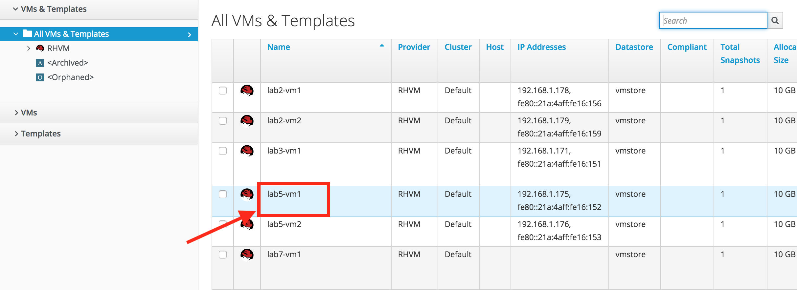
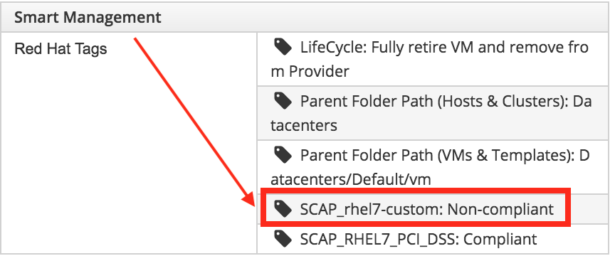
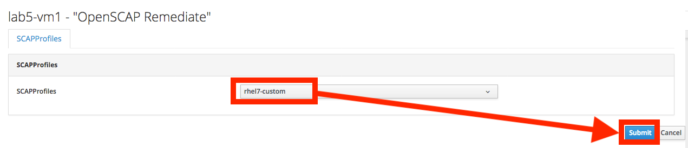
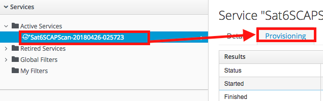
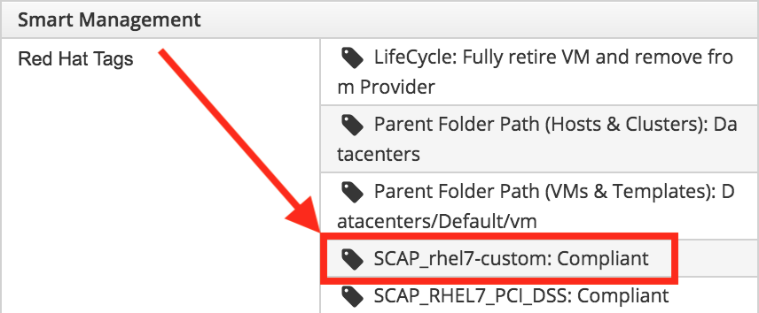

== Lab 5: Automated OpenSCAP security scans and remediations at the push of a button & viewing SCAP compliance reports

== Goal of Lab 5
The goal of this lab is to show the ability to execute OpenSCAP security scans and remediations at the push of a button in Red Hat CloudForms using Red Hat Ansible Automation, Red Hat Satellite, and Red Hat CloudForms.

In this lab, you will see how you can leverage Red Hat Satellite's built-in OpenSCAP scanning and remediation capabilities in an automated fashion for a hybrid environment using Red Hat Ansible Automation from Red Hat CloudForms. In this lab, you will launch the OpenSCAP scans and remediations by pressing custom buttons on a VM in Red Hat CloudForms. The buttons will launch an automated workflow utilizing both Red Hat Ansible Automation and Red Hat CloudForms.

You will also view reports in Red Hat CloudForms showing SCAP non-compliant and compliant VMs in a hybrid environment based on security compliance profiles. You will view these security compliance results reports as a security compliance officer/auditor. The security compliance officer/auditor is set up as a restricted, non-admin, user in Red Hat CloudForms. Specifically, this user is configured to only be able to create and view reports.

== Introduction
Red Hat CloudForms provides out-of-the-box integration with Red Hat Ansible Automation. As a result, with this integration, you can launch Ansible playbooks as part of your automation workflows in Red Hat CloudForms. For example, from Red Hat CloudForms, automated workflows can be executed, from a button on a host/vm , or as an action on a control policy. You can also launch Ansible automations from the Red Hat CloudForms service catalog as a service item or as part of a service bundle.

This integration between Red Hat CloudForms and Red Hat Satellite allows you to have a central and automated way to do point in time security scans and remediations on a per-vm basis.
Red Hat CloudForms has a robust reporting engine built into the product that allows you to create reports using any of the introspective data collected from your heterogeneous infrastructure. This data is stored either in an internal or external PostgreSQL database. You can use this collected data when creating reports , in control policies , or in automation workflows in Red Hat CloudForms.

=== Lab 5.1 OpenSCAP security scan at the push of a button

Utilizing the integrated OpenSCAP scanning capabilities in Satellite and automation workflows with Red Hat CloudForms and Red Hat Ansible Automation, we will execute push button, automated OpenSCAP scanning and remediations.

. Log into CloudForms with *admin* as the username and *r3dh4t1!* as the password.

. Navigate to the *lab5-vm1* by clicking on *Compute -> Infrastructure -> Virtual Machines*.
+
image:images/lab5.1-infra-vms.png[500,500]

. Click on the *lab5-vm1* VM, if not already there.
+

. Then, click on the *SCAP with Sat6* button at the top and click on *OpenSCAP Scan*.
+
image:images/lab5.1-scapscan.png[200,200]

. Here you are presented with a list of security policy profiles to choose from to scan your VM against. These same security profiles are available to you in Red Hat Satellite. Red Hat CloudForms dynamically grabbed these profiles from Red Hat Satellite and populated these in this dynamic dropdown list. Choose *rhel7-custom* and click *Submit*. This security policy simply ensures that the AIDE package is installed on your system.
+
image:images/lab5.1-scandialog.png[800,800]

. Now let's take a look at what is being executed behind the scenes. Navigate to *Services -> My Services*.
+
image:images/lab5.1-servicesmyservices.png[400,400]

. Click on the *Sat6SCAPScan* service and then click on the *Provisioning* tab to view the Ansible output.
+
image:images/lab5.1-myservicesprovtab.png[600,600]

. Press the refresh button periodically to refresh the Provisioning Ansible output.
+
NOTE: Clicking on refresh takes you back to the Service details page so you must re-click on the *Provisioning* tab.
+
image:images/lab5.1-serviceresults.png[800,800]

. Review the Ansible provisioning playbook output by scrolling down. Notice that the Ansible play recap shows no failures, which means that the Ansible provisioning playbook ran successfully.
+
image:images/lab5.1-ansibleoutput.png[800,800]
image:images/lab5.1-ansibleoutput2.png[800,800]

=== Lab 5.2 Looking at the results of the automated OpenSCAP security scan

. Now that the OpenSCAP scan completed successfully, let's take a look at some outputs of the scan in more detail. Navigate back to the *lab5-vm1* by clicking on *Compute -> Infrastructure -> Virtual Machines.*
+
image:images/lab5.2-infra-vms.png[500,500]

. Click on the *lab5-vm1* VM, if not already there.
+
image:images/lab5.2-clickvm.png[500,500]

. Scroll to the bottom of this page and notice the tags on this VM in the *Smart Management* section. Notice that there is now a tag named *SCAP_rhel7-custom: Non-compliant*. There is also a tag named *SCAP_RHEL7_PCI_DSS: Compliant*. This tag is from a previous successful OpenSCAP scan which checked this VM against the security technical controls of PCI-DSS.
+
NOTE: Our automated OpenSCAP scanning worklow using Ansible automation has automatically tagged this VM upon OpenSCAP scan failure. That way, we can track OpenSCAP scan failures for reporting or other automated workflow purposes(such as automatically opening a ticket in a ticket system such as ServiceNow or Remedy).
+

=== Lab 5.3 Creating and Viewing SCAP compliance reports
. Now that our OpenSCAP scan completed successfully and we have tagged VMs that are marked as either Compliant or Non-Compliant against various security profiles, let's create and view SCAP compliance reports. We will do this as a restricted user, the security compliance officer/auditor.
+
NOTE: Normally, the job of creating and viewing security compliance reports are done by a security compliance officer/auditor. This user is usually a restricted user and does not have full root level access to the systems like the admin.

. Let's Log into CloudForms as this restricted user, the security compliance officer/auditor. Login with *security* as the username and *r3dh4t1!* as the password.
+
NOTE: Notice that this user has very limited capabilities in Red Hat CloudForms compared to the admin. This security compliance officer/auditor can only view and create reports and scan machines in Red Hat CloudForms. The admin has configured this user to have only this capability in CloudForms.

. Navigate to *Reports* and click on the *OpenSCAP Scan(rhel7-custom)* report. Then press the *Queue* button at the top to create the report. Press the *refresh* button on the top left until the report finishes generating.
+
image:images/lab5.3-reportqueue.png[1000,1000]

. Now, click on the report and take a look at its output.
+
image:images/lab5.3-reportsresults.png[1000,1000]
+
NOTE: Notice that in this report you are seeing all the systems that were scanned against the OpenSCAP *rhel7-custom* security profile. This is a custom profile that just checks to see if the AIDE package is installed. In this report, of the systems that were scanned against this profile, you will see which of the systems are Compliant and Non-Compliant against the *rhel7-custom* security profile. In addition, you also see some other information CloudForms collected about these systems such as the IP addresses and Date Created.

. Locate the report *OpenSCAP Scan (rhel7-pci-dss)*, *Queue* the report and review the output.

=== Lab 5.4 Automated remediation of SCAP compliance failures

Now that the security compliance officer/auditor knows which systems are compliant and non-compliant to various profiles and has a report of the SCAP compliance scan findings, he can take this report to the admin. The admin will then fix the SCAP compliance failures.

In this part of the lab exercise, let's imagine that the security compliance officer/auditor is particularly concerned about the failures reported in the *rhel7-custom* profile for a specific production system (in our example, that would be *lab5-vm1*).
The security compliance officer/auditor has asked the admin to remediate the issue and ensure that the *lab5-vm1* system is compliant to the company custom security profile, which is the *rhel7-custom* profile.

. Log into CloudForms with *admin* as the username and *r3dh4t1!* as the password.
. First as admin, let's look at the SCAP compliance reports that the security compliance officer/auditor generated. Navigate to *Cloud Intel -> Reports*.
+
image:images/lab5.4-cloudintelreports.png[500,500]

. Under *Save Reports* notice that the OpenSCAP Scan Results reports are there for both *rhel7-custom* and *rhel7-pci-dss*.
+
image:images/lab5.4-savedreports.png[1000,1000]

. Click on the *OpenSCAP Scan Results (rhel7-custom Profile)* report. Notice that *lab5-vm1* is Non-Compliant to the rhel7-custom security profile.
+
image:images/lab5.4-vmnoncompliant.png[1000,1000]

. Now let's fix this issue. Before we do that, let's go into our *lab5-vm1* by SSH or via the console button on the main *Lab Information* webpage. In this step, we'll use SSH. SSH into the *lab5-vm1* VM. First, SSH into your workstation VM as *root* (using the password *r3dh4t1!*) and then from there, SSH into your *lab5-vm1* as root.
+
[source, text]
[localhost ~]$ ssh root@workstation-GUID.rhpds.opentlc.com
[root@workstation-GUID ~]$ ssh lab5-vm1.example.com

. From here, find out if the AIDE package is installed on *lab5-vm1*. You will find that it is not since the rpm -qa aide command comes back empty.
+
[source]
rpm -qa aide

. Back on the CloudForms UI, let's execute automated remediation and make *lab5-vm1* compliant to the *rhel7-custom* security policy in a push button automated fashion. Navigate to the *lab5-vm1* VM by navigating to
*Compute -> Infrastructure -> Virtual Machines*.
+
image:images/lab5.4-infra-vms.png[500,500]

. Click on the *lab5-vm1* VM, if not already there.
+
image:images/lab5.4-clickvm.png[500,500]

. Then, click on the *SCAP with Sat6* button at the top and click on *OpenSCAP Remediate*.
+
image:images/lab5.4-remediate.png[1000,1000]

. From the dialog, for *SCAPProfiles*, choose *rhel7-custom*. This is the custom security policy profile that ensures that the AIDE package is installed on your system. We will remediate *lab5-vm1* against this profile so that at the push of a button AIDE will get installed on this system. Press *Submit* when ready.
+

. Go back to your terminal and run a `rpm -qa aide` and in a few minutes, you will notice that the AIDE package gets automatically installed.
+
image:images/lab5.4-aide.png[400,400]

. Now that the AIDE package is installed, we should now pass the OpenSCAP scan against the *rhel7-custom* security policy profile. Let's confirm.

. Navigate to the *lab5-vm1* by clicking on *Compute -> Infrastructure -> Virtual Machines.*
+
image:images/lab5.4-infra-vms.png[500,500]

. Click on the *lab5-vm1* VM, if not already there.
+
image:images/lab5.4-clickvm.png[500,500]

. Then, click on the *SCAP with Sat6* button at the top and click on *OpenSCAP Scan*.
+
image:images/lab5.4-scapscan.png[200,200]

. From the dialog, for *SCAPProfiles*, choose *rhel7-custom*. This is a custom security policy profile that just checks to see if the AIDE package is installed on your system. Press *Submit*.
+
image:images/lab5.4-scandialog.png[1000,1000]

. Now let's take a look at what is being executed behind the scenes. Navigate to *Services -> My Services*.
+
image:images/lab5.4-servicesmyservices.png[400,400]

. Click on the *Sat6SCAPScan* service and then click on the *Provisioning* tab to view the Ansible output.
+

. Press the refresh button periodically to refresh the Provisioning Ansible output.
+
image:images/lab5.4-serviceresults.png[800,800]

. Review the Ansible provisioning playbook output by scrolling down. Notice that the Ansible play recap shows no failures, which means that the Ansible provisioning playbook ran successfully.
+
image:images/lab5.4-ansibleoutput.png[800,800]
image:images/lab5.4-ansibleoutput2.png[800,800]

. Now that the OpenSCAP scan completed successfully, let's take a look at some outputs of the scan in more detail. Navigate back to the *lab5-vm1* by clicking on *Compute -> Infrastructure -> Virtual Machines.*
+
image:images/lab5.4-infra-vms.png[500,500]

. Scroll to the bottom of this page and notice the tags on this VM in the *Smart Management* section. Notice that the previous tag named *SCAP_rhel7-custom: Non-compliant* got updated to *SCAP_rhel7-custom: Compliant*.
+
NOTE: The *lab5-vm1* is now SCAP compliant to the *rhel7-custom* security policy profile.
+

. Log back into CloudForms as the security officer/auditor with *security* as the username and *r3dh4t1!* as the password.
. Navigate to *Reports* and click on the *OpenSCAP Scan(rhel7-custom)* report. Then press the *Queue* button at the top to create the report. Press the *refresh* button on the top left until the report finishes generating.
+
image:images/lab5.4-reportqueue.png[1000,1000]

. Now, click on the report and take a look at its output.
+
image:images/lab5.4-reportsresults.png[1000,1000]

Notice that now the *lab5-vm1* VM is *Compliant* to the *rhel7-custom* security policy profile!.

link:README.adoc#table-of-contents[ Table of Contents ] | link:lab6.adoc[ Lab 6]
