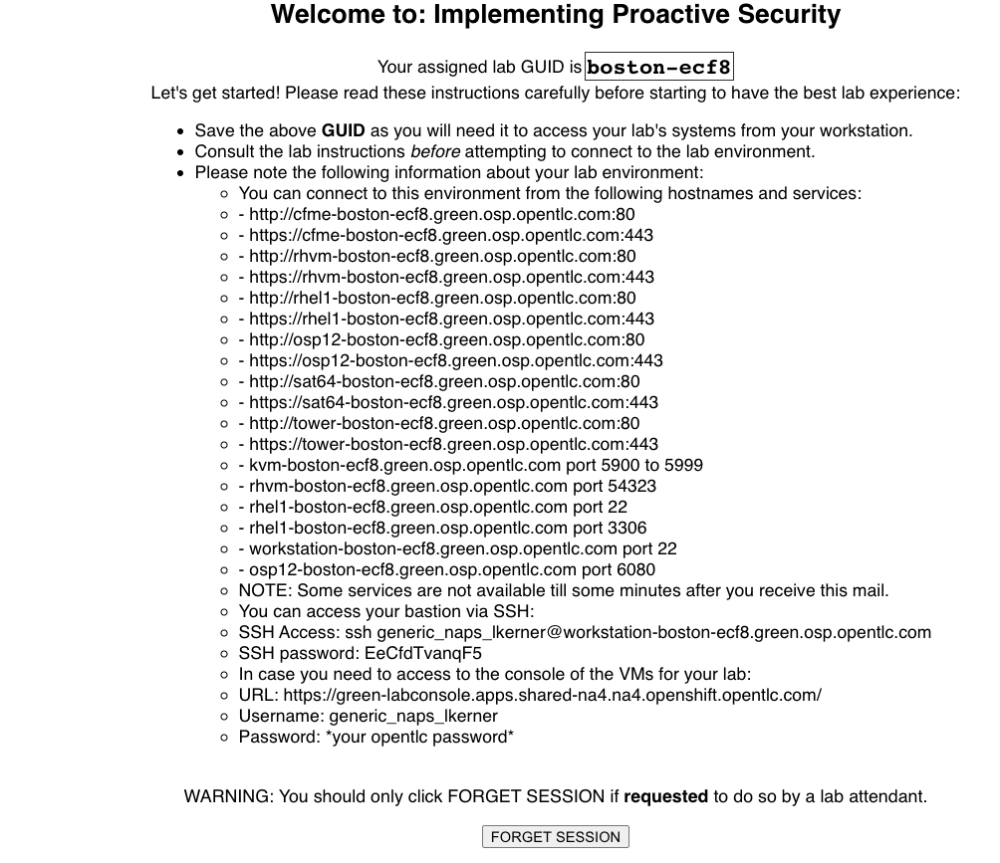

== Lab 0: Setup steps

=== Accessing your dedicated lab environment using your provided GUID
. From your laptop, navigate to the https://www.opentlc.com/gg/gg.cgi?profile=generic_naps_lkerner[*Lab GUID Assignment page*^]. Firefox with plugins disabled recommended.
From this page, you will be assigned your unique GUID, which you will use to access your unique lab environment and systems.

. Select the *Lab Code* titled *Implementing Proactive Security*  from the drop down list.

. Enter the *Activation Key*, which is *security*.

. The resulting *Lab GUID Assignment page* will display your lab's GUID and other useful information about your lab environment. Take note of your assigned GUID. You will use this GUID to access your lab's environment and systems.  Your unique GUID will also be embedded in your lab environment's host names. From this *Lab GUID Assignment page*, you will also be able to access your unique lab environment's power control and consoles. *Note that your actual GUID will be different than the example GUID that you see below.*
+

=== Logging into all the Red Hat Products
. Let’s log into the Red Hat Products that you will use for the  lab exercises in this lab.

. The *Lab GUID Assignment page* contains a list of links to all of the Red Hat Products that you will use in this lab. Click each of the links on this page. Each link should open a new tab. You will have to accept the SSL certificates for each page when the warning appears. Login as *admin* using the password *r3dh4t1!* for all the Red Hat Products that you log into.

=== Verifying you can SSH into the workstation system

. From the *Lab GUID Assignment page*, follow the directions to SSH into the workstation host using the provided password.

=== Turning on your VMs
. Before starting the lab steps, you will need to turn on the VMs that will be used in this lab. These VMs live in Red Hat Virtualization, but we will be turning on these VMs from Red Hat CloudForms.
. Log into Red Hat CloudForms. *Make sure to replace the GUID with your provided GUID!* If not already logged in, do so with *admin* as the Username and *r3dh4t1!* as the Password.

. On the left menus, navigate to *Compute -> Infrastructure -> Virtual Machines.*
+
image:images/lab0-infra-vms.png[500,500]

. Click on the *VMs* accordian on the left. Then, type *.hosts.example.com* in the top right search bar and *press the magnifying glass* to search. Next, select the following VMs: *rhel7-vm1.hosts.example.com*, *rhel7-vm2.hosts.example.com*, *rhel7-vm3.hosts.example.com*, *rhel7-vm4.hosts.example.com*, *rhel7-vm5.hosts.example.com*, and *rhel8-vm1.hosts.example.com*. Navigate to the top *Power* button and select *Power On*.
+
image:images/lab0-vmturnon2.png[1000,1000]

. Click *OK*.
. Do not close your CloudForms UI since you will be using it in future lab exercises.

link:README.adoc#table-of-contents[ Table of Contents ] | link:lab1.adoc[Lab 1: Automated Scanning and Remediation of Host Systems for Vulnerabilities and Security Compliance]
