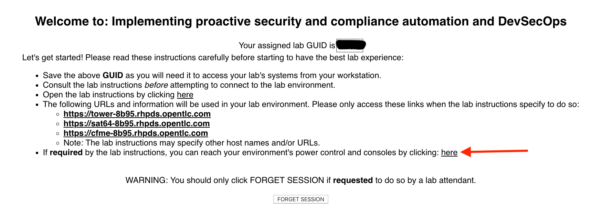
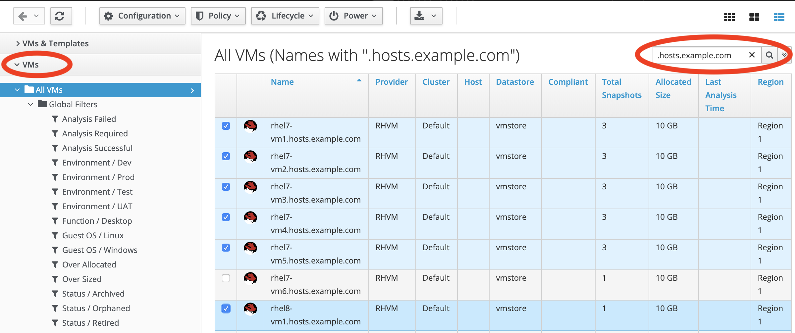

== Lab 0: Setup steps

=== Accessing your dedicated lab environment using your provided GUID
. From your laptop, navigate to the https://www.opentlc.com/gg/gg.cgi?profile=generic_na_jmentzel[*Lab GUID Assignment page*^]. Firefox with plugins disabled recommended.
From this page, you will be assigned your unique GUID, which you will use to access your unique lab environment and systems.

. Select the proper *Lab Code*. This *Implementing proactive security and compliance automation and DevSecOps* lab has two main sections: *infrastructure/operations security and compliance automation* lab exercises and *application security and compliance automation* lab exercises. Decide which section you want to work on first. If you want to work on the *infrastructure/operations security and compliance automation* lab exercises, select *SECURITYMA1 - Implementing proactive security and compliance automation and DevSecOps* from the drop down list. If you want to work on the *application security and compliance automation* lab exercises, select *TC9818 -AD - Implementing proactive security and compliance automation and DevSecOps* from the drop down list.

. Enter the *Activation Key*, which is *security*.

. The resulting *Lab GUID Assignment page* will display your lab's GUID and other useful information about your lab environment. Take note of your assigned GUID. You will use this GUID to access your lab's environment and systems.  Your unique GUID will also be embedded in your lab environment's host names. From this *Lab GUID Assignment page*, you will also be able to access your unique lab environment's power control and consoles.
+

. When you are completely done with your lab environment, please click *FORGET SESSION* so that you can move on to the next lab.  If you fail to do this, you will be locked into the GUID from the previous lab. In order to move from the *infrastructure/operations security and compliance automation* lab exercises (Lab Exercises #1-6) to the *application security and compliance automation* lab exercises (Lab Exercise #7) and vice versa, you will have to push the *FORGET SESSION* button, select the appropriate option from the drop down list as mentioned above, and get your GUID.
+
[NOTE]
Clicking *FORGET SESSION* will not stop or delete the lab environment.

=== Logging into all the Red Hat Products
. Let’s log into the Red Hat Products that you will use for the infrastructure and operations security and compliance automation lab exercises in this lab (Lab Exercises #1-6).
. The *Lab GUID Assignment page* contains a list of links to all of the Red Hat Products that you will use in this lab. Click each of the links on this page. Each link should open a new tab. You will have to accept the SSL certificates for each page when the warning appears.

The table below also shows the links to the Red Hat Products you need to be logged into for the infrastructure and operations security and compliance automation lab exercises in this lab (Lab Exercises #1-6). All the steps for the application security and compliance automation lab exercise are detailed in Lab 7.

*Red Hat Products to log into for Lab Exercises #1-6:*
|===
|Red Hat Product |URL |Username|Password
|Red Hat Ansible Tower
|https://tower-GUID.rhpds.opentlc.com
|admin
|r3dh4t1!

|Red Hat Satellite
|https://sat64-GUID.rhpds.opentlc.com
|admin
|r3dh4t1!

|Red Hat CloudForms
|https://cfme-GUID.rhpds.opentlc.com
|admin
|r3dh4t1!
|===

=== Verifying you can SSH into the workstation system

. From the *Lab GUID Assignment page*, copy the hostname of the *workstation* system (it should be *workstation-GUID.rhpds.opentlc.com* where GUID matches your environment's guid).

. A terminal window should already be opened for you on your Red Hat Summit provided laptop. Make sure you can SSH into the workstation host as you see below.
+
[source, text]
[localhost ~]$ ssh lab-user@workstation-8b95.rhpds.opentlc.com
+
NOTE: Replace GUID with your lab's GUID. Use the password *r3dh4t1!* for *lab-user*.

=== Turning on your VMs
. Before starting the lab steps, you will need to turn on the VMs that will be used in the infrastructure and operations security and compliance automation lab exercises in this lab (Lab Exercises #1-6). These VMs live in Red Hat Virtualization, but we will be turning on these VMs from Red Hat CloudForms.
. Go to the Red Hat CloudForms (https://cfme-GUID.rhpds.opentlc.com) tab. *Make sure to replace the GUID with your provided GUID!* If not already logged in, do so with *admin* as the Username and *r3dh4t1!* as the Password.

. On the left menus, navigate to *Compute -> Infrastructure -> Virtual Machines.*
+
image:images/lab0-infra-vms.png[500,500]

. Click on the *VMs* accordian on the left. Then, type *.hosts.example.com* in the top right search bar and *press the magnifying glass* to search. Next, select the following VMs: *rhel7-vm1.hosts.example.com*, *rhel7-vm2.hosts.example.com*, *rhel7-vm3.hosts.example.com*, *rhel7-vm4.hosts.example.com*, *rhel7-vm5.hosts.example.com*, and *rhel8-vm1.hosts.example.com*. Navigate to the top *Power* button and select *Power On*.
+

. Click *OK*.
. Do not close your CloudForms UI since you will be using it in future lab exercises.

link:README.adoc#table-of-contents[ Table of Contents ] | link:lab1.adoc[Lab 1: Automated Scanning and Remediation of Host Systems for Vulnerabilities and Security Compliance]
