== Lab 1: Automated Scanning and Remediation of Host Systems for Vulnerabilities and Security Compliance

=== Goal of Lab 1
The goal of this lab is to learn how to use a combination of Red Hat Ansible Automation , Red Hat Satellite, Red Hat CloudForms, and OpenSCAP to automatically detect and remediate security and compliance issues in a controlled way for automated security compliance at scale.

=== Introduction
Security compliance management is the ongoing process of defining security policies, auditing for compliance with those policies and resolving instances of non-compliance. Once a security policy is defined, an audit is conducted to verify compliance with the policy. Any non-compliance is managed according to the organization's configuration management policies. Security policies vary in their scope, from being host-specific to industry-wide, so there is a need for flexibility in their definition.

The Security Content Automation Protocol (SCAP) enables the definition of security configuration policies. For example, a security policy might specify that for hosts running Red Hat Enterprise Linux, login via SSH is not permitted for the root account. OpenSCAP is the integrated security scanning, auditing, and remediation tool in both Red Hat Enterprise Linux and Red Hat Satellite.

In Red Hat Satellite, tools provided by the OpenSCAP project are used to implement security compliance auditing. For more information about OpenSCAP see the link:https://access.redhat.com/documentation/en-us/red_hat_enterprise_linux/7/html/security_guide/index[Red Hat Enterprise Linux 7 Security Guide] and the link:https://access.redhat.com/documentation/en-us/red_hat_enterprise_linux/8-beta/html/configuring_and_managing_security/scanning-the-system-for-security-compliance-and-vulnerabilities_configuring-and-managing-security[Red Hat Enterprise Linux 8 Security Guide]. The Satellite web UI enables scheduled compliance auditing and reporting on all hosts under management by Red Hat Satellite.

Red Hat Ansible Automation is automation software powered by Red Hat Ansible Engine-an execution engine with hundreds of modules that can automate all aspects of IT environments and processes—and Red Hat Ansible Tower—a management interface that can integrate with other services. In this lab exercise, you will use Red Hat Ansible Tower for centralized automation.

Red Hat CloudForms is an infrastructure management platform that allows IT departments to control users’ self-service abilities to provision, manage, and ensure compliance across virtual machines and private clouds. In this lab exercise, you will use Red Hat CloudForms to launch Red Hat Ansible Automation security compliance scan and remediation automation tasks from a custom button.

=== Lab 1.1 Introduction to SCAP content provided in Red Hat Satellite
Before creating a SCAP compliance policy for a host, you need SCAP content.

SCAP content is a datastream format containing the configuration and security baseline against which hosts are checked. Checklists are described in the extensible checklist configuration description format (XCCDF) and vulnerabilities in the open vulnerability and assessment language (OVAL). Checklist items, also known as rules express the desired configuration of a system item. For example, you may specify that no one can log in to a host over SSH using the root user account. Rules can be grouped into one or more profiles, allowing multiple profiles to share a rule. SCAP content consists of both rules and profiles.

You can either create SCAP content or obtain it from a vendor. Supported profiles are provided for Red Hat Enterprise Linux in the scap-security-guide package. The creation of SCAP content is outside the scope of this lab, but see the link:https://access.redhat.com/documentation/en-us/red_hat_enterprise_linux/7/html/security_guide/index[Red Hat Enterprise Linux 7 Security Guide] or the link:https://access.redhat.com/documentation/en-us/red_hat_enterprise_linux/8-beta/html/configuring_and_managing_security/scanning-the-system-for-security-compliance-and-vulnerabilities_configuring-and-managing-security[Red Hat Enterprise Linux 8 Security Guide] for information on how to download, deploy, modify, and create your own content. The SCAP content provided with Red Hat Enterprise Linux is compliant with SCAP specification 1.2.

The default SCAP content provided with the OpenSCAP components of Red Hat Satellite depends on the version of Red Hat Enterprise Linux:

* On Red Hat Enterprise Linux 7, content for both Red Hat Enterprise Linux 6 and Red Hat Enterprise Linux 7 is installed.

* On Red Hat Enterprise Linux 6, content for Red Hat Enterprise Linux 6 is installed.

When you install the SCAP components in Satellite as defined in the link:https://access.redhat.com/documentation/en-us/red_hat_satellite/6.4/html/administering_red_hat_satellite/chap-red_hat_satellite-administering_red_hat_satellite-security_compliance_management/[Administering Red Hat Satellite Guide], all of the Red Hat default content will show up in Satellite so no extra steps are necessary to add the SCAP content to Satellite.  But if you had customized content that you wrote yourself or if you have a modified policy and you wanted to upload that modified version , you can do that in the Satellite UI under *Hosts → SCAP contents*.

. On the Red Hat Satellite server (https://sat64-GUID.rhpds.opentlc.com) log in with *admin* as the user name and *r3dh4t1!* as the password (if not already logged in).
. Take a look at the default SCAP content provided with the OpenSCAP components of Satellite 6 by navigating to *Hosts → SCAP contents*.
+
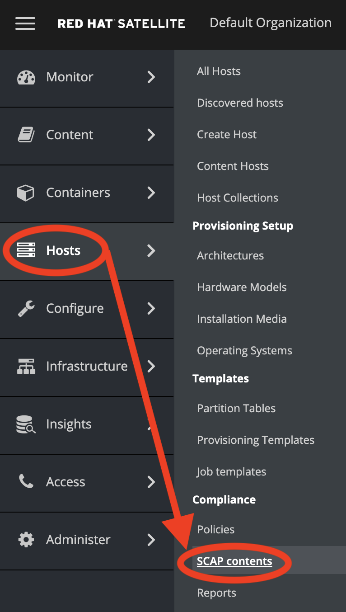
+
NOTE: To save time on this lab exercise, the SCAP components in Satellite were already installed for you. This is why you are seeing the default content under *Hosts → SCAP contents*.

=== Lab 1.2 Viewing the already created SCAP compliance policies
Now that you have SCAP content defined in Satellite, let's take a look at the SCAP compliance policies that have been already created for you.

. Take a look at the SCAP policies by navigating to *Hosts → Policies*.
+
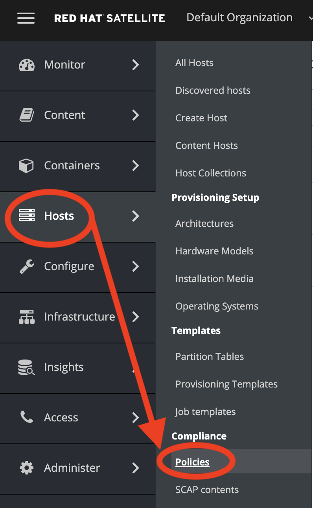
. Notice that there are 3 Compliance Policies that were already created for you: *RHEL7_Custom*, *RHEL7_PCI*, and *RHEL7_Standard*.
+
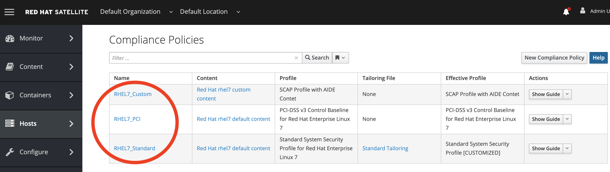

+
NOTE: A custom policy named *RHEL7_Custom* has already been uploaded for you. The *RHEL7_Custom* policy simply checks to see if the AIDE package is installed.

. Let's take a look at the *RHEL7_PCI* compliance policy that was already created for you. Click on *Edit* in the *Actions* drop down list.
+
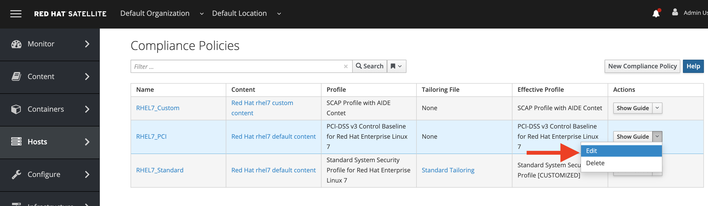
+
NOTE: A SCAP compliance policy takes one of the security profiles that are available in your SCAP content and applies it to a group of systems(as defined in your Hostgroups). You can also overwrite your SCAP content with a tailoring file. You will learn more about how to use tailoring files later in this lab exercise.

. Click on and review the various tabs including *General*, *SCAP Content*, *Schedule*, *Locations*, *Organizations*, and *Host Groups*.

. In the *SCAP Content* tab,
* Notice that nothing is selected for *Tailoring File*. We will add a tailoring file later.
+
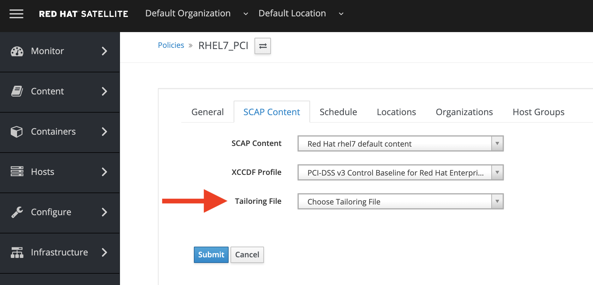
+
NOTE: Red Hat Satellite 6.3 introduced the Tailoring Files feature. Tailoring Files allow existing OpenSCAP policies to be tailored, or customized, without forking or rewriting the policy. It is important to note that the Tailoring files feature does not provide the abililty to create tailoring files. A Tailoring file can be created using SCAP Workbench(which is included in Red Hat Enterprise Linux). Once you have a Tailoring file you can upload it and assign the Tailoring File to a policy.

. In the *Schedule* tab,
* Whatever is defined here as a schedule is executed as a cron job on the client. For Period, if you selected Custom, you can define normal cron syntax to define when the schedule is going to run.

. In the *Hostgroups* tab,
* The compliance policy will apply to your selected *Hostgroup(s)*.
+
NOTE: Hostgroups are groupings of systems that are built and configured the same. You can use Hostgroups as a means to roll out certain compliance policies to certain subsets of your systems.

. Click *Cancel* when you are done looking through the tabs.
+
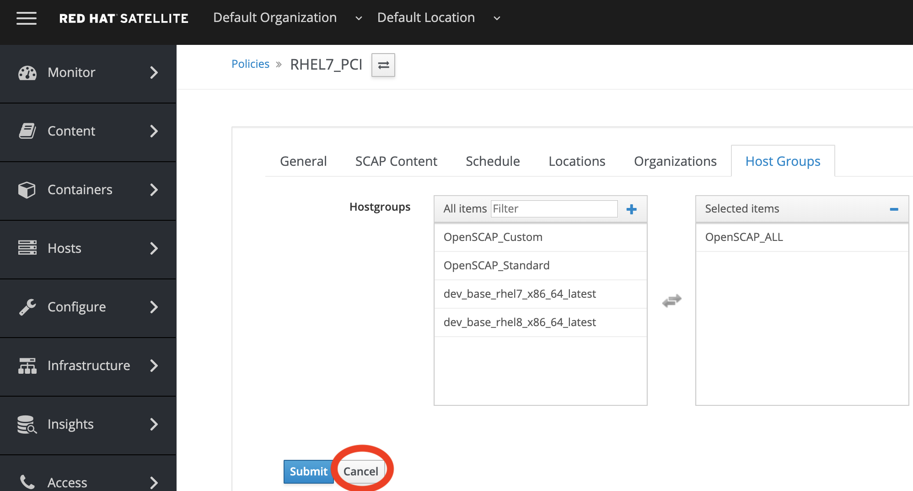

=== Lab 1.3 Executing security compliance policy scan on hosts at scale from Red Hat Ansible Tower

. Now that you have defined SCAP compliance policies in Red Hat Satellite,
let's run a SCAP compliance policy scan on a few hosts using Red Hat Ansible Tower.

. On Red Hat Ansible Tower (https://tower-GUID.rhpds.opentlc.com) log in with *admin* as the user name and *r3dh4t1!* as the password (if not already logged in).

. Navigate to *Inventories* and click on the *Satellite Inventory*.
+
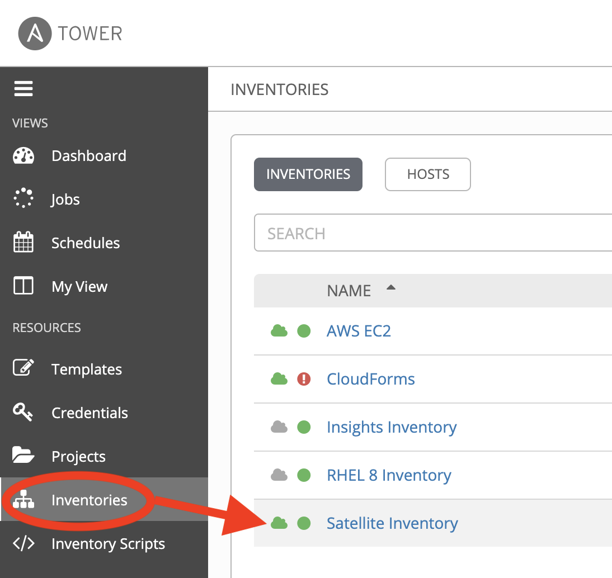

. Next click on *GROUPS* and click on the *foreman_lifecycle_environment_rhel7_qa* group. We will be running our SCAP compliance policy scan on the hosts in this group.
+
image:images/towergroups.png[400,400]

. Now let's take a look at the hosts that are part of the foreman_lifecycle_environment_rhel7_qa group. Click on *HOSTS*. Notice that there are two hosts that are part of the foreman_lifecycle_environment_rhel7_qa group: *rhel7-vm1.hosts.example.com* and *rhel7-vm2.hosts.example.com*.
+
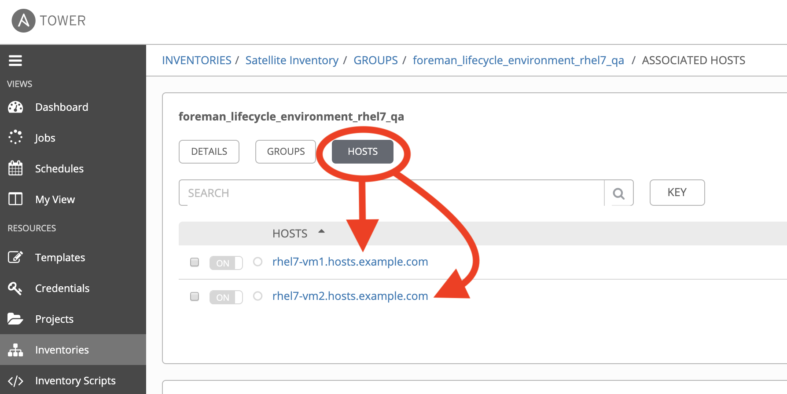

. Navigate to *Templates* and click the *rocket ship* next to the job template named *LINUX / SCAP Scan*.
+
image:images/templates.png[100,100]
image:images/linuxscapscan.png[1500,1500]

. Now, for *HOSTS*, copy/paste or type in the *foreman_lifecycle_environment_rhel7_qa* group name and choose the *RHEL7_PCI* profile from the *CHOOSE PROFILE* drop down list. Click *NEXT*.
+
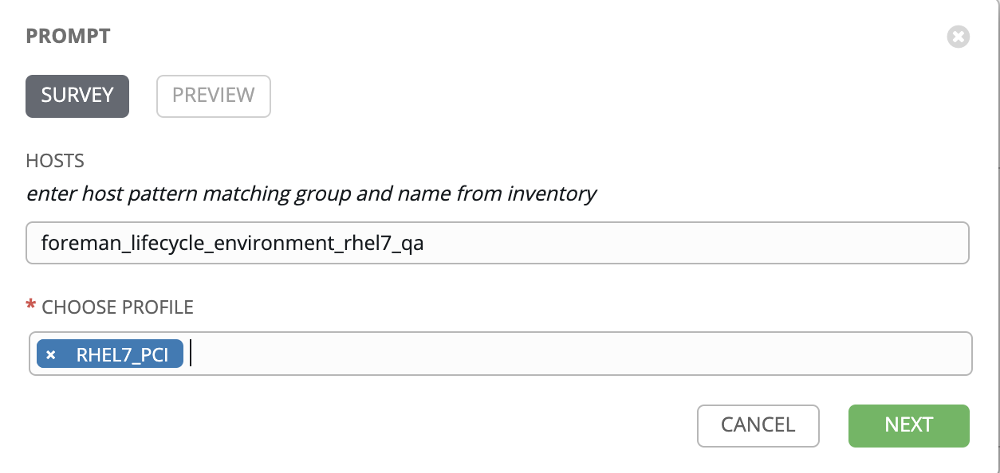

. Take a look at the preview of the Red Hat Ansible Tower job we are about to run. In this job, we are going to run the RHEL7_PCI SCAP compliance policy scan from the Red Hat Satellite server (sat64.example.com) on the hosts in the foreman_lifecycle_environment_rhel7_qa group. The RHEL7_PCI SCAP compliance policy is one of the SCAP compliance policies that is already configured in our Red Hat Satellite server.
Click *LAUNCH* to launch this scan. *This scan will take about 4 minutes to complete*.
+
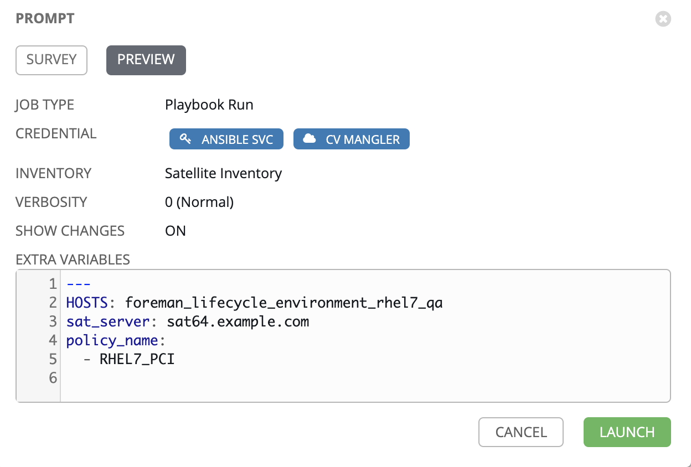
+
NOTE: Ansible Tower jobs can be scheduled to run on a periodic basis as well.
+
NOTE: While we're only running this job on the 2 hosts that are part of the foreman_lifecycle_environment_rhel7_qa group, Red Hat Ansible Tower provides the scalability to run this job across thousands of hosts.

. As we wait for this scan to complete, let's take a deeper look at what's happening in the background by looking at the log shown in Red Hat Ansible Tower. First, notice that we're running a playbook named *scap-scan.yml*. You can find this playbook in github  https://github.com/RedHatDemos/SecurityDemos/blob/master/2019Labs/ProactiveSecurityCompliance/Ansible/patching-playbooks/scap-scan.yml[here^]. When we look at the Red Hat Ansible Tower log, we first see tasks being executed from the *ansible-role-scap-client* role. Here, we're making sure that the SCAP client is installed and configured on the hosts.
+
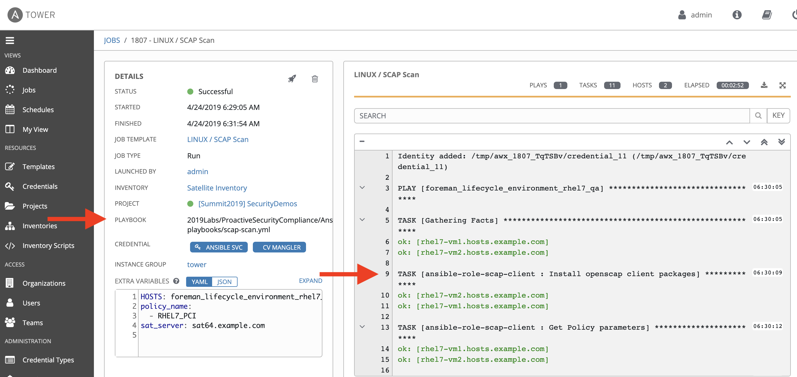
+
NOTE: Because Ansible is idempotent, after 1 run of a playbook to set things to a desired state, further runs of the same playbook will result in 0 changes. As a result, this playbook will check to make sure the client is installed and configured, but if there are no changes to be made, Ansible will skip over the task and verify that the systems are in the correct state. Also note that when we're accessing the host systems, we're using credentials that are encrypted and securely stored in Red Hat Ansible Tower.

Next, notice that the *Run SCAP Scan* task is being run. This will run the specified SCAP compliance policy (RHEL7_PCI) scan on the hosts. Once the scan completes, the SCAP compliance report will be automatically uploaded to the Red Hat Satellite server.

Finally, once you see *Successful* for *STATUS* with a date and time listed for *STARTED* and *ENDED* , in addition to seeing zero failures in the *PLAY RECAP* at the end of your Red Hat Ansible Tower log, then your job has successfully finished running.

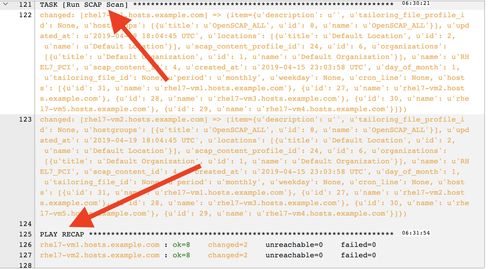
image:images/pciscanfinish.png[1000,1000]

=== Lab 1.4 Viewing the OpenSCAP scan reports in Red Hat Satellite

. Now that the SCAP compliance scans for the RHEL_PCI compliance policy have finished running on our specified hosts from the previous lab exercise, let's view the resulting SCAP scan  reports for the hosts in Red Hat Satellite.

. On the Red Hat Satellite server (https://sat64-GUID.rhpds.opentlc.com) log in with *admin* as the user name and *r3dh4t1!* as the password (if not already logged in)

. Navigate to *Hosts → Reports*.
+
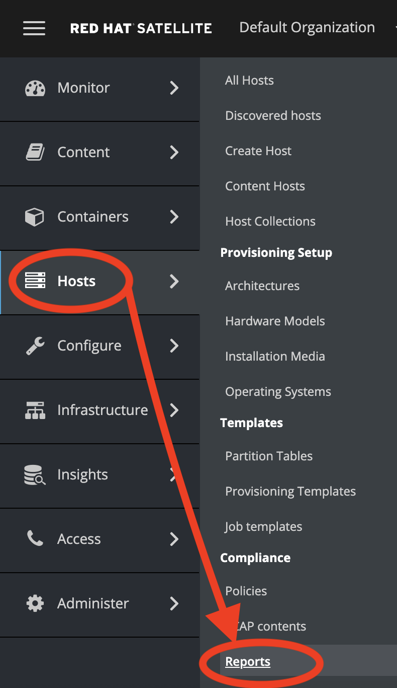

. Notice that there are two RHEL_PCI compliance policy reports, one for the *rhel7-vm1-hosts.example.com* host and another for the *rhel7-vm2.hosts.example.com* host. Notice that they both have 38 compliance rules that passed and 53 that failed and 3 other, which are compliance rules that were not checked. Let's look at one of the reports in more detail. We'll look at the compliance report for the *rhel7-vm2.hosts.example.com* host. Click the link in the *Reported At* column for the *rhel7-vm2.hosts.example.com* host. The *Reported At* column says how long ago the report was created.
+
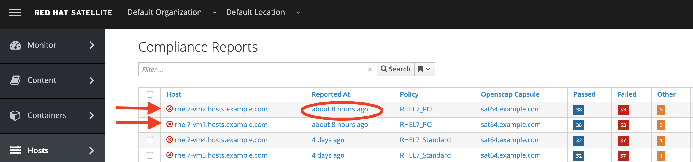

. In this report, you can see the security rules that have passed and failed at a high level which allows you to see the security posture of a system based upon an assigned audit policy.
+
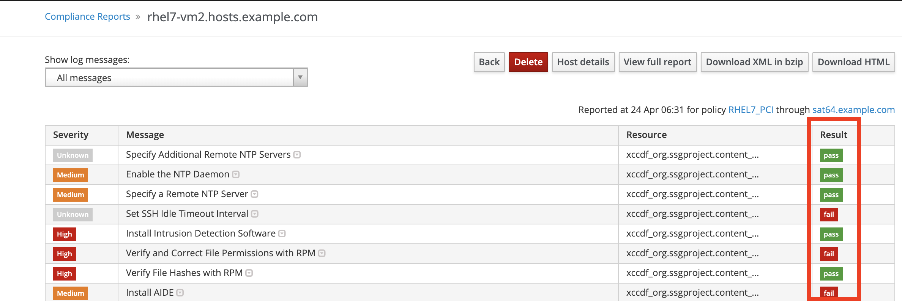
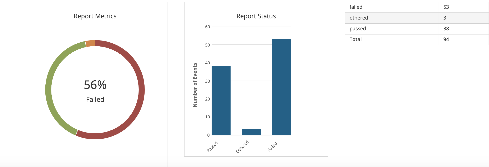

. To see the detailed full report, click on *View full report* at the top right. Notice that you can optionally *Download the XML* of the report in bzip or HTML format as well.
+
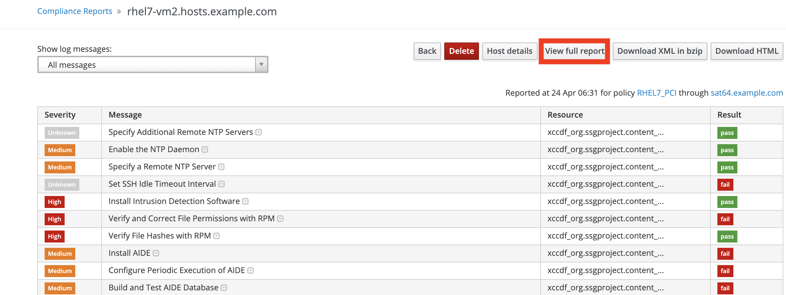

. Glance through this full report to see what rules passed/failed, severity of the rules, etc.  Notice that you can click on each rule for more detailed information.
+
image:images/lab2-moredetails1.png[1500,1500]

=== Lab 1.5 Remediating SCAP compliance policy scan failures on hosts at scale with Red Hat Ansible Tower

. Now let's fix the OpenSCAP scan failures from the *RHEL7_PCI* compliance policy on the hosts from the previous lab exercise.

. On Red Hat Ansible Tower (https://tower-GUID.rhpds.opentlc.com) log in with *admin* as the user name and *r3dh4t1!* as the password (if not already logged in).

. Navigate to *Templates* and click the *rocket ship* next to the job template named *LINUX / SCAP Remediate PCI*. This job template will launch the Red Hat provided Ansible role that will do all the configuration changes and remediations to the host(s) that this role is applied to so that the host(s) are compliant the the RHEL 7 PCI-DSS compliance profile.
+
image:images/templates.png[100,100]
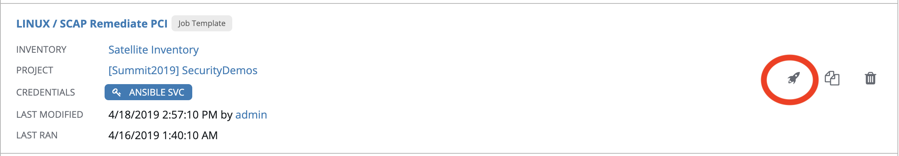

. Next, for *WHICH HOSTS?*, copy/paste or type in the *foreman_lifecycle_environment_rhel7_qa* group name again so we can do the RHEL 7 PCI-DSS remediations to the hosts that are in the foreman_lifecycle_environment_rhel7_qa group. Click *NEXT*.
+
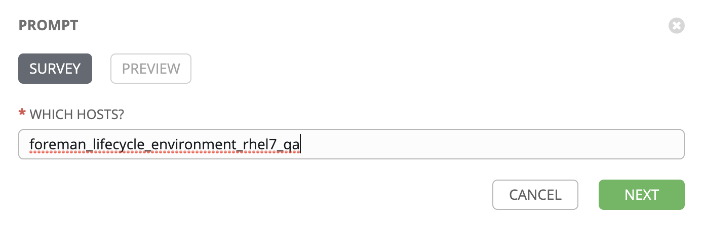

. Take a look at the job preview and click *LAUNCH*.
+
image:images/launch.png[1000,1000]
+
NOTE: This job will take about 10 minutes to complete.

. As we wait for the prior remediation step to complete, let's take a deeper look at what's happening in the background by looking at the log shown in Red Hat Ansible Tower. First, notice that the playbook that is being run is the *pci.yml* playbook. This playbook can be found https://github.com/RedHatDemos/SecurityDemos/blob/master/2019Labs/ProactiveSecurityCompliance/Ansible/patching-playbooks/pci.yml[here^]. Notice that this playbook calls the *redhatofficial.rhel7_pci_dss* role, which is why all of the tasks that you see in the log are coming from that *redhatofficial.rhel7_pci_dss* role. This Ansible role is a Red Hat provided and supported Ansible role that you can get from Ansible galaxy https://galaxy.ansible.com/RedHatOfficial/rhel7_pci_dss[here^]. You can also automatically generate this role from the SCAP workbench GUI tool that's provided in Red Hat Enterprise Linux. More details on SCAP workbench can be found https://access.redhat.com/documentation/en-us/red_hat_enterprise_linux/7/html/security_guide/sect-using_scap_workbench[here^]. This Red Hat provided *redhatofficial.rhel7_pci_dss* Ansible role will automatically make all the necessary configuration changes to remediate the host(s) that this role is applied to for compliance to the RHEL 7 PCI-DSS compliance profile.
+
NOTE: In addition to the RHEL 7 PCI-DSS Ansible role, many other Red Hat provided and supported Ansible roles can be found in Ansible galaxy such as HIPAA, DISA STIG, and more. Take a look https://galaxy.ansible.com/RedHatOfficial[here^] for more details.

. Finally, once you see *Successful* for *STATUS* with a date and time listed for *STARTED* and *ENDED* , in addition to seeing zero failures in the *PLAY RECAP* at the end of your Red Hat Ansible Tower log, then your job has successfully finished running.
+
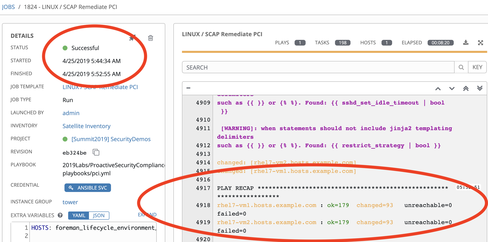

=== Lab 1.5 Re-executing the security compliance policy scan on hosts at scale from Red Hat Ansible Tower after Remediations & Viewing the resulting scan reports from Red Hat Satellite

. On Red Hat Ansible Tower (https://tower-GUID.rhpds.opentlc.com) log in with *admin* as the user name and *r3dh4t1!* as the password (if not already logged in).

. Navigate to *Templates* and click the *rocket ship* next to the job template named *LINUX / SCAP Scan*.
+
image:images/templates.png[100,100]
image:images/linuxscapscan.png[1500,1500]

. For *HOSTS*, copy/paste or type in the *foreman_lifecycle_environment_rhel7_qa* group name and choose the *RHEL7_PCI* profile from the *CHOOSE PROFILE* drop down list. Click *NEXT*.
+

. Take a look at the preview of the Red Hat Ansible Tower job we are about to run. Now that our remediations are in place on our hosts from the previous lab exercise, we are going to re-run the RHEL7_PCI SCAP compliance policy scan from the Red Hat Satellite server (sat64.example.com) on the hosts in the foreman_lifecycle_environment_rhel7_qa group.
Click *LAUNCH* to launch this scan. *This scan will take about 4 minutes to complete*.
+

. Finally, once you see *Successful* for *STATUS* with a date and time listed for *STARTED* and *ENDED* , in addition to seeing zero failures in the *PLAY RECAP* at the end of your Red Hat Ansible Tower log, then your job has successfully finished running.

image:images/pciscanfinish.png[1000,1000]

. Now that the SCAP compliance scans for the RHEL_PCI compliance policy have finished re-running on our specified hosts, let's view the resulting SCAP scan  reports for the hosts in Red Hat Satellite.

. On the Red Hat Satellite server (https://sat64-GUID.rhpds.opentlc.com) log in with *admin* as the user name and *r3dh4t1!* as the password (if not already logged in)

. Navigate to *Hosts → Reports*.
+

. Looking at the list of compliance reports in Red Hat Satellite, notice now that we now have 68 passes and 23 failures now for our hosts that we ran the RHEL7_PCI compliance scan on (*rhel7-vm1-hosts.example.com* and *rhel7-vm2.hosts.example.com*). By using the Red Hat provided and supported *redhatofficial.rhel7_pci_dss* Ansible role , we increased the number of passed rule checks by 30 since we automatically made all the necessary configuration changes to remediate these hosts that this role is applied to for compliance to the RHEL 7 PCI-DSS compliance profile.
+
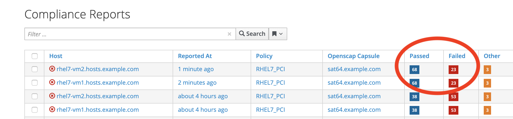

=== Lab 1.6 Tailoring (customizing) an existing OpenSCAP compliance policy with a tailoring file

Red Hat Satellite 6.3 introduced the tailoring files feature. Tailoring files allow existing OpenSCAP policies to be tailored, or customized, without forking or rewriting the policy. In other words, tailoring files allow you to add or ignore rules in the default policy content file. So if the rule is enabled in both the default content and the tailoring file, then the rule is enabled. If the rule is disabled in the tailoring file, but enabled in the default content, then the rule is disabled. If the rule is disabled in the default policy content file but enabled in the tailoring file , then the rule is enabled.

It is important to note that the tailoring files feature does not provide the ability to create tailoring files. A tailoring file can be created using SCAP Workbench(which is included in Red Hat Enterprise Linux). Once you have a tailoring file you can upload it and assign the Tailoring File to a policy.

. In this lab exercise, we are going to use a pre-created tailoring file that will disable the *failed* and *other* rules in the RHEL7_PCI compliance profile. The *other* rules are compliance rules that are not checked as part of the compliance profile. Many times, organizations will use a tailoring file if there are rules in the compliance profile that is not relevant or applicable to their organization's security compliance polices.

. From Satellite, navigate to *Hosts -> Tailoring Files*
+
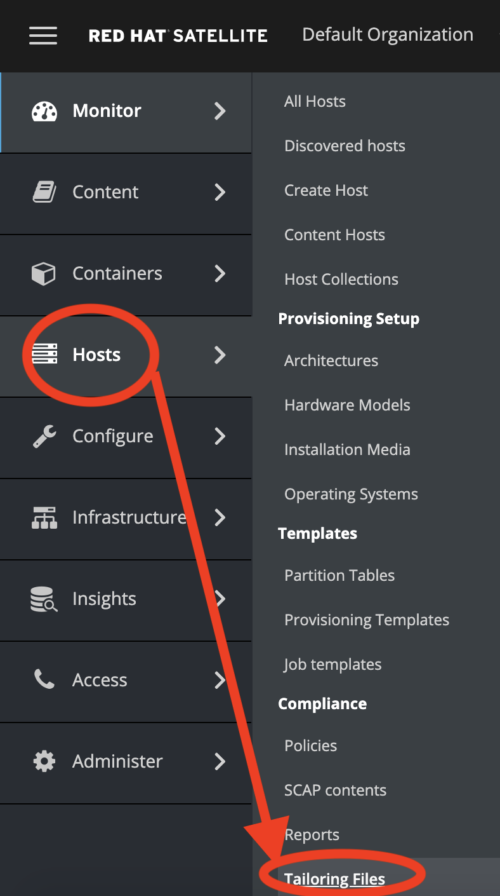

. Notice that there are two pre-configured tailoring files in Red Hat Satellite. Let's take a look at the pre-configured *PCI DSS Tailoring* file. Click *Edit* for the *PCI DSS Tailoring* file under *Actions*.
+
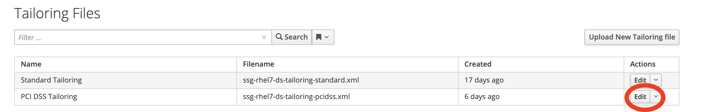

. Let's take a look at each of the tabs in this *PCI DSS Tailoring* file that was pre-configured. In the *File Upload* tab, notice that the *Scap File* that was used is the *ssg-rhel7-ds-tailoring-pcidss.xml* tailoring file, which was downloaded from http://sat64-GUID.rhpds.opentlc.com/pub. Feel free to download this and the other tailoring files for your own use as well if you wish.
+
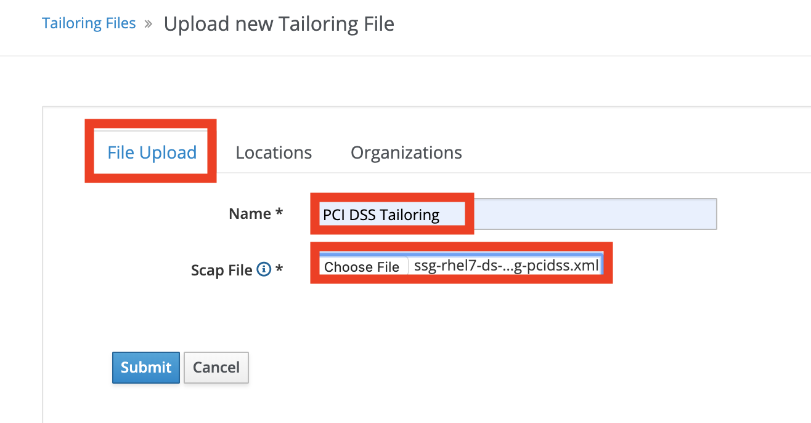
+
NOTE: This ssg-rhel7-ds-tailoring-pcidss.xml tailoring file was created using the SCAP Workbench GUI tool that's included in Red Hat Enterprise Linux. In this tool, users can uncheck compliance check rules that do not apply to their organization and export the resulting tailoring file. The SCAP Workbench tool was used to uncheck both the failed and other compliance check rules based on the most recent RHEL_PCI compliance scan results after remediation from the previous lab exercise.

. In the *Locations* tab, the *Default Location* is set and in the *Organizations* tab, the *Default Organization* is set. This will associate this tailoring file with this *Default Location* and *Default Organization*. Press *Cancel*.

. Now let's assign this tailoring file to a compliance policy. Navigate to *Hosts → Policies*.
+

. For the *RHEL7_PCI* compliance policy, click on *Edit* under the *Actions* column.
+
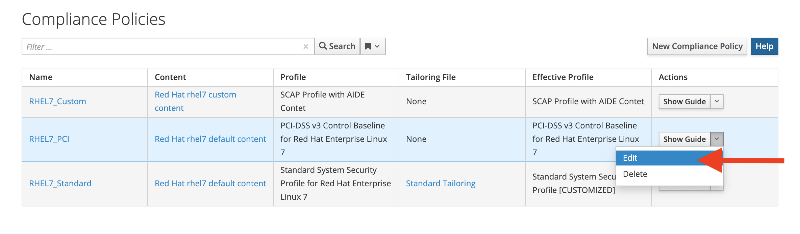

. Under the *SCAP Content* tab, select the *PCI DSS Tailoring* file that was pre-configured in the *Tailoring File* section. Note that the *XCCDF Profile in Tailoring File* section automatically gets filled in once you select your tailoring file. Press *Submit*.

+
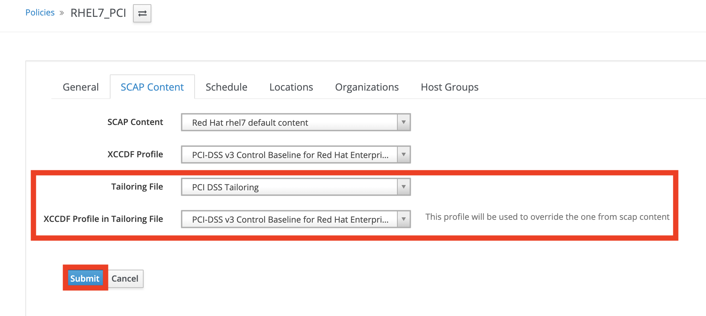

+
NOTE: Tailoring files are able to contain multiple XCCDF Profiles. Also, Satellite does not enforce that the tailoring file match the XCCDF profile. However, you need to make sure that they match to avoid running into errors when using the tailored compliance policy.

=== Lab 1.7 Re-executing the compliance policy scan with tailoring file on hosts from Red Hat Ansible Tower and viewing the OpenSCAP scan results from reports in Red Hat Satellite

In the previous lab exercise steps, we assigned the PCI DSS tailoring file to the *RHEL7_PCI* compliance policy. Now, let's re-execute the compliance policy scan on our hosts from Red Hat Ansible Tower and view the resulting OpenSCAP compliance scan reports from Red Hat Satellite.

. On Red Hat Ansible Tower (https://tower-GUID.rhpds.opentlc.com) log in with *admin* as the user name and *r3dh4t1!* as the password (if not already logged in).

. Navigate to *Templates* and click the *rocket ship* next to the job template named *LINUX / SCAP Scan*.
+
image:images/templates.png[100,100]
image:images/linuxscapscan.png[1500,1500]

. For *HOSTS*, copy/paste or type in the *foreman_lifecycle_environment_rhel7_qa* group name and choose the *RHEL7_PCI* profile from the *CHOOSE PROFILE* drop down list. Click *NEXT*.
+

. Take a look at the preview of the Red Hat Ansible Tower job we are about to run. Again, we are going to re-run the RHEL7_PCI SCAP compliance policy scan from the Red Hat Satellite server (sat64.example.com) on the hosts in the foreman_lifecycle_environment_rhel7_qa group but this time with the PCI DSS tailoring file on top of the RHEL7_PCI compliance profile. Click *LAUNCH* to launch this scan. *This scan will take about 4 minutes to complete*.
+

. Finally, once you see *Successful* for *STATUS* with a date and time listed for *STARTED* and *ENDED* , in addition to seeing zero failures in the *PLAY RECAP* at the end of your Red Hat Ansible Tower log, then your job has successfully finished running.

image:images/pciscanfinish.png[1000,1000]

. Now that the SCAP compliance scans for the RHEL_PCI compliance policy have finished re-running on our specified hosts, let's view the resulting SCAP scan  reports for the hosts in Red Hat Satellite.

. On the Red Hat Satellite server (https://sat64-GUID.rhpds.opentlc.com) log in with *admin* as the user name and *r3dh4t1!* as the password (if not already logged in)

. Navigate to *Hosts → Reports*.
+

. Looking at the list of compliance reports in Red Hat Satellite, notice now that we now have 68 passes and no failures or unchecked compliance rules listed in the *Other* column. This is because our pre-configured PCI DSS Tailoring file disabled the *failed* and *other* rules in the RHEL7_PCI compliance profile.
+
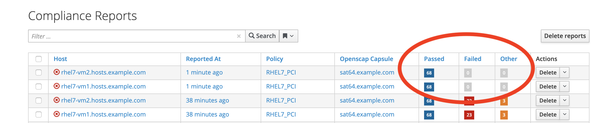

=== Lab 1.7 Executing SCAP compliance scans and remediations on hosts from a custom button in Red Hat CloudForms

In this lab exercise, you will use Red Hat CloudForms to launch Red Hat Ansible Automation security compliance scan and remediation automation tasks from a custom button. Specifically, you will launch OpenSCAP security compliance scans and remediations by pressing custom buttons on a VM in Red Hat CloudForms. The buttons will launch automation jobs in Red Hat Ansible Tower and upload the resulting OpenSCAP compliance scan reports to Red Hat Satellite.

. Log into CloudForms(https://cfme-GUID.rhpds.opentlc.com) with *admin* as the username and *r3dh4t1!* as the password.

. Navigate to the *Compute -> Infrastructure -> Virtual Machines*.
+
image:images/lab5.1-infra-vms.png[500,500]

. Search for the *rhel7-vm3.hosts.example.com* in the top right search bar and then click on this VM.
+
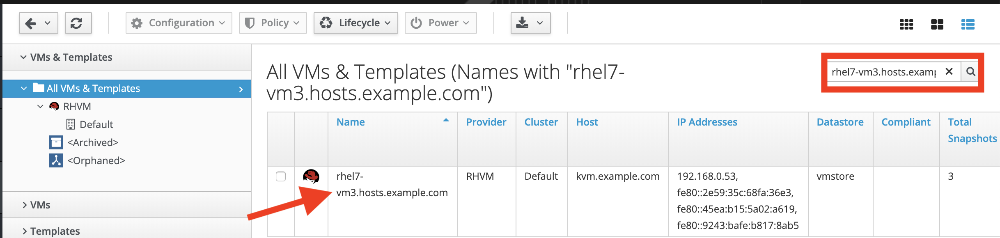

. Then, click on the *SCAP with Sat6* button at the top and click on *OpenSCAP Scan*. This will automatically launch a job in Red Hat Ansible Tower to do an OpenSCAP security compliance scan of several different security compliance profiles on this *rhel7-vm3.hosts.example.com*. *This scan will take about 3 minutes to complete*.
+
image:images/lab5.1-scapscan.png[200,200]

. Let's look at this job run in Red Hat Ansible Tower. Go to Red Hat Ansible Tower (https://tower-GUID.rhpds.opentlc.com) and log in with *admin* as the user name and *r3dh4t1!* as the password (if not already logged in).

. Navigate to *Jobs* and click on the job that is being run at the top , which is *CLOUDFORMS / SCAP SCAN*. This job will take about 3 minutes to complete.
+
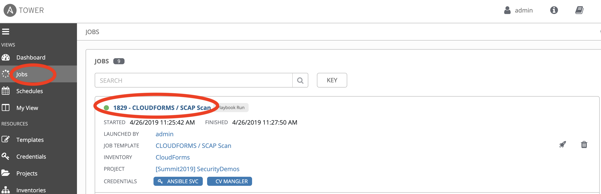

. Notice that this job is running the *scap-scan.yml* playbook on the *rhel7-vm3.hosts.example.com* host. If not specified, by default, this playbook will run SCAP compliance scans on the specified host(s) using all the defined SCAP compliance policy profiles configured in Red Hat Satellite. In our case, these are the compliance polices define in Red Hat Satellite: RHEL7_Standard, RHEL7_PCI, and RHEL7_Custom. As a reminder, the RHEL7_Custom policy is a custom policy that was pre-configured that just checks to see if the AIDE package is installed. These compliance policy scans will be run from the Red Hat Satellite server (sat64.example.com) on this host.
+
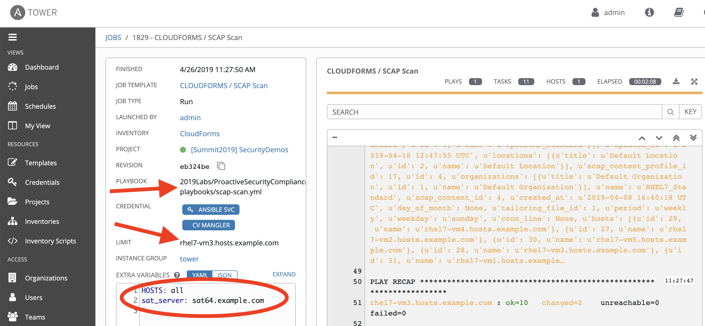

. Finally, once you see *Successful* for *STATUS* with a date and time listed for *STARTED* and *ENDED* , in addition to seeing zero failures in the *PLAY RECAP* at the end of your Red Hat Ansible Tower log, then your job has successfully finished running.

. Now that all the SCAP compliance scans have finished running on this *rhel7-vm3.hosts.example.com* host, let's view the resulting compliance reports for this host in Red Hat Satellite.

. On the Red Hat Satellite server (https://sat64-GUID.rhpds.opentlc.com) log in with *admin* as the user name and *r3dh4t1!* as the password (if not already logged in)

. Navigate to *Hosts → Reports*.
+

. Notice that there is a compliance reports for each of the compliance scans that were run on the *rhel7-vm3.hosts.example.com* host: RHEL7_Standard, RHEL7_PCI, and RHEL7_Custom.
+
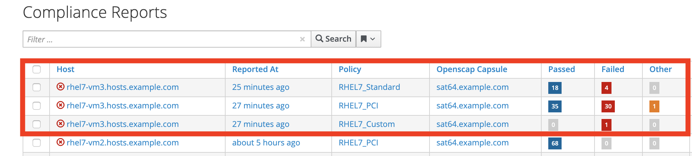

. Notice that there is one failure associated with the *RHEL7_Custom* compliance report for this host. Let's take a deeper look at this error.  Click the link in the *Reported At* column for the *RHEL7_Custom* compliance report for the *rhel7-vm3.hosts.example.com* host. The *Reported At* column says how long ago the report was created.
+
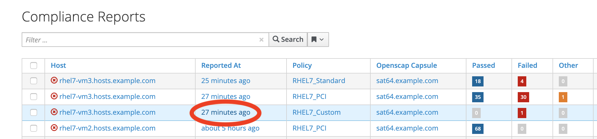

. Notice that the reason that this *RHEL7_Custom* compliance policy failed was because this *rhel7-vm3.hosts.example.com* host does not have the AIDE package installed.
+
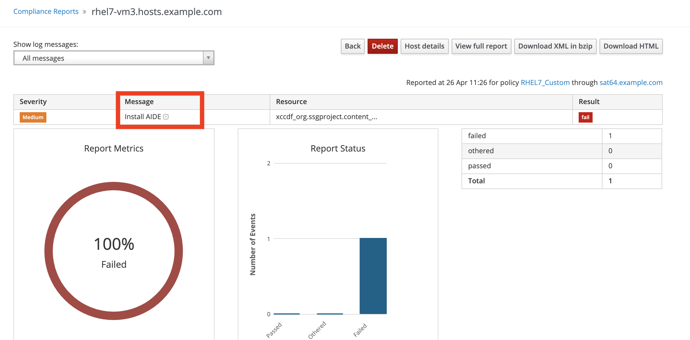

. Let's fix this error at the push of a button in Red Hat CloudForms. Before we do that, let's go into our *rhel7-vm3.hosts.example.com* by SSH or via the console button on the main *Lab Information* webpage. In this step, we'll use SSH. SSH into the *rhel7-vm3.hosts.example.com* VM. First, SSH into your workstation VM as *lab-user* (using the password *r3dh4t1!*) and then from there, SSH into your **rhel7-vm3.hosts.example.com* using its IP address (192.168.0.53).
+
[source, text]
[localhost ~]$ ssh lab-user@workstation-GUID.rhpds.opentlc.com
[lab-user@workstation-GUID ~]$ sudo -i
[root@workstation-GUID ~]$ ssh 192.168.0.53

. From here, find out if the AIDE package is installed on *lab5-vm1*. You will find that it is not since the rpm -qa aide command comes back empty.
+
[source]
rpm -qa aide

. Back on the CloudForms UI, let's execute automated remediation and make *rhel7-vm3.hosts.example.com* compliant to the *RHEL7_Custom* security policy in a push button automated fashion. Navigate to the *rhel7-vm3.hosts.example.com* VM by navigating to
*Compute -> Infrastructure -> Virtual Machines*.
+
image:images/lab5.4-infra-vms.png[500,500]

. Click on the *rhel7-vm3.hosts.example.com* VM, if not already there.
+

. Then, click on the *SCAP with Sat6* button at the top and click on *OpenSCAP Remediate*.
+
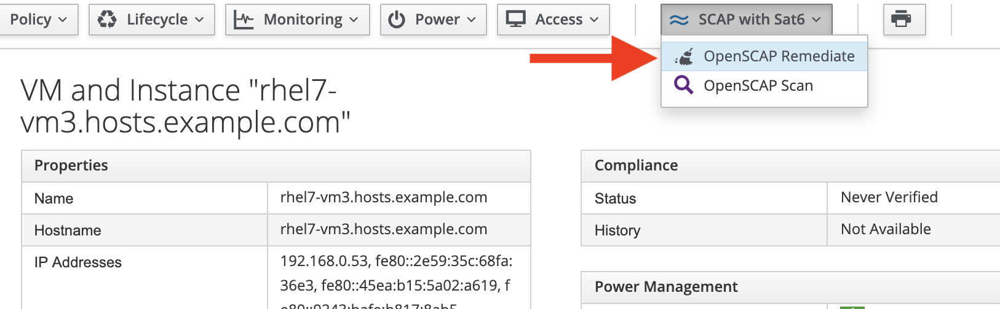

. From the dialog, for *SCAPProfiles*, choose *rhel7-custom*. This is the custom security policy profile that ensures that the AIDE package is installed on your system. We will remediate *rhel7-vm3.hosts.example.com* host against this profile so that at the push of a button AIDE will get installed on this system. Press *Submit* when ready.
+
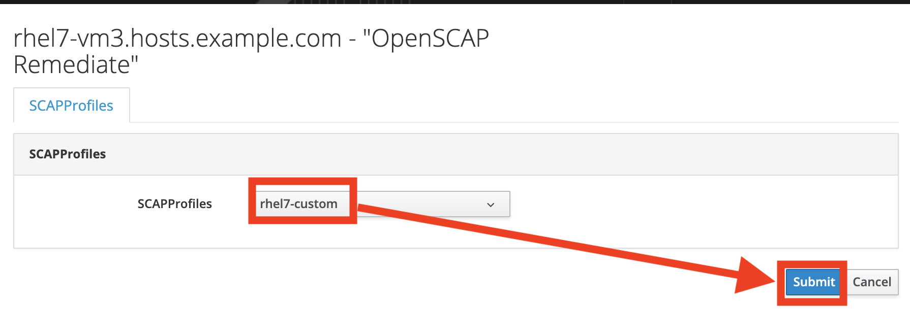

. Let's look at this job run in Red Hat Ansible Tower. Go to Red Hat Ansible Tower (https://tower-GUID.rhpds.opentlc.com) and log in with *admin* as the user name and *r3dh4t1!* as the password (if not already logged in).

. Navigate to *Jobs* and click on the job that is being run at the top , which is *CLOUDFORMS / SCAP Remediate*. Notice that the playbook that is being run in this job template is *openscap_remediate.yml*. If you want to take a closer look at this playbook , you can find it link:https://github.com/RedHatDemos/SecurityDemos/blob/master/2019Labs/ProactiveSecurityCompliance/cloudforms/ansible/satellite/openscap_remediate.yml[here^]. In this playbook, you will notice that after the remediation is completed, the OpenSCAP scan is automatically run and the resulting compliance report is automatically uploaded to Red Hat Satellite.
+
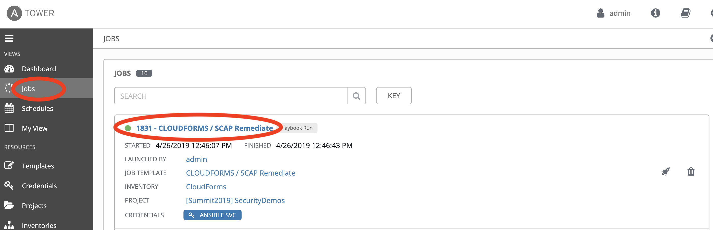

. Oonce you see *Successful* for *STATUS* with a date and time listed for *STARTED* and *ENDED* , in addition to seeing zero failures in the *PLAY RECAP* at the end of your Red Hat Ansible Tower log, then your job has successfully finished running.

. Go back to your terminal and run a `rpm -qa aide` and in a few minutes, you will notice that the AIDE package gets automatically installed.
+
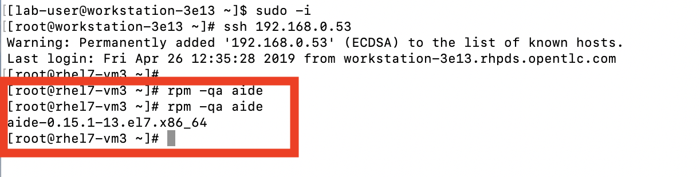

. Now that the AIDE package is installed, we should now pass the OpenSCAP scan against the *rhel7-custom* security policy profile. Let's confirm.

. On the Red Hat Satellite server (https://sat64-GUID.rhpds.opentlc.com) log in with *admin* as the user name and *r3dh4t1!* as the password (if not already logged in)

. Navigate to *Hosts → Reports*.
+

. Notice that we no longer have any failures listed in the *RHEL7_Custom* compliance report for this host. Click the link in the *Reported At* column for the *RHEL7_Custom* compliance report for the *rhel7-vm3.hosts.example.com* host. Notice that we now have 100% Passed for the RHEL7_Custom compliance policy.
+
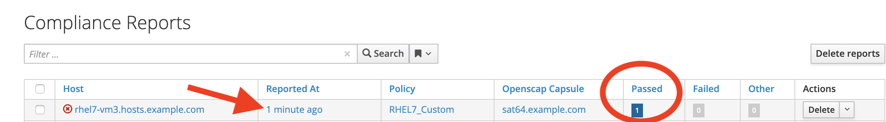
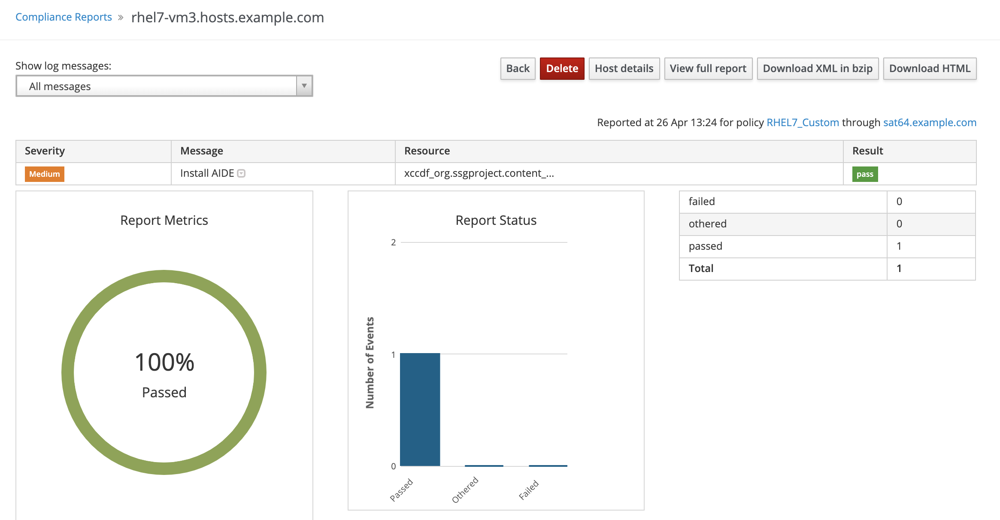

=== Lab 1.8 (*Optional*) Viewing the global status indicator in Red Hat Satellite

Compliance status is one of the items that affect the global status of a system. In Satellite, we have the global status indicator, which is an aggregate of all the compliance states on the system. Specifically, in order to determine the global status, Satellite checks the status of: compliance with SCAP policies, build, configuration, execution, errata, subscription, and traces. Whichever is the worst status is what governs the overall status of the system. This is important to note since if you have a system that fails a SCAP policy finding, you’ll be able to see this quickly in the Satellite UI.

. Take a look at the global status indicator by navigating to *Hosts → All Hosts*. Hover over the red circle next to *rhel7-vm3.hosts.example.com* VM. Notice that you can see at a high level what is wrong with this host in the text once you hover over the red circle.
+
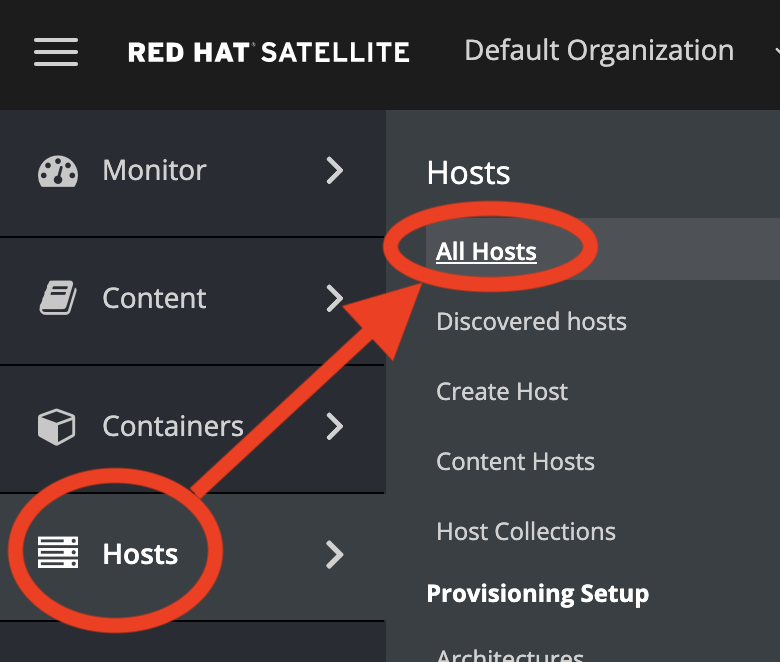
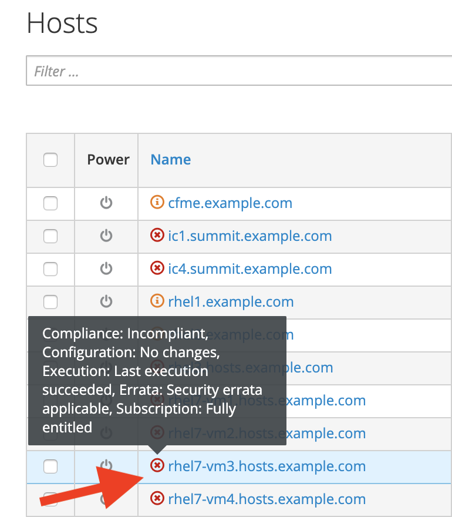

. Next, let's look at the global status indicator in more depth. Click on *rhel7-vm3.hosts.example.com*.

. In the *Properties* box on the left of the Satellite UI, notice that the global *Status* indicator says *Error* and Compliance shows *Incompliant* due to this host failing some of the compliance scans as show in the previous lab exercises.
+
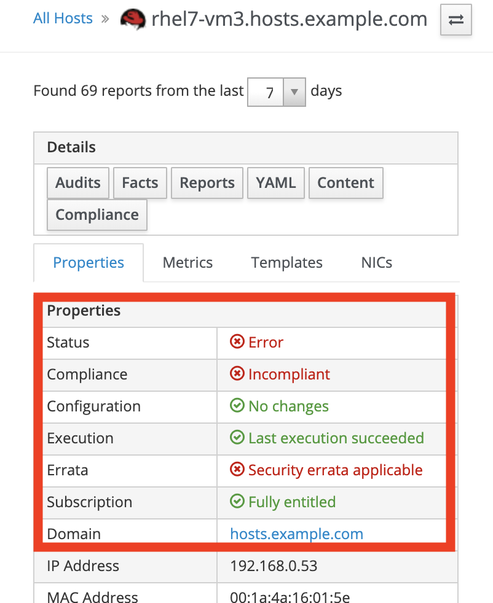

=== Lab 2.9 (*Optional*) Managing Users and Roles

For the administrator, Red Hat Satellite provides the ability to create, modify, and remove users. Also, it is possible to configure access permissions through assigning roles to users. We will not be diving deep into Users and Roles in this lab exercise. For more details on managing users and roles in Satellite, see the guide on link:https://access.redhat.com/documentation/en-us/red_hat_satellite/6.3/html/administering_red_hat_satellite/chap-red_hat_satellite-administering_red_hat_satellite-users_and_roles[Administering Red Hat Satellite].

. Satellite does have a default *Compliance viewer* and *Compliance manager* role. You can customize these roles and assign these roles to users. Users with the *Compliance manager* role can create new compliance policies and associate them with Hostgroups. Users with the *Compliance viewer* role can only view compliance reports.

+
image:images/lab2-roles.png[200,200]
+
image:images/lab2-complianceroles.png[200,200]

<<top>>

link:README.adoc#table-of-contents[ Table of Contents ] | link:lab3.adoc[ Lab 3]
