== Lab 2: Enforcing Automated Compliance with Security Policies

== Goal of Lab 2
The goal of this lab is to introduce you to the power and flexibility of Red Hat Ansible Automation and Red Hat CloudForms to enforce compliance with your security policies in an automated fashion.

Specifically, using a combination of Red Hat Ansible Automation and the control policy engine in Red Hat CloudForms, you will: enforce the installation of the AIDE package and enforce Openstack security group membership in an automated fashion.

== Introduction
Red Hat Ansible Automation is automation software powered by Red Hat Ansible Engine-an execution engine with hundreds of modules that can automate all aspects of IT environments and processes—and Red Hat Ansible Tower—a management interface that can integrate with other services. In this lab exercise, you will use Red Hat Ansible Tower for centralized automation.

Red Hat Ansible Tower and Red Hat CloudForms can easily communicate with each other for security and compliance automation tasks.

Red Hat CloudForms is an infrastructure management platform that allows IT departments to control users’ self-service abilities to provision, manage, and ensure compliance across virtual machines and private clouds. The Red Hat CloudForms control and policy engine provides built-in compliance and governance capabilities. A control policy is created in the Red Hat CloudForms control and policy engine by defining an Event, Condition, and Action. The Action can be one of the defined actions in the Red Hat CloudForms control engine or it can be free-form automation. The Red Hat CloudForms automate engine can be utilized to execute free-form automation using the integrated Ansible engine, by using the native ruby language, or by communicating directly to your Red hat Ansible Tower instance to execute your Ansible playbooks.

=== Lab 2.1 Using Red Hat Ansible Tower and Red Hat CloudForms to enforce the installation of the AIDE package
. Log into Red Hat CloudForms (https://cfme-GUID.rhpds.opentlc.com) with *admin* as the user name and *r3dh4t1!* as the password (if not already logged in).

. Navigate to *Control -> Explorer*.
+
image:images/lab3.1-control-explorer.png[200,200]

. Navigate to *Policy Profiles -> Enforce-AIDE -> Enforce AIDE Package*.
+
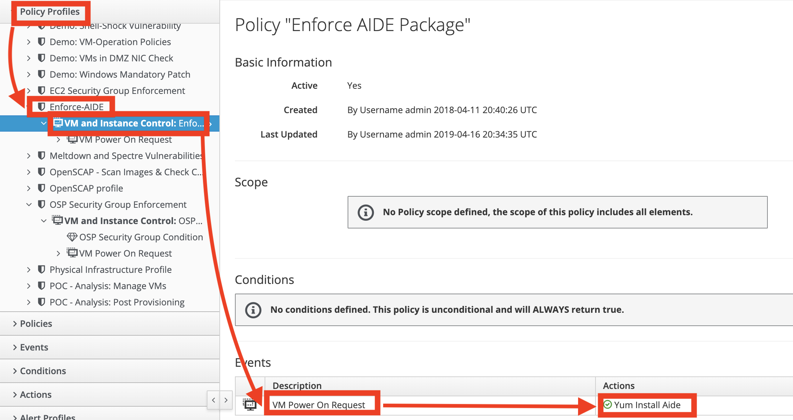
+
NOTE: This control policy dictates that when a VM is powered on, install the AIDE package.

. Click on this control policy by clicking on the event action that says *Yum Install Aide*.
+
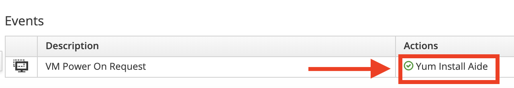

. Notice that this control policy is invoking a custom automation by calling a job template , named *Yum Install Aide* , from Red Hat Ansible Tower that will install the AIDE package on the host where this control policy is applied.
+
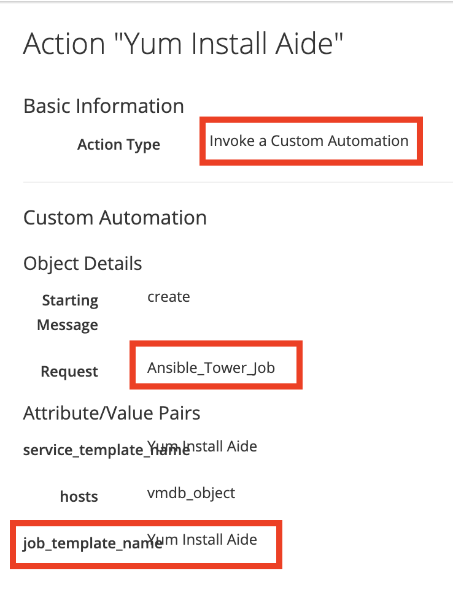

. We are going to apply this control policy to the *rhel7-vm1.hosts.example.com* VM. Let's first confirm that the AIDE package is not installed on this VM and remove the AIDE package from this VM if it is installed.

. If not already there, log into to the bastion host as *lab-user* from your desktop system *replacing GUID with your lab's GUID*. Use the password *r3dh4t1!* for *lab-user* if needed. Become root by typing *sudo -i*.

+
[source]
----
[localhost ~]$ ssh lab-user@workstation-GUID.rhpds.opentlc.com
[lab-user@workstation ~]$ sudo -i
----

. Log into the *rhel7-vm1.hosts.example.com* VM using its IP address *192.168.0.51*.
+
[source]
----
[root@workstation-GUID ~]# ssh 192.168.0.51
----

. Once logged in check to see if the *AIDE* package is installed. If it is, remove this package by typing *yum remove aide* and then typing *y* to remove the package. Do not exit out of this ssh session in your terminal.
+
[source]
----
[root@rhel7-vm1 ~]# rpm -qa --last aide
[root@rhel7-vm1 ~]# yum remove aide
----
. Now that we have confirmed and made sure that the AIDE package is not installed, let's go ahead and turn the  *rhel7-vm1.hosts.example.com* VM off and begin testing our Enforce AIDE control policy.

. Navigate to the *Compute -> Infrastructure -> Virtual Machines*.
+
image:images/lab5.1-infra-vms.png[500,500]

. Search for the *rhel7-vm1.hosts.example.com* VM in the top right search bar and then click on this VM.
+
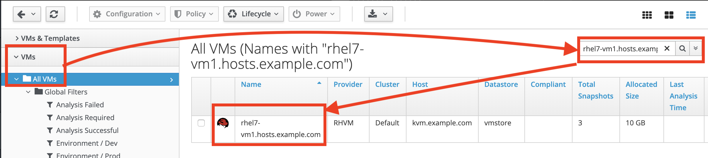

. First, let's Power Off this *rhel7-vm1.hosts.example.com* VM. From the VM summary page, power off this VM by clicking on
*Power -> Power Off*.  Press *OK*.
+
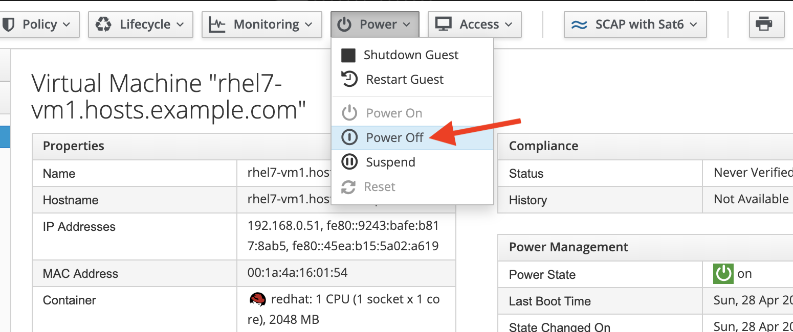

. The *rhel7-vm1.hosts.example.com* VM will power off within about 2 minutes. Press the *refresh* button at the top left until you see that this VM has turned off.
+
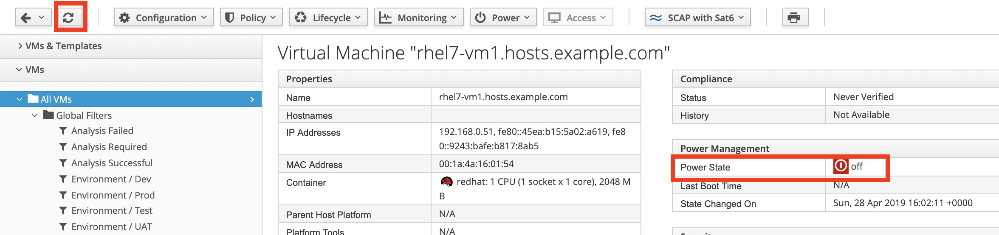

. Click on *Policy -> Manage Policies*.
+
image:images/lab3.1-policy-manage-policies.png[400,400]

. Notice that the Enforce AIDE control policy is assigned to this *rhel7-vm1.hosts.example.com* VM. Also if you scroll down on this page, notice that there is a yellow shield on this VM. This indicates that a control policy is on this VM. Click on *Cancel* to exit.
+
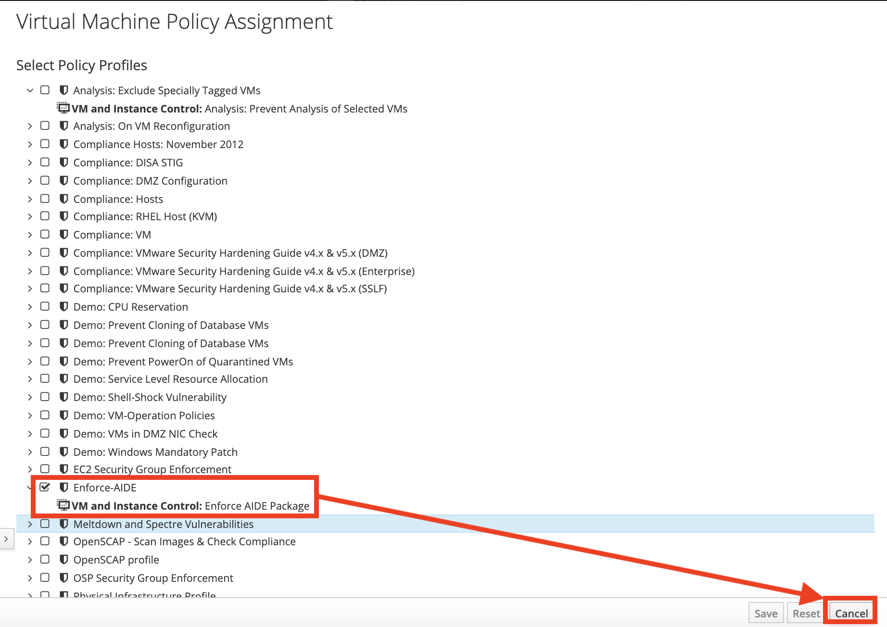
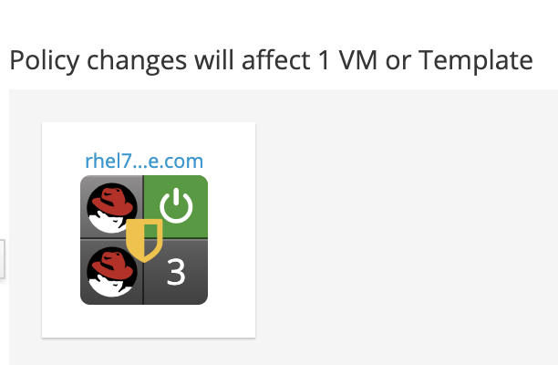

. As stated before, the *Enforce AIDE* control policy will automatically install the AIDE package to the VM that this control policy is applied to whenever the VM is turned on.  Now let's confirm that this Enforce AIDE control policy will automatically execute on this *rhel7-vm1.hosts.example.com* VM whenever it is powered on.

. From the VM summary page, power on the *rhel7-vm1.hosts.example.com* VM. Click *OK*. This will trigger the control policy to execute the *Yum Install Aide* Red Hat Ansible Job Template to install the AIDE package on this VM. Note that it can take a minute or so for the package to be installed.
+
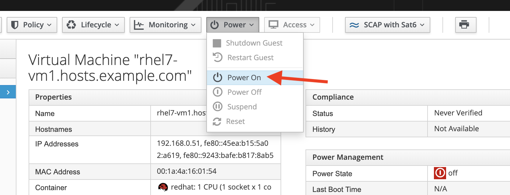

. Note the IP address for the *rhel7-vm1.hosts.example.com* VM, which is *192.168.0.51*.
+
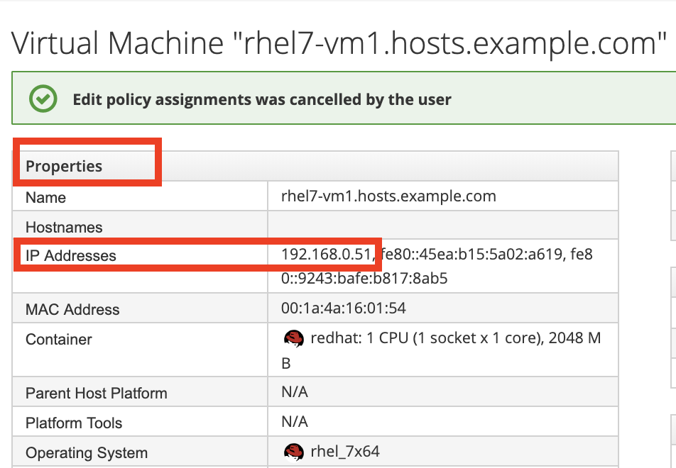

. Go to Red Hat Ansible Tower (https://tower-GUID.rhpds.opentlc.com) and log in with *admin* as the user name and *r3dh4t1!* as the password (if not already logged in).

. Navigate to *Jobs* and click on the job that is being run at the top , which is *Yum Install Aide*.
+
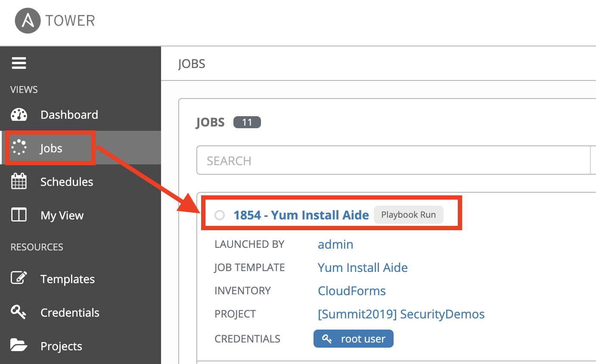

. Notice that this job is running the *install-packages.yml* playbook and is being run on the *rhel7-vm1.hosts.example.com* VM.
+
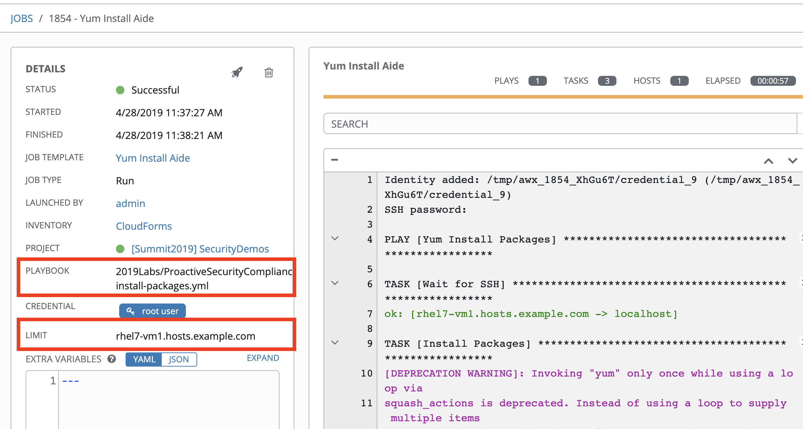

. Go back to your terminal where you are still logged in as *root* on the *rhel7-vm1.hosts.example.com* VM.

. Once logged in check to see if the *AIDE* package is now installed.
+
[source]
----
[root@rhel7-vm1 ~]# rpm -qa --last aide
aide-0.15.1-13.el7.x86_64  Sun 28 Apr 2019 04:26:59 PM EDT
----
. The *Enforce AIDE* control policy has automatically executed on the *rhel7-vm1.hosts.example.com* VM successfully!

. Exit out of the ssh session.

=== Lab 3.2 Using Red Hat CloudForms compliance policy to determine if an OpenStack instance is vulnerable to the Meltdown and Spectre vulnerabilities
. Open a private browser window in your web browser.  In the private browser window go to the CloudForms appliance URL (cfme-GUID.rhpds.opentlc.com) and log in with *labuser* as the user name and *r3dh4t1!* as the password.
+
NOTE: labuser is a restricted user that was created by the admin. This user can only see his/her VMs and has limited functionality in CloudForms.

. Navigate to Services -> Workloads if not already there.
+
image:images/lab3.2-services-workloads.png[400,400]

. You will see that the VM is non-compliant. Click on the VM *lab3-vm2* to go to the summary screen.
+
image:images/lab3.2-all-vms.png[500,500]

. In the upper right hand corner click on *Compliance Status*.
+
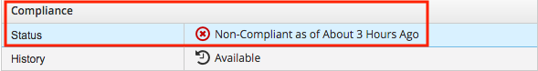
+
. Expand and see the details of this compliance check. You will see that the VM is vulnerable to the Meltdown and Spectre vulnerabilities.
+
image:images/lab3.2-compliance-status-view.png[400,400]
+
NOTE: For the sake of time, the vulnerable kernel packages have already been patched by updating this VM to the latest kernel packages.
+
. Click on the back arrow to navigate back to the VM summary page.
+
image:images/lab3.2-back-arrow.png[400,400]
+
. From the VM summary page click on Packages.
+
image:images/lab3.2-packages.png[500,500]
+
. Scroll down to find the kernel package and note the version *693.el7*.
+
image:images/lab3.2-packages-view.png[800,800]
+
. To mitigate against the Meltdown and Spectre vulnerabilities, the kernel package needs to be version *830.el7* or higher. Click on the *back arrow* to navigate back to the VM summary page.
+
image:images/lab3.2-back-arrow.png[400,400]
+
. Click on *Configuration -> Perform SmartState Analysis*. This will launch a job that will scan the VMs packages and other metadata.
+
image:images/lab3.2-launch-smart-state.png[400,400]
+
. Click on *Lab User -> Tasks* to monitor the scan jobs status.
+
image:images/lab3.2-tasks.png[150,150]
+
. Click on the *Refresh* button periodically until the scan job has completed (about 3 minutes). Afterwards, *click on the job* and this will take you back to the VM summary page.
+
image:images/lab3.2-task-results.png[600,600]
+
. Click on *Policy -> Check Compliance of Last Known Configuration*
+
image:images/lab3.2-check-compliance.png[400,400]
+
. Click on the *Refresh* button until the VM is compliant.
+
image:images/lab3.2-compliant-success.png[600,600]

=== Lab 3.3 Using Red Hat CloudForms control engine to enforce OpenStack Security Group membership

. Switch to the browser tab that is logged in to CloudForms as *admin* and then navigate to *Control -> Explorer*.
+
image:images/lab3.3-control-explorer.png[200,200]
+
. Navigate to *Policy Profiles -> Lab 3.3 OSP Security Group Enforcement -> Lab 3.3 OSP Attach Security Group Policy*. You will notice that this policy states that when an OpenStack instance is powered on, ensure that the *Production* security group is attached.
+
image:images/lab3.3-control-policy.png[600,600]
+
. Navigate to Compute -> Cloud -> Instances.
+
image:images/lab3.3-computecloudinstances.png[500,500]
+
. Click on the VM *lab3-vm3* to go to the VM summary page.
+
image:images/lab3.3-all-vms.png[600,600]
+
. Click on *Policy -> Manage Policies*.
+
image:images/lab3.3-policy-manage-policies.png[400,400]
+
. Verify that the Lab 3.3 control policy is assigned and click on *Cancel* to exit.
+
image:images/lab3.3-policy-assignment.png[600,600]
+
. From the VM summary page, locate *Relationships* and click on *Security Groups*.
+
image:images/lab3.3-relationships.png[400,400]
+
. You will see that the VM only has 1 security group.
+
image:images/lab3.3-security-groups-before.png[600,600]
+
. Click on the *back* arrow to navigate back to the VM summary page.
+
image:images/lab3.3-back-arrow.png[200,200]
+
. From the VM summary page *power on* the VM. This will trigger the control policy to ensure that the *Production* security group is applied.
+
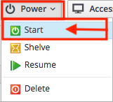
+
. Click on the *refresh button* until the VM has powered on and the security group count has changed. Once changed, click on *Security Groups* again.
+
image:images/lab3.3-refresh-security-groups.png[600,600]
+
. You will now notice that the *Production* security group has been applied automatically due to the control policy set on this Openstack instance.
+
image:images/lab3.3-security-groups-after.png[600,600]

link:README.adoc#table-of-contents[ Table of Contents ] | link:lab4.adoc[Lab 4]
