== Lab 3: Additional Automated Security Hardening and Configuration Management of Host Systems

*Lab Length: Medium/Average*

=== Goal of Lab 3
The goal of this lab is to perform additional security hardening and configuration management tasks on our host systems.

Specifically, in this lab exercise, we will configure the following on our host systems, in an automated fashion, to ensure that we are are practicing general security hardening best practices:

* Deploy login banner
* Configure account password complexity
* Enable SELinux
* Harden SSH

*Be sure to do this lab exercise (Lab 3) AFTER Labs 1, 2, and 3.*
This is because this lab exercise will harden several host VMs and make them unusable for Labs 1, 2, and 3.

=== Introduction
Every year we are seeing an increase in the number of security breaches, an increase in the time to resolve an incident, and it's harder and harder to find security skilled staff. Also, the link:https://www-03.ibm.com/press/us/en/pressrelease/53800.wss[Ponemon Institute's Cost of a Data Breach 2018 Study]  found that while 25% of the root cause of data breaches were caused by system glitches, 48% were caused by malicious or criminal attacks, and 27% were caused by human errors. In addition, according to the link:https://enterprise.verizon.com/resources/reports/dbir/[Verizon Data Breach Report], 81% of hacking-related breaches leveraged either stolen and/or weak passwords.

Automation can help with these challenges by improving both security and compliance. Specifically, it can help you avoid human errors, which will help with reducing risk and data breaches. In addition, automation gives you the ability to create infrastructure, security, and compliance as code , thus creating that repeatable, sharable, and verifiable infrastructure and application environments. Also, all of these benefits with automation also make it easier to pass security compliance audits.

In this lab exercise, we will use automation to further harden our host systems and practice general security hardening best practices by protecting these host systems from common security mistakes, such as weak passwords, and more.

=== Lab 3.1 Viewing Host Systems Before Automated Additional Security Hardening

. Let's take a look at our host systems before doing additional automated security hardening on them. Note that the additional automated security hardening will be executed on 3 RHEL 7 hosts that are part of the foreman_lifecycle_environment_rhel7_dev group: *rhel7-vm3.hosts.example.com, rhel7-vm4.hosts.example.com, and rhel7-vm5.hosts.example.com*. In addition, automated security hardening will be executed on the *rhel8-vm1.hosts.example.com* RHEL 8 host as well. However for this RHEL 8 host, we will execute limited hardening.

. SSH into *rhel7-vm3.hosts.example.com* from the workstation bastion host. From your laptop, first SSH into the workstation bastion host as *lab-user*. Then, become *root* on the workstation bastion host and as *lab-user*, ssh into *rhel7-vm3.hosts.example.com* by its *IP address (192.168.0.53)*.
+
[source, text]
[localhost ~]$ ssh lab-user@workstation-GUID.green.osp.opentlc.com
[lab-user@workstation-GUID ~]$ sudo -i
[root@workstation-GUID ~]$ ssh lab-user@192.168.0.53
[root@rhel7-vm3 ~]#

. Notice that we are able to SSH into this host without any issues. Also notice that there is no login banner or message of the day shown when you log into the host. Optionally, SSH into this host as *root* and notice that again you are able to SSH without any issues and do not see the login banner or message of the day.

. Optionally, feel free to SSH into the other 2 RHEL 7 hosts: rhel7-vm4.hosts.example.com(192.168.0.54) and rhel7-vm5.hosts.example.com(192.168.0.55). You will again notice that you are able to SSH into these hosts without any issues and there is no login banner or message of the day shown when you log into these hosts. You will also notice that you can SSH into the rhel8-vm1.hosts.example.com(192.168.0.61) RHEL 8 host without any issues and no login banner or message of the day is shown.

. Now, let's go ahead and do automated security hardening of these hosts in the next exercise.

=== Lab 3.2 Automated Security Hardening of Host Systems from Red Hat Ansible Tower

. On Red Hat Ansible Tower log in with *admin* as the user name and *r3dh4t1!* as the password (if not already logged in). Don't forget to replace the *GUID* with your provided *GUID*.

. Navigate to *Templates* and click the *rocket ship* next to the job template named *LINUX / System Hardening*.
+
image:images/templates.png[100,100]
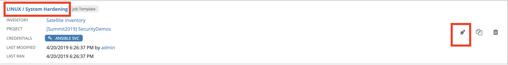

. You will be prompted for the hosts that you would like to run this job template on. Enter **rhel7_dev* into the text field. We will target our dev host systems first. Click *Next* followed by *Launch* to begin the job.
+
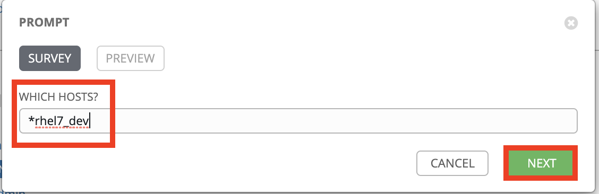
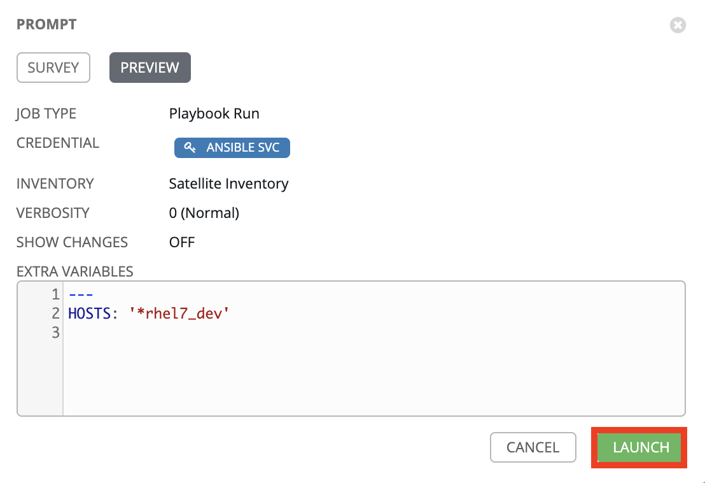

. Now, let's find out which hosts are part of *foreman_lifecycle_environment_rhel7_dev* group.

. Navigate to *Inventories -> Satellite Inventory -> GROUPS -> foreman_lifecycle_environment_rhel7_dev -> HOSTS*. Notice that there are 3 hosts that are part of the foreman_lifecycle_environment_rhel7_dev group: rhel7-vm3.hosts.example.com, rhel7-vm4.hosts.example.com, and rhel7-vm5.hosts.example.com. That means that this host hardening job template will be run on these three hosts.

. Navigate back to *Jobs* and click on the *LINUX / System Hardening* job.
+
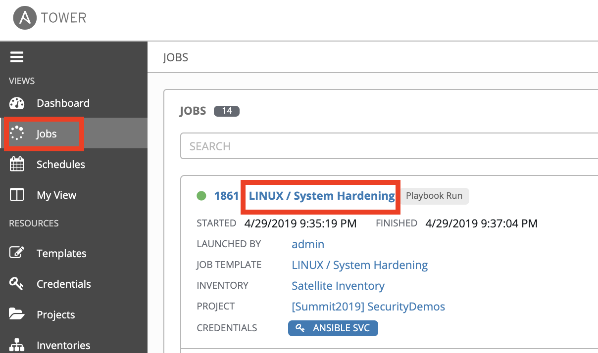

. Take a look at the Ansible Tower log output as the configuration is checked and remediated on our host systems. Specifically, notice that several tasks are being executed on our host systems such as various SSH hardening tasks, enabling SELinux, deploying a login banner, and configuring account password complexity.  At the end we will see a *Play Recap* showing us how many changes were made on the systems.
+
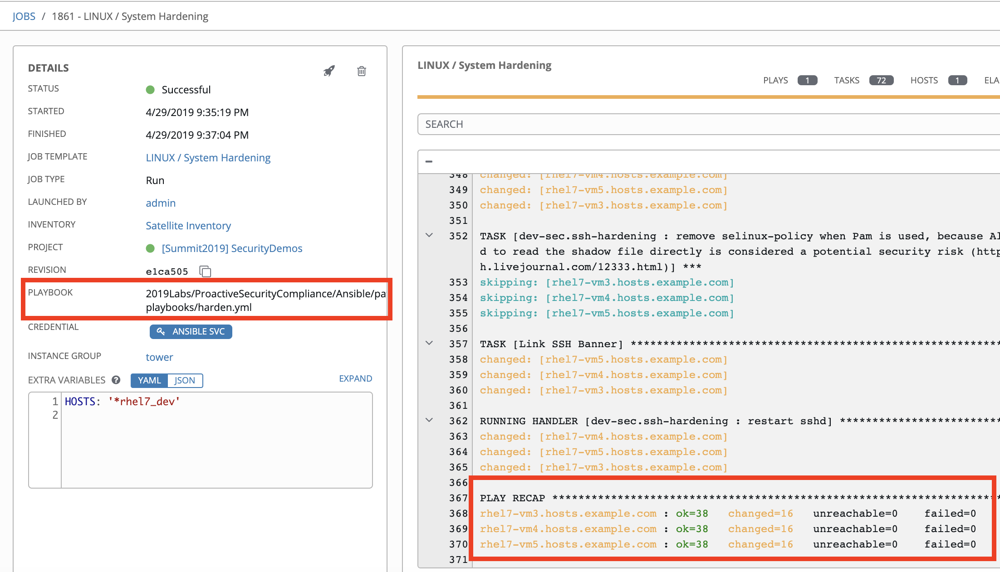
+
NOTE: Because Ansible is idempotent, after 1 run of a playbook to set things to a desired state, further runs of the same playbook will result in 0 changes. As a result, this playbook will check to make sure the client is installed and configured, but if there are no changes to be made, Ansible will skip over the task and verify that the systems are in the correct state. Ansible works to achieve an endstate defined in the playbook so if this playbook is run routinely, it will only make the changes needed to comply with your security hardening standard.

. Now, let's go ahead and do limited hardening of our rhel8-vm1.hosts.example.com RHEL 8 host as well. Specifically, we are just going to make sure SELinux is enabled and display a login banner.

. Navigate to *Templates* and click the *rocket ship* next to the job template named *LINUX / RHEL 8/ System Hardening*.
+
image:images/templates.png[100,100]
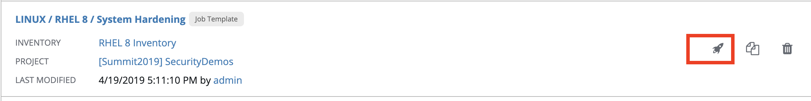

. In the survey prompt, for *WHICH HOSTS?*, type *rhel8-vm1.hosts.example.com* and press *NEXT*.
+
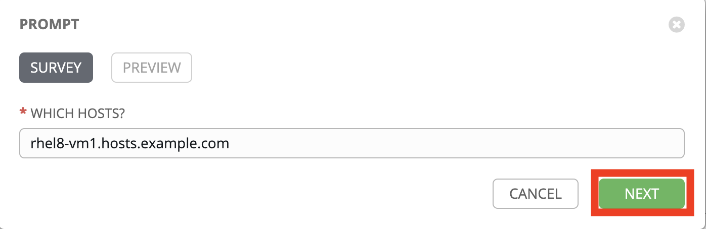

. Take a look at the Ansible Tower log output as the configuration is checked and remediated on our *rhel8-vm1.hosts.example.com* RHEL 8 host. Specifically, notice that less tasks are being executed on this RHEL 8 host vs our previous RHEL 7 hosts. For example, you don't see the various SSH hardening tasks being executed as part of this job.  At the end of this job run, we will see a *PLAY RECAP* showing us the number of changes that were made on the *rhel8-vm1.hosts.example.com* RHEL 8 host with zero errors. You will also see STATUS showing Successful in the DETAILS section.
+
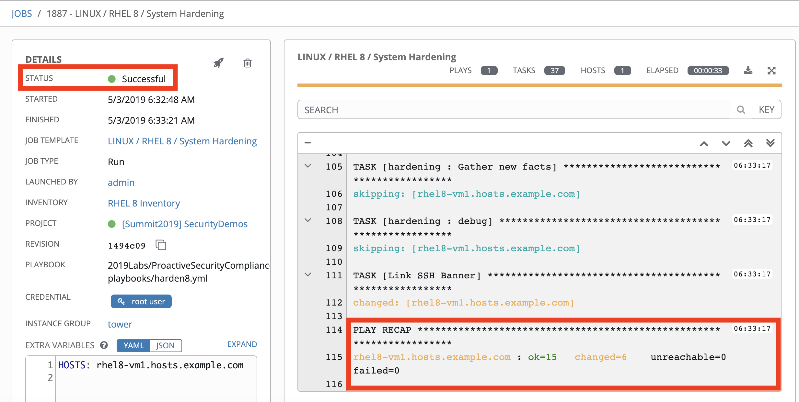

=== Lab 3.3 Viewing Host Systems After Automated Additional Security Hardening

. Let's take a look at our host systems again now that we have applied additional automated security hardening on them. Again, remember that the additional automated security hardening was executed on 3 RHEL 7 hosts that are part of the foreman_lifecycle_environment_rhel7_dev group: *rhel7-vm3.hosts.example.com, rhel7-vm4.hosts.example.com, and rhel7-vm5.hosts.example.com*. In addition, limited hardening was also executed on the rhel8-vm1.hosts.example.com RHEL 8 host as well. Specifically, we just make sure that SELinux is enabled and display a login banner.

. SSH into *rhel7-vm3.hosts.example.com* from the workstation bastion host. From your laptop, first SSH into the workstation bastion host as *lab-user*. Then, become *root* on the workstation bastion host, ssh into *rhel7-vm3.hosts.example.com* by its *IP address (192.168.0.53)*.
+
[source, text]
[localhost ~]$ ssh lab-user@workstation-GUID.green.osp.opentlc.com
[lab-user@workstation-GUID ~]$ sudo -i
[root@workstation-GUID ~]$ ssh lab-user@192.168.0.53

. Notice that we are no longer able to SSH into this host as *lab-user* or *root* and get permission denied when trying to log in. Also notice that there is now a message of the day when you log into this host. Optionally, SSH into this host as *ansible* and notice that you see the login banner , message of the day, and have no issues logging into this system as the ansible user.
+
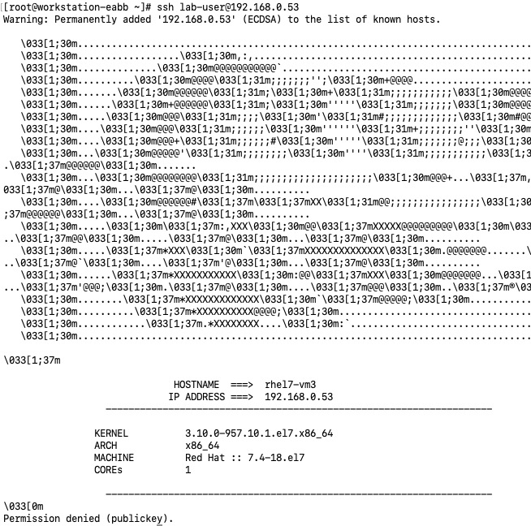

. Optionally, feel free to SSH into the other 2 RHEL 7 hosts: rhel7-vm4.hosts.example.com(192.168.0.54) and rhel7-vm5.hosts.example.com(192.168.0.55) as either *lab-user* or *root*. You will again notice that you are not able to SSH into these hosts and get a permission denied when trying to log in. In addition, you also will see the message of the day when logging into these hosts.

. Finally, SSH into the *rhel8-vm1.hosts.example.com* RHEL 8 host from the workstation bastion host. From your laptop, first SSH into the workstation bastion host as *lab-user*. Then, become *root* on the workstation bastion host, ssh into *rhel8-vm1.hosts.example.com* by its *IP address (192.168.0.61)*.
+
[source, text]
[localhost ~]$ ssh lab-user@workstation-GUID.green.osp.opentlc.com
[lab-user@workstation-GUID ~]$ sudo -i
[root@workstation-GUID ~]$ ssh lab-user@192.168.0.61

. Notice that we can SSH into the *rhel8-vm1.hosts.example.com* RHEL 8 host as *root* or *lab-user* without any issues since the RHEL 8 hardening playbook did not harden SSH. Also notice that you also see the Red Hat login banner and SELinux is enabled.
+
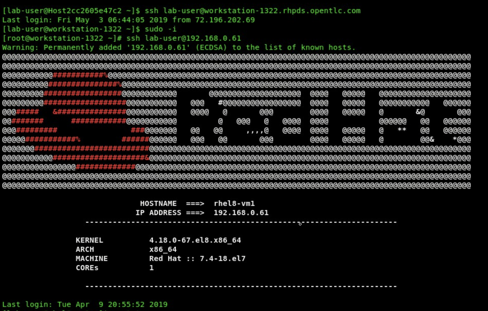
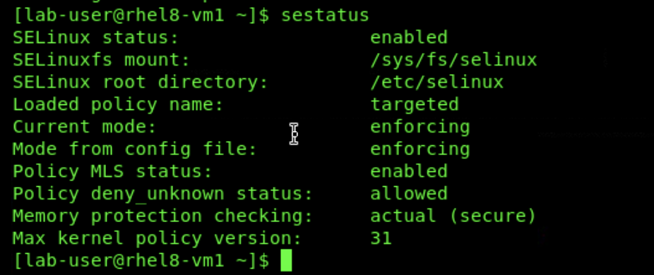

<<top>>

link:README.adoc#table-of-contents[ Table of Contents ] | link:lab5.adoc[Lab 5: Proactive Security and Automated Risk Management at Scale with Predictive Analytics]
