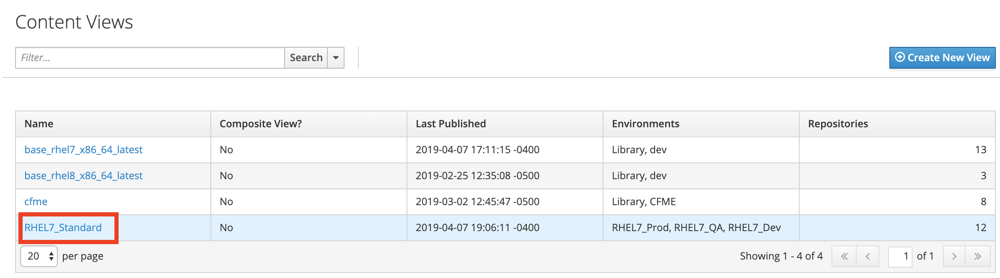
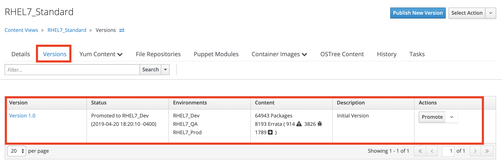
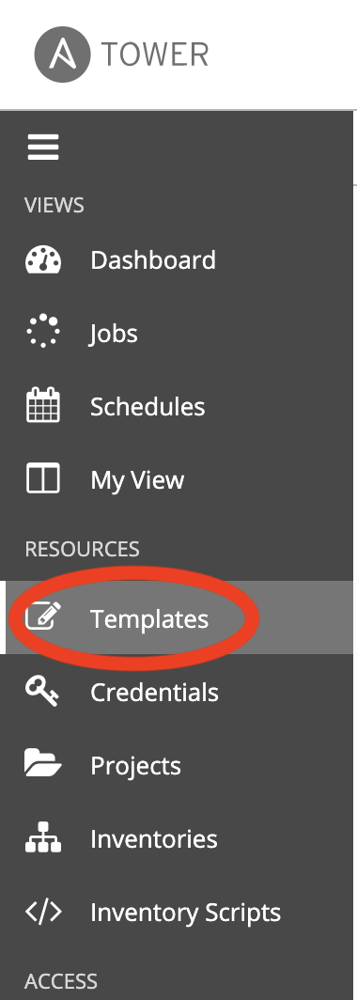
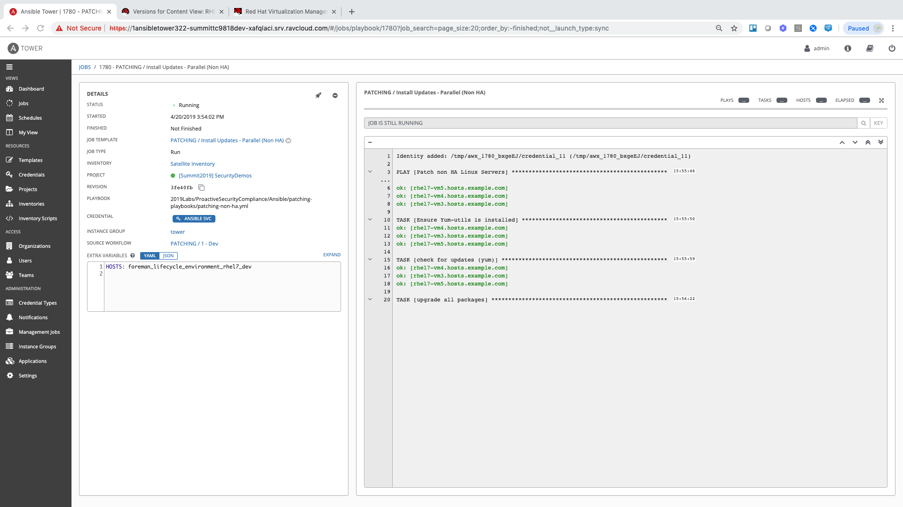
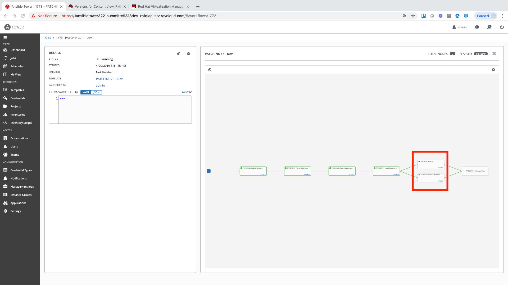
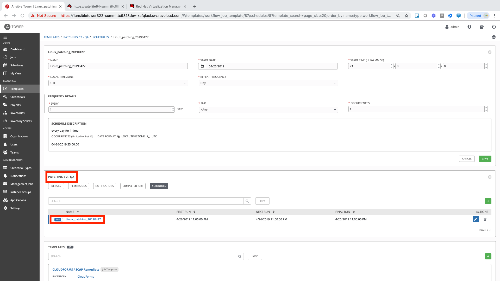

== Lab 3: Automated Patching of Host Systems

=== Goal of Lab 3
The goal of this lab is to learn how you can use a combination of Red Hat Ansible Tower and Red Hat Satellite to implement an automated patching strategy to automatically update and patch host systems at scale in different lifecycle environments. Specifically, you will learn how you can automatically apply patches to host systems and how to automate the tasks that have to happen behind the scenes to manage content in Red Hat Satellite.

=== Introduction
Gartner found that link:https://www.gartner.com/smarterwithgartner/focus-on-the-biggest-security-threats-not-the-most-publicized["99% of the vulnerabilities exploited by the end of 2020 will continue to be ones known by security and IT professionals at the time of the incident."]
By having a consistent and automated patching strategy in place, you have a higher chance of being protected by these known vulnerabilities.

Patching is a necessary part of operating system lifecycle management. However, many organizations are struggling to remain current with the constant release of new patches and updates. At the same time, they are under pressure to provide near 100% availability of key business systems. With a consistent automated patch strategy that is routinely executed on your host systems, patching can run smoothly and in an automated fashion.
Automation is a key component of having a successful patching strategy. Automation provides that continuous, daily improvement.

Frequent patching is a crucial component to maintainting a secure environment. It is often avoided, delayed, or heavlily lagging due to the involved manual process required to confidently roll new patch sets out to systems and applications.

In this lab, we will see how utilizing Red Hat Satellite as the content repository and Red Hat Ansible Tower as the automation platform can make patching must less of a burden with automation.

=== Lab 1.1 Viewing the Red Hat Satellite Pre-Configured Content Views

. On the Red Hat Satellite server (https://sat64-GUID.rhpds.opentlc.com) log in with *admin* as the user name and *r3dh4t1!* as the password (if not already logged in)

. Navigate to *Content -> Content Views*. Here you will find a content view called *RHEL7_Standard*. This is used for all base builds of RHEL7.
+
image:images/content-views.png[300,300]

. Click on the *RHEL7_Standard* content view.
+

. Once the page loads, click the *Versions* tab at the top of the frame (if not already there). You will see one version (*Version 1.0*) associated with all lifecycle environments (*RHEL7_Dev, RHEL7_QA, and RHEL7_Prod*).
+

=== Lab 1.2 Automatically Creating and Promoting New Content Views in Red Hat Satellite with Red Hat Ansible Tower

To patch our systems, we will need to create a new version of the content view that contains any newly synchronized packages. Next, we want to promote that version to the lower environments (such as Dev and QA) to test the patches prior to releasing to higher environments (such as Production). This would all have to be done manually if we did not have automation in place. As the number of content views and environments grows, so does the workload in doing this manually.

In this lab exercise, we will automatically create and promote new content views with our updated patches and packages in Red Hat Satellite automatically using Red Hat Ansible Tower.

. On Red Hat Ansible Tower (https://tower-GUID.rhpds.opentlc.com) log in with *admin* as the user name and *r3dh4t1!* as the password (if not already logged in).

. Navigate to *Templates* and click the *rocket ship* next to the job template named *PATCHING / 1 Dev*. This will launch the job and we will observe what actions it automates as it runs. The next few steps will walk you through what the automation is doing.
+

image:images/lab4-launch_dev.png[2000,2000]

.. First, we need to publish a new version of content. Go back to Satellite and look at your content view again. (Content > Content Views > RHEL7_Standard) You will notice in the "Versions" section that a new version is being created.
+
image:images/lab4-create_version.png[500,500]

.. Next, the 'RHEL7_Dev' lifecycle environment will be promoted to use the new version.
+
image:images/lab4-promote_version.png[500,500]

.. After that, we scan the hosts for new Errata. This simply updates satellite with the patches missing on the system now that we have a new version of content.

.. Ansible will then run a `yum update` on the hosts to install the new content. Click the "Details" link while the "Install Updates" job is running. From here we can monitor progress across all hosts.
+

.. Click the back button in your browser to go back and monitor the full workflow. The next 2 jobs will run in parallel since they are not dependent on each other. One will run and OpenSCAP scan on the system post updates to provide the latest compliance report. The other will rescan the host again and upload the patch status to Satellite.
+

. Finally, if all of the previous steps were successful, a schedule will be created in Ansible Tower to patch the QA environment 7 days from now. Once the entire workflow is complete, select "Schedules" from the navigation menu on the left. Click on the schedule titled "Linux_patching_*". Inspect the scheule to take note of the workflow it will run and the date that is scheudled. From this page you can disable the schedule, reschedule, cancel, etc. If no changes are made, it will automatically promote and patch your QA environment. Since we do not have 7 days to wait, if you would like to watch the process again, return to the "Templates" page and manually run "PATCHING / 2 - QA".
+

link:README.adoc#table-of-contents[ Table of Contents ] | link:lab4.adoc[Lab 4: Additional Automated Security Hardening and Configuration Management of Host Systems]
