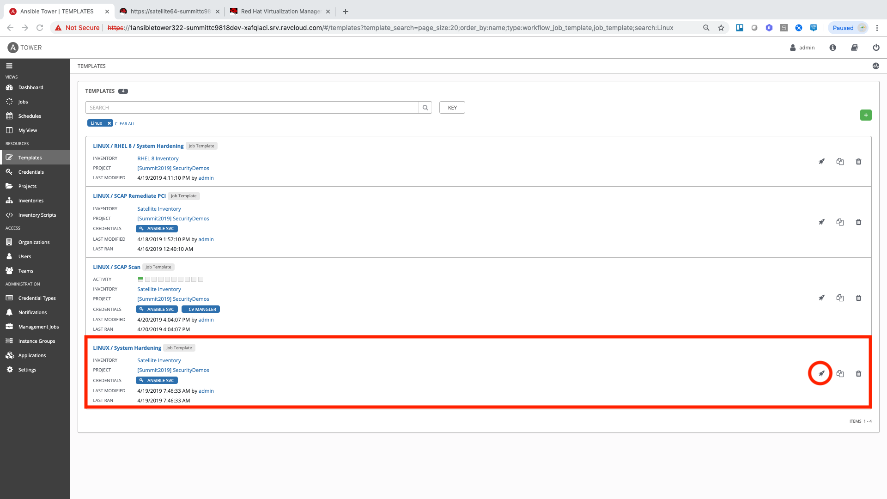
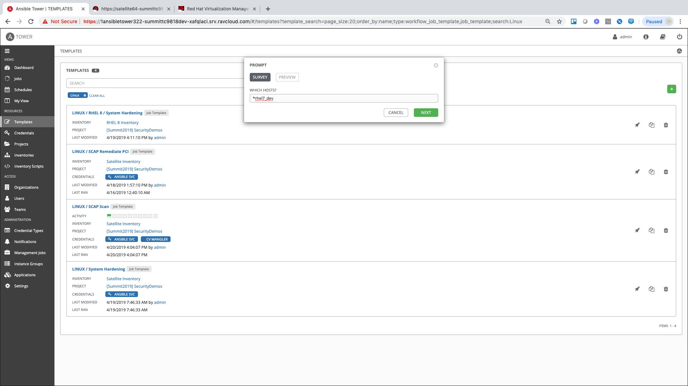
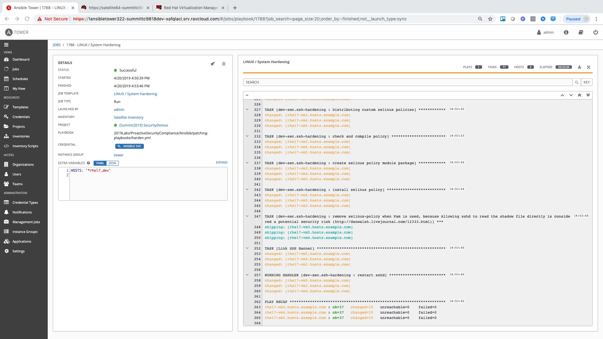

== Lab 4: Additional Automated Security Hardening and Configuration Management of Host Systems

=== Goal of Lab 4
The goal of this lab is to perform additional security hardening and configuration management tasks on our host systems.

Specifically, in this lab exercise, we will configure the following on our host systems, in an automated fashion, to ensure that we are are practicing general security hardening best practices:

* Deploy login banner
* Configure account password complexity
* Enable SELinux
* Harden SSH

*Be sure to do this lab exercise (Lab 4) AFTER Labs 1, 2, and 3.*
This is because this lab exercise will harden several host VMs and make them unusable for Labs 1, 2, and 3.

=== Introduction
Every year we are seeing an increase in the number of security breaches, an increase in the time to resolve an incident, and it's harder and harder to find security skilled staff. Also, the link:https://www-03.ibm.com/press/us/en/pressrelease/53800.wss[Ponemon Institute's Cost of a Data Breach 2018 Study]  found that while 25% of the root cause of data breaches were caused by system glitches, 48% were caused by malicious or criminal attacks, and 27% were caused by human errors. In addition, according to the link:https://enterprise.verizon.com/resources/reports/dbir/[Verizon Data Breach Report], 81% of hacking-related breaches leveraged either stolen and/or weak passwords.

Automation can help with these challenges by improving both security and compliance. Specifically, it can help you avoid human errors, which will help with reducing risks and data breaches. In addition, automation gives you the ability to create infrastructure, security, and compliance as code , thus creating that repeatable, sharable, and verifiable infrastructure and application environments. Also, all of these benefits with automation also helps make passing security compliance audits easier as well.

In this lab exercise, we will use automation to further harden our host systems and practice general security hardening best practices by protecting these host systems from common mistakes, such as weak passwords and more.

. Login to Ansible Tower and select "Templates" from the navigation menu on the left.

. Search or scroll through the templates to find the template named "LINUX / System Hardening". Then click the rocket ship icon to the right side of the window.
+

. You will be prompted for the hosts that you would like to configure. Enter `*rhel7_dev` into the text field. We will target our dev servers first. Click "Next" followed by "Launch" to begin the job.
+

. We will monitor the log as the configuration is checked and remediated on our systems. At the end we will see a Play Recap showing us how many changes were made on the systems.
+

. Re-run the job using the rocketship in the top corner of the details frame to observe how many changes are made after a system is already hardened. Ansible works to achieve an endstate defined in the playbook so if this playbook is run routinely, it will only make the changes needed to comply with your hardening standard.

<<top>>

link:README.adoc#table-of-contents[ Table of Contents ] | link:lab5.adoc[Lab 5: Proactive Security and Automated Risk Management at Scale with Predictive Analytics]
