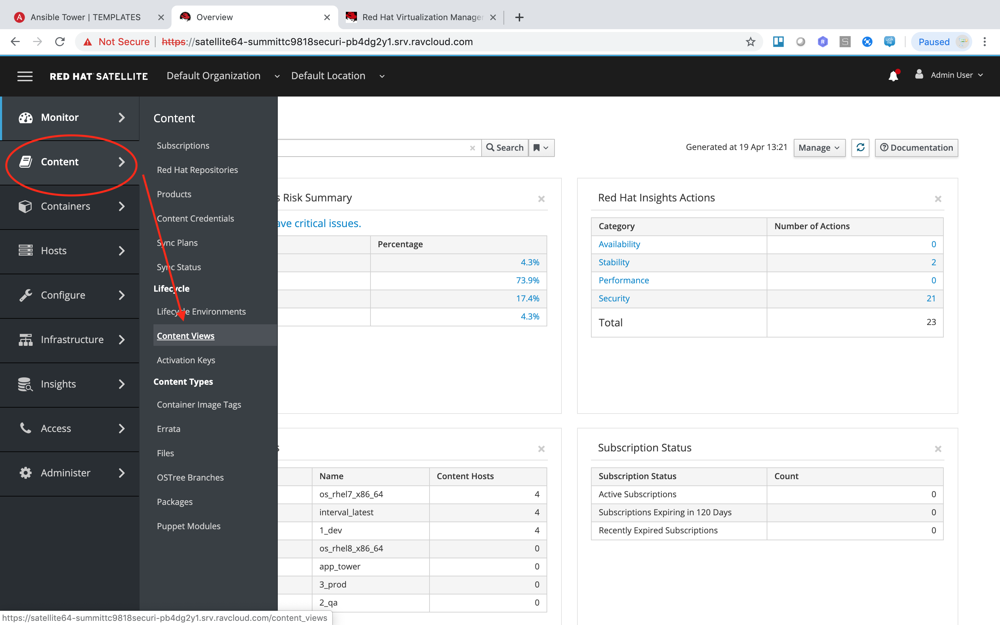
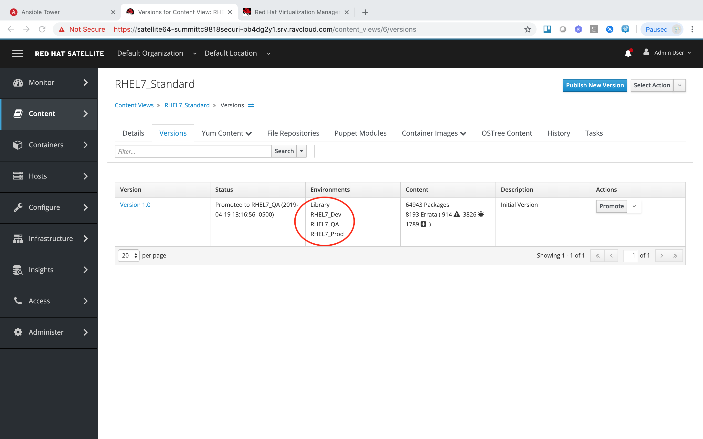
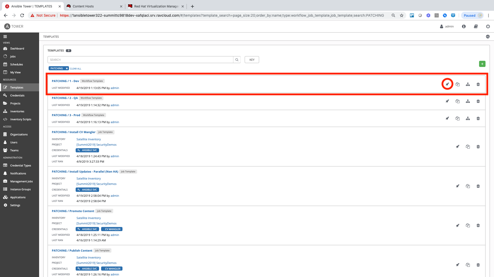
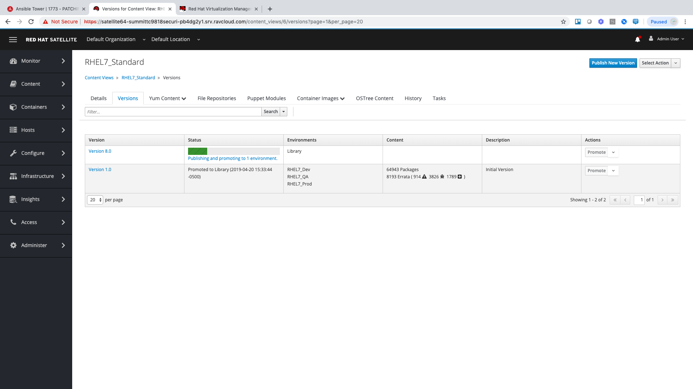
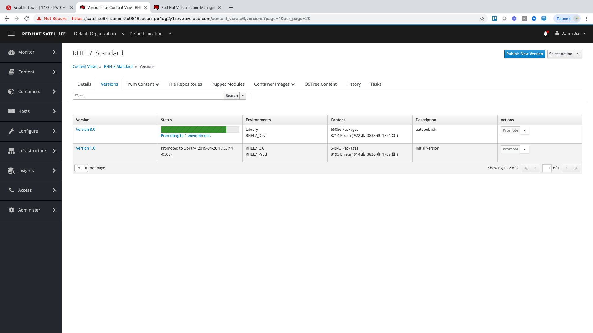

== Lab 4: Automated Patching

____
[Automation] is not magic. It’s about continuous, daily improvement—the constant discipline of pursuing higher performance by following the heuristic “if it hurts, do it more often, and bring the pain forward.”
____
-- https://continuousdelivery.com[Jez Humble]

Frequent patching is a crucial component to maintainting a secure environment. It is often avoided, delayed, or heavlily lagging due to the involved manual process required to confidently roll new patch sets out to systems and applications. In this lab, we will see how utilizing RedHat Satellite (content repository) and Ansible Tower (Automation Platform) make patching must less of a burden. 

Before we get started, let's understand a little about the setup and process since much of what we do will be automated.

. Open the Web UI for your Satellite Server. Select "Content" from the navigation on the left and then select "Content Views". Here you will find a content view called `RHEL7_Standard`. This is used for all base builds of RHEL7.
+

. Click on the `RHEL7_Standard` content view. Once the page loads, click the "Versions" tab at the top of the frame. You will see 1 version associated with all lifecycle environments.
+

+
To patch our systems, we will need to create a new version of the content view that contains any newly syncronized packages. Next, we want to promote that version to the lower environments to test the patches prior to releasing to higher environments. This would all have to be done manually if we did not have automation and as the number of content views and environments grows, so does the workload in doing this manually.

. From the Tower dashboard, select "Templates" from the navigation bar on the left.

. In the Templates view, locate the "PATCHING / 1 Dev" job template by searching or scrolling, and click the rocket ship icon to the left of the template name. This will launch the job and we will observe what actions it automates as it runs. The next few steps will walk you through what the automation is doing.
+

.. First, we need to publish a new version of content. Go back to Satellite and look at your content view again. (Content > Content Views > RHEL7_Standard) You will notice in the "Versions" section that a new version is being created.
+

.. Next, the 'RHEL7_Dev' lifecycle environment will be promoted to use the new version.
+

.. After that, we scan the hosts for new Errata. This simply updates satellite with the patches missing on the system now that we have a new version of content. 

.. Ansible will then run a `yum update` on the hosts to install the new content. Click the "Details" link while the "Install Updates" job is running. From here we can monitor progress across all hosts.

.. Click the back button in your browser to go back and monitor the full workflow. The next 2 jobs will run in parallel since they are not dependent on each other. One will run and OpenSCAP scan on the system post updates to provide the latest compliance report. The other will rescan the host again and upload the patch status to Satellite.

.. Finally, if all of the previous steps were successful, a schedule will be created in Ansible Tower to patch the QA environment 7 days from now. Once the entire workflow is complete, select "Schedules" from the navigation menu on the left. Click on the schedule titled "Linux_patching_*". Inspect the scheule to take note of the workflow it will run and the date that is scheudled. From this page you can disable the schedule, reschedule, cancel, etc. If no changes are made, it will automatically promote and patch your QA environment. Since we do not have 7 days to wait, if you would like to watch the process again, return to the "Templates" page and manually run "PATCHING / 2 - QA".

link:README.adoc#table-of-contents[ Table of Contents ] | link:lab7.adoc[ Lab 7]
