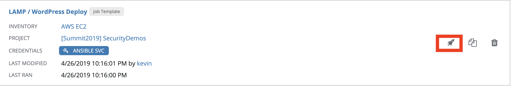
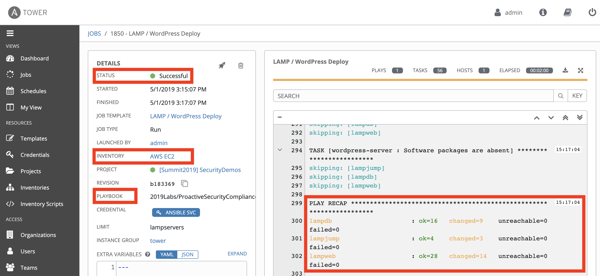
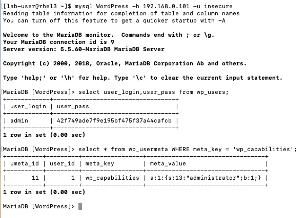
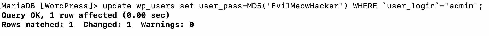
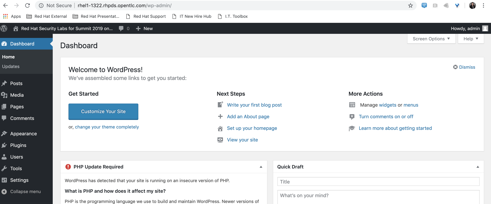
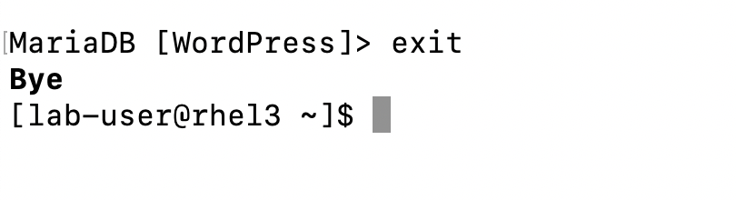

== Lab 6: Automated Security Hardening of a Hacked Web Application

=== Goal of Lab 6
The goal of this lab is to learn how to use Red Hat Ansible Automation to automatically security harden a hacked WordPress web application. Specifically, you will first install a simple Wordpress web application with default credentials in an automated way using Red Hat Ansible Automation. Then, you will exploit this web application since it is left open with liberal permissions and no password set. Finally, you will automatically remediate the issue with Red Hat Ansible Automation.

=== Introduction
Every year we are seeing an increase in the number of security breaches. Many times, these security breaches are not because of zero-day vulnerabilities. Instead, they are caused by human error or weak passwords or not patching known vulnerabilities. The link:https://www-03.ibm.com/press/us/en/pressrelease/53800.wss[Ponemon Institute's Cost of a Data Breach 2018 Study]  found that while 25% of the root cause of data breaches were caused by system glitches, 48% were caused by malicious or criminal attacks, and 27% were caused by human errors. In addition, according to the link:https://enterprise.verizon.com/resources/reports/dbir/[Verizon Data Breach Report], 81% of hacking-related breaches leveraged either stolen and/or weak passwords.

Automation can help with these challenges by improving both security and compliance. Specifically, it can help you avoid human errors, which will help with reducing risk and data breaches. In addition, automation gives you the ability to create infrastructure, security, and compliance as code , thus creating that repeatable, sharable, and verifiable infrastructure and application environments. Also, all of these benefits with automation also make it easier to pass security compliance audits.

This lab demonstrates how a common task, such as installing a simple web application can leave open exploits. In some instances, a default mysql / mariadb installation
includes default users that are allowed to connect without a password
set. And if not at the time of installation, humans will often open up
liberal permissions to make testing easier during development. When
these changes make their way into production, a site is left vulnerable
to attackers who are looking for these loopholes.

=== Lab 6.1 Introducing the lab exercise setup

In this lab exercise, we will demonstrate this vulnerability with some simple commands. After using a Red Hat Ansible playbook to install a base WordPress web site, you will run a small shell script from a specified system, which will take over a
public facing site with cat memes. We will then use an Ansible playbook to search and remediate common vulnerabilities (in this case,
accounts with liberal permissions and no password set). After
remediating the problem, we will see that our exploit script no longer
works.

This lab exercise is configured to run against three servers in a group called *lampservers*:


.Machines that you'll be using in this lab exercise
[width="90%",cols="^m,^m,,",frame="topbot",options="header,footer"]
|=====================================================
|     3+|Details of machines that will be used in this lab exercise:
    |*lampweb*

    rhel1-GUID.rhpds.opentlc.com (replace the GUID with your lab provided GUID)
    | 192.168.0.100
    |This server is used for the apache web server. There is no local database on this machine
    | The wordpress application is set with a default login of:

---------------------------

    [http://rhel1-GUID.rhpds.opentlc.com/] (replace GUID with your lab provided GUID)

    LOGIN:  admin

    PASS:  Password123

    |*lampdb*

    rhel2.example.com
    | 192.168.0.101
    |This server is a standalone database with no other purpose than to host the MySQL / MariaDB instance.
    | The database has been configured correctly for the WordPress application. However, we made a major mistake here and left one account unsecured. It's possible (and sometimes default) to have a database configured to allow traffic from ANYWHERE with NO PASSWORD REQUIRED!

    |*lampjump*

    rhel3.example.com
    | 192.168.0.102
    |This is a "jump box," representing a machine that a hacker might use to connect and run some scripts in order to exploit your new web site.
    | You will log in as lab-user to this machine and see a script in your home directory. Additionally, you can run remote MySQL commands from this machine against the unsecured database.


|=====================================================

=== Lab 6.1 Automated Install of the WordPress LAMP Stack Web Application

In this lab exercise, you will install the LAMP stack WordPress web application, in an automated fashion, using Red Hat Ansible Automation. Specifically, you will be doing this install using an Ansible role.

. Go to Red Hat Ansible Tower (https://tower-GUID.rhpds.opentlc.com) and log in with *admin* as the user name and *r3dh4t1!* as the password (if not already logged in).

. Navigate to *Templates* and click the *rocket ship* next to the job template named *LAMP / WordPress Deploy*.  This will install our WordPress LAMP Stack web application.
+
image:images/templates.png[100,100]


. Now let's take a closer look at our Red Hat Ansible Tower log to see what is happening behind the scenes. Notice that this job template is executing the *wordpress.yml* playbook that is deploying Wordpress to the lampweb and lampdb systems. Also take a look at the Inventory in the DETAILS section. Notice that the systems that we're using in this lab exercise are AWS EC2 instances. When you look at the Red Hat Ansible Tower log, nothing looks out of the ordinary and to the innocent eye, we complete this step without any issues (as seen in the STATUS in the DETAILS section and in the PLAY RECAP at the bottom of the Red Hat Ansible Tower log).
+


. Now that this Red Hat Ansible Tower job template completed, let's validate that our WordPress LAMP Stack Web Application got installed successfully by visiting the website at *http://rhel1-GUID.rhpds.opentlc.com*. Don't forget to replace the GUID with your lab provided GUID!

+
NOTE: Be careful when you type the website's URL. The website is HTTP not HTTPS (another security mistake purposely made for lab demonstration purposes).

=== Lab 6.2 Hacking the Database of the WordPress LAMP Stack Web Application

In this lab exercise, we are going to confirm that we can access the database of our WordPress LAMP Stack Web Application  insecurely. We'll then take advantage of the user accounts that already exist on the database system and lock out the legitimate user of the WordPress site so that they can no longer log in. You(the database hacker) will now have admin access to the site!

First, let's see if we can get into the database.

==== Lab 6.2.1 Accessing and Viewing the Database of the WordPress LAMP Stack Web Application

. Let's SSH into our *lampjump* system using its IP address (*192.168.0.102*). Remember that this system is our "jump box", representing a machine that a hacker would use to connect and run exploit scripts to hack your new web site. In order to SSH into our *lampjump* system, we have to first SSH into our lab's workstation box.

. If not already there, go to the Terminal window on your laptop and log in to the workstation bastion host as *lab-user* from your desktop system *replacing GUID with your unique lab provided GUID*. If needed, use the password *r3dh4t1!* From the workstation bastion host, log into your *lampjump* system as *lab-user* using its IP address (*192.168.0.102*). Note that the hostname of our *lampjump* system is rhel3.example.com.
+
----
[localhost ~]$ ssh lab-user@workstation-GUID.rhpds.opentlc.com
[lab-user@workstation-GUID ~]$ ssh lab-user@192.168.0.102
[lab-user@rhel3 ~]$
----
. Next, from our *lampjump* system, connect to the database using this command:
+
----
[lab-user@rhel3 ~]$ mysql WordPress -h 192.168.0.101 -u insecure
----
Notice that we get the following MySQL prompt:
+
----
Welcome to the MariaDB monitor.  Commands end with ; or \g.
Your MariaDB connection id is something
Server version: 5.5.60-MariaDB MariaDB Server

Copyright (c) 2000, 2018, Oracle, MariaDB Corporation Ab and others.

Type 'help;' or '\h' for help. Type '\c' to clear the current input statement.

MariaDB [WordPress]>
----
+
If you see the above MySQL prompt, you're in the database! We just connected to the database on a a server and didn't even need a password!
+
Anyone with a bit of curiosity and malicious intent can directly access the database that runs your entire web site! They could add their own users and easily take over your own website. Yikes! Or they could cover your site in cat memes. You, the hacker, decided to do just that since you are a big cat fan. In the next step, we are going to hack this web application and fill it with cat memes. But first, let's create a WordPress user so we can go in anytime and post articles.

. While we're in the MySQL database, let's take a look at the users who
are allowed to log in to the WordPress server. Type the following two commands into your MySQL database prompt.
+
----
`select user_login,user_pass from wp_users;`

`select * from wp_usermeta WHERE meta_key = 'wp_capabilities';`
----
+

+
Notice how we can easily see the user and the password that's stored in the database for this user. In addition, we can see the data that defines the access level. This tells you that we can easily access the site's database and make changes without any credentials. Now, let's take advantage of the admin account and change the admin password so that we can always log in as admin with our new password. Chances are, someone will realize they're locked out and eventually get back in. A more realistic example would actually be sneakier: we would create an ambiguous username
that _looked_ official but was our secret access backdoor.

==== Lab 6.2.2 Taking Advantage of the Admin Account by Changing the Admin Password

In this lab exercise, let's give ourselves access to our WordPress web application by using the vulnerable database. It's as simple as updating the admin user's password. Even though we don't know what that admin password is, we have wide open database access so we can set the admin password to whatever we
want!

. Run this command in your MySQL prompt to change the WordPress admin user's password to something else:

+
----
update wp_users set user_pass=MD5('EvilMeowHacker') WHERE `user_login`='admin';
----
+


. Now, verify you have access with this new password by visiting this admin login URL and logging in with your new credentials. The admin user for this WordPress instance is now set to:
*http://rhel1-GUID.rhpds.opentlc.com/wp-admin/*. Don't forget to change the GUID to your lab's GUID. Also note that the website is HTTP not HTTPS (again, as noted before, this is another security mistake purposely made for lab demonstration purposes).
* login: `admin`
* password: `EvilMeowHacker`
+
WOW. We are in!
+

+
The main thing we're pointing out here is the fact that this is a really scary exploitable security mistake that is surprisingly more common than you think and one that we may not ever notice.

. Now, let's get out of the MySQL prompt. Type *exit* to leave the MySQL prompt and return back to the regular command line.
+


=== Lab 6.3 Exploiting the database vulnerability by importing a database payload into the website's database.

The previous lab exercises verified that the database was insecure and that one method of exploiting it is to change a login user for MySQL,
specifically the login for the WordPress application.

In this lab exercise, we are going to take advantage of the fact that the database is insecure and do a SQL injection to overwrite the contents of the website without needing a password.

. Let's SSH into our *lampjump* system using its IP address (*192.168.0.102*). Remember that this system is our "jump box", representing a machine that a hacker would use to connect and run exploit scripts to hack your new web site. In order to SSH into our *lampjump* system, we have to first SSH into our lab's workstation box.

. If not already there, go to the Terminal window on your laptop and log in to the workstation bastion host as *lab-user* from your desktop system *replacing GUID with your unique lab provided GUID*. If needed, use the password *r3dh4t1!* From the workstation bastion host, log into your *lampjump* system as *lab-user* using its IP address (*192.168.0.102*). Note that the hostname of our *lampjump* system is rhel3.example.com.
+
----
[localhost ~]$ ssh lab-user@workstation-GUID.rhpds.opentlc.com
[lab-user@workstation-GUID ~]$ ssh lab-user@192.168.0.102
[lab-user@rhel3 ~]$
----
. Now that we are in our *lampjump* system, let's take a look at our exploit shell script in the home directory of lab-user. This script is set up to run an import command to a file located in that directory. A typical hacker might have a similar file to this,
pre-designed to exploit a site once they found the vulnerability. Note the use of cat (versus vi or nano) to view our exploit script for double the meow fun.
+
----
[lab-user@rhel3 ~]$ cat /home/lab-user/cat_meme_takeover.sh | less
----
+
When you reach the bottom of the cat_meme_takeover.sh exploit script type *q* to exit.

. Now, let's go ahead and run this script to exploit the database and fill our web site with cat memes!
+
----
[lab-user@rhel3 ~]$ /home/lab-user/cat_meme_takeover.sh
----

. You will see this after the cat_meme_takeover.sh script finishes running:

```
[lab-user@rhel3 ~]$ /home/lab-user/cat_meme_takeover.sh

      HACKED!!!  YOU ARE A BAD KITTY!

      ##############################
       __  __ _____ _____        __
      |  \/  | ____/ _ \ \      / /
      | |\/| |  _|| | | \ \ /\ / /
      | |  | | |__| |_| |\ V  V /
      |_|  |_|_____\___/  \_/\_/

      ##############################

      DONE!  Now reload the web page
  http://rhel1-[GUID].rhpds.opentlc.com/
 to see what the evil cat hacker clan did!


```
Note that the GUID referenced in the output above will be your lab provided GUID.

. Now, refresh the page at *http://rhel1-GUID.rhpds.opentlc.com*, replacing GUID with your lab provided GUID.

. You should see a new look to the website, informing you that the site has been hacked by cat memes.

=== Lab 6.4 Automated Re-Install of the WordPress LAMP Stack Web Application to reset the servers to a stable baseline (left off)

*MISSION:* Oh no! A script kitty hacked our site! Let's re-install the
original WordPress role to reset the servers to a stable baseline.

*STEPS:* Run the job template again "LAMP / WordPress Deploy" from Ansible
Tower, to install the web application for WordPress.

* This reinstalls the Apache server rhel1-[GUID].rhpds.opentlc.com and the DB server
on the DB server
* Once this role re-runs in this tasks, we are 100% back to our web site
baseline, exactly where we were before the cat hackers took over the
site content. The site is back to normal, but our database is still
vulnerable due to that username which can be exploited.

To confirm that our site is back to normal, refresh the page at:
http://rhel1-[GUID].rhpds.opentlc.com/

YAYY! We're no longer victims of a cat meme exploit!

[[task5]]
TASK5:
------

*MISSION:* Let's lock down the database so this won't work again.

*STEPS:* Run the job template again "LAMP / WordPress Secure" this time,
from Ansible Tower, to run the hardening playbook.

* This removes the open vulnerability which allows you to connect to the
database and exploit it with cat memes.

Now, refresh the page at: http://rhel1-[GUID].rhpds.opentlc.com/ to confirm everything
still works

[[task6]]
TASK6:
------

*MISSION:* Confirm we can not access the database insecurely (same steps
as step 2).

*PREAMBLE:* We have removed our user named "insecure" with no password
for his account. His access was set wide open, but has been revoked with
our latest hardening playbook. Run this command to confirm you can no
longer connect. This is the exact command from TASK2 where we
successfully connected

*STEPS:* We will manually connect to the database from the workstation,
as well as attempt to run the exploit again. Then we will attempt to run
our SQL injection script again, in a second attempt to take the website
over with cat memes.

* From the command line of your desktop VM, run:
`mysql WordPress -h 192.168.0.101 -u insecure` -- You should not be
able to connect. "Access Denied!"

```[lab-user@rhel3 ~]$ mysql WordPress -h 192.168.0.101 -u insecure
ERROR 1045 (28000): Access denied for user
'insecure'@'rhel3.example.com' (using password: NO) [lab-user@rhel3 ~]$

--------------------------------------------------------------------

- Back on the jump host, run the same script from the earlier called

 `/home/lab-user/cat_meme_takeover.sh`

- This time, it should fail with a different message like this:
--------------------------------------------------------------------

[lab-user@workstation-repl ~]$ /home/lab-user/cat_meme_takeover.sh


```

[lab-user@workstation-repl ~]$ /home/lab-user/cat_meme_takeover.sh

        FAILED!  You do not can haz
        permissionz to the database

       ##############################
       ____      ___        ______  _
      |  _ \    / \ \      / /  _ \| |
      | |_) |  / _ \ \ /\ / /| |_) | |
      |  _ <  / ___ \ V  V / |  _ <|_|
      |_| \_\/_/   \_\_/\_/  |_| \_(_)

       ##############################

        FAILED!  You do not can haz
        permissionz to the database
```

Access DENIED!!!!


[[summary]]
SUMMARY
-------

The default WordPress application install left us vulnerable to a SQL
attack. The database was not secure in the way it was allowing us to
connect without a password from a remote machine. This is not an
uncommon situation. In order to demonstrate and experience the
vulnerability,

The playbook we ran to harden the database server targets and removes
accounts set up to allow both: - remote access - no password


link:README.adoc#table-of-contents[ Table of Contents ] | link:lab7.adoc[Lab 7: Implementing DevSecOps to Build and Automate Security into the Application in a Secure CI/CD Pipeline]
