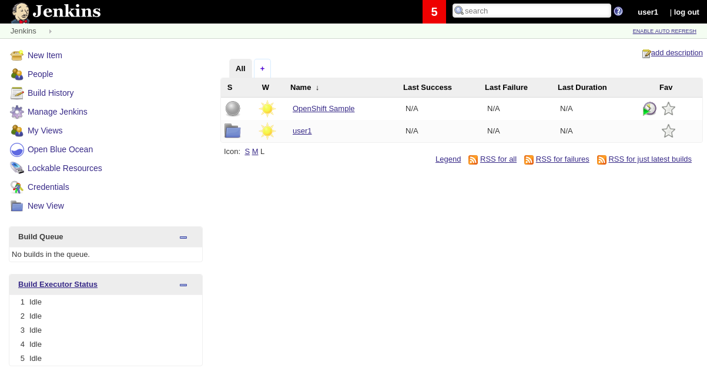
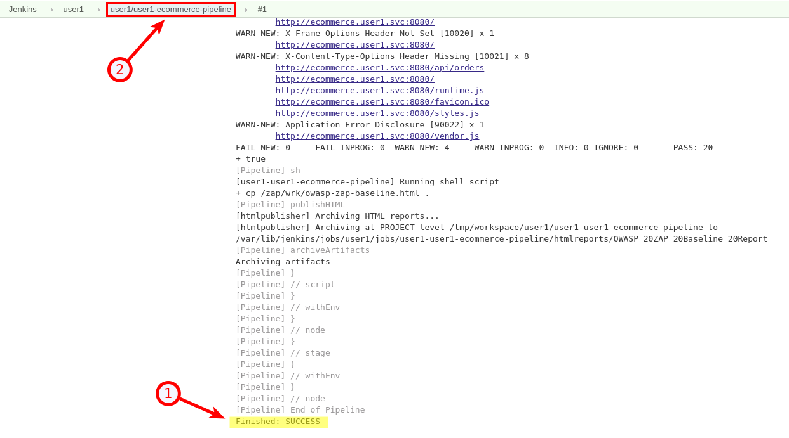
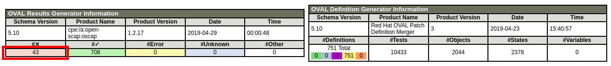
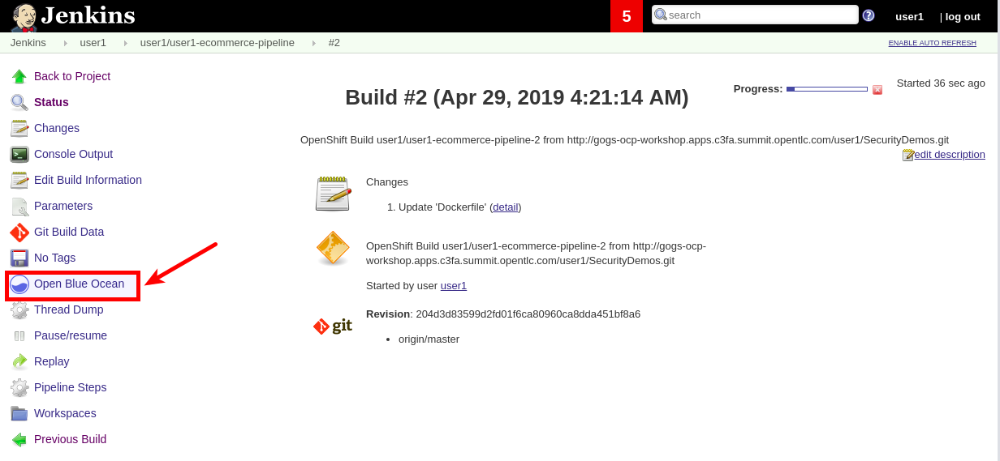
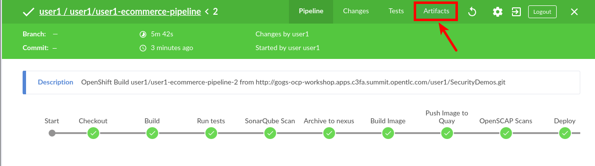
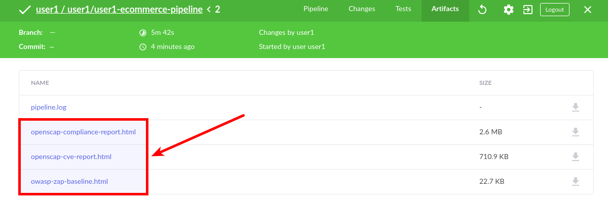

== Lab 7: Implementing DevSecOps to Build and Automate Security into the Application in a Secure CI/CD Pipeline

=== Goal of Lab 7

To exercise a devsecops pipeline, analyze result, and apply remediation.

=== Introduction

(TODO - Describe DevSecOps and how it can be done in OCP)

=== Lab 7.1 About the sample application

For the purposes of this lab we will be examining a simple, all-in-one https://spring.io/projects/spring-boot[spring boot] application. The application presents a simple e-commerce web user interface, which is backed by a restful API.

image:images/lab7-ecommerce-webapp.png[]

=== Lab 7.2 Logging into the environment

A number of tools have been installed and configured to support the devsecops pipeline. Each of these tools is running containerized within the OpenShift cluster.

==== Gogs
Gogs is the Go Git Service- a github-like git server written in the Go programming language.

The goal of this project is to make the easiest, fastest, and most painless way of setting up a self-hosted Git service. With Go, this can be done with an independent binary distribution across ALL platforms that Go supports, including Linux, Mac OS X, Windows and ARM.

==== Jenkins
Jenkins is an open-source continuous integration software tool written in the Java programming language for testing and reporting on isolated changes in a larger code base in real time. The software enables developers to find and solve defects in a code base rapidly and to automate testing of their builds.

==== Nexus
Sonayype Nexus is a repository manager. It allows you to proxy, collect, and manage your dependencies so that you are not constantly juggling a collection of JARs. It makes it easy to distribute your software. Internally, you configure your build to publish artifacts to Nexus and they then become available to other developers.

==== SonarQube
SonarQube is static code anlysis system that provides continuos inspection including the detection of common code issues, including in the areas of security.

==== Quay / Clair
Red Hat® Quay is a private container registry that stores, builds, and deploys container images. It analyzes your images for security vulnerabilities (using Clair), identifying potential issues that can help you mitigate security risks.

==== OWASP Zed Attack Proxy (ZAP)
The OWASP Zed Attack Proxy (ZAP) is one of the world’s most popular free security tools and is actively maintained by hundreds of international volunteers. It can help you automatically find security vulnerabilities in your web applications while you are developing and testing your applications. Its also a great tool for experienced pentesters to use for manual security testing.

Log in to each of the tools with the credentials shown below. Replace *{GUID}* with your lab cluster guid and *{USERID}* with your user id - e.g., *user1*

* Gogs - http://gogs-ocp-workshop.apps.{GUID}.summit.opentlc.com
+
*login:* {USERID}
+
*password:* openshift
+
image:images/lab7.2-gogs.png[]
* Jenkins - https://jenkins-{USERID}.apps.{GUID}.summit.opentlc.com
+
**login:** {USERID}
+
**password:** r3dh4t1!
+
When prompted, press the *Allow selected permissions* button.
+
image:images/lab7-jenkinslogin.png[]
+
The main Jenkins page will appear as below:
+

* Nexus - http://nexus-ocp-workshop.apps.{GUID}.summit.opentlc.com
+
no login necessary
+
image:images/lab7.2-nexus.png[]
* Sonarqube - http://sonarqube-ocp-workshop.apps.{GUID}.summit.opentlc.com
+
no login necessary
+
image:images/lab7.2-sonarqube.png[]

* Quay - http://quayecosystem-quay-quay-enterprise.apps.{GUID}.summit.opentlc.com
+
**login:** admin
+
**password:** admin123
+
image:images/lab7.2-quay.png[]

=== Lab 7.3 Explore the pipeline stages

TODO - Guided tour through each pipeline stage.

=== Lab 7.4 Exercise an initial run through the pipeline

. Navigate back to the jenkins user interface https://jenkins-{USERID}.apps.{GUID}.summit.opentlc.com
+
. Click the folder label with your user id (e.g., user1)
+
image:images/lab7.4-jenkins-folder.png[]
+
. Click the pipeline (e.g., user1/user1-ecommerce-pipeline)
+
image:images/lab7.4-jenkins-pipeline.png[]
+
. Click the *Build with Parameters* link in the left menu
+
image:images/lab7.4-jenkins-build.png[]
. Keep the default values and press the *Build* button
+
image:images/lab7.4-build-with-params.png[]
+
. Click the build label (e.g., #1) next to the build in the *Build History* pane on the left
+
image:images/lab7.4-jenkins-select-build.png[]
+
. Click the *Console Output* link to monitor the build progress
+ 
image:images/lab7.4-jenkins-output.png[]
+
. Once the build has completed successfully, click the *user#/user#-ecommerce-pipeline* link at the top of the display
+

+ 
. Navigate to each of the reports generated by the build on the left hand menu:
+
image:images/lab7.4-jenkins-report-links.png[]

* OpenSCAP Compliance Report
+
Experiment with the filters to adjust the output of the report.
+
image:images/lab7.4-compliance-filters.png[]
* OpenSCAP Vulnerability Report
+
Note the number of vulnerabilities identified by the OpenSCAP Report:
+

* OWASP ZAP Baseline Report
+
image:images/lab7.4-owasp-zap.png[]
+
. Navigate to the SonarQube url http://sonarqube-ocp-workshop.apps.{GUID}.summit.opentlc.com Click on the number link above *Projects Analyzed* section:
+
image:images/lab7.4-sonarqube-projects.png[]
+
. Note 3 vulnerabilites were found and that the unit test code coverage has been recorded. SonarQube also provides code metrics on items including unit test coverage, potential bugs and code smells. Click the Project prefixed with your userid and determine where the vulnerabilities are in the source code.
+
image:images/lab7.4-sonarqube-project-link.png[]
. Navigate to the nexus url http://nexus-ocp-workshop.apps.{GUID}.summit.opentlc.com, click *browse* then *maven-snapshots* 
+
image:images/lab7.4-nexus-snapshots.png[]
+
Navigate the folder structure and verify your JAR file exists within it.
+
image:images/lab7.4-nexus-jar.png[]
. Navigate to the quay url http://quayecosystem-quay-quay-enterprise.apps.{GUID}.summit.opentlc.com, login as *admin* with the password *admin123* if you haven't already
+
. Navigate to the image tagged with your userid by clicking the *ecommerce* repository 
+
image:images/lab7.4-quay-repo.png[]
+
Click the tag icon on the left (second icon from the top) then click the image hash id 
+
image:images/lab7.4-quay-tag.png[]
. Click the bug icon to see the vulnerabilities detected by Clair. Make a note of the number of vulnerabilities
+
image:images/lab7.4-quay-vulnerabilities.png[]
+
. Click the package icon to see the packages that are affected
+
image:images/lab7.4-quay-packages.png[]
+
You can also view the deployed application at http://ecommerce-{USERID}.apps.{GUID}.summit.opentlc.com/

=== Lab 7.5 Update the source code and base image

An old base images was used to build the application, we will update the base image to use a newer version. This will reduce the number of vulnerabilities that are detected. We will also update the source code to remove the vulnerabilities detected by SonarQube.

. Navigate to your source code repository in gogs http://gogs-ocp-workshop.apps.{GUID}.summit.opentlc.com and login if you haven't already (userid / openshift)
+
. Click on the *SecurityDemos* repository under *My Repositories*
+ 
image:images/lab7.5-gogs-repo.png[]
. Click the *Dockerfile* (TODO - Explain what a dockerfile is)
+
image:images/lab7.5-gogs-dockerfile.png[]
. Click the edit icon (small pencil) and change the image version from 1.0 to latest:
+
       FROM registry.access.redhat.com/redhat-openjdk-18/openjdk18-openshift:latest
+
image:images/lab7.5-gogs-edit-dockerfile.png[]
. Click the *Commit Changes* button
+
image:images/lab7.5-gogs-commit-changes.png[]
+
. Navigate back to the root of the SecurityDemos folder 
+
image:images/lab7.5-gogs-navigate-root.png[]
+
. Click down through the following folders src -> main -> java -> com -> baeldung -> ecommerce -> controller -> OrderController.java
+
image:images/lab7.5-gogs-src.png[]
+
. Edit the file and remove line 28, which has a hardcoded password. This password is not actually used by the applicaton so it is safe to remove it.
+
image:images/lab7.5-gogs-delete-password.png[]
+
. Click the commit changes button
+ 
. Navigate back to Jenkins and start another build by clicking *Build with Parameters*
+
image:images/lab7.4-jenkins-build.png[]
+
Then click the *Build* button
+
image:images/lab7.4-build-with-params.png[]
+
. Once the build has started,navigate to the blue ocean view of the build.  First select the current build
+
image:images/lab7.5-jenkins-build-2.png[]
+
. Click the *Open Blue Ocean* Link 

+
. View the build progress
image:images/lab7.5-jenkins-blueocean-view.png[]
+
. Once the build is complete review the reports, quay vulnerability scan and sonarqube to verify that the number of vulnerabilities has been reduced. Click *Artifacts* in the blue ocean view:
+

+
. Then view each of the reports
+

<<top>>

link:README.adoc#table-of-contents[ Table of Contents ] 