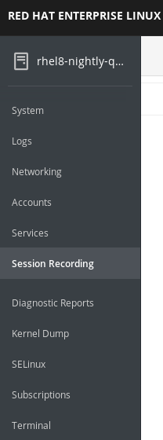
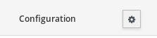
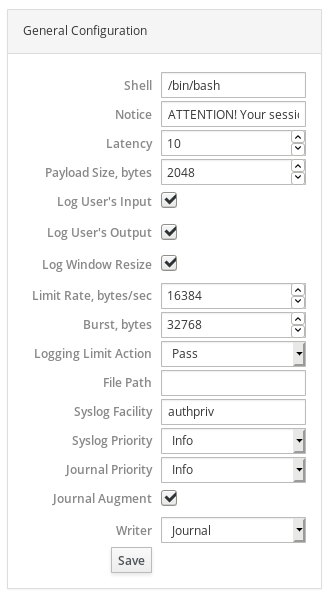
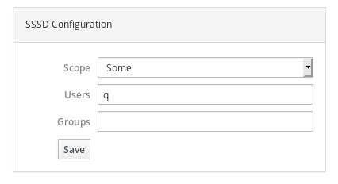
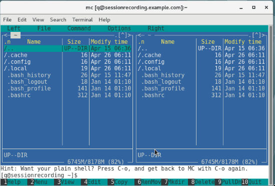
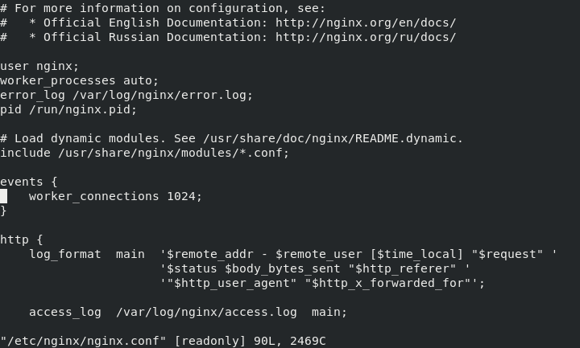
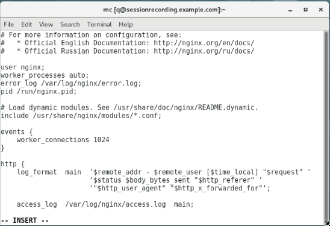
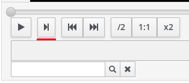
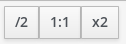
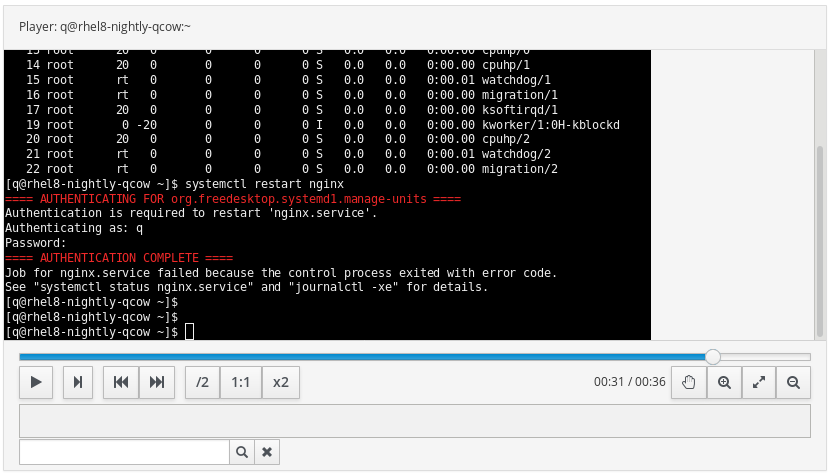

= Lab 12: Session Recording

== Goal of Lab
The goal of this lab is to use Session Recording to help log and audit user's terminal sessions and correlate them with system logs.

* You will need to install required software. Required packages are tlog & cockpit-session-recording.
* You will configure it to record terminal activity for specific users.
* You will wear a hat of third-party contractor who will break something on your system.
* You will wear a hat of a system administrator to find out what has happened to your system.

== Introduction
Terminal Session Recording project aims to log user's terminal sessions for purposes of audit, security and monitoring. It provides interface in Cockpit to analyze these recordings and correlate them with system logs. This provides a whole picture of activity which has happened.

=== tlog
Tlog records terminal activity by putting itself in the middle between user and terminal. Systemd Journal is used as a storage for recorded sessions.

=== cockpit-session-recording
Our package for Cockpit uses provided APIs to access Journal and get sessions from it. It provides JavaScript based player which produces text output, but with a videoplayer-like controls.

Several packages were pre-installed for your convenience. Those are:

* tlog
* cockpit
* cockpit-session-recording
* mc
* nginx
* vim

== Lab 12.1 Accessing the Session Recording Lab System

All of the exercises in this lab are run on the _sessionrecording.example.com_ host. You will have user *q*. Their terminal sessions will be recorded.

== Lab 12.2 Setup recording

Go to your *Lab Information* webpage from the *Lab 0 setup steps* and click on the console button for your workstation bastion host. Login as *lab-user* with *r3dh4t1!* as the password.
+
image:images/lab1.1-workstationconsole.png[300,300]
image:images/lab1.1-labuserlogin.png[300,300]

Open a Firefox web browser: 

image:images/session_recording_firefox.png[]

Go to _https://sessionrecording.example.com:9090/_

image:images/session_recording_firefox_1.png[]

Login as _root_ user with *r3dh4t1!* as the password.

image:images/session_recording_cockpit_login.png[]

Click on Session Recording menu item

Then click on the button in upper righ corner with a cog icon to access the configuration.

Take a look on the configuration of tlog-rec-session.conf which is represented as "General Configuration" in Cockpit

image:images/session_recording_tlog_conf.png[]

Enable logging of user's input by clicking the corresponding checkbox:

Then, press the "Save" button.

Now you should configure users to be recorded.

===== Lab 12.3 Setup recorded users using cockpit-session-recording

While staying on the same page as in previous chapter do the following.

Choose "*Some*" option in Scope dropdown and put "*q*" in the Users input. Then click the *Save* button.

Do not forget to click the *Save* button.

That is it. Now the "*q*" user will be recorded.

== Lab 12.4 Creating sessions recorded by tlog

Let's create some activity by one of the recorded users. Then you will be able to play it back in Cockpit.

Open the *Terminal*. 

image:images/session_recording_terminal.png[]

Login using SSH to the same machine. Use *session1* as a password:

    [lab-user@sessionrecording]# ssh q@sessionrecording.example.com

image:images/session_recording_terminal1.png[]

You will see notice message in terminal right after login

image:images/session_recording_notice.png[]

Remember, that this session is being recorded. You could try to resize session window to see it's supported later.

    [q@sessionrecording]$ mc

You will see mc launched

Try to use by navigating to various directories. Then press F10 or click on Quit button in the right bottom corner.

Let's imitate a real world scenario by breaking the nginx web server configuration file, so that later we will be able to investigate the problem using session recording in cockpit.

    [q@sessionrecording]$ sudo vi /etc/nginx/nginx.conf

image:images/session_recording_vi_nginx.png[]

Let's remove *;* in the line *worker_connections 1024;* like this:

Next we will restart the nginx server:

    [q@sessionrecording]$ sudo systemctl restart nginx

The restart will fail due to the error we created in nginx.conf file, this will be used as an example.
You will see an error message like this:

image:images/session_recording_nginx_error.png[]

Now, it is time to login to cockpit and use cockpit-session-recording to investigate why the web server does not work.

=== Lab 12.5 Using Session Player from Cockpit UI

Go to your *Lab Information* webpage from the *Lab 0 setup steps* and click on the console button for your workstation bastion host. Login as *lab-user* with *r3dh4t1!* as the password.
+
image:images/lab1.1-workstationconsole.png[300,300]
image:images/lab1.1-labuserlogin.png[300,300]

Open a Firefox web browser: 

image:images/session_recording_firefox.png[]

Go to _https://sessionrecording.example.com:9090/_

image:images/session_recording_firefox_1.png[]

Login as *root* user with *r3dh4t1!* as the password.

image:images/session_recording_cockpit_login.png[]

Click on the Session Recording menu item

Your session will appear in the list of sessions. Of course data will be different. Click on it to open it:

image:images/session_recording_session_list.png[]

Click on "*Play*" button to start playback of the session or just use hotkey "*p*" to achieve the same result:

image:images/session_recording_play.png[]

You can also navigate the session frame-by-frame using "*Skip Frame*" button or hotkey "*.*":

Try to play with other controls. Speed controls:

Restart playback and fast-forward to end:

image:images/session_recording_fastforward.png[]

Zoom controls: 

image:images/session_recording_zoom_controls.png[]

Switch between selection of text and drag'n'pan of zoomed content:

image:images/session_recording_dragnpan.png[]

Searching for appearance of a specific keyword in the session. It shows closest beginning of "frame" with match:

image:images/session_recording_search_button.png[]

In session player the action of restarting nginx should look something like this:

In the bottom part of the page the correlated logs are shown. You should be able to find the corresponding messages:

image:images/session_recording_cockpit_nginx_error.png[]

Clicking on the timestamp event in the logs panel will jump to the same time in the session.

You can try searching for "nginx.conf" to find time when the config was edited. The Closest time will be shown,  clicking on it will rewind the player position to that time.

image:images/session_recording_search.png[]

<<top>>
link:README.adoc#table-of-contents[ Table of Contents ] | link:lab12_SessionRecording.adoc[ Lab 12: Session Recording ]
