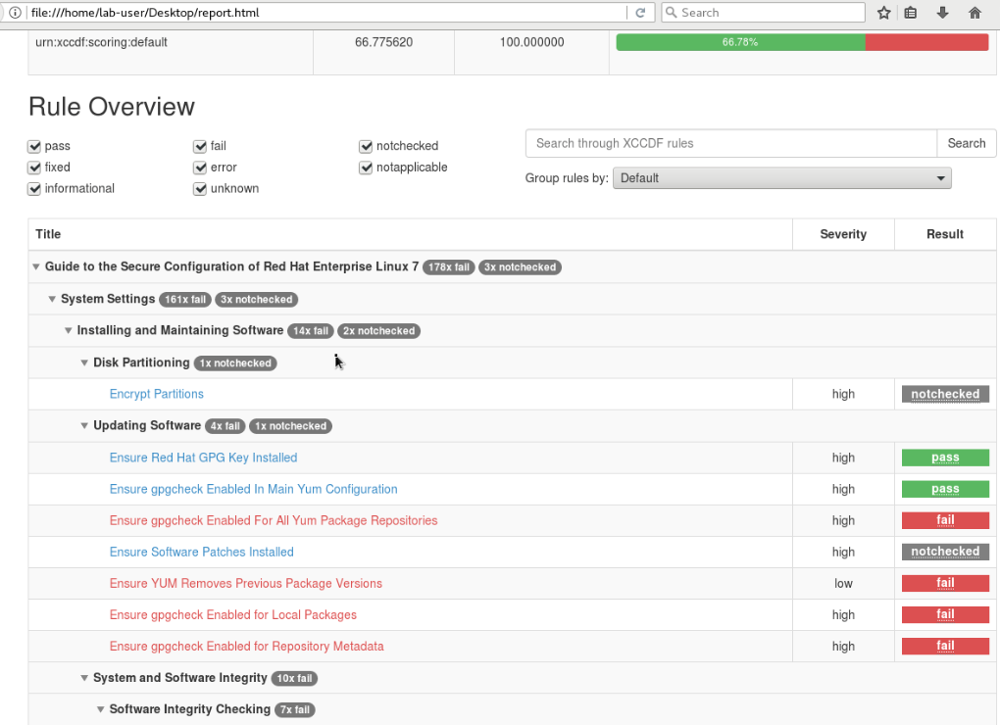
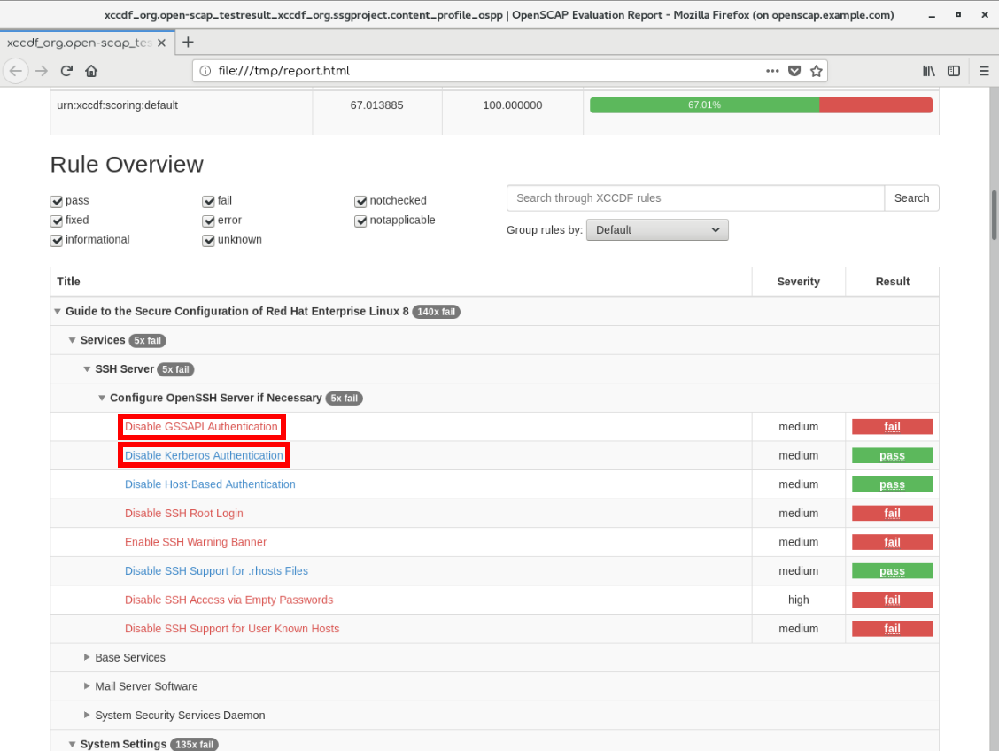
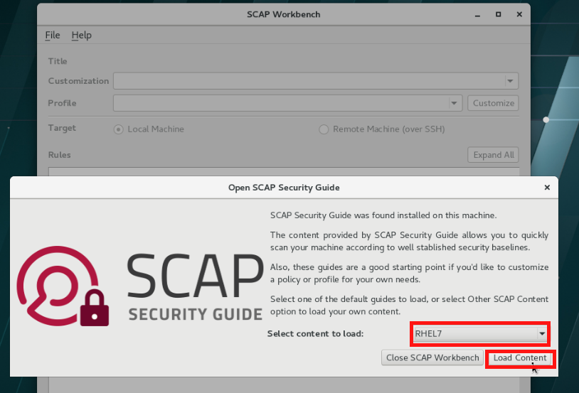
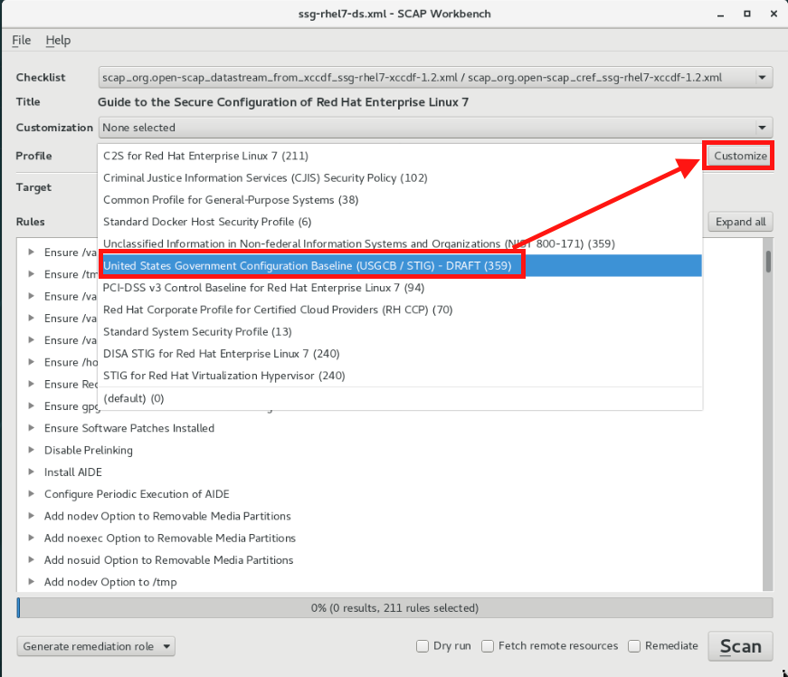

= Lab 1: OpenSCAP Basics and Command Line Scanning

== Goal of Lab
The goal of this lab exercise is to introduce you to the basics of automated security scanning and remediations with OpenSCAP and Ansible.

== Introduction
Security Content Automation Protocol (SCAP) is collection of standards aiming to enable automated vulnerability and configuration compliance.
OpenSCAP is a family of open source SCAP tools, and SCAP Security Guide (further as SSG) is collection of xml-based SCAP benchmarks and content in other formats to help with compliance configuration assessment of Red Hat Enterprise Linux machines.
Natively shipping in Red Hat Enterprise Linux, this provides practical security hardening advice for Red Hat technologies and links to compliance requirements, making deployment activities like certifications and accreditations easier.

OpenSCAP and SSG allows you to perform both vulnerability and security compliance checks in a fully automated way.
Several integrations for continuous scanning exist but in this lab exercise, we will focus on one-off scanning to get started.

== Pre-Configured Set Up Steps (Already done for you)
All of the steps in this pre-configured set up section have already been done for you.
This section is for your reference only so you know what steps have already been pre-configured in this lab environment for you.

.  Red Hat Enterprise Linux 8.0 is installed on the *openscap.example.com* host. We have also pre-installed several packages on the *openscap.example.com* host.

. Specifically, we pre-installed *openscap-scanner*, *scap-security-guide*, and *Ansible*. Take a look at the comments above each installation command for more details.
+
 # the tool that performs the scanning
 [root@openscap]# dnf install openscap-scanner
 # project that brings in security policies we will load and test agains
 [root@openscap]# dnf install scap-security-guide
 # we will need this later for Ansible based remediations
 [root@openscap]# dnf install ansible python-firewall

. You can verify a successful installation by running:
+
 [root@openscap]# oscap -V

 OpenSCAP command line tool (oscap) 1.3.0
 Copyright 2009--2018 Red Hat Inc., Durham, North Carolina.

 ==== Supported specifications ====
 XCCDF Version: 1.2
 OVAL Version: 5.11.1
 CPE Version: 2.3
 CVSS Version: 2.0
 CVE Version: 2.0
 Asset Identification Version: 1.1
 Asset Reporting Format Version: 1.1
 CVRF Version: 1.1
 ...
+
Notice that this command outputs the OpenSCAP version and versions of supported standards.
If during your own installation it says `oscap` command not found, you need to install the OpenSCAP tooling since this means that OpenSCAP has not been installed successfully.

. Finally, SCAP Workbench has also been installed on the *openscap.example.com* server host for you.
+
 # GUI tool for scanning and benchmark customization, a front-end for OpenSCAP
 [root@openscap] dnf install scap-workbench

== Lab 1.1 Security scanning with OpenSCAP
. If not already there, log into to the workstation bastion host as *lab-user* from your desktop system *replacing GUID with your lab's GUID*. Use the password *r3dh4t1!*
+
----
[localhost ~]$ ssh lab-user@workstation-GUID.rhpds.opentlc.com
----

. Log into the *openscap.example.com* host as *root*.
+
----
[lab-user@workstation-GUID ~]$ ssh root@openscap.example.com
----

. Let's take a look at the compliance content provided by `scap-security-guide`:
+
 [root@openscap]# rpm -ql scap-security-guide
 ...
 /usr/share/xml/scap/ssg/content/ssg-rhel8-cpe-dictionary.xml
 /usr/share/xml/scap/ssg/content/ssg-rhel8-cpe-oval.xml
 /usr/share/xml/scap/ssg/content/ssg-rhel8-ds.xml
 /usr/share/xml/scap/ssg/content/ssg-rhel8-ocil.xml
 /usr/share/xml/scap/ssg/content/ssg-rhel8-oval.xml
 /usr/share/xml/scap/ssg/content/ssg-rhel8-xccdf.xml
 ...

. Notice that content provided in `scap-security-guide` covers a wide range of security baselines.
For Red Hat Enterprise Linux 8, OSPP (Protection Profile for General Purpose Operating Systems) and PCI-DSS (Payment Card Industry Data Security Standard) profiles are available.
There are also various formats in which this is provided - human readable HTML guides, SCAP benchmarks, but also Ansible remediation playbooks.

. Move to the `content` folder so we can avoid typing long paths:
+
----
 [root@openscap]# cd /usr/share/xml/scap/ssg/content
----

. First, let's check which compliance profiles are available for rhel8.
+
----
 [root@openscap]# oscap info ssg-rhel8-ds.xml
----
+
. You will get list of contents, aforementioned compliance profiles. OSPP - Protection Profile for General Purpose Operating Systems, and PCI-DSS.

. Next, let's perform our first baseline testing scan with the vanilla OSPP profile.
You can see in our command below that we can skip the profile ID prefix to make the command simpler.
The real ID is xccdf_org.ssgproject.content_profile_ospp.
+
----
  [root@openscap]# oscap xccdf eval --profile ospp ./ssg-rhel8-ds.xml
----
+
Now, you will see the compliance scan results for every security control in the OSPP security baseline profile.

. Now, let's store the results of the scan this time:
* use `--results-arf` to get machine readable results archive
* use `--report` to get human readable report (can also be generated from ARF after the scan as you see in the next optional step)
* use `--oval-results` for extended details of failing rules

----
 [root@openscap]# oscap xccdf eval --oval-results --profile ospp --results-arf /tmp/arf.xml --report /tmp/report.html ./ssg-rhel8-ds.xml
----

. (Optional) You can also generate the HTML report separately:
+
----
 [root@openscap]# oscap xccdf generate report /tmp/arf.xml > /tmp/report.html
----

. Now, go to your *power controls and consoles* view from the *Lab Information* page (the one with GUID) and click on the console button for your workstation bastion host.
Login as *lab-user* with *r3dh4t1!* as the password.
+
image:images/lab1.1-workstationconsole.png[300,300]
image:images/lab1.1-labuserlogin.png[300,300]

. Open the Terminal, and use it to open the *report.html* in a X forwarded web browser.
+
 [lab-user@workstation-GUID ~]$ ssh -X root@openscap.example.com firefox /tmp/report.html

. You will see the compliance scan results for every security control in the OSPP security baseline profile in HTML format.
+

. Rules can have several types of results but the most common ones are *pass* and *fail*, which indicate whether or not the particular security control has passed or failed the scan.

. Click on the rule title in the HTML report.
+

. This will bring up a pop-up dialog that allows you to examine details of the particular OpenSCAP security rule that failed or passed.
On case `--oval-results` has been specified on the command line when scanning, extended details are provided.
For example, if an OpenSCAP security rule is testing file permissions on a list of files, it will specify which files failed and what are their permission bits.
In our case, it shows which file failed regex check.
+
image::images/lab1.1-report_pass.png[HTML report: A rule that is passing]
+

image::images/lab1.1-report_fail.png[HTML report: A rule that is failing]

. Feel free to browse through the report, to see all the different checks that are performed.
Machine is in state equivalent to default installation.
When you are done, you can close Firefox window.

== Lab 1.2 Customizing existing SCAP benchmarks using SCAP Workbench
. Now, go back to your *Lab Information* webpage from the *Lab 0 Setup steps* and click on the console button for your workstation bastion host.
Login as *lab-user* with *r3dh4t1!* as the password.
Don't forget you can paste text into console using button T in the top right corner.
+
image:images/lab1.1-workstationconsole.png[300,300]
image:images/lab1.1-labuserlogin.png[300,300]

. Once you log in, open the Terminal, and use it to open SCAP Workbench on the server.
+
 [lab-user@workstation-GUID ~]$ ssh -X root@openscap.example.com scap-workbench

. After Workbench starts, select *RHEL8* and click on *Load Content* to open the compliance content for Red Hat Enterprise Linux 8.
+

+
image::images/lab1.2-workbench_opened.png[SCAP Workbench opened, profile selected]

. Let's customize the PCI-DSS Control baseline.
Select this profile from the *Profile* drop-down list.
Click *Customize*.
+

. In the *Customize Profile* pop-up window, leave the default New Profile ID name and click *OK*.
+
image:images/lab1.2-newprofileID.png[500,500]

. Now you can select and unselect rules according to your organization's needs and change values such as minimum password length to tailor the compliance profile.
There is no specific goal in mind for this part of exercise, just showcase of capabilities.
After you are done customizing click *OK* to save the profile.
You have now created a new custom profile.
+
image::images/lab1.2-workbench_tailoring.png[SCAP Workbench content customization]

. Now let's run a test scan with the new custom profile we just created.
Click *Scan* and inspect the results.
When prompted for the password for *lab-user*, type *r3dh4t1!*.
This will take a few minutes so feel free to move on with the lab exercise and not wait until the scan is completed.
You can ignore and close the diagnostics window that will pop up at the end of the scan.
+
image:images/lab1.2-scapworkbenchscan.png[500,500]

. (Optional) You can save it to a tailoring file by selecting File->Save Customization Only.
+
image:images/lab1.2-savecustomization.png[300,300]

. This is the end of work in the console view.

== Lab 1.3 Security Remediations with OpenSCAP and Ansible
Putting the machine into compliance (for example by changing its configuration) is called *remediation* in the SCAP terminology.
As remediation changes configuration of the machine to restrict its capabilities, it is possible that you will lock yourself out or disable workloads important to you.
As a result, it is best practice to test the remediation and its effects before deploying.

. If not already there, log into to the workstation bastion host as *lab-user* from your desktop system *replacing GUID with your lab's GUID*. Use the password *r3dh4t1!*
+
----
[localhost ~]$ ssh lab-user@workstation-GUID.rhpds.opentlc.com
----
. Log into the *openscap.example.com* host as *root*.
+
----
[lab-user@workstation-GUID ~]$ ssh root@openscap.example.com
----

. All remediations will be executed on the *openscap.example.com* host.
You will not make modifications to any other hosts, including the *workstation.example.com* host.

. Let's generate an Ansible playbook that will put the *openscap.example.com* machine into compliance.
Let's go ahead and generate a playbook from the results:
+
Use the `--fix-type ansible` option to request an ansible playbook with the fixes:
+
----
 [root@openscap]# oscap xccdf generate fix --fix-type ansible --result-id "" /tmp/arf.xml > playbook.yml
----

. (Optional) Generate bash remediation script.
This can be accomplished by running:
* use `--fix-type bash` to request a bash script with the fixes
+
----
 [root@openscap]# oscap xccdf generate fix --fix-type bash --result-id "" /tmp/arf.xml > bash-fix.sh
----
. By running this generated script, machine would be also put close to the compliance.

. Notice that in both cases we are using empty `--result-id`.
This is a trick to avoid specifying the full result ID.

. We will focus on the Ansible remediation options in this next part of the lab exercise.

. Let's open the generated playbook using a text editor.
In this example, we will use nano as our text editor (but feel free to use vi as well).
+
....
[root@openscap]# nano playbook.yml
---
###############################################################################
#
# Ansible remediation role for the results of evaluation of profile xccdf_org.ssgproject.content_profile_ospp
# XCCDF Version:  1.2
#
...
#
# How to apply this remediation role:
# $ ansible-playbook -i "localhost," -c local playbook.yml
# $ ansible-playbook -i "192.168.1.155," playbook.yml
# $ ansible-playbook -i inventory.ini playbook.yml
#
###############################################################################
....

. Exploring the playbook further you will see the tasks that set up the machine:
+
....
   - name: Ensure gpgcheck Enabled For All Yum Package Repositories
      with_items: "{{ yum_find.files }}"
      lineinfile:
        create: yes
        dest: "{{ item.path }}"
        regexp: '^gpgcheck'
        line: 'gpgcheck=1'
      tags:
        - ensure_gpgcheck_never_disabled
        - high_severity
        - unknown_strategy
        - low_complexity
        - medium_disruption
        - CCE-26876-3
        - NIST-800-53-CM-5(3)
        - NIST-800-53-SI-7
        - NIST-800-53-MA-1(b)
        - NIST-800-171-3.4.8
        - PCI-DSS-Req-6.2
        - CJIS-5.10.4.1
....

. You can customize the playbook by changing the variables listed at the top of the generated file.
Let's change the password minimum length by setting the `var_password_pam_minlen` to `!!str 18`.
After making this change, press *control + x* , then type *y* and press *enter* in your nano text editor to save your changes.
+
....
   vars:
      var_accounts_password_minlen_login_defs: !!str 15
      var_accounts_passwords_pam_faillock_deny: !!str 3
      var_accounts_passwords_pam_faillock_unlock_time: !!str never
      var_accounts_passwords_pam_faillock_fail_interval: !!str 900
      var_accounts_passwords_pam_faillock_deny: !!str 3
      var_accounts_passwords_pam_faillock_unlock_time: !!str never
      var_accounts_passwords_pam_faillock_fail_interval: !!str 900
      var_password_pam_minlen: !!str 12
      var_password_pam_ocredit: !!str -1
      var_password_pam_lcredit: !!str -1
      var_password_pam_ucredit: !!str -1
      var_password_pam_dcredit: !!str -1
      var_accounts_tmout: !!str 600
      var_system_crypto_policy: !!str FIPS
      rsyslog_remote_loghost_address: !!str logcollector
...
....

. Let's run the playbook locally in check mode to see how it would change the machine to put it into compliance.
Setting `ansible_python_interpreter` is workaround for known issue in Ansible 2.7 used on the machine.
Make sure you run this on the *openscap.example.com* host:
+
----
 [root@openscap]# ansible-playbook -i "localhost," -c local --check playbook.yml -e 'ansible_python_interpreter=/usr/bin/python3'
----
+
....
[WARNING]: While constructing a mapping from /root/playbook.yml, line 26, column 7, found a duplicate dict key (var_accounts_passwords_pam_faillock_deny). Using last defined value only.

[WARNING]: While constructing a mapping from /root/playbook.yml, line 26, column 7, found a duplicate dict key (var_accounts_passwords_pam_faillock_unlock_time). Using last defined value only.

[WARNING]: While constructing a mapping from /root/playbook.yml, line 26, column 7, found a duplicate dict key (var_accounts_passwords_pam_faillock_fail_interval). Using last defined value only.

PLAY [all] *********************************************************************

TASK [Gathering Facts] *********************************************************
ok: [localhost]

TASK [Disable GSSAPI Authentication] *******************************************
changed: [localhost]

TASK [Disable SSH Root Login] **************************************************
changed: [localhost]

...

TASK [Set rsyslog remote loghost] **********************************************
changed: [localhost]

PLAY RECAP *********************************************************************
localhost                  : ok=458  changed=260  unreachable=0    failed=0
....

. This command will take a while to finish.
If you remove `--check` from the command, you will get machine closer to the compliance.
Please note that you won't be able to log again into the machine, if hardened, as one of the requirements prohibits login as a root.

<<top>>

link:README.adoc#table-of-contents[ Table of Contents ] | link:lab2_SELinux.adoc[Lab 2: SELinux]
