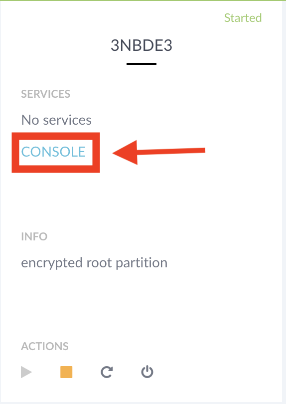
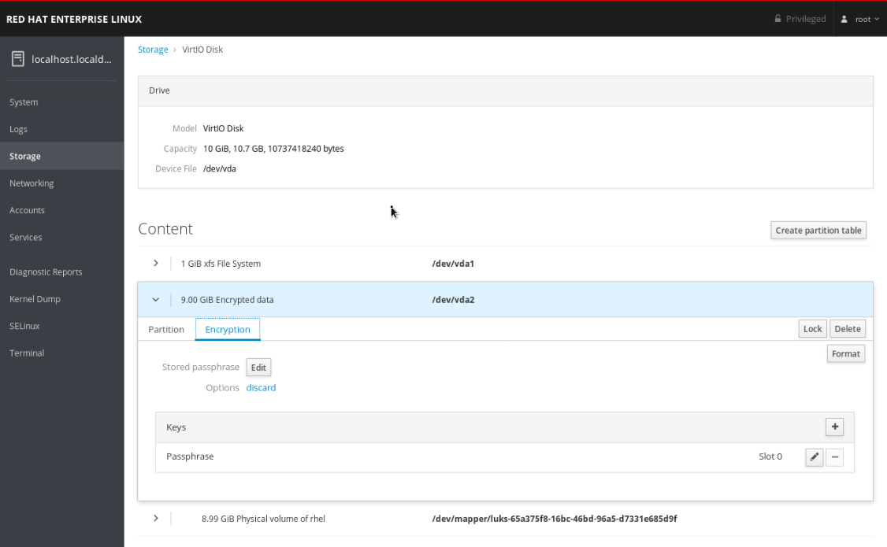

= Lab 3: How to use Network Bound Disk Encryption (NBDE) to securely decrypt LUKS encrypted volumes

== Goal of Lab
The goal of this lab is to understand how to use Network Bound Disk Encryption (NBDE) to securely decrypt LUKS encrypted volumes. You will install the Tang server on our NBDE1 server, and install the Clevis client on NBDE3.

== Introduction
Network-Bound Disk Encryption (NBDE) allows the user to encrypt root volumes of hard drives on physical and virtual machines without requiring to manually enter a password when systems are restarted.  Red Hat Enterprise Linux implements NBDE with a central server named Tang, and and client framework named Clevis.

Tang is used to bind data to a secure network.  It is stateless and does not require TLS or authentication.  Tang does not interact with client keys, so it never obtains identifying information from the client.  Clevis provides automated unlocking of LUKS volumes.

Clevis and Tang are generic client and server components that provide network bound encryption. In Red Hat Enterprise Linux 7, they are used in conjunction with LUKS to encrypt and decrypt root and non-root storage volumes to accomplish Network Bound Disk Encryption.

This lab covers setting up NBDE using command line interface, but Cockpit also provides same functionality in cockpit-storaged. You are able to add, edit and remove both passphrase based keys and keyserver key.

== Lab 3.1 Installing the Tang server
. Navigate to the Lab information page from *Lab 0 Setup steps*. This page has your environment's power control and consoles. Click on the console for *NBDE1*. Login to the NBDE1 server as *root* using the password *r3dh4t1!*.

+
image:images/lab3-console.png[200,200]

. Then, install the tang packages
+
[source, text]
[root@nbde1 ~]# yum install tang
+

NOTE:
If you wanted to copy and paste text to send to the console, you could also press the *T* button at the top right of your console if you didn't want to type text into the console directly. This is mainly recommended for longer commands.
image:images/console-textbox.png[500,500]

. Finally, enable the tang service in systemd and open the HTTP port in firewall:
+
[source, text]
[root@nbde1 ~]# systemctl enable tangd.socket --now
[root@nbde1 ~]# firewall-cmd --add-service=http
[root@nbde1 ~]# firewall-cmd --add-service=http --permanent

Since tangd uses the systemd socket activation mechanism, the server starts as soon as the first connection comes in. A new set of cryptographic keys is automatically generated at the first start.

== Lab 3.2 Installing the Clevis Client
Your NBDE3 client is already encrypted and this exercise will install the client packages that will allow you to un-encrypt the root device drive upon boot without manual intervention.

. Navigate to the Lab information page from *Lab 0 Setup steps*. This page has your environment's power control and consoles. Click on the console for *NBDE3*. The passphrase for the LUKS encrypted disk on *NBDE3* is *r3dh4t1!*. You will need to enter the pass phrase to complete the boot process.  If you wanted to copy and paste text to send to the console, press the *T* button at the top right of your console.
+

image:images/console-textbox.png[500,500]

. Login to the NBDE3 server as *root* using the password *r3dh4t1!*.
. Then, install the clevis packages:
+
[source, text]
[root@nbde3 ~]# yum install clevis clevis-luks clevis-dracut
. Next, we will initialize the luks binding to the tang server. If you wanted to copy and paste the text below to send to the console, press the *T* button at the top right of your console (See the picture above on Step #1).
+
[source, text]
[root@nbde3 ~]# clevis luks bind -d /dev/vda2 tang '{"url":"http://nbde1.example.com"}'
+
NOTE: This command performs four steps:
1) Creates a new key with the same entropy as the LUKS master key.
2) Encrypts the new key with Clevis.
3) Stores the Clevis JWE object in the LUKS header with LUKSMeta.
4) Enables the new key for use with LUKS.

. You will be asked to trust the keys. Answer ‘y’ to this question.
. Next, enter the existing LUKS password, which is *r3dh4t1!*.


. This disk can now be unlocked with your existing passphrase as well as with the Clevis policy.

== Lab 3.3 Verify LUKS Header
. To verify that the Clevis JWE object is successfully placed in a LUKS header, use the `cryptsetup luksDump` command on *NBDE3*.
You should see that there are two keyslots in the header. Keyslot 0 represents the static password you had to enter when booting the machine for the first time. Keyslot 1 is the newly added entry by the `clevis luks bind` command.
+
[source, text]
```
[root@nbde3 ~]# cryptsetup luksDump /dev/vda2
LUKS header information
Version:       	2
Epoch:         	5
Metadata area: 	12288 bytes
UUID:          	65a375f8-16bc-46bd-96a5-d7331e685d9f
Label:         	(no label)
Subsystem:     	(no subsystem)
Flags:       	(no flags)

Data segments:
  0: crypt
	offset: 8388608 [bytes]
	length: (whole device)
	cipher: aes-xts-plain64
	sector: 512 [bytes]

Keyslots:
  0: luks2
	Key:        512 bits
	Priority:   normal
	Cipher:     aes-xts-plain64
	PBKDF:      argon2i
	Time cost:  4
	Memory:     754560
	Threads:    2
	Salt:       c7 be d2 42 3c d0 57 53 65 59 bb 62 1f 21 aa ba 
	            4b 6d c4 82 1f 6b 8f a0 2d 0a 22 5a 4e 5f 4e 88 
	AF stripes: 4000
	Area offset:32768 [bytes]
	Area length:258048 [bytes]
	Digest ID:  0
  1: luks2
	Key:        512 bits
	Priority:   normal
	Cipher:     aes-xts-plain64
	PBKDF:      argon2i
	Time cost:  4
	Memory:     831696
	Threads:    2
	Salt:       76 f2 20 9e 37 2f 2d 76 42 05 7f 14 83 30 da bc 
	            ae 33 dc fd 6e 5d 7a 74 f1 b6 dc b1 3d 61 f7 a9 
	AF stripes: 4000
	Area offset:290816 [bytes]
	Area length:258048 [bytes]
	Digest ID:  0
Tokens:
  0: clevis
	Keyslot:  1
Digests:
  0: pbkdf2
	Hash:       sha256
	Iterations: 83485
	Salt:       e8 33 a0 97 1b 5d ac 81 29 30 df fa 5e e0 4a e3 
	            8b 12 fd 1d 1d 7f f2 74 b1 b5 c7 56 08 2b 9e 76 
	Digest:     b7 42 05 a6 84 23 e2 26 af d7 2d db bf 21 27 29 
	            b7 23 26 c1 07 08 52 bc e2 a7 93 75 21 7f 80 b1
```

== Lab 3.4 Enable Decryption on the Boot Process
. To enable the early boot system to process the disk binding, enter the following command on *NBDE3*.
+
[source, text]
[root@nbde3 ~]# dracut -f
+
NOTE: Pass the *-vf* parameter if you want to see verbose output.

== Lab 3.5 Reboot *NBDE3* and test that NBDE was successfully configured
. Reboot *NBDE3*.  When the prompt comes up for the LUKS passphrase, wait for a while (it might take up to *2 minutes* in the virtualized environment) and *NBDE3*  should automatically begin the boot process without requiring you to enter a password.

+
[source, text]
[root@nbde3 ~]# reboot

== Lab 3.6 Initializing the luks binding to the tang server using Cockpit

Your NBDE2 server is already encrypted and this exercise will install the client packages that will allow you to un-encrypt the root device drive upon boot without manual intervention.

Navigate to the Lab information page from *Lab 0 Setup steps*. This page has your environment's power control and consoles. Click on the console for *NBDE2*. The passphrase for the LUKs encrypted disk on *NBDE2* is *r3dh4t1!*. You will need to enter the pass phrase to complete the boot process.  If you wanted to copy and paste text to send to the console, press the *T* button at the top right of your console.


image:images/console-textbox.png[500,500]

Login to the NBDE2 server as *root* using the password *r3dh4t1!*.

Your NBDE2 server is already encrypted and this exercise will install the client packages that will allow you to un-encrypt the root device drive upon boot without manual intervention.

Navigate to the Lab information page from *Lab 0 Setup steps*. This page has your environment's power control and consoles. Click on the console for *NBDE2*. The passphrase for the LUKs encrypted disk on *NBDE2* is *r3dh4t1!*. You will need to enter the pass phrase to complete the boot process.  If you wanted to copy and paste text to send to the console, press the *T* button at the top right of your console.


image:images/console-textbox.png[500,500]

Cockpit-storaged package was preinstalled for you. Cockpit was enabled as well. This can be done by following commands:

[source, text]
[root@nbde2 ~]# yum install cockpit cockpit-storaged

[source, text]
[root@nbde2 ~]# systemctl start cockpit.socket
[root@nbde2 ~]# systemctl enable cockpit.socket --now

Next, we will initialize the luks binding to the tang server using Cockpit.

Go to your *Lab Information* webpage from the *Lab 0 setup steps* and click on the console button for your workstation bastion host. Login as *lab-user* with *r3dh4t1!* as the password.
+
image:images/lab1.1-workstationconsole.png[300,300]
image:images/lab1.1-labuserlogin.png[300,300]

Open a Firefox web browser: 

image:images/nbde_cockpit_firefox.png[]

Open https://nbde2.example.com:9090/

image:images/nbde_cockpit_firefox_1.png[]

Login as root user using *r3dh4t1!* as the password. Next, access *Storage* menu and then click on VirtiO Disk.

image:images/nbde_cockpit_storage_page.png[]

Next, click on *Encrypted data* for */dev/vda2*:

image:images/nbde_cockpit_disk_page.png[]

Next, click on the *Ecnryption* tab for the disk:

image:images/nbde_cockpit_disk_page_1.png[]

It will show current keys for disk. Currently, there is only one passphrase key:



Click on *+* button to add one more key. You will see modal window looking like this:

image:images/nbde_cockpit_tang_empty.png[]

As a Keyserver address we will use *nbde1.example.com* and *r3dh4t1!* for existing disk passphrase. So, fill the modal window fields like this and click *Add* button:

image:images/nbde_cockpit_tang_filled.png[]

It will take some take for it to process the request. After this click *Trust key*:

image:images/nbde_cockpit_tang_confirm.png[]

After this you will see both Disk passphrase and Keyserver as your keys for the disk:

image:images/nbde_cockpit_keys_result.png[]

This disk can now be unlocked with your existing passphrase as well as with the Clevis policy.

<<top>>

link:README.adoc#table-of-contents[ Table of Contents ] | link:lab4_IPsec.adoc[ Lab 4: IPSec ]
