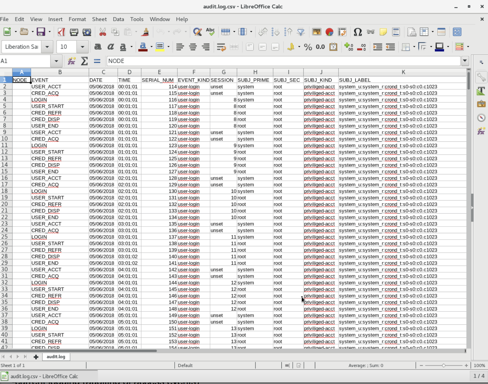

:toc2:
:linkattrs:

= Lab 6: Auditing on Red Hat Enterprise Linux 8

.*Lab Length*
* Medium/Average (~15 mins)

.*Goal*
* Become familiar with the auditing capabilities of Red Hat^(R)^ Enterprise Linux^(R)^ (RHEL)

== 6.1: Introduction
The Linux Audit System provides a way to track security-relevant information on your system. Based on preconfigured rules, Audit generates log entries to record as much information as possible about the events happening on your system. This information is crucial for mission-critical environments to determine any violations of security policy and what actions the violator performed. Audit does not provide additional security to your system; rather, it can be used to discover violations of security policies used on your system. These violations can be prevented by additional security measures such as SELinux.

The lab is performed on a system installed with Red Hat Enterprise Linux 8 and may require modification to work in other lab environments.

== 6.2: Accessing the Audit Lab System

All of the exercises in this lab are run on the *audit.example.com* host,
either as the *root* or *auditlab* user. In each section, you are instructed which user to use. The username is reflected in the command prompt as shown here:

* The *root* user prompt on *audit.example.com*:
+
----
[root@audit ~]#
----

* The *auditlab* user prompt on *audit.example.com*:
+
----
[auditlab@audit ~]$
----

To access the *audit.example.com*, Red Hat recommends that you open the terminal and
remotely connect using SSH into the *audit.example.com* host from the bastion
workstation system as shown. If done correctly, you do not need to enter
a password.

. Use SSH to remotely log in to the bastion workstation system (replacing `GUID` with your lab-provided GUID and using *r3dh4t1!* as the password):
+
----
[localhost ~]$ ssh lab-user@workstation-GUID.rhpds.opentlc.com
----

. Use SSH to remotely log in to *audit.example.com* as *root*:
+
----
[lab-user@workstation-GUID ~]$ ssh root@audit.example.com
----

. Repeat the first SSH command to log in to your bastion workstation system in a new terminal, then use SSH to log in to *audit.example.com* as `auditlab` to avoid exiting your root session on *audit.example.com*:
+
----
[lab-user@workstation-GUID ~]$ ssh auditlab@audit.example.com
----

== 6.3: Configuring the Audit Daemon and Kernel

There are two main audit components in Red Hat Enterprise Linux: the audit
daemon and the kernel itself. In this section, you configure both.

=== 6.3.1: Configuring the Audit Daemon

When the audit daemon is started during the boot process, it reads its
configuration information from the file `/etc/audit/auditd.conf`.
The configuration options are explained in the link:http://man7.org/linux/man-pages/man5/auditd.conf.5.html[auditd.conf(5)^]
man page. Three of the more interesting options are the `flush`, `freq`, and `log_format` options:

* `flush` determines the method by which audit events are flushed to disk.
* `freq` controls how frequently the flush takes place.
* `log_format` option controls the on-disk audit log format.

In this section, you verify that `flush` is set to `INCREMENTAL_ASYNC`
(for asynchronous flushing for performance), *freq* is set to `50` (to flush the log
every 50 records), and *log_format* is set to `ENRICHED` (to resolve some
information for improved archival value).

The `/etc/audit/auditd.conf` file
can be modified using any text editor. In this section, you use the `sed` command to edit the file.

. If you are not already there, log in to the workstation bastion host as *lab-user* from your desktop system (replacing `GUID` with your lab-provided GUID and, if needed, using *r3dh4t1!* as the password):
+
----
[localhost ~]$ ssh lab-user@workstation-GUID.rhpds.opentlc.com
----

. Log in to the *audit.example.com* host as *root*:
+
[source]
----
[lab-user@workstation-GUID ~]$ ssh root@audit.example.com
----

. As *root*, edit the `auditd.conf` file:
+
----
[root@audit ~]# sed -e 's/^flush.*/flush = INCREMENTAL_ASYNC/' -i /etc/audit/auditd.conf
[root@audit ~]# sed -e 's/^freq.*/freq = 50/' -i /etc/audit/auditd.conf
[root@audit ~]# sed -e 's/^log_format.*/log_format = ENRICHED/' -i /etc/audit/auditd.conf
----
+
After the configuration file is updated, you must signal the audit
daemon to reload its configuration.

. As *root*, force `auditd` to reload its configuration:
+
----
[root@audit ~]# service auditd reload
----
+
Expect to see it return an acknowledgement similar to:
+
----
Reconfiguring: [  OK  ]
----
+
The audit daemon can dump a small report about its configuration and some facts about
its current state. This can help you diagnose problems encountered by the audit daemon.

. As *root*, determine the audit daemon's state:
+
----
[root@audit ~]# service auditd state
----
+
Expect to see it return an acknowledgement similar to the following, with a list of values including the current time, process priority, configuration options, and disk free space:
+
----
Getting auditd internal state: [  OK  ]
----
+
Usually the audit daemon enables the kernel's audit subsystem.

. As *root*, get the kernel's state to verify that the audit system is enabled:
+
----
	[root@audit ~]# auditctl -s
----
+
The `1` in the first line of the output of the `auditctl` command indicates that it is enabled. The `pid` line provides the PID of the audit daemon. The rest of the output is the kernel status, not including rules.

=== 6.3.2: Configuring the Linux Kernel

The Linux kernel’s audit subsystem can be configured with the `auditctl`
command. By using `auditctl` the administrator can add audit event filtering
rules as well as tune the audit subsystem in the kernel. The configuration
parameters are explained in the
link:http://man7.org/linux/man-pages/man8/auditctl.8.html[auditctl(8)^] man page.

==== 6.3.2.1: Enabling Preconfigured Rules

A number of preconfigured audit filter rules are provided with Red Hat
Enterprise Linux. You can find them in `/usr/share/doc/audit-*`. These filter
rules can be enabled by copying them to the system’s audit filter rule
directory, regenerating the filter configuration, and loading the resulting
filter rule configuration into the kernel.

In this section, you enable some basic audit filters designed to help
administrators meet the U.S. Department of Defense Security
Technical Implementation Guide (STIG) for Red Hat Enterprise Linux.

. While logged in to the *audit.example.com* system as *root*, enable a number of
pre-defined audit filters:
+
----
[root@audit ~]# cat /usr/share/doc/audit/rules/README-rules
[root@audit ~]# rm /etc/audit/rules.d/*
[root@audit ~]# cp /usr/share/doc/audit/rules/10-base-config.rules /etc/audit/rules.d
[root@audit ~]# cp /usr/share/doc/audit/rules/30-stig.rules /etc/audit/rules.d
[root@audit ~]# cp /usr/share/doc/audit/rules/31-privileged.rules /etc/audit/rules.d
[root@audit ~]# cp /usr/share/doc/audit/rules/99-finalize.rules /etc/audit/rules.d
[root@audit ~]# augenrules --load
----
+
The `augenrules` tool combines all of the `*.rules` files located in
`/etc/audit/rules.d` into the `/etc/audit/audit.rules` file and loads them
using the `auditctl` command. You can remove or rename any of these files
and rerun the `augenrules --load` command to reconfigure your system.

. Now that rules are loaded, working as *root*, have the kernel dump the currently loaded rules so
that you can inspect what is loaded:
+
----
[root@audit ~]# auditctl -l
----
+
Expect to see many audit rules output from the kernel.

==== 6.3.2.2: Creating Custom Rules

Custom audit filters can be loaded into the kernel using the `auditctl`
command. The various filter options are explained in the
link:http://man7.org/linux/man-pages/man8/auditctl.8.html[auditctl(8)^] man page.

Custom audit filters can be made persistent by creating a new file in the
`/etc/audit/rules.d` directory with the `.rules` file extension. While not
required, the following naming convention is suggested:

----
<priority>-<name>.rules
----

Where the `<priority>` value falls into these categories:

----
10: Kernel and `auditctl` configuration
20: Rules that could match general rules but we want a different match
30: Main rules
40: Optional rules
50: Server specific rules
70: System local rules
90: Finalize (immutable)
----

The preconfigured filter rules provide a useful example for how to structure
your custom audit filter rule files. The basic syntax is that each line is
a series of arguments passed to the `auditctl` command; lines starting with a
`#` are treated as comments and ignored.

In this section, you create an audit filter that captures audit
events created by the `/usr/bin/ping` program. You also configure the
system to tag all of those events with the `rhkey` key, using the `-k`
option, to make the search through the audit log easier.  The `-a always,exit` is
a common way to add audit filter rules; it adds a filter rule to be executed at
`syscall` exit time. (See the
link:http://man7.org/linux/man-pages/man8/auditctl.8.html[auditctl(8)^] man page for
more detail.)

. While logged into the *audit.example.com* system as *root*, add a custom audit
filter for the `/usr/bin/ping` application:
+
----
[root@audit ~]# auditctl -a always,exit -F exe=/usr/bin/ping -k rhkey
----

. As *root*, add a new rule file to `/etc/audit/rules.d` and reload your configuration
 to make your custom filter rule persistent:
+
----
[root@audit ~]# echo "-a always,exit -S all -F exe=/usr/bin/ping -F key=rhkey" > /etc/audit/rules.d/70-rhkey_lab.rules
[root@audit ~]# augenrules --load
----
+
In addition to modifying custom filter rules, you can adjust the base configuration of the audit subsystem in the Linux kernel using `auditctl`.

. As *root*, increase the audit backlog buffer to `8192` entries:

	[root@audit ~]# auditctl -b 8192
+
This setting is confirmed by output similar to the status command.
+
If you want to make the configuration change persistent, you can
create a new file in `/etc/audit/rules.d` with the configuration and reload the
audit rules.

. As *root*, make the backlog changes persistent:
+
----
[root@audit ~]# echo "-b 8192" > /etc/audit/rules.d/15-rhkey_kernel.rules
[root@audit ~]# augenrules --load
----

==== 6.3.2.3: Defining Kernel Boot Parameters

The kernel also has two kernel boot command-line options that affect the audit system:
`audit` and `audit_backlog_limit`. The `audit` configuration option takes either a `1` or `0`, which
means enabled or disabled, respectively. If you plan to use the audit system, you should boot
with `audit` enabled. As the system is booting, it generates events. By default the kernel
has room to hold 64 events. But `systemd` logs an event for every service started and stopped, and
the kernel logs events as it gets configured. This can easily overrun the 64 reserved event spots.
To hold a lot of events until `auditd` can start reading them, you increase the backlog.

In this section, you modify `/etc/default/grub` to add audit-related configuration to the
kernel's boot prompt. Then you regenerate the boot menu so that it takes effect.

. As *root*, back up the current `/etc/default/grub` file and edit it to set the `audit` and `audit_backlog_limit` options:
+
----
[root@audit ~]# cp /etc/default/grub /etc/default/grub.bak
[root@audit ~]# sed -e '/GRUB_CMDLINE_LINUX/s/\"/ audit=1 audit_backlog_limit=8192\"/2' -i /etc/default/grub
----

. Verify that the `audit=1 and audit_backlog_limit=8192` options are present:
+
----
[root@audit ~]# grep GRUB_CMDLINE_LINUX /etc/default/grub
----

. As *root*, regenerate the grub boot menu:
+
----
[root@audit ~]# grub2-mkconfig -o `find /boot -name grub.cfg`
----
* The menu is in different places based on whether you have a BIOS- or UEFI-based machine. The `find` command locates the file for you.

== 6.4: Inspecting the Audit Log

The exercises below show how to search through the audit logs and generate
summary audit reports. It is important to note that this section requires that
the system is configured as described earlier in this lab.

=== 6.4.1: Generating Audit Events

. Open another terminal shell on the workstation bastion host, and from there log in to the
*audit.example.com* system as the *auditlab* user:
+
----
[lab-user@workstation-GUID ~]$ ssh auditlab@audit.example.com
----

. Run the following commands to generate some interesting events in the audit log:
+
----
[auditlab@audit ~]$ vi /etc/shadow
(Type :q! to exit vi)
----
+
----
[auditlab@audit ~]$ ping -c 1 127.0.0.1
----
+
----
[auditlab@audit ~]$ vi ~/project_tps_report.txt
(Type: i to go into insert mode)
(Type: This is my TPS report)
(Press *Esc*)
(Type :wq! to save the file and exit vi)
----
+
----
[auditlab@audit ~]$ chmod 0664 ~/project_tps_report.txt
----

=== 6.4.2: Searching for Events

While the audit logs are plain text files, and normal Linux text searching tools
(e.g. `grep`) can be used to search the audit logs, the audit userspace tools
include `ausearch`&#8212;, which was designed to search and interpret the audit logs.
The `ausearch` tool can take a number of command-line parameters, which are described in the
link:http://man7.org/linux/man-pages/man8/ausearch.8.html[ausearch(8)^] man page.

The `--start` option specifies at what point in the audit logs to start searching,
`--start today` indicates that only events from today should be considered. The
`-m` option indicates that you are interested in audit events with the given
record type.

. While logged into the *audit.example.com* system as *root*, examine the login events on the test system:
+
----
[root@audit ~]# ausearch --start today -m USER_LOGIN
----
+
Expect to see one event shown with SSHD for the current session that is hosting this search command.

. As *root*, list all of the service start and stop events:
+
----
[root@audit ~]# ausearch --start this-month -m SERVICE_START -m SERVICE_STOP
----
+
Multiple record types can be specified; the results include events that
contain either record type.
+
Expect the results to show an event for each service run or stopped in that time.
+
The `-i` option instructs `ausearch` to interpret the results, translating some
fields into a more human-readable form. The `-k` option searches on the key
assigned to an audit rule.

. As *root*, display all of the events from today matching the *access* key:
+
----
[root@audit ~]# ausearch --start today -i -k access
----
+
This command lists any events triggered by the pre-defined rules with the `access` key, and the `-i` interpretation option makes the `proctitle` field readable in the output.

. As *root*, display today's events from the *auditlab* user that match the `perm_mod` key:
+
----
[root@audit ~]# ausearch --start today -i -k perm_mod --uid auditlab
----
+
The `--uid` option searches for events that match the given UID.
+
Expect this command to list the event generated by the example above in the <<Audit Events Generation>> section.

. As *root*, display all of today's accesses of the *project_tps_report.txt* file:
+
----
[root@audit ~]# ausearch --start today -i -f project_tps_report.txt
----
+
The `-f` option searches for events that match the given file name.
+
Expect the command to list the creation and permission modification events from the <<Audit Events Generation>> section.

. As *root*, view all of the events from today matching the `rhkey` key, to search for audit events generated by your custom filter rule:
+
----
[root@audit ~]# ausearch --start today -i -k rhkey
----
+
Expect this to list the event from the `ping` command in the <<Audit Events Generation>> section.

=== 6.4.3: Generating Reports

Included in the Audit userspace tools are three utilities that can be used to
generate a number of reports from the audit log: `aureport`, `aulast`, and
`aulastlog`.  The `aureport` tool can generate a number of different reports,
all of which are described in the
link:http://man7.org/linux/man-pages/man8/aureport.8.html[aureport(8)^] man page.

. While logged into the *audit.example.com* system as *root*, run the following
commands to create several audit reports for today's activity:
+
----
[root@audit ~]# aureport --start today --summary
[root@audit ~]# aureport --start today --summary -i --file
[root@audit ~]# aureport --start today --summary -i --executable
[root@audit ~]# aureport --start today --summary -i --login
----
+
The `aureport` and `ausearch` tools may be used together if you want to identify who triggered
a specific audit rule. The strategy is to search for the key that is associated with the audit rule
and then feed the results to the kind of report you are interested in. This works only if the output
from `ausearch` is exactly as it is in the logs. To tell `ausearch` to leave the event unaltered,
pass the `--raw` formatting option.

. As *root*, run the following command:
+
----
[root@audit ~]# ausearch --start today -k access --raw | aureport --summary -i --file
----
+
The `aulast` tool generates a report similar to the `last` command, except the
information is collected from the audit log instead of the less reliable `utmp`
logs. The _aulast(8)_ man page provides details on how to run `aulast`; without
any options, the output is familiar with the `last` command.
+
The `aulast` utility can also help you find an `ausearch` command to extract just the audit
events for a specific login whenever you pass the `--proof` command-line option. This is helpful
when investigating which programs or files a user accessed during a specific session.

. As *root*, examine an example of `aulast` report:
+
----
[root@audit ~]# aulast
[root@audit ~]# aulast --proof
----
+
Similar to `aulast`, `aulastlog` is designed as a replacement for the `lastlog`
command--the important difference being that `aulastlog` collects data from the
audit log. The _aulastlog(8)_ man page provides more information, but even running
`aulastlog` without any options results in a useful report.

. As *root*, examine an `aulastlog` report:
+
----
	[root@audit ~]# aulastlog
----

=== 6.4.4: Transforming Audit Logs

In addition to searching through the audit logs, the `ausearch` tool can also
be used to transform the results into different formats. If you have already
completed the rest of this lab, you are most likely familiar with the `raw`
and `interpreted` default formats. In addition to these formats, there are also
`csv` and `text` formats, which can be selected using the `--format` argument.

The `--format` option, as well as several others that can customize the output
of `ausearch`, can be found in the
link:http://man7.org/linux/man-pages/man8/ausearch.8.html[ausearch(8)^] man page.

. While logged into the *audit.example.com* system as *root*, view samples of the `csv` and `text` formats:
+
----
[root@audit ~]# ausearch --start today --format csv
[root@audit ~]# ausearch --start today --format text
----
+
The CSV output is particularly interesting as it can be imported into
LibreOffice or any other spreadsheet program that accepts files in the
Comma Separated Values (CSV) format.

. As *root*, transform today's audit log into the CSV format suitable for use within LibreOffice:
+
----
[root@audit ~]# ausearch --start today --format csv --extra-labels --extra-obj2 > /tmp/audit.log.csv
----

=== 6.4.5: Viewing the CSV Output Audit Log from the Workstation Bastion Host

In this section, you transfer the CSV file you just created from the *audit.example.com* system to the workstation bastion host system by using `scp`. Then you open the CSV file using LibreOffice from the workstation bastion host.

. If you are not already there, log in to the workstation bastion host as *lab-user* from your desktop system (replacing `GUID` with your lab-provided GUID and using *r3dh4t1!* as the password):
+
----
[localhost ~]$ ssh lab-user@workstation-GUID.rhpds.opentlc.com
----

. Use `scp` to transfer the CSV file from the *audit.example.com* system to the desktop of the workstation bastion host system:
+
----
[lab-user@workstation-GUID ~]$ scp root@audit.example.com:/tmp/audit.log.csv ~/Desktop/
----

. Return to your *Lab Information* web page and click *CONSOLE* for your workstation bastion host:
+
image:images/lab1.1-workstationconsole.png[300,300]

. Log in as *lab-user* with *r3dh4t1!* as the password:
+
image:images/lab1.1-labuserlogin.png[300,300]

. Locate the CSV file you just copied from the *audit.example.com* system on your workstation bastion host's desktop:
+
image:images/audit-csvdesktop.png[200,200]

. Double-click the audit report to view it, then click *Ok* on the *Text Import* dialog:
+
image:images/audit-textimportok.png[400,400]

. Take a look at your CSV report:
+

== 6.5: Resetting the Lab System (Optional)

. If you want to restart the lab from scratch, run the following as *root* on *audit.example.com*:
+
----
[root@audit ~]# rm /etc/audit/rules.d/*
[root@audit ~]# cp /usr/share/doc/audit/rules/10-base-config.rules /etc/audit/rules.d
[root@audit ~]# augenrules --load
[root@audit ~]# cp /etc/default/grub.bak /etc/default/grub
[root@audit ~]# grub2-mkconfig -o `find /boot -name grub.cfg`
----

<<top>>

link:README.adoc#table-of-contents[Table of Contents^] | link:lab7_AIDE.adoc[Lab 7: AIDE^]

