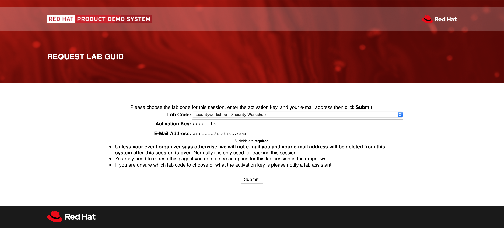
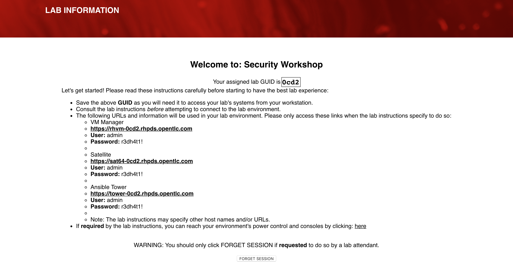
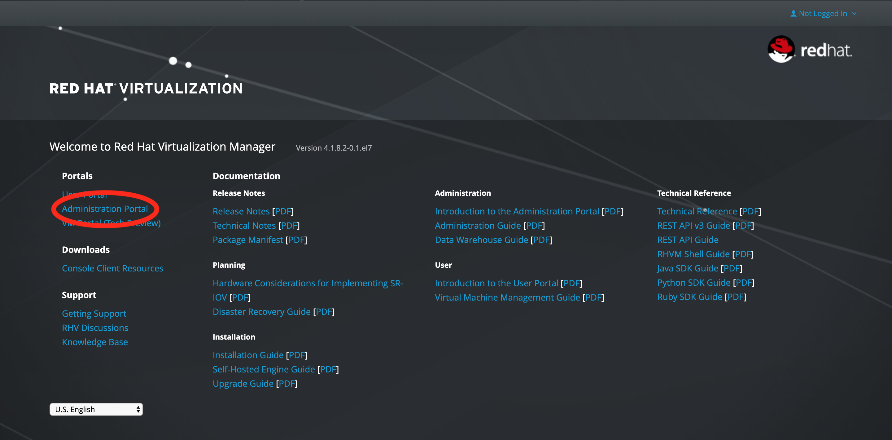
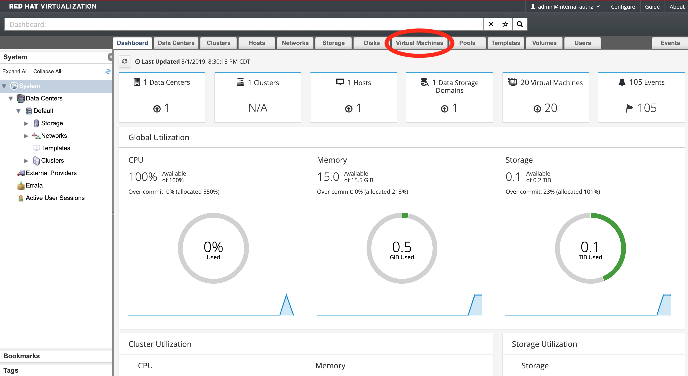
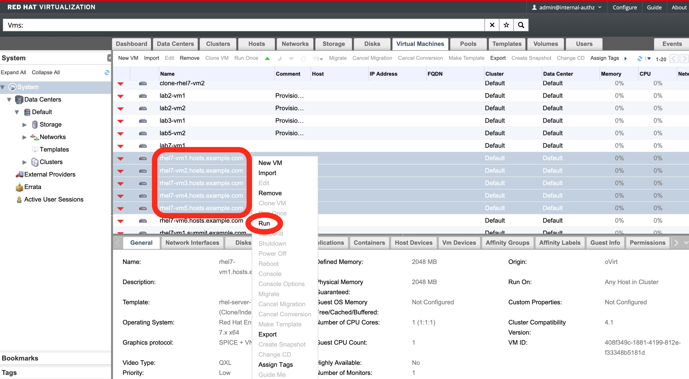

== Lab 1: Explore The Lab Environment

=== Accessing your dedicated lab environment using your GUID
You will be given a URL and Activation Key by your instructor to retrieve your lab environment. Complete the form to have a GUID allocated to you. This GUID represents your unique environment. 

You will be given a a 4 character code. This code is called your GUID. Whenever you see GUID in the lab guide, replace it with this code. You will need this for the next step when we verify connectivity to your lab.

=== Logging into your lab environment
. Let’s log into the Red Hat Products that you will use for the workshop. 
. The *Lab GUID Assignment page* contains a list of links to all of the Red Hat Products that you will use in this lab. Click each of the links on this page. Each link should open a new tab. You will have to accept the SSL certificates for each page when the warning appears.
+

Alternatively, the table below also shows the links to the Red Hat Products you need to be logged into for the exercises.

*Red Hat Products to log into:*
|===
|Red Hat Product |URL |Username|Password
|Red Hat Ansible Tower
|https://tower-GUID.rhpds.opentlc.com
|admin
|r3dh4t1!

|Red Hat Satellite
|https://sat64-GUID.rhpds.opentlc.com
|admin
|r3dh4t1!

|Red Hat Virtualization
|https://rhvm-GUID.rhpds.opentlc.com
|admin
|r3dh4t1!
|===

=== Turning on your VMs
. Before starting the lab, you will need to turn on the VMs that will be used for the exercises. These VMs run on Red Hat Virtualization. Go to the Virtualization Manager (https://rhvm-GUID.rhpds.opentlc.com) tab. *Make sure to replace the GUID with your provided GUID!* 

. From the homepage, select the *Administration Portal* to be directed to the login screen where you can login with *admin* as the Username and *r3dh4t1!* as the Password.
+

. Click on the *Virtual Machiness* tab on the top. You will be presented with a list of all VMs.
+

. Then, select the following VMs: +
*rhel7-vm1.hosts.example.com* +
*rhel7-vm2.hosts.example.com* + 
*rhel7-vm3.hosts.example.com* +
*rhel7-vm4.hosts.example.com* +
*rhel7-vm5.hosts.example.com* +
Right click on the selected VMs and choose *Run* from the menu.
+

. Your machines will now power on and be ready for your next exercise.

link:README.adoc#agenda[ Table of Contents ] | link:lab2.adoc[Lab 2: Automated Scanning and Remediation]