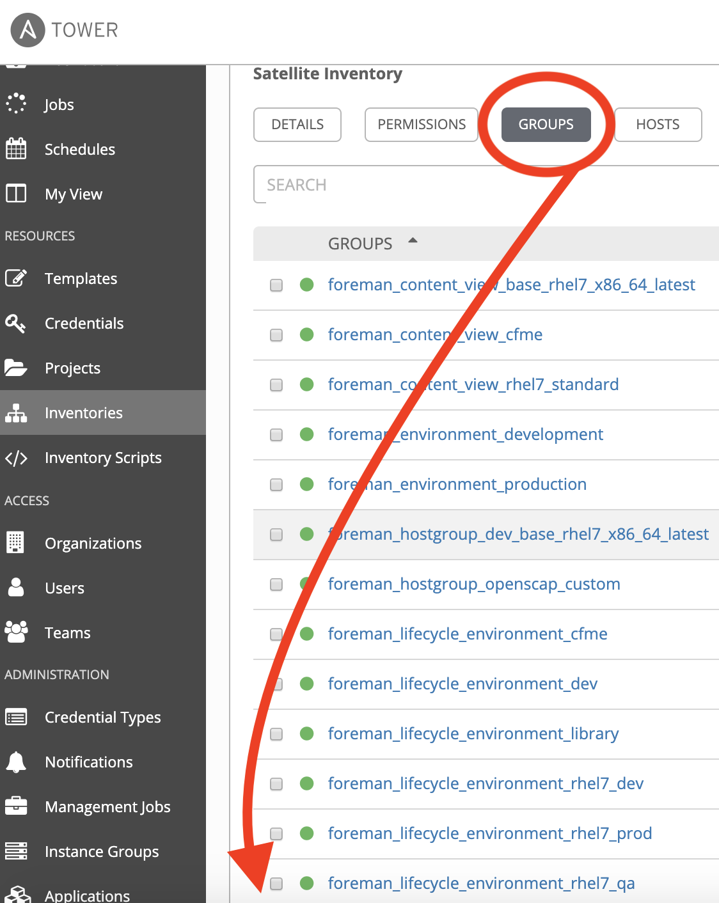
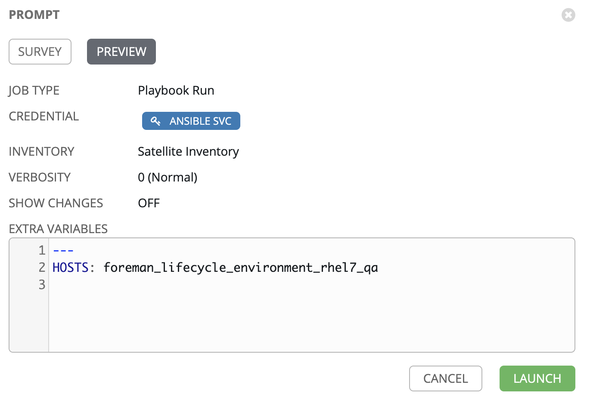
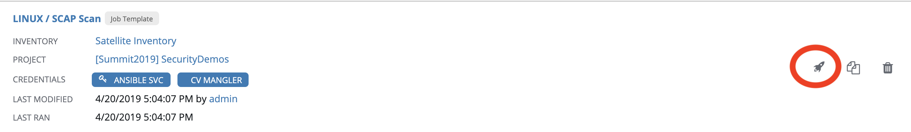
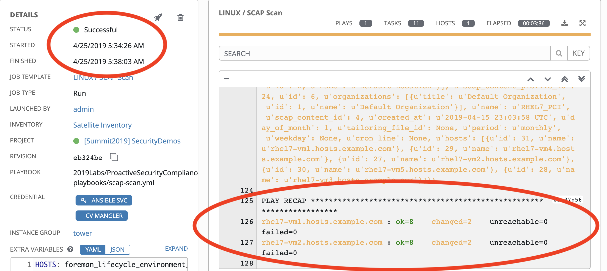

== Lab 2: Automated Scanning and Remediation

=== Goal of Lab 1
The goal of this lab is to learn how to use a combination of Red Hat Ansible Automation , Satellite, and OpenSCAP to automatically detect and remediate security and compliance issues.

=== Lab 1.1 Introduction to SCAP content provided in Satellite
Before creating a SCAP compliance policy for a host, you need SCAP content.

SCAP content is a datastream format containing the configuration and security baseline against which hosts are checked. Checklists are described in the extensible checklist configuration description format (XCCDF) and vulnerabilities in the open vulnerability and assessment language (OVAL). Checklist items, also known as rules express the desired configuration of a system item. For example, you may specify that no one can log in to a host over SSH using the root user account. Rules can be grouped into one or more profiles, allowing multiple profiles to share a rule. SCAP content consists of both rules and profiles. You can either create SCAP content or obtain it from a vendor. Supported profiles are provided for Red Hat Enterprise Linux in the scap-security-guide package. 

When you install the SCAP components in Satellite as defined in the link:https://access.redhat.com/documentation/en-us/red_hat_satellite/6.4/html/administering_red_hat_satellite/chap-red_hat_satellite-administering_red_hat_satellite-security_compliance_management/[Administering Satellite Guide], all of the Red Hat default content will show up in Satellite. If you customize content or have a modified policy, you can upload it in the Satellite UI under *Hosts → SCAP contents*.

. On the Satellite server (https://sat64-GUID.rhpds.opentlc.com) log in with *admin* as the user name and *r3dh4t1!* as the password (if not already logged in). Don't forget to replace the *GUID* with your provided *GUID*.

. Take a look at the default SCAP content provided with the OpenSCAP components of Satellite 6 by navigating to *Hosts → SCAP contents*.
+
image:images/lab2/lab2-0.png[300,300]
+
NOTE: To save time on this lab exercise, the SCAP components in Satellite were already installed for you. This is why you are seeing the default content under *Hosts → SCAP contents*.

=== Lab 1.2 Viewing the already created SCAP compliance policies
Now that you have SCAP content defined in Satellite, let's take a look at the SCAP compliance policies that have been already created for you.

. Take a look at the SCAP policies by navigating to *Hosts → Policies*.
+
image:images/lab2/lab2-1.png[300,300]
. Notice that there are 3 Compliance Policies that were already created: *RHEL7_Custom*, *RHEL7_PCI*, and *RHEL7_Standard*.
+
image:images/lab2/lab2-2.png[1500,1500]

+
NOTE: A custom policy named *RHEL7_Custom* has already been uploaded. The *RHEL7_Custom* policy simply checks to see if the AIDE package is installed.

. Let's take a look at the *RHEL7_PCI* compliance policy. Click on *Edit* in the *Actions* drop down list.
+
image:images/lab2/lab2-3.png[1500,1500]
+
NOTE: A SCAP compliance policy takes one of the security profiles that are available in your SCAP content and applies it to a group of systems. You can also overwrite your SCAP content with a tailoring file. 

. Click on and review the various tabs including *General*, *SCAP Content*, *Schedule*, *Locations*, and *Organizations*.

. In the *SCAP Content* tab,
* Notice that nothing is selected for *Tailoring File*. We will add a tailoring file later.
+
image:images/lab2/lab2-4.png[1000,1000]
+
NOTE: Tailoring Files allow existing OpenSCAP policies to be tailored, or customized, without forking or rewriting the policy. It is important to note that the Tailoring files feature does not provide the ability to create tailoring files. A Tailoring file can be created using SCAP Workbench(which is included in Red Hat Enterprise Linux). Once you have a Tailoring file you can upload it and assign the Tailoring File to a policy. We will learn more about how to use tailoring files later in this lab exercise.

. Click *Cancel* when you are done looking through the tabs.

=== Lab 1.3 Executing security compliance policy scan on hosts at scale from Ansible Tower

. Now that SCAP compliance policies are defined in Satellite,
let's run a SCAP compliance policy scan with Ansible Tower.

. On Ansible Tower (https://tower-GUID.rhpds.opentlc.com) log in with *admin* as the user name and *r3dh4t1!* as the password (if not already logged in).

. Navigate to *Inventories* and click on the *Satellite Inventory*.
+
image:images/lab2/lab2-5.png[400,400]

. Next, click on *GROUPS* and click on the *foreman_lifecycle_environment_rhel7_qa* group. We will be running our SCAP compliance policy scan on the hosts in this group.
+

. Now, take a look at the hosts that are part of the *foreman_lifecycle_environment_rhel7_qa group*. Click on *HOSTS*. Notice that there are two hosts that are part of *foreman_lifecycle_environment_rhel7_qa* group: *rhel7-vm1.hosts.example.com* and *rhel7-vm2.hosts.example.com*.
+
image:images/lab2/lab2-7.png[600,600]

. Navigate to *Templates* and click the *rocket ship* next to the job template named *LINUX / SCAP Scan*.
+
image:images/lab2/lab2-8.png[100,100]
image:images/lab2/lab2-9.png[1500,1500]

. Now, for *HOSTS*, copy/paste or type *foreman_lifecycle_environment_rhel7_qa* and choose the *RHEL7_PCI* profile from the *CHOOSE PROFILE* drop down list. Click *NEXT*.
+
image:images/lab2/lab2-10.png[1000,1000]

. Take a look at the preview of the Ansible Tower job we are about to run. In this job, we are going to run the `RHEL7_PCI` SCAP compliance policy scan from the Satellite server (sat64.example.com) on the hosts in the `foreman_lifecycle_environment_rhel7_qa` group. Click *LAUNCH* to run this scan. *This scan will take about several minutes to complete*.
+
image:images/lab2/lab2-11.png[1000,1000]
+
NOTE: Ansible Tower jobs can be scheduled to run on a periodic basis as well.
+
NOTE: While we're only running this job on the 2 hosts that are part of the foreman_lifecycle_environment_rhel7_qa group, Ansible Tower provides the scalability to run this job across thousands of hosts.

. As we wait for this scan to complete, let's take a deeper look at what's happening in the background. First, notice that we're running a playbook named https://github.com/RedHatDemos/SecurityDemos/blob/master/2019Labs/ProactiveSecurityCompliance/Ansible/patching-playbooks/scap-scan.yml[scap-scan.yml]. In the job log, we first see tasks being executed from the *ansible-role-scap-client* role. Here, we're making sure that the SCAP client is installed and configured on the hosts.
+
image:images/lab2/lab2-12.png[1500,1500]
+
NOTE: Because Ansible is idempotent, after 1 run of a playbook to set things to a desired state, further runs of the same playbook will result in 0 changes. As a result, this playbook will check to make sure the client is installed and configured but, if it has already been installed, no changes will be made. Also note that when we're accessing the host systems, we're using credentials that are encrypted and securely stored in Ansible Tower's credential vault.

Next, the *Run SCAP Scan* task beings to run. This will run the specified SCAP compliance policy (RHEL7_PCI) scan on the hosts. Once the scan completes, the SCAP compliance report will be automatically uploaded to the Satellite server.

Finally, once you see *Successful* for *STATUS* with a date and time listed for *STARTED* and *ENDED* , in addition to seeing zero failures in the *PLAY RECAP* at the end of your Ansible Tower log, then your job has successfully finished running.

image:images/lab2/lab2-13.png[1000,1000]
image:images/lab2/lab2-14.png[1000,1000]

=== Lab 1.4 Viewing the OpenSCAP scan reports in Satellite

. Now that the SCAP compliance scans for the RHEL_PCI compliance policy have finished running, let's view the resulting reports for the hosts in Satellite.

. On the Satellite server (https://sat64-GUID.rhpds.opentlc.com) log in with *admin* as the user name and *r3dh4t1!* as the password (if not already logged in). Don't forget to replace the *GUID* with your provided *GUID*.

. Navigate to *Hosts → Reports*.
+
image:images/lab2/lab2-15.png[300,300]

. Notice that there are two RHEL_PCI compliance policy reports, one for the *rhel7-vm1-hosts.example.com* host and another for the *rhel7-vm2.hosts.example.com* host. Notice that they both have 38 compliance rules that passed and 53 that failed and 3 other, which are compliance rules that were not checked. Let's look at one of the reports in more detail. We'll look at the compliance report for the *rhel7-vm2.hosts.example.com* host. Click the link in the *Reported At* column for the *rhel7-vm2.hosts.example.com* host. The *Reported At* column says how long ago the report was created.
+
image:images/lab2/lab2-16.png[2000,2000]

. In this report, you can see the security rules that have passed and failed at a high level which allows you to see the security posture of a system based upon an assigned audit policy.
+
image:images/lab2/lab2-17.png[1000,1000]
image:images/lab2/lab2-18.png[1000,1000]

. To see the detailed full report, click on *View full report* at the top right. Notice that you can optionally *Download the XML* of the report in bzip or HTML format as well.
+
image:images/lab2/lab2-19.png[1000,1000]

. Glance through this full report to see what rules passed/failed, severity of the rules, etc.  Notice that you can click on each rule for more detailed information.
+
image:images/lab2/lab2-20.png[1500,1500]

=== Lab 1.5 Remediating SCAP compliance policy scan failures on hosts at scale with Ansible Tower

. Now let's fix the OpenSCAP scan failures from the *RHEL7_PCI* compliance policy on the hosts from the previous lab exercise.

. On Ansible Tower (https://tower-GUID.rhpds.opentlc.com) log in with *admin* as the user name and *r3dh4t1!* as the password (if not already logged in).

. Navigate to *Templates* and click the *rocket ship* next to the job template named *LINUX / SCAP Remediate PCI*. This job template will launch the Red Hat provided Ansible role that will do all the configuration changes and remediation to the host(s) that this role is applied to so that the host(s) are compliant the the RHEL 7 PCI-DSS compliance profile.
+
image:images/lab2/lab2-21.png[100,100]
image:images/lab2/lab2-22.png[1500,1500]

. Next, for *WHICH HOSTS?*, copy/paste or type in the *foreman_lifecycle_environment_rhel7_qa* group name again so we can do the RHEL 7 PCI-DSS remediations to the hosts that are in the foreman_lifecycle_environment_rhel7_qa group. Click *NEXT*.
+
image:images/lab2/lab2-23.png[1000,1000]

. Take a look at the job preview and click *LAUNCH*.
+

+
NOTE: This job will take about 10 minutes to complete.

. As we wait for the prior remediation step to complete, let's take a deeper look at what's happening in the background by looking at the log shown in Ansible Tower. First, notice that the playbook that is being run is the *pci.yml* playbook. This playbook can be found https://github.com/RedHatDemos/SecurityDemos/blob/master/2019Labs/ProactiveSecurityCompliance/Ansible/patching-playbooks/pci.yml[here^]. Notice that this playbook calls the *redhatofficial.rhel7_pci_dss* role, which is why all of the tasks that you see in the log are coming from that *redhatofficial.rhel7_pci_dss* role. This Ansible role is a Red Hat provided and supported Ansible role that you can get from Ansible galaxy https://galaxy.ansible.com/RedHatOfficial/rhel7_pci_dss[here^]. You can also automatically generate this role from the SCAP workbench GUI tool that's provided in Red Hat Enterprise Linux. More details on SCAP workbench can be found https://access.redhat.com/documentation/en-us/red_hat_enterprise_linux/7/html/security_guide/sect-using_scap_workbench[here^]. This Red Hat provided *redhatofficial.rhel7_pci_dss* Ansible role will automatically make all the necessary configuration changes to remediate the host(s) that this role is applied to for compliance to the RHEL 7 PCI-DSS compliance profile.

. Finally, once you see *Successful* for *STATUS* with a date and time listed for *STARTED* and *ENDED* , in addition to seeing zero failures in the *PLAY RECAP* at the end of your Ansible Tower log, then your job has successfully finished running.
+
image:images/lab2/lab2-25.png[1000,1000]

=== Lab 1.6 Re-executing the security compliance policy scan on hosts at scale from Ansible Tower after Remediations & Viewing the resulting scan reports from Satellite

. On Ansible Tower (https://tower-GUID.rhpds.opentlc.com) log in with *admin* as the user name and *r3dh4t1!* as the password (if not already logged in).

. Navigate to *Templates* and click the *rocket ship* next to the job template named *LINUX / SCAP Scan*.
+
image:images/lab2/lab2-26.png[100,100]

. For *HOSTS*, copy/paste or type in the *foreman_lifecycle_environment_rhel7_qa* group name and choose the *RHEL7_PCI* profile from the *CHOOSE PROFILE* drop down list. Click *NEXT*.
+
image:images/lab2/lab2-28.png[1000,1000]

. Take a look at the preview of the Ansible Tower job we are about to run. Now that our remediations are in place on our hosts from the previous lab exercise, we are going to re-run the RHEL7_PCI SCAP compliance policy scan from the Satellite server (sat64.example.com) on the hosts in the foreman_lifecycle_environment_rhel7_qa group.
Click *LAUNCH* to launch this scan. *This scan will take about 4 minutes to complete*.
+
image:images/linuxscapscan-preview.png[1000,1000]

. Finally, once you see *Successful* for *STATUS* with a date and time listed for *STARTED* and *ENDED* , in addition to seeing zero failures in the *PLAY RECAP* at the end of your Ansible Tower log, then your job has successfully finished running.

image:images/lab2/lab2-29.png[1000,1000]

. Now that the SCAP compliance scans for the RHEL_PCI compliance policy have finished re-running on our specified hosts, let's view the resulting SCAP scan  reports for the hosts in Satellite.

. On the Satellite server (https://sat64-GUID.rhpds.opentlc.com) log in with *admin* as the user name and *r3dh4t1!* as the password (if not already logged in). Don't forget to replace the *GUID* with your provided *GUID*.

. Navigate to *Hosts → Reports*.
+
image:images/lab2/lab2-31.png[300,300]

. Looking at the list of compliance reports in Satellite, notice now that we now have 68 passes and 23 failures now for our hosts that we ran the RHEL7_PCI compliance scan on (*rhel7-vm1-hosts.example.com* and *rhel7-vm2.hosts.example.com*). By using the Red Hat provided and supported *redhatofficial.rhel7_pci_dss* Ansible role , we increased the number of passed rule checks by 30 since we automatically made all the necessary configuration changes to remediate these hosts that this role is applied to for compliance to the RHEL 7 PCI-DSS compliance profile.
+
image:images/lab2/lab2-32.png[1000,1000]
<<top>>

link:README.adoc#agenda[ Table of Contents ] | link:lab2.adoc[Lab 3: Automated Configuration Management]
