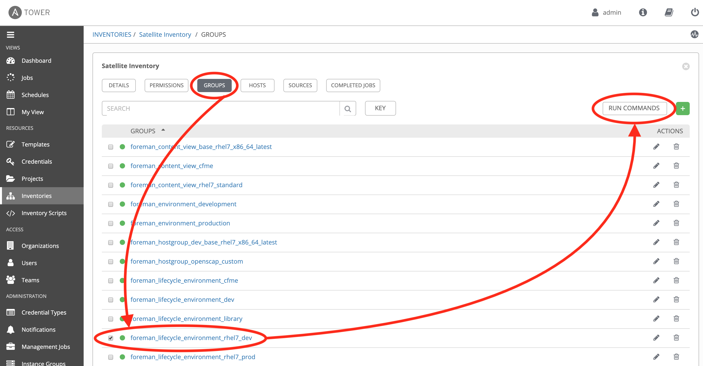
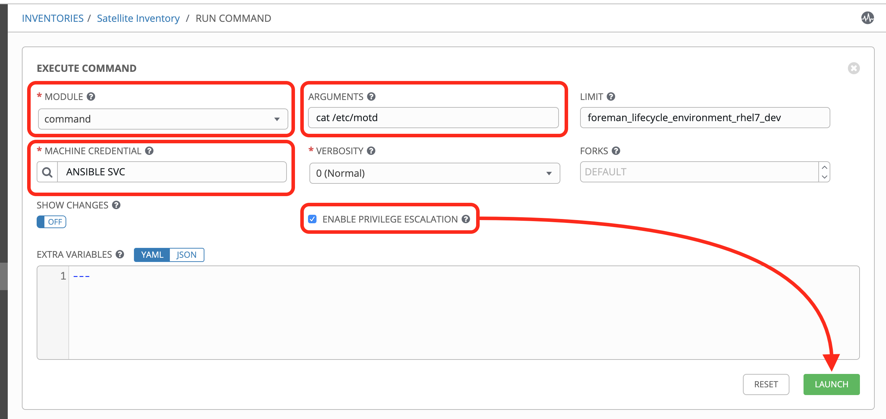
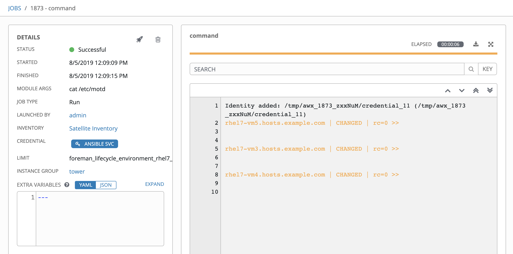
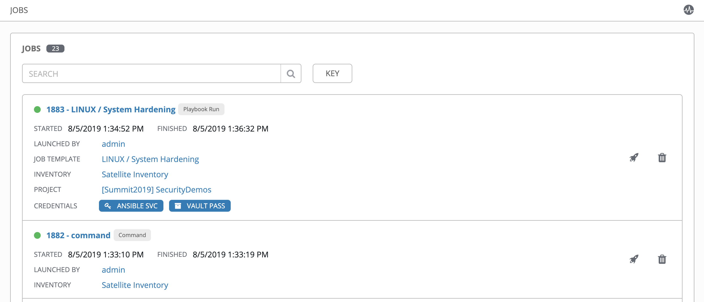
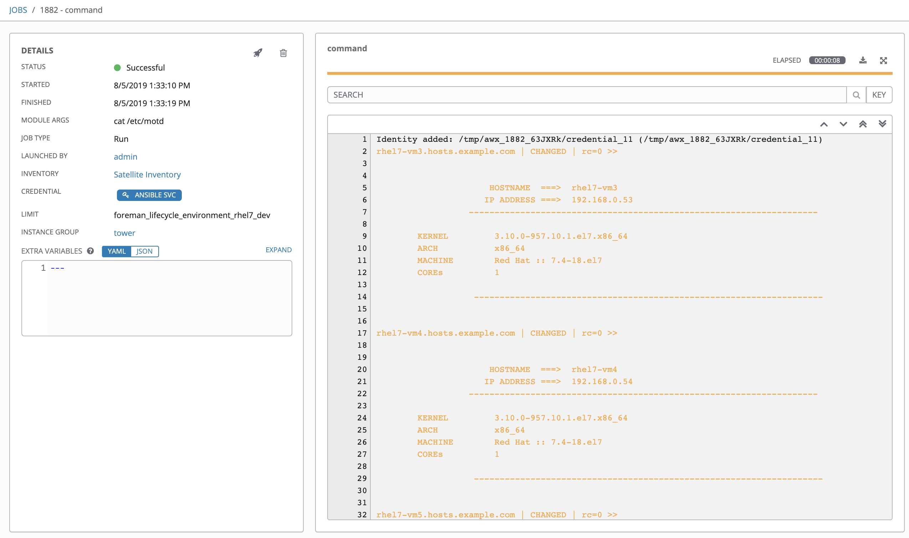

= Lab 3: Configuration Management for Security
:icons: font

=== Goal of Lab 3
The goal of this lab is to perform additional security hardening and configuration management tasks on our host systems.

Specifically, in this lab exercise, we will configure the following on our host systems, in an automated fashion, to ensure that we are are practicing general security hardening best practices:

* Deploy login banner
* Configure account password complexity
* Enable SELinux
* Harden SSH

=== Lab 3.1 Viewing Host Systems Before Automated Additional Security Hardening

. Let's take a look at our host systems before doing additional hardening on them. Note that the additional automated security hardening will be executed on 3 RHEL 7 hosts that are part of the foreman_lifecycle_environment_rhel7_dev group: +
*rhel7-vm3.hosts.example.com* +
*rhel7-vm4.hosts.example.com* +
*rhel7-vm5.hosts.example.com* +

. Login to Ansible Tower (https://tower-GUID.rhpds.opentlc.com) log in with *admin* as the user name and *r3dh4t1!* as the password (if not already logged in).

. Navigate to *Inventories* and click on the *Satellite Inventory*.
+
image:images/lab3/1-inventories.png[400,400]

. Next, click on *GROUPS* and click the check box for *foreman_lifecycle_environment_rhel7_dev* then click the *Run Command* button to the top right. This will allow us to run an ad-hoc command against the hosts in the group.
+

. Select the appropriate parameters for the ad-hoc command. 
.. First, choose `command` from the module dropdown list. This selects the Ansible module we will run. 
.. Next, provide the parameters for the the `command` module. To check the contents of MOTD, enter `cat /etc/motd` into *Arguments*.
.. Notice the group *foreman_lifecycle_environment_rhel7_dev* has already been filled in for you. 
.. We need credentials to login to the systems. Click the magnifying glass next to *Machine Credentials* and choose *ANSIBLE SVC*.
.. Finally, check *Enable Privilege Escalation* to indicate that we will elevate our permissions to run our command once Ansible has logged in.
.. Click *Launch* to run the command. 
+

. As you will see in the log, the motd is empty. Also, to left of the log output, the date, time, credentials, command, etc. are all logged in Ansible Tower. These logs are stored in the database and reviewed later or forwarded to a log aggregator. 
+

=== Lab 3.2 Automated Security Hardening of Host Systems

. On Ansible Tower (https://tower-GUID.rhpds.opentlc.com) log in with *admin* as the user name and *r3dh4t1!* as the password (if not already logged in). Don't forget to replace the *GUID* with your provided *GUID*.

. Navigate to *Templates* and click the *rocket ship* next to the job template named *LINUX / System Hardening*.
+
image:images/lab3/5-templates.png[100,100]
image:images/lab3/6-hardening.png[2000,2000]

. You will be prompted for the hosts that you would like to run this job template on. Enter **rhel7_dev* into the text field. We will target our dev host systems first. Click *Next* followed by *Launch* to begin the job.
+
image:images/lab3/7-select_hosts.png[500,500]
image:images/lab3/8-launch.png[500,500]

. While the job runs, lets review the Ansible playbook being executed.

[source,yaml]
----
---
- hosts: "{{ HOSTS }}" # <1> 
  vars: # <2>
    ssh_banner: true
    sftp_enabled: true
    ssh_print_motd: true
    account_password: !vault | # <3>
          $ANSIBLE_VAULT;1.1;AES256
          37336563333938313333393861346464323461663565303937333732316666613037363130643233
          3339663739653831313361636263396537356366623862650a626162613531383539636633643436
          65643164613663393237393130646436626561323231643338343863353162306263303661356161
          6438393537646364380a363164383966353262326639323563346661653232643132633033333164
          35373633656365353836303338613136643137633632326431303637636536613737353164656530
          61626530626431653532333361383461303637316266306436333262313163346365353936623661
          66643563303039306236353939343163306138663230633335366465333830613561336237663932
          63336166363537306261623331653433393639646237386464336339346566643966636236623633
          64373365356261646139373561363061326131333637303037623831333131636262

  pre_tasks:
  - name: Set ansible user password # <4>
    user:
      name: ansible
      group: ansible
      password: "{{ account_password }}"

  roles: # <5>
  - motd-splash # <6>
  - hardening # <7>
  - dev-sec.ssh-hardening # <8>

  tasks:
  - name: Link SSH Banner # <9>
    file:
      path: /etc/ssh/banner.txt
      src: /etc/issue
      state: link
----
<1> The host selector determines what group from inventory will be run against. Since we passed in the variable `*rhel7_dev` through the survey, Ansible will target the hosts from the `foreman_lifecycle_environment_rhel7_dev` group.
<2> Variables can be defined in a playbook. Here, we are specifying variables to override the defaults from the Ansible Roles used later in the playbook
<3> Values can be encrypted using https://docs.ansible.com/ansible/latest/user_guide/vault.html[Ansible Vault]. This allows us to securely store sensitive data in our playbooks or other files. The key to decrypt the variable is stored securely in Ansible Tower. 
<4> The https://docs.ansible.com/ansible/latest/modules/user_module.html[user module] sets the password for the `ansible` user. This apply before the rest of the playbook because our hardening will restrict accounts without passwords.
<5> https://docs.ansible.com/ansible/latest/user_guide/playbooks_reuse_roles.html[Ansible Roles] are ways of automatically loading certain vars_files, tasks, and handlers based on a known file structure. Grouping content by roles also allows easy sharing of roles with other users.
<6> This role configures the MOTD across multiple different operating systems. View the code https://github.com/RedHatDemos/SecurityDemos/tree/master/2019Labs/ProactiveSecurityCompliance/Ansible/patching-playbooks/roles/motd-splash[here].
<7> This role contains our standard security harding settings, specifically SE Linux and password complexity. View the code https://github.com/RedHatDemos/SecurityDemos/tree/master/2019Labs/ProactiveSecurityCompliance/Ansible/patching-playbooks/roles/hardening[here].
<8> This role comes from https://galaxy.ansible.com[Ansible Galaxy], a community site for sharing and distributing roles. It will harden the ssh server and client on our nodes. See more on https://galaxy.ansible.com/dev-sec/ssh-hardening[Galaxy].
<9> Especially when using roles, the configuration might not match exactly what we need in our environment. We can automate away these differences in our playbook. Using the https://docs.ansible.com/ansible/latest/modules/file_module.html[file module], we link `/etc/ssh/banner.txt` (configured by the `ssh-hardening` role) to `/etc/issue` (configured by the `motd-splash` role)

. Navigate back to *Jobs* and click on the *LINUX / System Hardening* job.
+
image:images/lab3/9-jobs_hardening.png[500,500]

. Take a look at the Ansible Tower log output as the configuration is checked and remediated on our host systems. Specifically, notice that several tasks are being executed on our host systems such as various SSH hardening tasks, enabling SELinux, deploying a login banner, and configuring account password complexity.  At the end we will see a *Play Recap* showing us how many changes were made on the systems.
+
image:images/lab3/10-job_log.png[1500,1500]
+
NOTE: Because Ansible is idempotent, after 1 run of a playbook to set things to a desired state, further runs of the same playbook will result in 0 changes. As a result, this playbook will check to make sure the client is installed and configured, but if there are no changes to be made, Ansible will skip over the task and verify that the systems are in the correct state. Ansible works to achieve an endstate defined in the playbook so if this playbook is run routinely, it will only make the changes needed to comply with your security hardening standard.

=== Lab 3.3 Viewing Host Systems After Automated Additional Security Hardening

. Let's take a look at our host systems again now that we have applied additional automated security hardening on them. Again, remember that the additional automated security hardening was executed on 3 RHEL 7 hosts that are part of the foreman_lifecycle_environment_rhel7_dev group: *rhel7-vm3.hosts.example.com, rhel7-vm4.hosts.example.com, and rhel7-vm5.hosts.example.com*.

. Using an ad-hoc command again, we will check the contents of `/etc/motd`. Go to *Jobs* and find the most recent job named *command* before the System Hardening job. Click the rocket ship next to the *command* job to rerun with the same parameters as before.
+

.  A new job will be created at the top of the list, click the name of this job to view the log. You will notice that now it shows us the content of MOTD after our playbook configured the systems. You can click on the tasks in the log for more detailed debug output.
+

<<top>>

link:README.adoc#agenda[ Table of Contents ] | link:lab4.adoc[Lab 4: Automation with Predictive Analytics]
