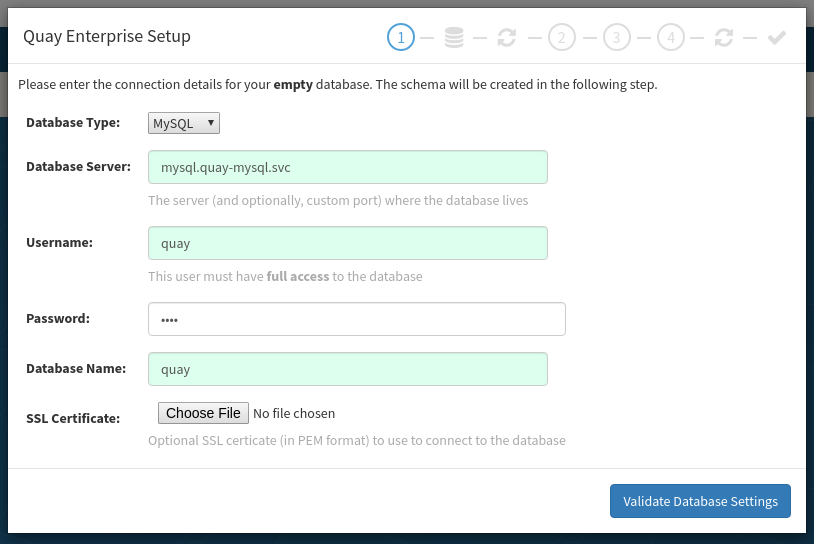
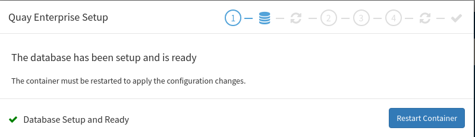
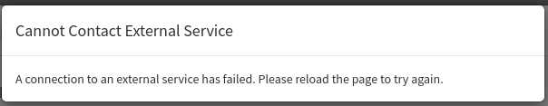
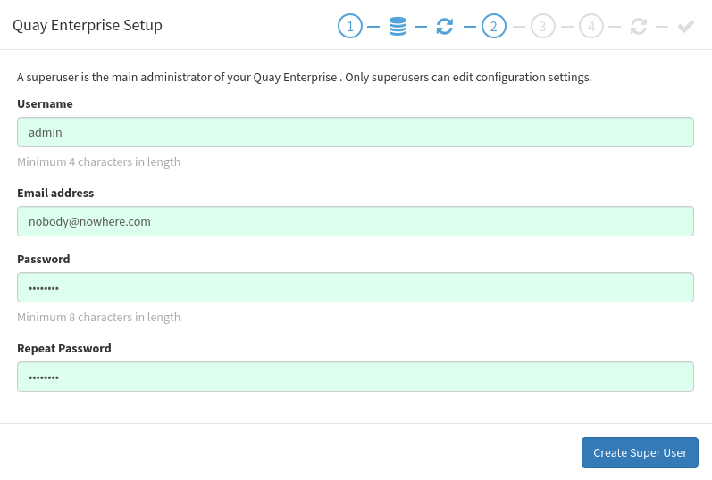
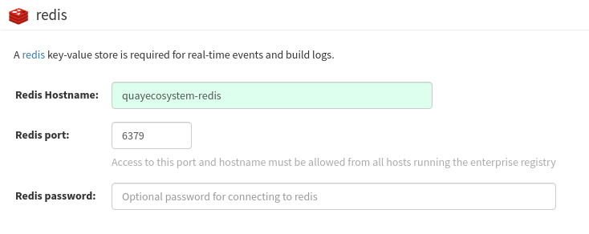
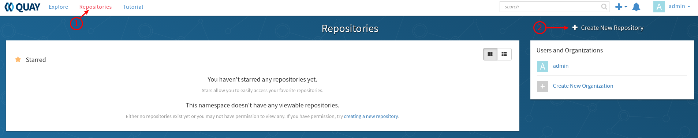
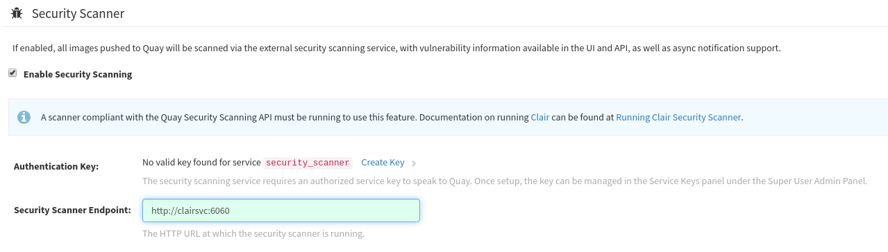
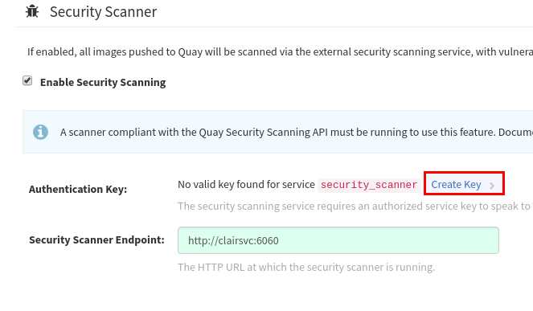
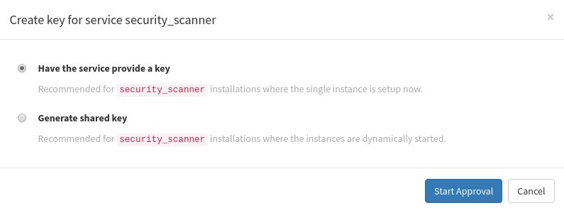

== Lab 7: Instructor Preparation (Quay/Clair pre-lab configuration)

link:README.adoc#table-of-contents[ Table of Contents ] 

=== Quay Configuration

. Login to the quay console from a web browser:
+
      http://quayecosystem-quay-quay-enterprise.apps.{GUID}.example.opentlc.com
+
. Set the database type from the pull down to `mysql`.  Set the database server to `mysql.quay-mysql.svc`, username, password and database name should be set to `quay`
+

+
. Click the `Validate Database Settings` button. If the page times out refresh it. Otherwise press the `Restart Container` button
+

+
. You will get the `Cannot Contact External Service` dialog, refresh until the setup screen comes back
+

+
. Enter the admin user information.  username: admin, email: nobody@nowhere.com, password: admin123
+

+
. Click `Create Superuser`. If the dialog times out (`Could not create superuser`), refresh the browser window
+
. Click the `Sign in` button and sign in with the credentials created above
+
. Scroll down to the redis configuration and set the hostname to `quayecosystem-redis`, click `Save Configuration Changes`
+

+
. If the window times out, refresh it. Press the `Save Configuration` button. Refresh the screen if it times out.
+
. Click the `Restart Container` button when prompted.
+
. Click the `View Superuser Panel` button. Refresh the page if you get the `Application is not available` page
+
. Click the `Repositories` link in the upper left menu, then click the `Create New Repository` link on the right
+

+
. Set the name to `ecommerce` and select public. Press the `Create Public Repository` button
+
. Click the `Admin` drop down menu in the upper right and select `Super User Admin Panel`
+
. Go to the settings options by clicking the gear icon in the lower left corner
+
. Scroll down the `Security Scanner` section and click the `Enable Security Scanning` option. Enter `http://clairsvc:6060` into the `Security Scanner Endpoint` field
+

+
. Scale down then scale back up the clair pod:
 
       oc login -u admin https://master.{GUID}.example.opentlc.com
       oc scale rc/clair --replicas=0 -n quay-enterprise  
       # Wait for the pod to scale down, then scale it back up
       oc get pods -n quay-enterprise 
       oc scale rc/clair --replicas=1 -n quay-enterprise

. Go back to the `Security Scanner` configuration in quay, and click the `Create Key` link next to `Authentication Key`
+

+
. Click the `Have the service provide a key` option and press the `Start Approval` button.
+

+
. Wait for the message `A key for service security_scanner has been automatically generated, approved and saved in the service's keystore.` If it does not pop up within a minute, restart the clair pod as described above and continue waiting.
+
. Click the `Save Configuration Changes` button, then click the `Save Configuration` button. Refresh the browser if it times out
+
. Verify the `Security Scanner Endpoint` is still properly set in the settings, if not, set it again.
+
. Kill the quay pod so that the configuration changes can take effect
+
      oc delete pod $(oc get pods -n quay-enterprise | grep quayecosystem-quay | awk '{print $1}') -n quay-enterprise
+
. Press ctrl+c if the previous command hangs. 
+
. Wait for the quay pod to start back up:
+
      oc get pods -n quay-enterprise -w
+
. Refresh the quay ui to verify it is back