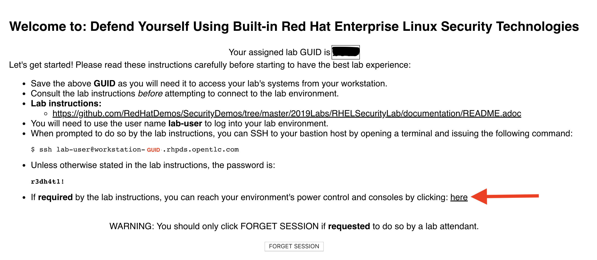

== Lab 0: Setup steps

=== Accessing your dedicated lab environment using your provided GUID
. From your laptop, navigate to the https://www.opentlc.com/gg/gg.cgi?profile=generic_na_jmentzel[*Lab GUID Assignment page*^]. Firefox with plugins disabled recommended.
From this page, you will be assigned your unique GUID, which you will use to access your unique lab environment and systems.

. Select the proper *Lab Code*. Select *SECURITYMA2 - Defend Yourself with RHEL Security Technologies* from the drop down list.

. Enter the *Activation Key*, which is *security*.

. The resulting *Lab GUID Assignment page* will display your lab's GUID and other useful information about your lab environment. Take note of your assigned GUID. You will use this GUID to access your lab's environment and systems.  Your unique GUID will also be embedded in your lab environment's host names. From this *Lab GUID Assignment page*, you will also be able to access your unique lab environment's power control and consoles.
+

link:README.adoc#table-of-contents[ Table of Contents ] | link:lab1_OpenSCAP.adoc[Lab 1: OpenSCAP]
