:toc2:
:linkattrs:

= Lab 8: Single-Sign-on Environment Creation for Linux Servers Using Identity Management in Red Hat Enterprise Linux

.*Lab Length*
* Medium/Average (~15-20 mins)

.*Goal*
* Create a single-sign-on (SSO) environment for all of your Linux^(R)^ servers to manage users, hosts, and sudo commands from a central console

.*Objectives*
* Create users on the IdM server and exercise SSO
* Create user groups and assign users to those groups
* Create host groups and assign hosts to those groups
* Create sudo command groups that allow escalated privileges
* Integrate user, host, and sudo command groups into a policy

== 8.1: Introduction

In this lab, you will manage user identities and policies using Identity Management in Red Hat^(R)^ Enterprise Linux (IdM) server. This lab environment already has an IdM server and two clients installed, and the lab focuses on managing clients.

You will use the GUI interface available on your IdM server, and will log into the clients using *ssh* on a terminal.

The IdM server is a 389-based server that is configured to manage users, hosts, and sudo commands. It is Kerberos-based and can operate as a standalone directory server or integrate with any LDAP-compliant directory servers such as Microsoft Active Directory. IdM can also be configured to manage DNS for your Linux environment and provide for dynamic DNS updates.

The lab environment was configured using link:https://github.com/freeipa/ansible-freeipa[ansible-freeipa^]. Since the lab already provides DNS, you do not need dynamic DNS updates enabled. Also, server and clients were configured to create a user home directory upon first login.

== 8.2: Attaching the Clients to the IdM Realm

=== 8.2.1: Accessing the IdM Web Interface

. Following the istructions on *Lab 0: Setup Steps*, section 0.2, open the graphical user interface on the IdM server.

. Open the Firefox web browser (under *Applications*) and navigate to link:http://idm1.example.com/ipa/ui/[http://idm1.example.com/ipa/ui^]. IdM will redirect you to the Red Hat^(R)^ Identity Management web interface:
+
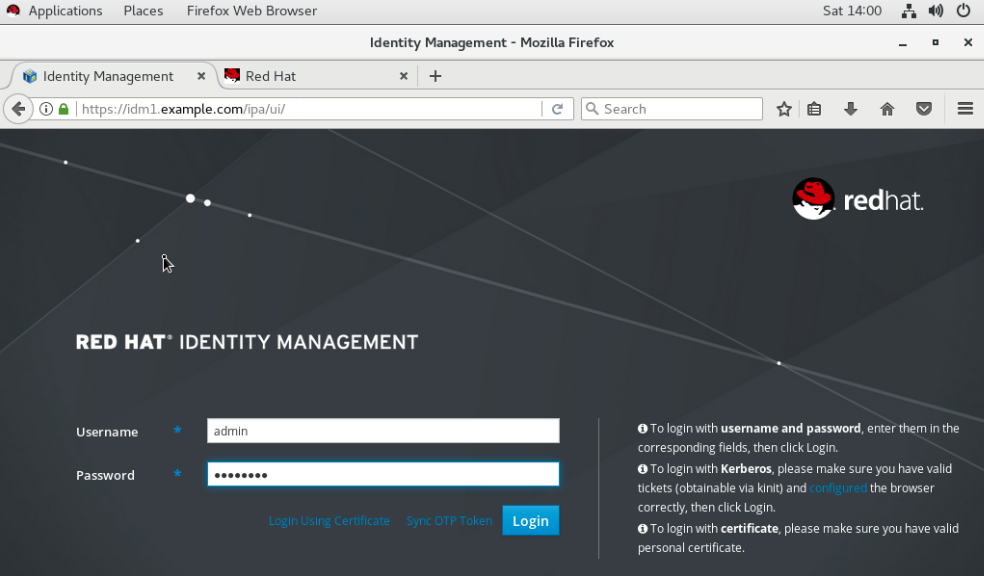
+
This is the UI for the IdM server.

. Log in as *admin* with *r3dh4t1!* as the password, and examine the interface.
+
You'll revisit this IdM server GUI later in this exercise.

=== 8.2.2: Verifying Enrollment of Client Systems

In the web interface, navigate to the *Identity* -> *Hosts* tab.
+
Note that both of your client systems, *idm2.example.com* and *idm3.example.com* (in addition to the IdM server, *idm1.example.com*) display as *Enrolled*:
+
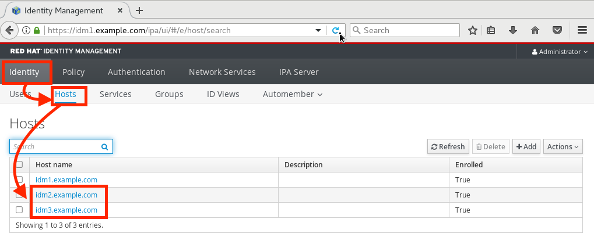

== 8.3: Configuring a Simple User

In this section, you create a user and exercise SSO.

. Open the Firefox web browser and navigate to link:http://idm1.example.com/ipa/ui/[http://idm1.example.com/ipa/ui^] (if you are not already there).

. Navigate to the *Identity* -> *Users* tab and click *+Add*:
+
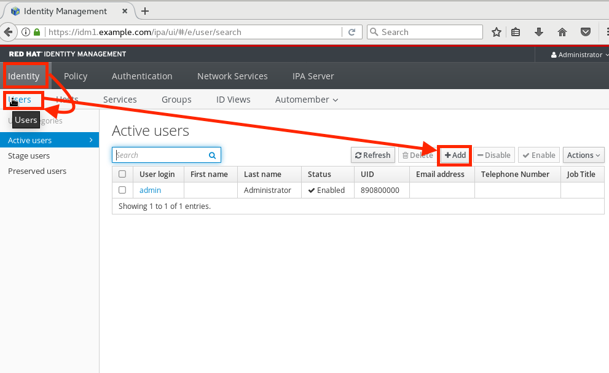

. Complete the form with the following information:

* *User login*: *user1*
* *First name*: *User*
* *Last name*: *One*
* *New Password*: *password* (initial password that must be changed on first logon)
* *Verify Password*: *password*
+
image:images/idm-03-user1.png[500,500]
+
You do not need to fill in the other items on this form (such as *Class* and *GID*).

. When you finish completing the form, click *Add*:
+
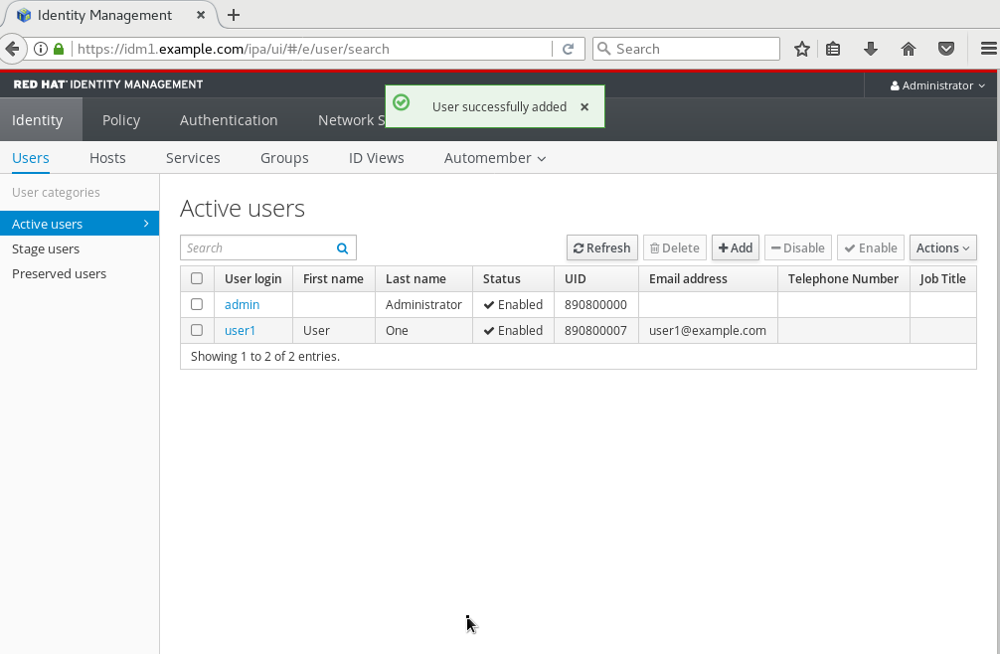

. Navigate to the *Policy* -> *Host-Based-Access Control* -> *HBAC Rules* tab:
+
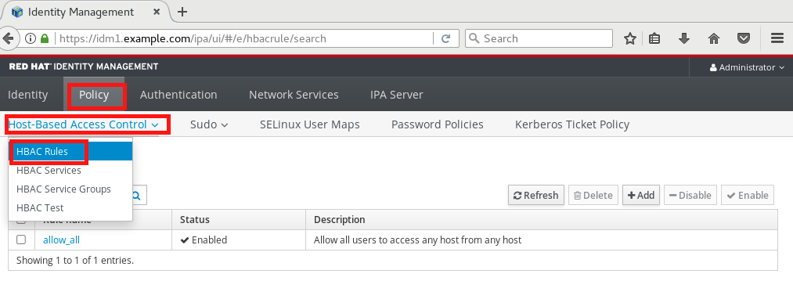
+
[NOTE]
====
The default *allow_all* policy allows access to all users and all hosts. This is something that you delete shortly, but is useful for testing for now.
====

. Start a `Terminal` application and execute the command `kinit user1`, providing *passwords* as your password.

. When prompted, change your initial password to any new password that you can easily remember.
+
A home directory is automatically created for *user1*.

. From the command line, verify that this local *user1* account does not exist in `/etc/passwd`:
+
----
[user1@idm2 ~]$ grep user1 /etc/passwd
[user1@idm2 ~]$ exit
----
+
This is because IdM caches credentials locally in the System Security Services Daemon (SSSD).

== 8.4: Controlling User-Based Access

In this section, you allow and then restrict access to hosts by specific users.

. Open the Firefox web browser and navigate to link:http://idm1.example.com/ipa/ui/[http://idm1.example.com/ipa/ui^] (if you are not already there).

. Navigate to the *Policy* -> *Host-Based-Access-Control* -> *HBAC Rules* tab.

. For the HBAC rule name, select *allow_all* and click *Disable* on the right, then click *Ok*:
+
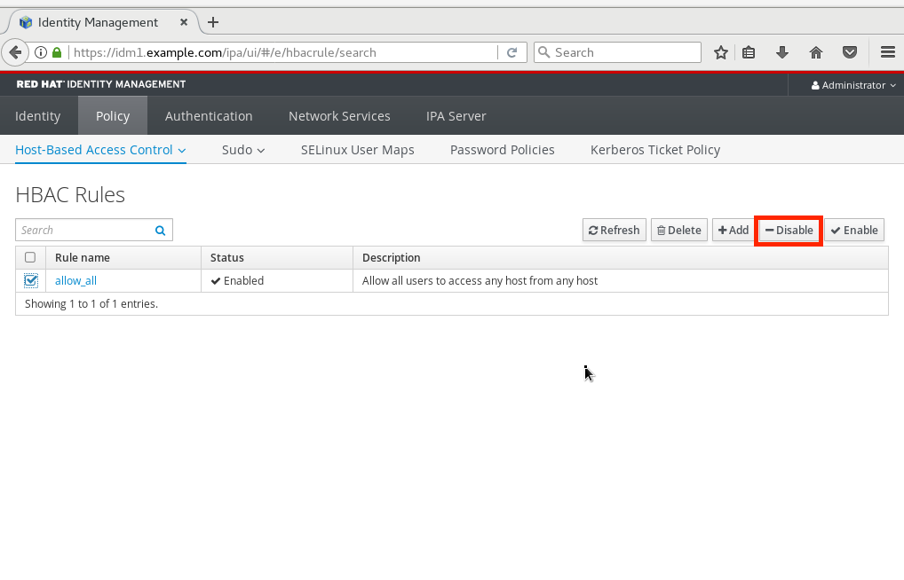
+
The Kerberos ticket that you are currently holding may continue to allow and disallow access to a resource after you make a change to a resource on the IdM server. As a result, you must clear the cache for *IdM2* and *IdM3*.
+
While there are ways to configure the cache for your specific needs, a quick way to clear the SSSD cache is as the *root* user. After clearing the cache, you can no longer log in.

. Stop the SSSD service, clear the cache, and restart the service on *IdM2* as the *root* user--logging back in to *IdM2* as *root* if necessary (using the password *r3dh4t1!*):
+
----
[root@idm2 ~]$ systemctl stop sssd.service
[root@idm2 ~]$ sss_cache -E
[root@idm2 ~]$ systemctl start sssd.service
----

. Clear the cache for *IdM3* as well by repeating the previous step on *IdM3*.

. On the right, click *+Add* to create a new rule that allows you access to a specific server, using any name you want for the rule--for example, *my_hbac_rule*.

. Click *Add and Edit* to create and edit your rule:
+
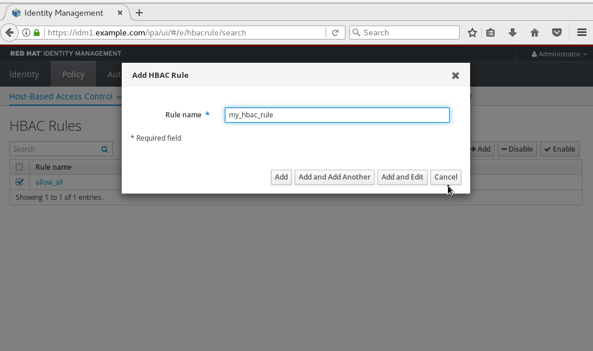

. Under *Who*, click *+Add* on the far right in the *Users* section, then click *Add*:
+
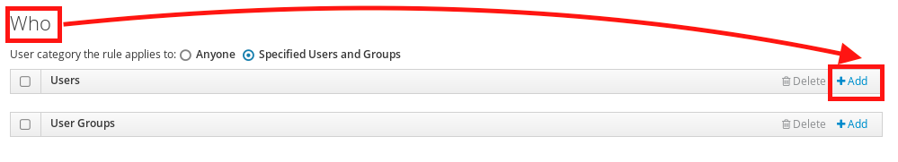

. Select *user1* and click the *>* button to move *user1* from the *Available Users* section to the *Prospective Users* section to add the user to the policy:
+
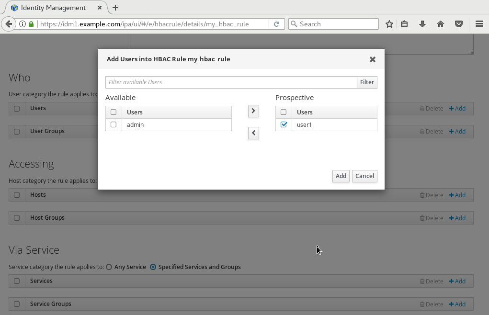

. Under *Accessing*, click *+Add* at the far right:
+
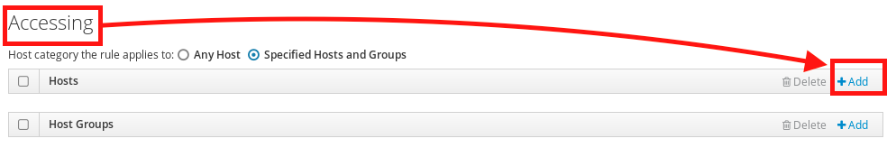

. Select *idm2.example.com* and click the *>* button to move *idm2.example.com* from the *Available Hosts* section to the *Prospective Hosts* section, then click *Add* to add it to the policy:
+
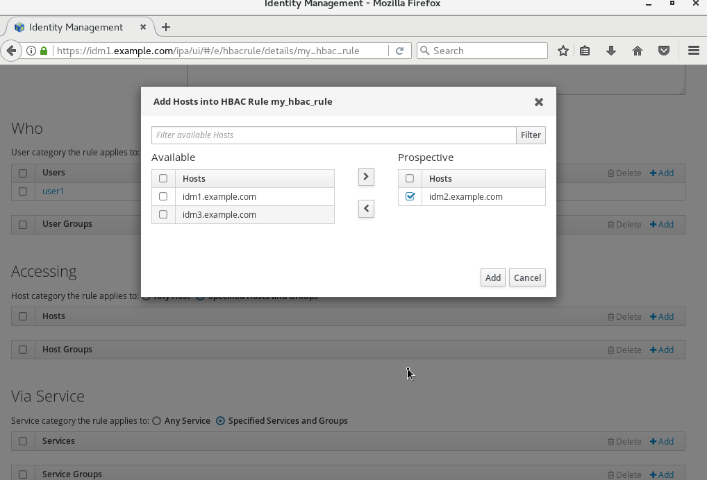

. Under *Via Service*, click *+Add* at the far right:
+
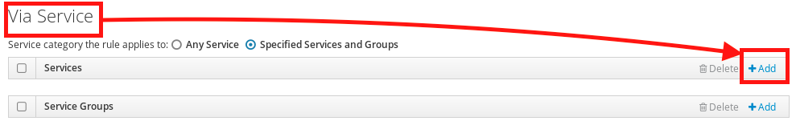

. Select *login* and *sshd* and click the *>* button to move them from the *Available HBAC Services* section to the *Prospective HBAC Services* section, then click *Add* to add them to the policy:

+
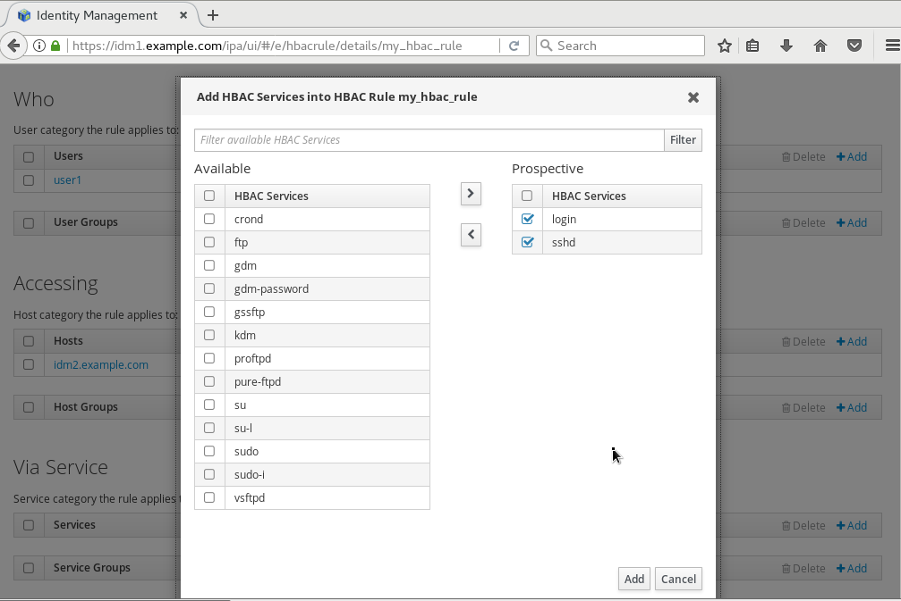

. Attempt to log in to the *IdM2* server as *user1* with the password that you set previously.
+
Expect to be able to successfully log in as *user1* on *IdM2* because the policy that you just created allows both login and SSH for *user1* on *idm2.example.com*.

. Attempt to log in to the *IdM3* server as *user1* with the password that you set previously.
+
Expect to be restricted from logging in to *IdM3* with a *Permission denied* error because this server is not in the policy that you created previously.

. Log in to *IdM2* from the console as *root* with password *r3dh4t1!*, and execute the following commands to clear the cache:
+
----
[root@idm2 ~]$ systemctl stop sssd.service
[root@idm2 ~]$ sss_cache -E
[root@idm2 ~]$ systemctl start sssd.service
----

.  Navigate to the *Policy* -> *Host-Based Access Control* -> *HBAC Rules* tab, select *my_hbac_rule* and click *Disable* on the far right to disable the policy:
+
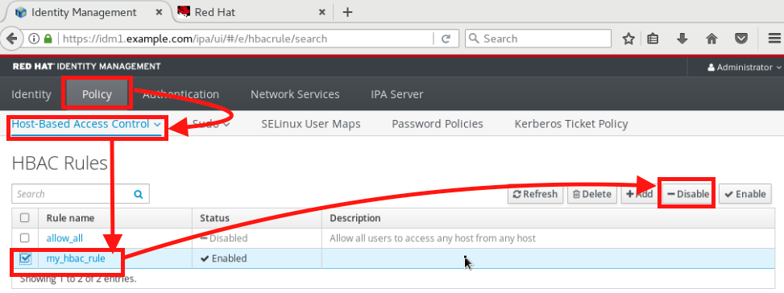+
+
The system is ready for the next section.

== 8.5: (Optional) Controlling User Group-Based Access

In this section, you restrict access to hosts by user group.

. Open the Firefox web browser and navigate to link:http://idm1.example.com/ipa/ui/[http://idm1.example.com/ipa/ui^] (if you are not already there).

. Navigate to the *Identity* -> *Groups* tab, select *User Groups* on the left under *Group categories*, and click *+Add* to add a group:
+
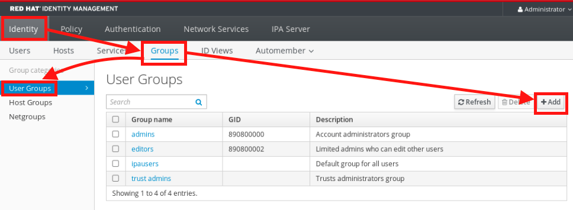

. Provide a user group name (for example, *my_user_group*), then click *Add and Edit*:
+
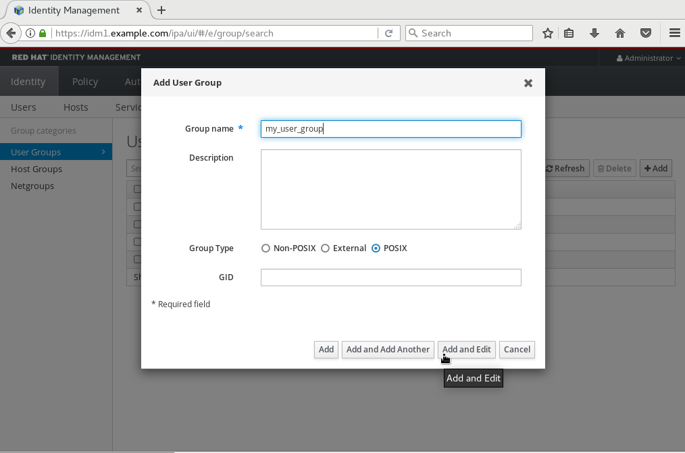

. Click *+Add* to add a user to your user group:
+
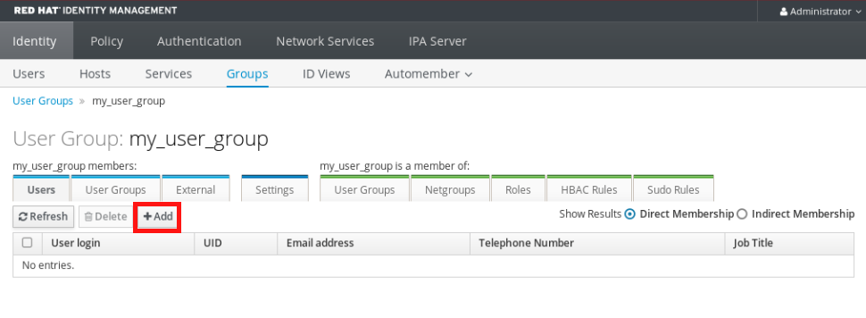

. Select *user1* and click the *>* button to move it from the *Available User login* section to the *Prospective User login* section, then click *Add* it to your user group:
+
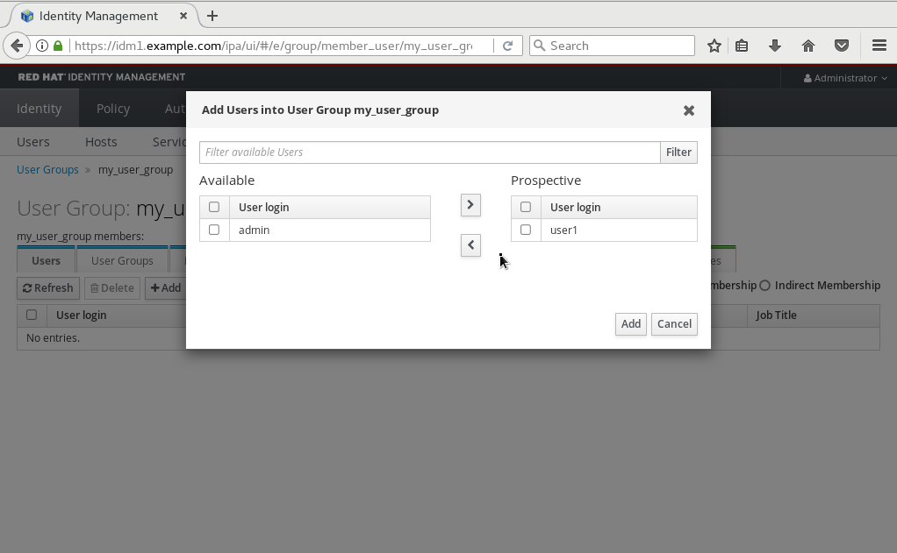

. Navigate to the *Identity* -> *Groups* -> *Host Groups* tab and click *+Add*:
+
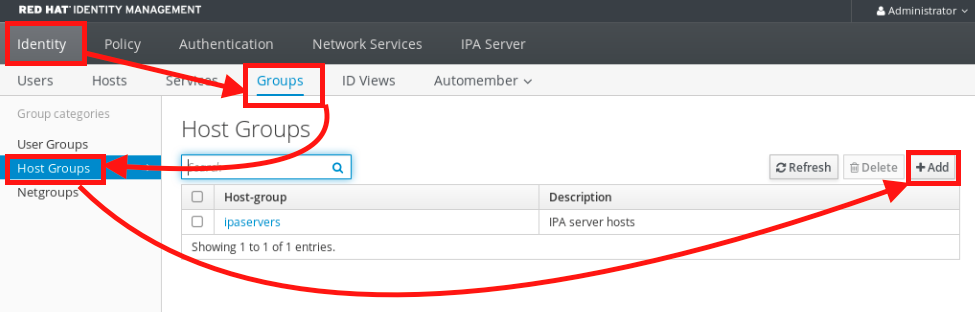

. Enter a host group name (for example, *my_host_group*) and click *Add and Edit button*:
+
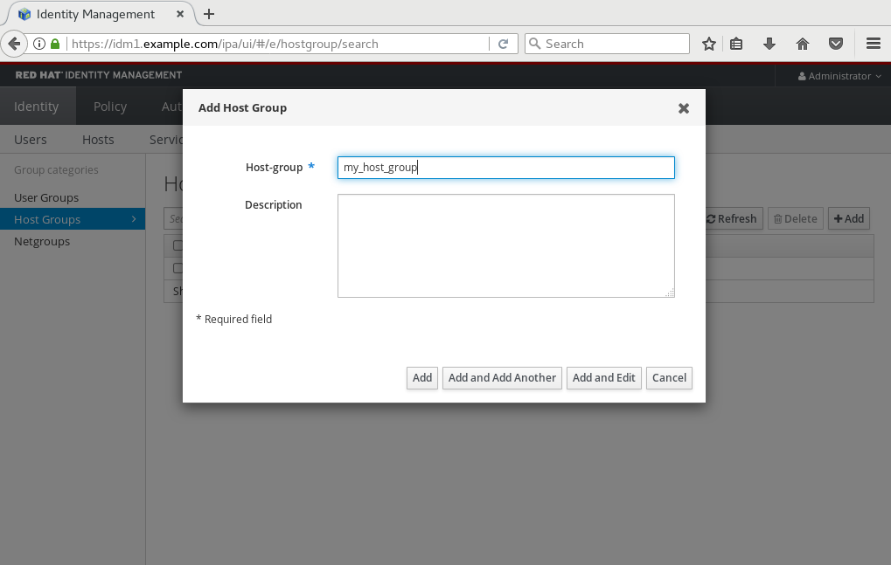

. Click *+Add* on the *Host Group* page:
+
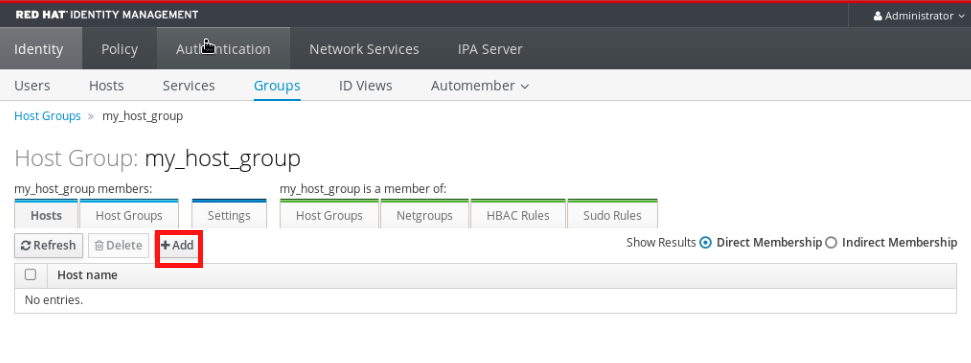

. Select *idm3.example.com* and click the *>* button to move it from the *Available Host name* section to the *Prospective Host name* section, then click *Add* to add this host into your host group:
+
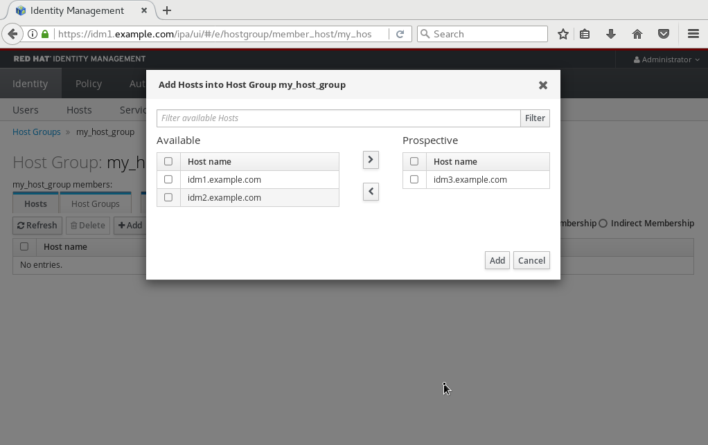

. Navigate to the *Policy -> Host-Based-Access-Control -> HBAC Rules* tab and click *+Add*:
+
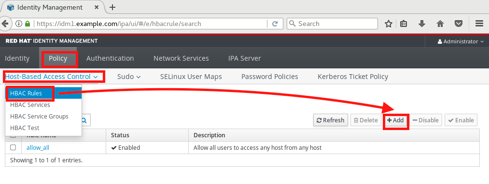

. Give the new HBAC rule a name (for example, *my_group_hbac*), then click *Add and Edit*:

+
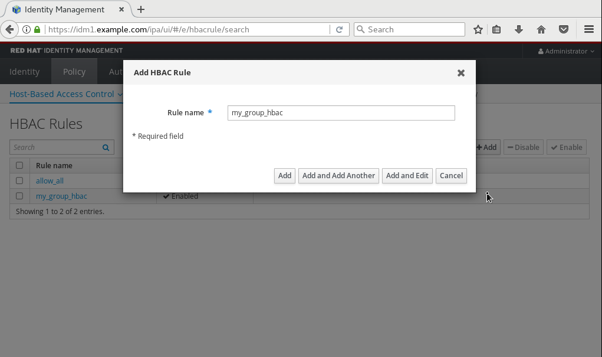

. Under the *Who* section, select your user group, click *+Add*, then move your user group from the *Available User Groups* section into the *Prospective User Groups* section and click *Add*:
+
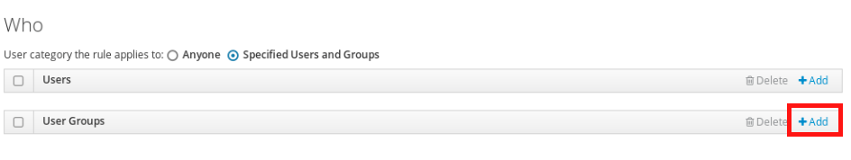
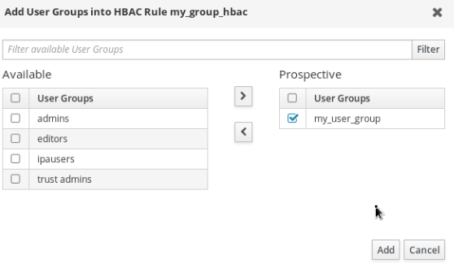

. Under the *Accessing* section, select your host group, click *+Add*, then move your host group from the *Available Host Groups* section to the *Prospective Host Groups* section and click *Add*:
+
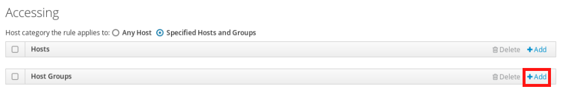
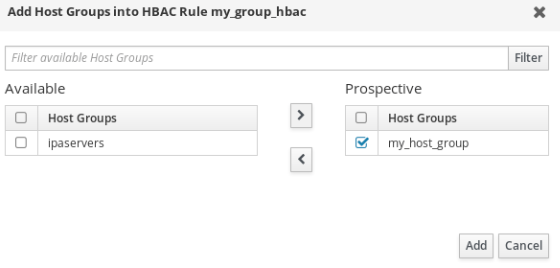

. Under the *Via Service* section, click *+Add* next to *Services*, then select *login* and *sshd* under *Available HBAC Services* and move them to *Prospective HBAC Services*:
+
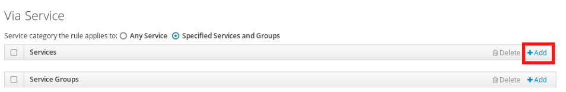
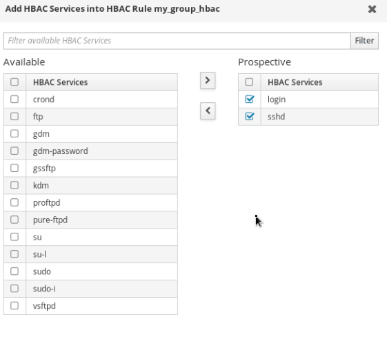

. Open a terminal and try to loging with `ssh` into *idm3.example.com* as *user1*:
---
[root@idm2 ~]$ ssh user1@idm3.example.com
---
+
Expect to be able to log in to this server because it is specified in the your group HBAC policy that you created in this section.

. Logut (e.g. `CTRL+d`) from *idm3*.

. Try to login with `ssh` into *idm3.example.com* as *user1*:
---
[root@idm2 ~]$ ssh user1@idm3.example.com
---
+
Expect to be restricted from logging in to *IdM2* with an error because *IdM2* is not in your group HBAC policy that you created in this exercise.

. Do not disable the policy because you are going to add to it in the next step.

== 8.6: (Optional) Creating `sudo` Command Groups

Grouping users and hosts allows you to move users into and out of groups, thereby inheriting and disinheriting access. In this section, where you create sudo command groups, you witness the clear advantage of using this method.

Rather than creating service accounts with shared passwords for a group of administrators, you can do the following:

* Add a user to a user group
* That user inherits access to a specific group of hosts
* That user also inherits escalated privileges required to perform their role on those hosts
* That user’s activity is logged centrally

This section expands on the previous section by adding a sudo command group to the existing policy.  Therefore, in addition to having access to specific hosts, the users in the group are also granted escalated privileges. To simplify the lab, you create a sudo command group with one command in it--the ability to execute `yum`.

. Before adding this to the policy, log in to a server that your user (*user1*) has access to (*IdM3*) from the previous step to verify that you do not have access to escalate and run `yum`:
+
----
[user1@idm3 ~]# sudo yum update
----
+
Use the password that you set earlier for this user.

. Even though you type in the password that you set for *user1*, you get a *Sorry, try again* error. After three attempts, you are prevented from trying further.

.  Open the Firefox web browser and navigate to link:http://idm1.example.com/ipa/ui/[http://idm1.example.com/ipa/ui^] (if you are not already there).

. Navigate to the *Policy -> Sudo* tab and select *Sudo Commands*:
+
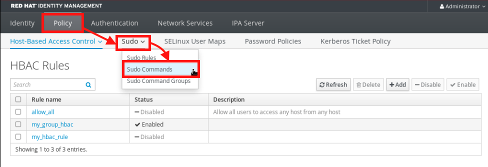

. On the far right, click *+Add* to add a command:
+
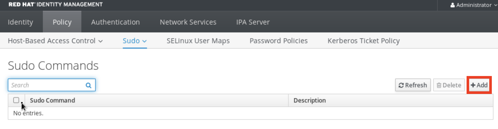

. For the sudo command, enter */usr/bin/yum*, then click *Add and Edit*:
+
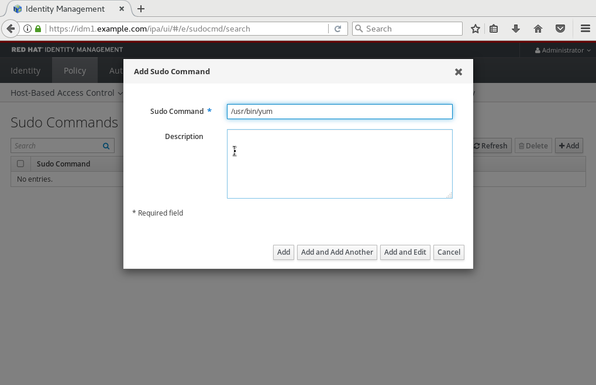

. From the *Sudo* menu, select *Sudo Command Groups* and click *+Add* at the far right to create a group:
+
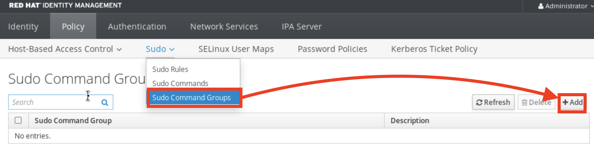

. Create a new group by providing a *Sudo Command Group* name (for example, *my_sudo_group*), then click *Add and Edit*:
+
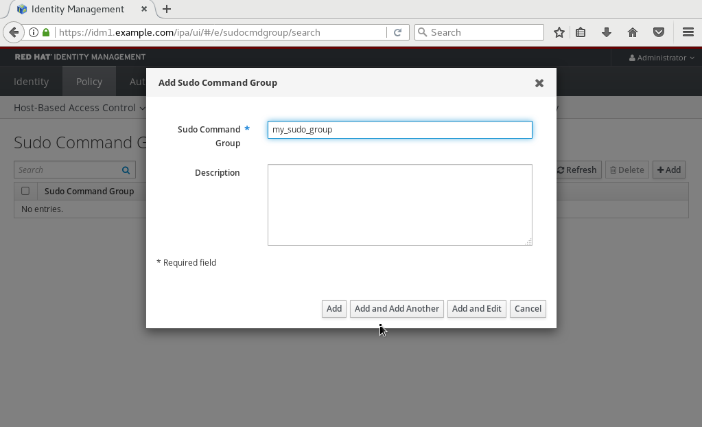

. Click *+Add* and add the `/usr/bin/yum` command from the previous step from the *Available Sudo Command* section to the *Prospective Sudo Command* section, then click *Add*:
+
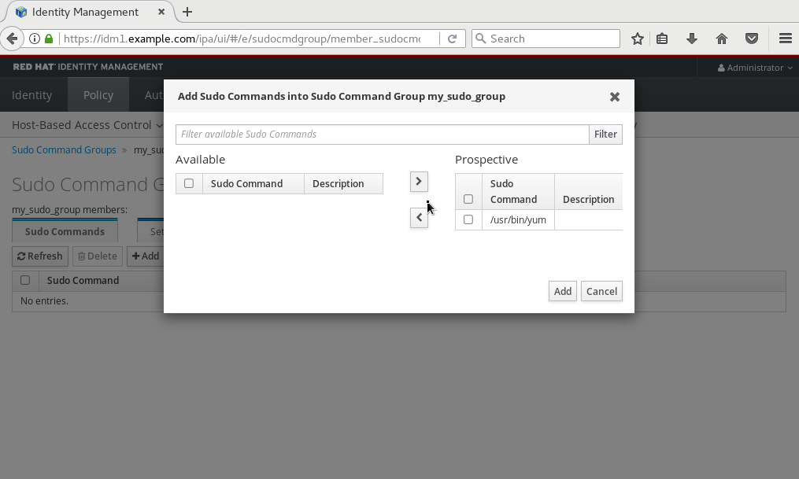

. Select *Sudo Rules* from the *Sudo* menu, then click *+Add* on the right to create a new rule:
+
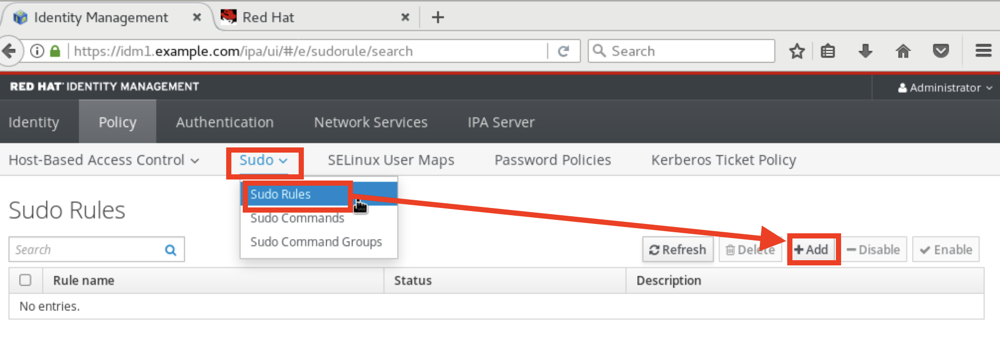

. Enter a sudo *Rule name* (for example, *my_sudo_rule*), then click *Add and Edit*:
+
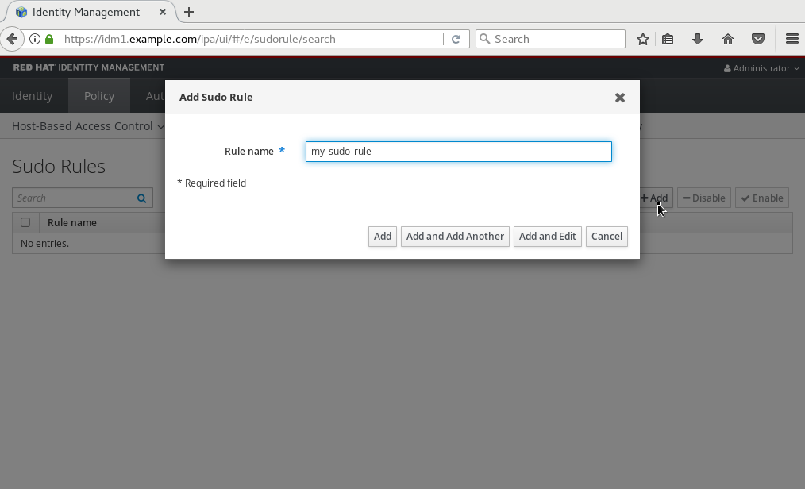

. In the *Who* section, add your user group under *User Groups*, then click *+Add*:
+
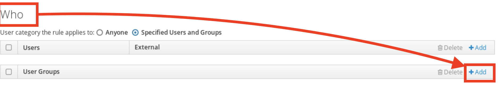

. From the list of *Available User Groups*, select *my_user_group* and click the *>* button to add it to the *Prospective User Groups*, then click *Add*:
+
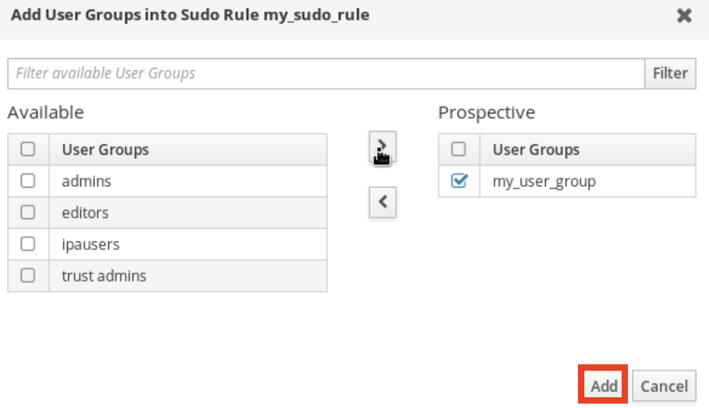

. Add your host group under *Access this host -> Host Groups*, then click *+Add*:
+
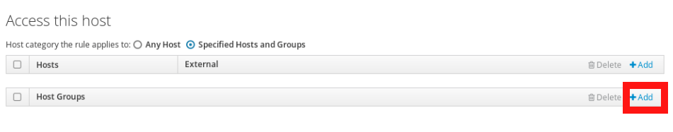
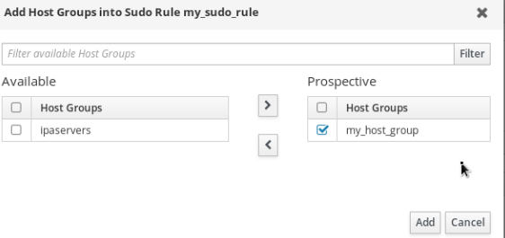

. In the *Run Commands* section, add your sudo group (*my_sudo_group* in this example) under *Sudo Allow Command Groups* and then click *+Add*:
+
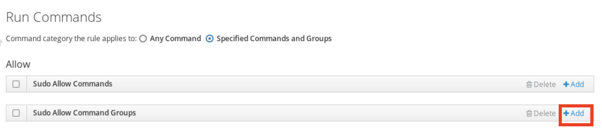
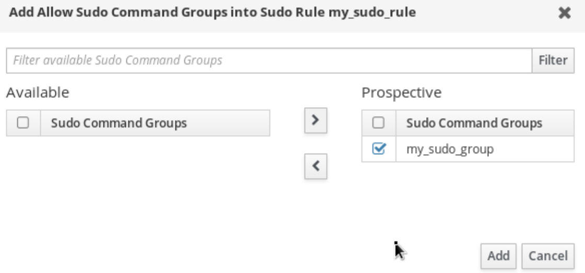

. Navigate to *Policy -> Host Based Access Control -> HBAC Rules*:
+
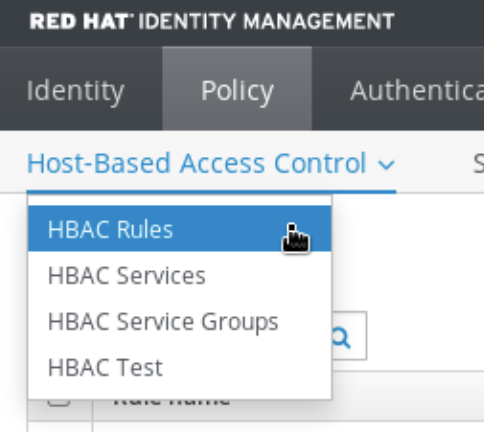

. Click the *my_group_hbac* rule that you created earlier:

. Navigate to *Via Service* and click *+Add* in the *Services* section.

. From the list of *Available* *HBAC Services*, select *sudo* and click the *>* button to add it to *Prospective* *HBAC Services*:
+

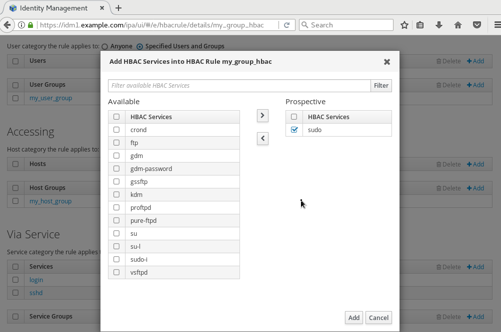
+
Expect to see *sudo* as a service in addition to *logon* and *SSHD*.

. Make sure that you are logged out as *user1* on *IdM3*, then log in again as *root* and clear the cache:
+
----
[root@idm2 ~]$ systemctl stop sssd.service
[root@idm2 ~]$ sss_cache -E
[root@idm2 ~]$ systemctl start sssd.service
----
+
The Kerberos ticket held by *user1* may not be updated with the change to the rules that you just made.

. Using the password for this user that you set earlier, log in again to the server that your user (*user1*) has access to (*IdM3*), and verify that you have access to escalate, by running `yum`:
+
----
[user1@idm3 ~]# sudo yum update
----
+
[NOTE]
====
You can simplify this by adding a user and a command rather than a user group and command group. However, this lab attempts to illustrate how you can group users, hosts, and sudo commands into one policy, which allows you to add and remove users that inherit and disinherit access, respectively.
====

<<top>>

link:README.adoc#table-of-contents[ Table of Contents^] | link:lab9_GPG.adoc[Lab 9: GNU Privacy Guard^]
