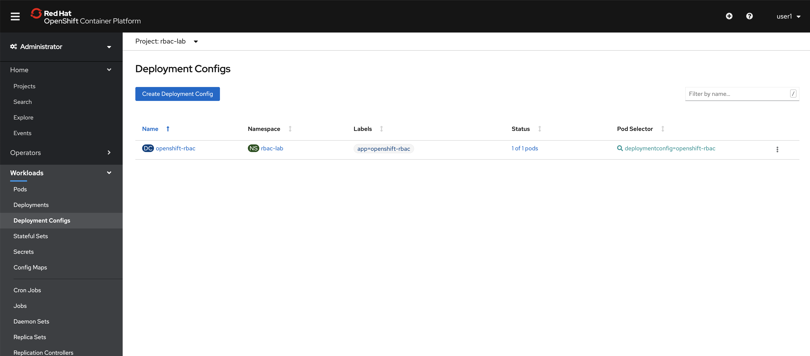
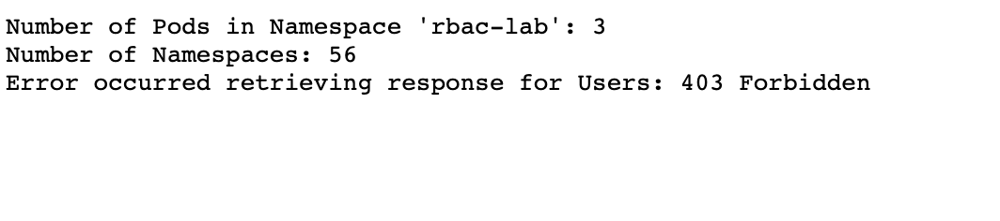

:USER_GUID: %GUID%
:USERNAME: %USERNAME%
:markup-in-source: verbatim,attributes,quotes
:show_solution: true
:sectnums: true
:toc: true

== Lab 3: OpenShift Role Based Access Control (RBAC)

=== Goal of Lab 3

The goal of this lab is to learn about the capabilities provided by OpenShift Role Based Access Control and how it can be used to access cluster based resources within an application.

=== Introduction

OpenShift, being a secure platform by default, has included support for authentication and authorization since the beginning of its Kubernetes lineage with version 3.0. Since that time, many of the features that were originally found in OpenShift have been upstreamed and are now part of Kubernetes itself. As part of this lab, you will learn the differences between authentication and authorization including how they are implemented within OpenShift along with how they can be configured. Finally, you will use an application running within the platform to extend your knowledge of authentication and authorization to configure custom policies for the application to access cluster based resources.

=== Authentication and Authorization in OpenShift

Within the context of security, two of the fundamental terms are Authentication and Authorization. Let's break down the differences and how they apply to OpenShift.

* Authentication - Verifying the identity of a user
* Authorization -  Verifying access to a resource

=== OpenShift Authentication

There are multiple forms that identifies a user in OpenShift including the following:

* Regular users - Typical individuals that access the cluster
* System users - For use by infrastructure related assets, such as _nodes_
* Service Accounts - Special system users that are associated with Projects/Namespaces. These users are typically used to run pods or access the cluster within external systems.

Multiple users can then be organized into *Groups* to better manage policies within the cluster.

Authentication against the OpenShift API is accomplished using one of the following methods:

* OAuth Access Tokens - Asset for communicating with the OpenShift API once authenticated.
* X.509 Client Certificates - Use of certificates to authenticate against the API

==== OpenShift OAuth Server and Identity Providers

OpenShift contains an included OAuth server for allowing users to obtain access tokens for communicating with the API. The OAuth server can integrate with a number of identity providers that stores information about users. Common examples are link:https://docs.openshift.com/container-platform/4.1/authentication/identity_providers/configuring-ldap-identity-provider.html#configuring-ldap-identity-provider[LDAP], link:https://docs.openshift.com/container-platform/4.1/authentication/identity_providers/configuring-htpasswd-identity-provider.html#configuring-htpasswd-identity-provider[HTPasswd] and link:https://docs.openshift.com/container-platform/4.1/authentication/identity_providers/configuring-oidc-identity-provider.html#configuring-oidc-identity-provider[OpenID Connect (OIDC)].

A full discussion on OpenShift authentication can be found within the link:https://docs.openshift.com/container-platform/4.1/authentication/understanding-authentication.html[OpenShift Documentation].

=== OpenShift API

OpenShift emphasizes the use of declarative configurations and is the foundation for this schema. As a distributed system, all requests (whether they be from internal infrastructure resources or external components) invoke the API. The API is exposed as a series of RESTful endpoints and any request undergoes a series of steps prior to it being fulfilled completely. The following diagram depicts the steps of an API request:

image:images/admission-controller-phases.png[]

==== OpenShift Role Based Access Control (RBAC)

RBAC is used to determine whether a user is allowed to perform a given action. Authorization is managed using the following:

* Rules - Sets of permitted verbs on a set of objects. For example, whether a user or service account can create pods
* Roles - Collections of rules.
* Bindings - Associations between users and/or groups with a role.

Roles and bindings can be created at one of the following scopes:

* Local - Scoped to a given project
* Cluster - Applicable across all projects

To simplify access within the platform, several default cluster roles are automatically configured:

* `admin` - rights to view any resource in the project and modify any resource in the project except for quota.
* `basic-user` - A user that can get basic information about projects and users.
* `cluster-admin` - A super-user that can perform any action in any project. When bound to a user with a local binding, they have full control over quota and every action on every resource in the project.
* `cluster-status` - A user that can get basic cluster status information.
* `edit` - A user that can modify most objects in a project but does not have the power to view or modify roles or bindings.
* `self-provisioner` - A user that can create their own projects.
* `view` - A user who cannot make any modifications, but can see most objects in a project. They cannot view or modify roles or bindings.

More information on OpenShift RBAC can be found in the link:https://docs.openshift.com/container-platform/4.1/authentication/using-rbac.html[OpenShift Documentation].

=== Lab Implementation

To demonstrate many of the capabilities around managing Role Based Access Control in OpenShift, a sample application will be used to showcase not only how applications can be used to communicate with the OpenShift API, but also the levels of permissions that can be granted.

==== Prerequisites

Prior to starting the lab, the following should be available to you:

* OpenShift environment with cluster level permissions
* OpenShift Command Line Interface (CLI)

==== Environment Walkthrough

Login to OpenShift using the web console and from the _Administrator_ perspective, on the lefthand navigation pane, expand _Home_ and select *Projects*. If the _Developer_ perspective is shown, select the _Developer_ dropdown and select _Administrator_. Confirm that the *rbac-lab* project is displayed in the list of available projects.

image:images/lab3-1-projects.png[]

By expanding _Workloads_ on the lefthand side, select *Deployment Configs is present* and confirm `openshift-rbac` is displayed.

NOTE: If `openshift-rbac` is not present, confirm you are in the `rbac-lab` project by selecting `rbac-lab` from the _Project_ dropdown at the top of the screen.

Feel free to browse the around to view the _Pods_, _Secrets_, and _ConfigMaps_ that are part of the application.

Once complete, navigate to the _Route_ that is exposed for the application. Expand the _Networking_ pane on the lefthand navigation pane and select *Routes*.

image:images/lab3.1-routes.png[]

Under the _Location_ column, select the hyperlink to navigate to the application. Depending on the configuration of your environment, you may be presented with an insecure SSL warning as the application is communicating using secure transport. Accept the warning and continue navigating to the application. You should be presented with a screen similar to the following:

image:images/lab3.1-applicationoverview.png[]

The application is a simple golang based service that communicates with OpenShift to query various assets. The "_403 Forbidden_" error that is displayed is expected and we will work to resolve these conditions throughout the course of this exercise.

==== API Access For Applications

Every pod that is deployed with OpenShift includes a set of tools that make it possible to communicate with the OpenShift API. These tools are found in the `/var/run/secrets/kubernetes.io/serviceaccount` directory.

Using the OpenShift CLI, ensure that you are logged into the cluster and change into the `rbac-lab` namespace.

[source]
----
# oc project rbac-lab
----

Once in the project, list the running pods by typing *oc get pods*.

[source]
----
# oc get pods

NAME                      READY   STATUS      RESTARTS   AGE
openshift-rbac-1-build    0/1     Completed   0          5h9m
openshift-rbac-1-deploy   0/1     Completed   0          5h7m
openshift-rbac-1-xgh4g    1/1     Running     0          5h7m
----

Next, start a remote shell session in the running pod and list the contents of the `/var/run/secrets/kubernetes.io/serviceaccount` directory

[source]
----
# oc rsh $(oc get pod -l=app=openshift-rbac -o jsonpath="{ .items[0].metadata.name }")
sh-4.2$ ls -l /var/run/secrets/kubernetes.io/serviceaccount

total 0
lrwxrwxrwx. 1 root root 13 Apr 25 14:35 ca.crt -> ..data/ca.crt
lrwxrwxrwx. 1 root root 16 Apr 25 14:35 namespace -> ..data/namespace
lrwxrwxrwx. 1 root root 21 Apr 25 14:35 service-ca.crt -> ..data/service-ca.crt
lrwxrwxrwx. 1 root root 12 Apr 25 14:35 token -> ..data/token
----

The following contents are available:

* `ca.crt` - OpenShift Certificate Authority (CA)
* `namespace` - Contains the namespace the pod is currently running within
* `service-ca.crt` - OpenShift Service Certificate Authority
* `token` - Contains the OAuth token for the Service Account associated with the running pod

The contents provided in this directory make it possible for applications to query the OpenShift API using the URL https://kubernetes.default.svc. Try to query this endpoint using the curl command:

[source]
----
sh-4.2$ curl https://kubernetes.default.svc

curl: (60) Peer's certificate issuer has been marked as not trusted by the user.
More details here: http://curl.haxx.se/docs/sslcerts.html

curl performs SSL certificate verification by default, using a "bundle"
 of Certificate Authority (CA) public keys (CA certs). If the default
 bundle file isn't adequate, you can specify an alternate file
 using the --cacert option.
If this HTTPS server uses a certificate signed by a CA represented in
 the bundle, the certificate verification probably failed due to a
 problem with the certificate (it might be expired, or the name might
 not match the domain name in the URL).
If you'd like to turn off curl's verification of the certificate, use
 the -k (or --insecure) option.
----

The error displayed indicates that the certificate for Kubernetes is not trusted. Fortunately, we have the CA for Kubernetes in our pod that we can specify. Execute the following command that refers to the CA file as described previously.

[source]
----
sh-4.2$ curl --cacert /var/run/secrets/kubernetes.io/serviceaccount/ca.crt https://kubernetes.default.svc
{
  "kind": "Status",
  "apiVersion": "v1",
  "metadata": {

  },
  "status": "Failure",
  "message": "forbidden: User \"system:anonymous\" cannot get path \"/\"",
  "reason": "Forbidden",
  "details": {

  },
}
----

Better. We are able to invoke the API, but we are receiving _Forbidden_ error. Notice the message that is displayed. `User \"system:anonymous\" cannot get path \"`. Since we did not provide any credentials, OpenShift maps us into the reserved `system:anonymous` user. The OAuth token can be used to communicate with the API using the service account that is used to run the pod. Let's make one more command that passes authentication as part of the request:

[source]
----
sh-4.2$ curl --cacert /var/run/secrets/kubernetes.io/serviceaccount/ca.crt -H "Authorization: Bearer $(cat /var/run/secrets/kubernetes.io/serviceaccount/token)" https://kubernetes.default.svc
{
  "paths": [
    "/api",
    "/api/v1",
    "/apis",
    "/apis/",
    "/apis/admissionregistration.k8s.io",
    "/apis/admissionregistration.k8s.io/v1",
    "/apis/admissionregistration.k8s.io/v1beta1",
    "/apis/apiextensions.k8s.io",
    "/apis/apiextensions.k8s.io/v1",
    "/apis/apiextensions.k8s.io/v1beta1",
    "/apis/apiregistration.k8s.io",
    "/apis/apiregistration.k8s.io/v1",
    "/apis/apiregistration.k8s.io/v1beta1",
    "/apis/apps",
    ...
----

Great! We have successfully authenticated against the OpenShift api and see a list of endpoints that are exposed by the OpenShift API.

You can exit out of the running pod by typing `exit` and hit the _Return_ key.

==== Roles and RoleBindings

With a basic understanding of how applications can query information from the OpenShift API, let's return our focus to the example application in the `rbac-lab` namespace. As you can see from the application viewed in the web browser, each of the requests against the API are returning a HTTP 403 error. This error indicates that authentication was successful, however, the user does not have the appropriate rights to access the requested service.

The first query attempts to list all _pods_ that are found in the current namespace. Recall that permission scope in OpenShift can either be at a namespace or cluster level. Since listing _pods_ in the current namespace is limited to only a single namespace, a `role` would be applicable for defining the policies that could be applied.

As covered in the overview section, any policy requires the following considerations:

* Resources that would be queried
* Verbs associated to the request

With those considerations in mind, a new role can be created for the application to allow the application to `list` all `pods` in the `rbac-lab` namespace.

Execute the following command to create a new `Role` called `pod-lister` that grants access to `list` all `pods`.

[source]
----
# oc create role pod-lister --verb=list --resource=pods

role.rbac.authorization.k8s.io/pod-lister created
----

We can view the contents of the `pod-lister` role by executing the following command:

[source]
----
# oc get role pod-lister -o yaml

apiVersion: rbac.authorization.k8s.io/v1
kind: Role
metadata:
  creationTimestamp: "2020-04-26T16:00:19Z"
  name: pod-lister
  namespace: rbac-lab
  resourceVersion: "598640"
  selfLink: /apis/rbac.authorization.k8s.io/v1/namespaces/rbac-lab/roles/pod-lister
  uid: 8e3582b2-c8bb-469b-9a34-110735d4dbfd
rules:
- apiGroups:
  - ""
  resources:
  - pods
  verbs:
  - list
----

Notice how the resources and verbs are organized based on our desired intentions.

With the new role created, the next step is to associate the `pod-lister` role to the Service Account that is used to run the application. By default, all pods in OpenShift execute using the `default` Service Account. The association of namespace scoped roles to an entity, such as a Service Account, is accomplished using a `RoleBinding`.

Execute the following command to create a new `RoleBinding` called `pod-listers`:

[source]
----
# oc create rolebinding pod-listers --role=pod-lister --serviceaccount=rbac-lab:default
----

The `--serviceacount` flag takes the form `<namespace>:<serviceaccount>`

View the contents of the `RoleBinding` by executing the following command:

[source]
----
# oc get rolebinding pod-listers -o yaml

kind: RoleBinding
metadata:
  creationTimestamp: "2020-04-26T16:08:25Z"
  name: pod-listers
  namespace: rbac-lab
  resourceVersion: "600800"
  selfLink: /apis/rbac.authorization.k8s.io/v1/namespaces/rbac-lab/rolebindings/pod-listers
  uid: 3691987a-5abb-4f84-a51e-a9984151aa8c
roleRef:
  apiGroup: rbac.authorization.k8s.io
  kind: Role
  name: pod-lister
subjects:
- kind: ServiceAccount
  name: default
  namespace: rbac-lab
----

With the `Role` and `RoleBinding` now created in order for the _default_ Service Account to list pods in the `rbac-lab` namespace, return to the application in the web browser and refresh the page to confirm that a valid response is now being displayed for the first query.

image:images/lab3.2-pod-list-application.png[]

==== ClusterRoles and ClusterRoleBindings

With a basic understanding of `Roles` and `RoleBindings` as a way to grant access to resources in a single namespace, let's attempt to resolve the authorization issue that still exists with the application. The next request attempts to list all _namespaces_. Listing all _namespaces_ is a _cluster_ scoped action and as a result, a `Role` cannot be used. Instead, a `ClusterRole` must be created in order to grant access to this resource.

Execute the following command to create a new _ClusterRole_ called `namespace-lister` that grants access to _list_ all _namespaces_ in the cluster:

[source]
----
# oc create clusterrole namespace-lister --verb=list --resource=namespace
----

NOTE: If you receive an authorization error, be sure that you are logged into OpenShift using an account with elevated access.

Now, create a `ClusterRoleBinding` to associate the `pod-lister` _ClusterRole_ to the `default` Service Account in the `rbac-lab` namespace:

[source]
----
# oc create clusterrolebinding namespace-listers --clusterrole=namespace-lister --serviceaccount=rbac-lab:default
----

With the _ClusterRole_ and _ClusterRoleBinding_ created, return once again to the application in the web browser and refresh the page. The second query should now display a valid response.

NOTE: The number of namespaces may differ based on the contents of your OpenShift environment.

==== API Groups

For the first few versions of Kubernetes, all of the API resources were located under a single endpoint (`v1`). To promote the emerging ecosystems of consumers looking to take advantage of the compute power of Kubernetes, the concept of link:https://kubernetes.io/docs/concepts/overview/kubernetes-api/#api-groups[API Groups] was created to provide a method to be able to manage their increasing number of API's that would need to be registered. Instead of putting all of the desired endpoints under `v1`, the concept of API groups was created where developers could register their own API and have them be managed in a way similar to the core set of endpoints.

`Namespaces` and `Pods` are part of the core API group. You may have noticed when creating the `Roles` and `ClusterRoles` the inclusion of the `apiGroups` field as shown below:

[source]
----
...
rules:
- apiGroups:
  - ""
  resources:
  - pods
  verbs:
  - list
  ...
----

Notice how the `apiGroups` field is empty. This indicates that the desired resource is part of the core group. To view all of the API's that are registered, the following command can be used:

[source]
----
# oc api-resources

NAME                                  SHORTNAMES       APIGROUP                              NAMESPACED   KIND
bindings                                                                                     true         Binding
componentstatuses                     cs                                                     false        ComponentStatus
mutatingwebhookconfigurations                          admissionregistration.k8s.io          false        MutatingWebhookConfiguration
validatingwebhookconfigurations                        admissionregistration.k8s.io          false        ValidatingWebhookConfiguration
customresourcedefinitions             crd,crds         apiextensions.k8s.io                  false        CustomResourceDefinition
apiservices                                            apiregistration.k8s.io                false        APIService
controllerrevisions                                    apps                                  true         ControllerRevision
daemonsets                            ds               apps                                  true         DaemonSet
deployments                           deploy           apps                                  true         Deployment
replicasets                           rs               apps                                  true         ReplicaSet
...
----

You can also add the `--namespaced` flag to limit resources that are either namespaced or cluster scoped.

For the final exercise, we will make use of a resource outside of the core API group to query all registered users.

==== Methods of Verifying API Access

So far, we have used the application as an indicator for determining the level of access that the _default_ Service Account has against the OpenShift API. However, there are other options available that can be used ahead of deployment time in order to validate the desired level of access. Through a concept called link:https://kubernetes.io/docs/reference/access-authn-authz/authentication/#user-impersonation[_User Impersonation_], requests can be made to appear as if it was originating from another user.

The `--as` flag can be used to specify the user to impersonate. When combined with the `oc auth can-i` command, it provides a method for determining whether a user can access an OpenShift API resource. Try this out by first determining whether your current user can list all users in the cluster by executing the following command:

[source]
----
# oc auth can-i list users

Warning: resource 'users' is not namespace scoped in group 'user.openshift.io'
yes
----

As indicated, since you are logged in with a user with elevated access to OpenShift, you can successfully list all users.

Now, use the User Impersonation capabilities to determine if the _default_ Service Account in the `rbac-lab` namespace can list users.

[source]
----
# oc auth can-i list users --as=system:serviceaccount:rbac-lab:default

Warning: resource 'users' is not namespace scoped in group 'user.openshift.io'
no
----

As expected, the _default_ Service Account does not have access. You may also notice that we needed to give the full name for the Service Account. In prior commands when creating `RoleBindings` and `ClusterRoleBindings`, we did not need to provide `system:serviceaccount` as it was assumed through the `--serviceaccount` flag.

In the final section, we wil create policies to enable the application to be able to query the number of users in OpenShift.

==== Creating Policies for Resources Outside the Core API

The process for creating policies for resources outside of the Core API is very similar to those within the Core API. As indicated previously, Users are cluster scoped and with that in mind, the ability to list all users in the cluster requires that a new `ClusterRole` and `ClusterRoleBinding` be created.

The first step is to determine the API group that users are part of. Use the `oc api-resources` command to help determine the API group

[source]
----
# oc api-resources | grep users

users                                                  user.openshift.io                     false        User
----

The first column indicates the resource while the second column indicates the API Group.

Now that we know the API Group users are part of, we can create a ClusterRole called `user-lister` using the following command:

[source]
----
# oc create clusterrole user-lister --verb=list --resource=users.user.openshift.io
----

The combination of the resource name and the API Group is used in the `--resource` flag.

Finally, create a `ClusterRoleBinding` to grant access to the default Service Account to the newly created `ClusterRole`

[source]
----
# oc create clusterrolebinding user-listers --clusterrole=user-lister --serviceaccount=rbac-lab:default
----

While we could confirm that the application can now query for users, let's use User Impersonation to determine ahead of time whether the default Service Account has the appropriate rights.

Execute the following command to impersonate the default Service Account:

[source]
----
# oc auth can-i list users --as=system:serviceaccount:rbac-lab:default

Warning: resource 'users' is not namespace scoped in group 'user.openshift.io'
yes
----

With access verified, navigate to the application in the web browser and refresh the page to confirm all of the queries against the OpenShift API return valid results.

image:images/lab3.3-users-list-application.png[]

<<top>>

link:README.adoc#table-of-contents[ Table of Contents ]
