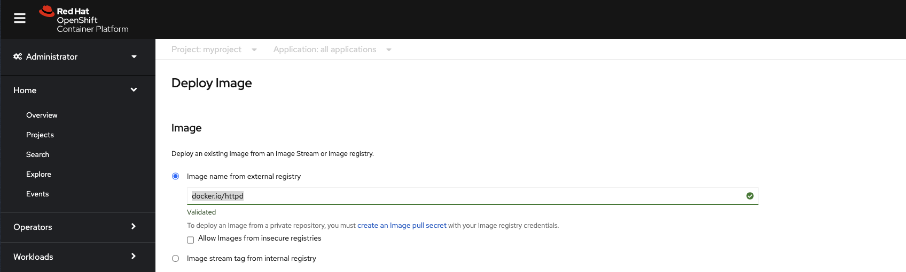
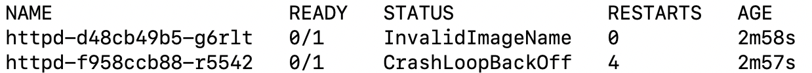
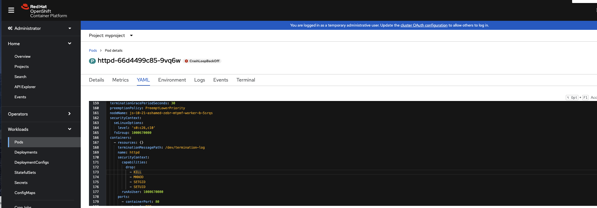

== Lab 1: OpenShift blocks rogue containers from running as privileged user

=== Goal of Lab 1
The goal of this lab is to learn about the default security technologies in Red Hat OpenShift Container Platform. Specifically, you will see how OpenShift blocks rogue containers from Docker Hub to run as a privileged root user.

=== Introduction
Almost all software you are running in your containers does not require root. Your web applications, databases, load balancers, number crunchers, etc. do not need to be run as root ever. Building container images that do not require root at all and basing images off of non-privileged container images is needed for container security. However, the vast majority of container images in the world today, such as the community container images available on Docker Hub, require root. By default, no containers are allowed to run as root in Red Hat OpenShift Container Platform. An admin can override this, if your organization requires the capability to run a container as root. Ensuring your containers are not run as root is particularly important in multi-tenant OpenShift Kubernetes clusters, where a single cluster may be serving multiple applications and multiple development teams. It is not always practical or even advisable for administrators to run separate clusters for each application or team.

=== Lab 1.1 Pull rogue container image from Docker Hub and observe how OpenShift locks down the container by default

. Create a new project called *myproject*.
+
[source]
----
oc new-project myproject
----

. In the OpenShift console, navigate to *Home->Projects*, search for *myproject* and click on it.
+
image:images/lab1.1-myproject.png[]

. Then, go to the *Workloads* tab and click on the *Container Image* tile.
+
image:images/lab1.1-4.9-workloads[]

. Then, click on *Container Images* . Make sure that *Image name from external registry* is selected and for the Image and input *docker.io/httpd* in the field labeled "Enter an Image Name". 
+

+
NOTE: If you investigate the link:https://github.com/docker-library/httpd/blob/4d89a55e9e5742bebd10fddf83ffb07f2df4d7a0/2.4/Dockerfile[DockerFile for the image] you can see that the container must run as root and is exposed over port 80. Because this is exposed over port 80 a privledged user, such as root must start the proccess to bind to the port. If a root user is not used to start this proccess the proccess will fail. 

. Press *Create*.

. Now, go back to your terminal and go into the project you just created by typing *oc project myproject*. Then, take a look at your pods by typing *oc get pods*. Notice that one of your pods has a CrashLoopBackOff error.
+

. Let's investigate further what is causing this error. Take a look at the log of the pod that is causing this error.
You can get the name of the pod from the previous oc get pods command.
+
[source]
----
POD=`oc get pods --selector app=httpd -o custom-columns=NAME:.metadata.name --no-headers`; oc logs $POD
# Or use the following command manually replacing the pod_name with the name of your pod.
# oc logs <pod_name i.e httpd-f958ccb88-r5542>
----

. Notice that you get permission denied errors saying that you cannot bind to port 80. This is because the proccess was not startup as root and was modified by the security context constraint to run as a specific user. 
+
image:images/lab1.1-noport80.png[1500,1500]

. For a more detailed look, type oc describe pod with the name of your pod. 
+
[source]
----
oc describe pod $pod
# Or 
# oc describe pod <insert_pod_name i.e httpd-f958ccb88-r5542>
----
+
image:images/lab1.1-describepod-error.png[]
+
NOTE: Notice that the output shows that the container failed after trying to start on port 80 and terminated due to a CrashLoopBackOff error. Also notice the default OpenShift Security Context Constraints policy that is in place is restricted (openshift.io/scc: restricted).

. Finally, investigate your pod yaml in the OpenShift console by navigating to the *YAML** view of your pod in the OpenShift console. Scroll down to the containers definition and notice how the SCC has dropped several capabilites and added a specifc runAsUser. These modifications have prevented your pod from scheduling because it was originally designed in an insecure state.
+

+
<<top>>

link:README.adoc#table-of-contents[ Table of Contents ]
