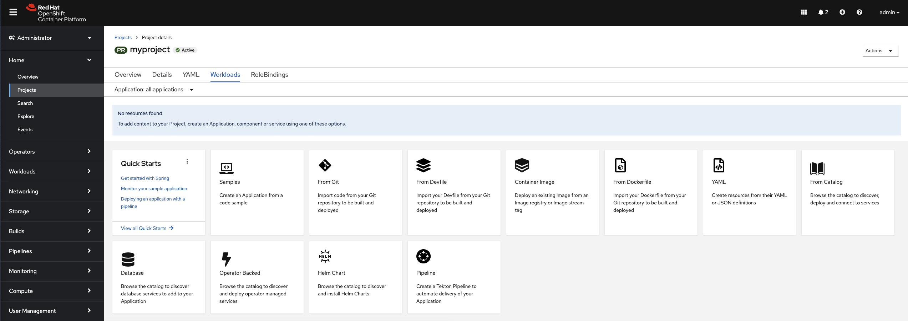
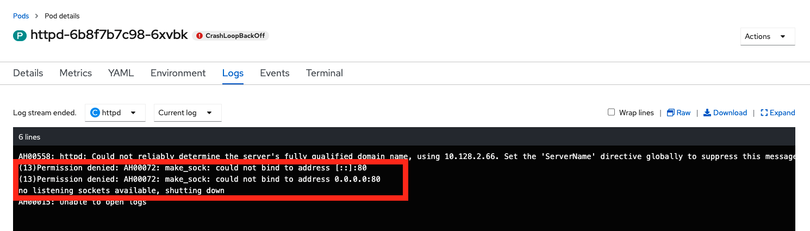

== Lab 1: OpenShift blocks 'rogue' containers from running as privileged user

=== Goal of Lab 1
The goal of this lab is to learn about the default security technologies in Red Hat OpenShift Container Platform. Specifically, you will see how OpenShift blocks 'rogue' containers with images from from Docker Hub from running as a privileged root user and how you can work around that restrictions for this specific container.

=== Introduction

Almost all software you are running in your containers does not require 'root' level access. Your web applications, databases, load balancers, number crunchers, etc. do not need to be run as root ever. Building container images that do not require root at all and basing images off of non-privileged container images are needed for container security. However, the vast majority of container images in the world today, such as the community container images available on Docker Hub, require root. By default, no containers are allowed to run as root in Red Hat OpenShift Container Platform. An admin can override this, otherwise all user containers run without ever being root. This is particularly important in multi-tenant OpenShift Kubernetes clusters, where a single cluster may be serving multiple applications and multiple development teams. It is not always practical or even advisable for administrators to run separate clusters for each.

=== Lab 1.1 Pull 'rogue' container image from Docker Hub and observe how OpenShift locks down the container by default

. Create a new project called *myproject* (or any other name that you prefer).

+
[source]
----
oc new-project myproject
----

. In the OpenShift console, navigate to *Home->Projects*, search for *myproject* and click on it.
+
image:images/lab1.1-myproject.png[]

. Then, go to the *Workloads* tab and click on the *Container Image* tile.
+

NOTE: It may be easier to use *Developer* perspective of OpenShift console to navigate to a project and click "+Add" button on the left hand side menu  to initiate that workflow. 
. Then, click on *Container Images* . Make sure that *Image name from external registry* is selected and for the Image Name, type *docker.io/httpd*. Press the magnifying glass.

+
image:images/lab1.1-4.7.33-image-external.png[]
+

NOTE: Notice that this container image requires to be run as 'root' and listen on port 80.

. Leave other values as defaults and press *Create*.

. Now, go back to your terminal and go into the project you just created by typing *oc project myproject*. Then, take a look at your pods by typing *oc get pods*. Notice that one of your pods has a CrashLoopBackOff error.
+
image:images/lab1.1-crashloopbackofferror.png[]

. Let's investigate further what is causing this error. Take a look at the log of the pod that is causing this error.
You can get the name of the pod from the previous *oc get pods* command.
+
[source]
----
POD=`oc get pods --selector app=httpd -o custom-columns=NAME:.metadata.name --no-headers`; oc logs $POD
# Or use the following command manually replacing the pod_name with the name of your pod.
# oc logs <pod_name i.e httpd-f958ccb88-r5542>
----

. Notice that you get permission denied errors saying that you cannot bind to port 80. This is because the proccess was not startup as root and was modified by the security context constraint to run as a specific user. 
+
image:images/lab1.1-noport80.png[1500,1500]

. Also we can review failing container logs via OpenShift UI console, Log tab for that pod:
+

+
. For a more detailed look, type 'oc describe pod ....' with the name of your pod.

+
[source]
----
oc describe pod $pod
# Or 
# oc describe pod <insert_pod_name i.e httpd-f958ccb88-r5542>
----
+
image:images/lab1.1-describepod-error.png[]
+
Notice that the output shows that the container failed after trying to start on port 80 and terminated due to a CrashLoopBackOff error. Also notice the default OpenShift Security Context Constraints (SCC) policy that is in place is 'restricted' (openshift.io/scc: restricted).

=== Lab 1.2 Work around the default container security restriction by using service accounts with SCC privileges

. Now let's fix this issue. In order to allow containers to run with elevated SCC privileges, we will create a Service Account (a special user account to run services) called 'privileged-sa':
+
[source]
----
[localhost ~]$ oc create sa privileged-sa
serviceaccount/privileged-sa created
----

. Then, we will entitle that Service Account (which is not used by default by any pods) to run as any userId by running the folowing command to add an SCC context:
+
[source]
----
[localhost ~]$ oc adm policy add-scc-to-user anyuid -z privileged-sa
clusterrole.rbac.authorization.k8s.io/system:openshift:scc:anyuid added: "privileged-sa"
----

. Now we have a Service Account that can run pods/containers using any userId. But how can we "plug" it into out application to allow it to run with that privilege? There is a pretty straighforward OpenShift command for that as well that "injects" that non-default service account into our application deployment:
+
[source]
----
[localhost ~]$ oc set serviceaccount  deployment httpd privileged-sa
deployment.apps/httpd serviceaccount updated
----
. That will make our 'httpd' pod use this Service Account and enable elevated privileges. We can verify that our Deployment now is using that Service Account by running command:
+
[source]
----
[localhost ~]$ oc describe deployment httpd
Name:                   httpd
Namespace:              container-security
CreationTimestamp:      Wed, 06 Apr 2022 14:30:14 -0700
Labels:                 app=httpd
                        app.kubernetes.io/component=httpd
                        app.kubernetes.io/instance=httpd
                        app.kubernetes.io/name=httpd
                        app.kubernetes.io/part-of=httpd-app
                        app.openshift.io/runtime-namespace=container-security
Annotations:            alpha.image.policy.openshift.io/resolve-names: *
                        deployment.kubernetes.io/revision: 2
                        image.openshift.io/triggers:
                          [{"from":{"kind":"ImageStreamTag","name":"httpd:latest","namespace":"container-security"},"fieldPath":"spec.template.spec.containers[?(@.n...
                        openshift.io/generated-by: OpenShiftWebConsole
Selector:               app=httpd
Replicas:               1 desired | 1 updated | 1 total | 1 available | 0 unavailable
StrategyType:           RollingUpdate
MinReadySeconds:        0
RollingUpdateStrategy:  25% max unavailable, 25% max surge
Pod Template:
  Labels:           app=httpd
                    deploymentconfig=httpd
  Annotations:      openshift.io/generated-by: OpenShiftWebConsole
  Service Account:  privileged-sa <== non-default service acount that will run containers
  Containers:
   httpd:
    Image:        image-registry.openshift-image-registry.svc:5000/container-security/httpd@sha256:10ed1591781d9fdbaefaafee77067f12e833c699c84ed4e21706ccbd5229fd0a
    Port:         80/TCP
    Host Port:    0/TCP
    Environment:  <none>
    Mounts:       <none>
  Volumes:        <none>
Conditions:
  Type           Status  Reason
  -----           ------  ------
  Available      True    MinimumReplicasAvailable
  Progressing    True    NewReplicaSetAvailable
OldReplicaSets:  <none>
NewReplicaSet:   httpd-765df85d48 (1/1 replicas created)
Events:
  Type    Reason             Age    From                   Message
  -----    ------            -----   ----                   -------
  Normal  ScalingReplicaSet  83m    deployment-controller  Scaled up replica set httpd-6b8f7b7c98 to 1
  Normal  ScalingReplicaSet  2m44s  deployment-controller  Scaled up replica set httpd-765df85d48 to 1
  Normal  ScalingReplicaSet  2m41s  deployment-controller  Scaled down replica set httpd-6b8f7b7c98 to 0
----

. We now see that Replica Set that controls pods instances has been regenerated and our HTTP server pod is running OK which we can check in its logs:
+
[source]
----
[localhost ~]$oc logs httpd-765df85d48-pwtm5
AH00558: httpd: Could not reliably determine the server's fully qualified domain name, using 10.128.2.95. Set the 'ServerName' directive globally to suppress this message
AH00558: httpd: Could not reliably determine the server's fully qualified domain name, using 10.128.2.95. Set the 'ServerName' directive globally to suppress this message
[Wed Apr 06 22:50:53.509904 2022] [mpm_event:notice] [pid 1:tid 140675277868352] AH00489: Apache/2.4.53 (Unix) configured -- resuming normal operations
[Wed Apr 06 22:50:53.510037 2022] [core:notice] [pid 1:tid 140675277868352] AH00094: Command line: 'httpd -D FOREGROUND'
...
----

. So we have learned that by adding SCC privileges to a Service Account and using that Service Account to run a pod that requires elevated privileges, we can get it to run securely on OpenShift. Please keep in mind that *best practice is to assign minimal SCC privileges* that are required for pod security to such service accounts. 

Per OpenShift Documentation (https://docs.openshift.com/container-platform/4.10/security/container_security/security-hosts-vms.html) the best practice is: most containers, except those managing or monitoring the host system itself, should run as a non-root user. Dropping the privilege level or creating containers with the least amount of privileges possible is recommended best practice for protecting your own OpenShift Container Platform clusters.  

. Finally, investigate your pod yaml in the OpenShift console by navigating to the *YAML** view of your pod in the OpenShift console. Scroll down to the containers definition and notice how the SCC has dropped several capabilites and added a specifc runAsUser. These modifications have prevented your pod from scheduling because it was originally designed in an insecure state.
+
image:images/lab1.1-scc-modify.png[]
+
<<top>>

link:README.adoc#table-of-contents[ Table of Contents ]
