== Lab 2: Implementing network isolation between running containers using Network Policies

=== Goal of Lab 2
The goal of this lab is to learn about how to implement network isolation between running containers in Red Hat OpenShift Container Platform using Software Defined Networking and Network Policies. First, we will create a few projects and see the default out of the box network policies provided in OpenShift. Then, we will use Network Policies to restrict which projects can talk to each other by restricting the network layer to provide that network isolation between running containers with Software Defined Networking and Network Policies.

=== Introduction
Network Policies are an easy way for Project Administrators to define exactly what ingress traffic is allowed to any pod, from any other pod, including traffic from pods located in other projects. By default, all Pods in a project are accessible from other Pods and network endpoints. To isolate one or more Pods in a project, you can create NetworkPolicy objects in that project to indicate the allowed incoming connections. Project administrators can create and delete NetworkPolicy objects within their own project.

If a Pod is matched by selectors in one or more NetworkPolicy objects, then the Pod will accept only connections that are allowed by at least one of those NetworkPolicy objects. A Pod that is not selected by any NetworkPolicy objects is fully accessible.

=== Lab 2.1 Creating Projects and Labeling Namespaces

. Create 3 projects and label the namespaces.
+
[source]
----
oc new-project proj-a
oc new-project proj-b
oc new-project proj-c
----

. Use the oc login command to login with the cluster admin user provided to you by the workshop facilitor using the command.

+ 
[source]
----
oc login
----

. In order to do Network Policies and to allow one namespace to only allow certain other namespace to access your service, you have to label the namespaces (and this is why you have to be cluster admin):
+
[source]
----
oc label namespace proj-a name=proj-a
oc label namespace proj-b name=proj-b
oc label namespace proj-c name=proj-c
----

. Log back in as the workshop user that you were assigned.

. Now, let's look at the projects and labels we just created:
+
[source]
----
oc get projects --show-labels | grep proj-
----
+
image:images/lab2.1-showlabels.png[]

=== Lab 2.1 Creating the hello world microservice and client pod in proj-c

. Let's go into the project named *proj-c* and create 2 pods and a service.
+
[source]
----
oc project proj-c
oc new-app quay.io/bkozdemb/hello
----
This will create a new app, which is a hello world container on quay.io that’s built on the RHEL base python image. It runs a simple web server that prints hello.

. Next, let's confirm that the pod is starting to run.
+
[source]
----
oc get pods
----
+
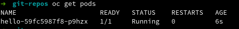

. Now, let's run the client pod, which is a fedora base image. When it runs image, notice the command that’s being run, which essentially prevents the pod from running and then immediately quitting. This client pod will be used to run a curl command later.
+
[source]
----
oc run client --image=fedora --command -- tail -f /dev/null
----

. Let's confirm that our client pod and hello world pod are now running.
+
[source]
----
oc get pods
----
+
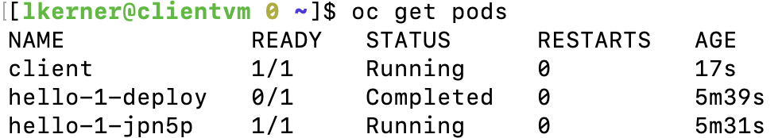

. Next, let's create client pods in both projects named *proj-a* and *proj-b*.
+
[source]
----
oc project proj-b
oc run client --image=fedora --command -- tail -f /dev/null
oc project proj-a
oc run client --image=fedora --command -- tail -f /dev/null
----

. Notice that the projects , *proj-a* and *proj-b* just has a client pod.
+
[source]
----
oc get pods -n proj-a
oc get pods -n proj-b
----
+
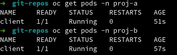

. As we saw in the previous steps, *proj-c*, has both a client pod and the service (hello world app).
+
[source]
----
oc get pods -n proj-c
----
+
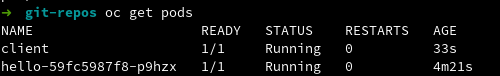

. When the client pod is ready, show the labels.
+
[source]
----
    oc get pods --show-labels
----
+
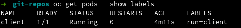

Notice that the label that we’re using is run=client which is created automatically by our previous oc run client command.

. Next, from project, *proj-a*, enter the container and curl the *hello.proj-c* service in project, *proj-c*. The default network policy allows a client pod in *proj-a* to access the microservice in *proj-c*.
+
[source]
----
oc project proj-a
POD=`oc get pods --selector=run=client --output=custom-columns=NAME:.metadata.name --no-headers`
----
This command above simply inserts the pod name into variable since some pods have random names by default so this command allows you to give a specific name to the pod.
+
[source]
----
echo $POD
----
+
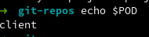

This returns this returns *client*, which is the pod name.
Next, go into the pod and curl the service in project, *proj-c*. Notice that this is allowed since it's open access by default.
+
[source]
----
oc rsh ${POD}
sh-5.0# curl -v hello.proj-c:8080
----
+
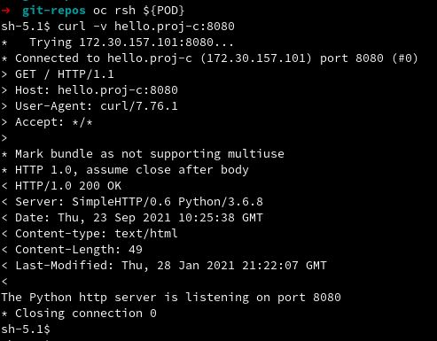

. What you have seen so far is how Network Policies work by default in OpenShift. Log into the web console, then go to Projects and find the project, *proj-c*. Go into *proj-c*, then select *Networking* -> *Network Policies*.
+
image:images/lab2.1.10-webconsole2.png[]
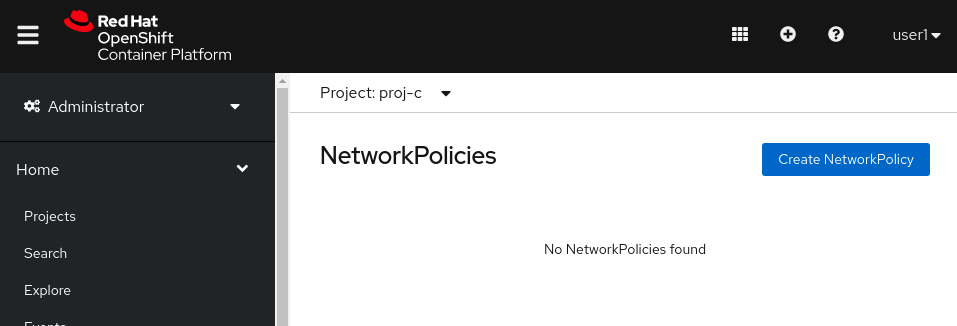

. Notice that there are no Network Policies defined, as a result, all traffic is allowed.

=== Lab 2.2 Creating Network Policies for network isolation
. In the OpenShift web console, choose project, *proj-c*, and go to *Networking* -> *Network Policies*.

. Now, create a new Network Policy in project, *proj-c* that denies traffic from other namespaces. It should be
the first example shown on the right in the Samples Network policies. Notice there are a lot of Sample Network Policies. Apply the first example *Limit access to the current namespace*. Click Try it. This creates the yaml. Next, press *create*.
+
image:images/lab2.2-createnetworkpolicies1.png[]
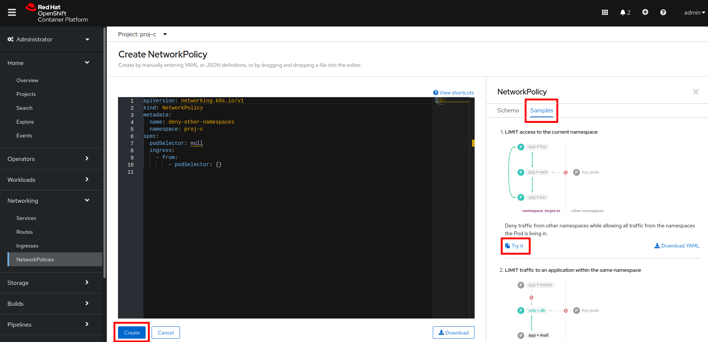

. Now, go into *Networking* -> *Network Policies*. and notice that the *deny-other-namespaces* network policy is defined.
+
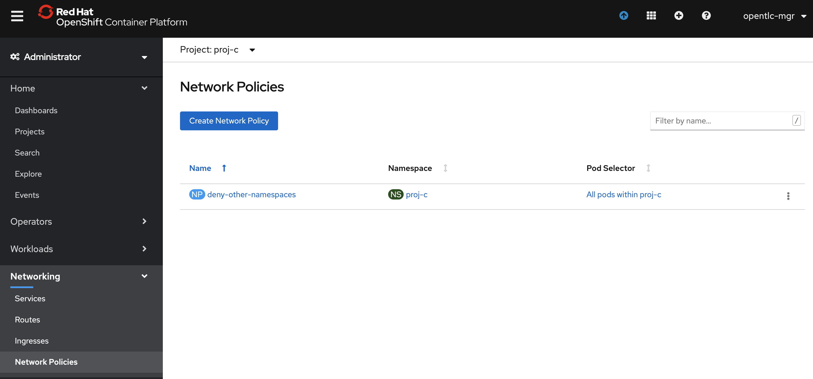

. Next, try to curl the hello world service in project, *proj-c* from the client in *proj-a*. Notice that the curl fails this time. Note that you have to wait for a while for the command to fail.
+
[source]
----
oc rsh ${POD}
sh-5.0# curl -v hello.proj-c:8080
----
+
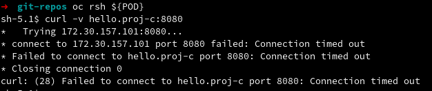

<<top>>

link:README.adoc#table-of-contents[ Table of Contents ]
