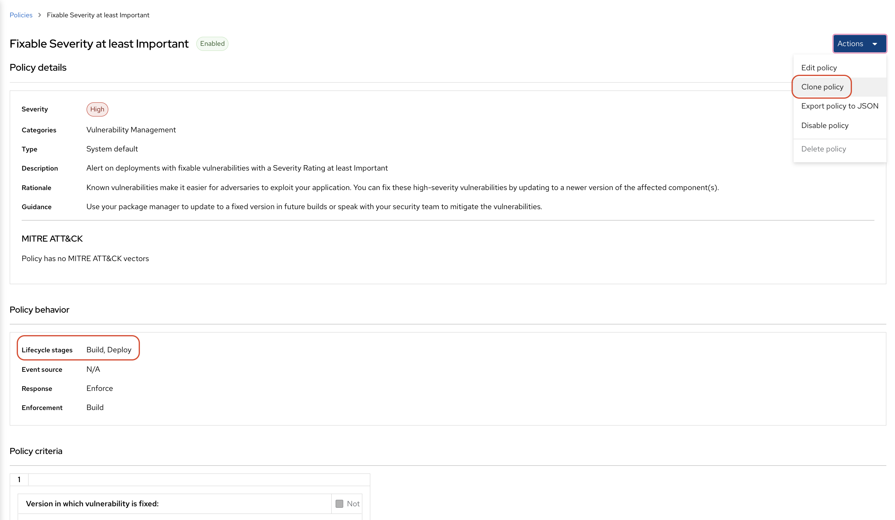
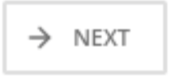
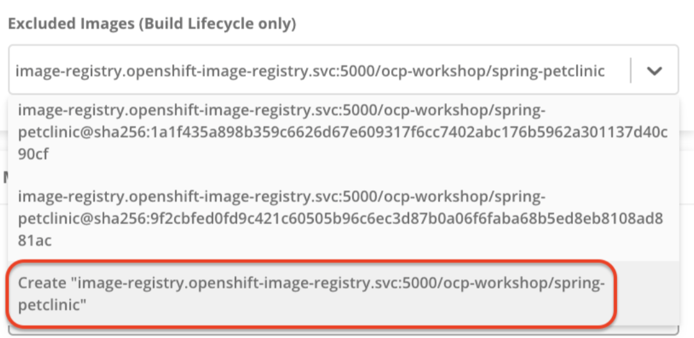
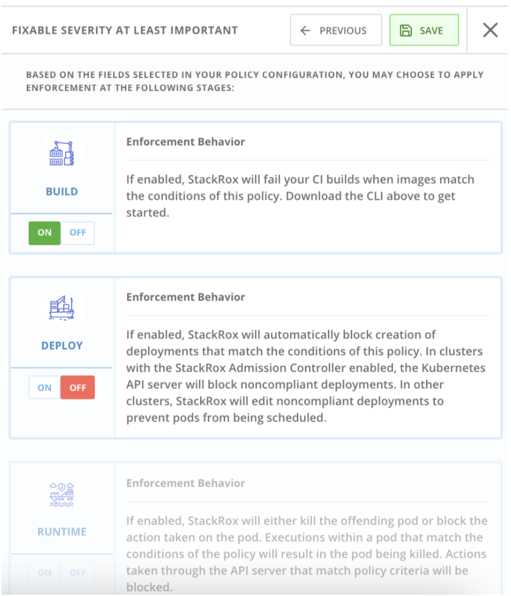
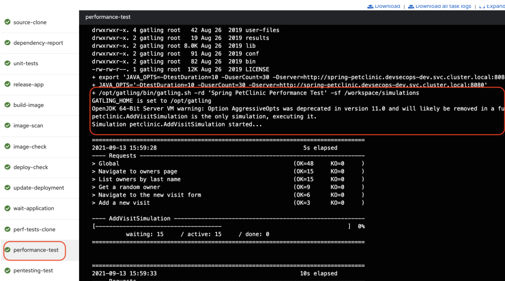
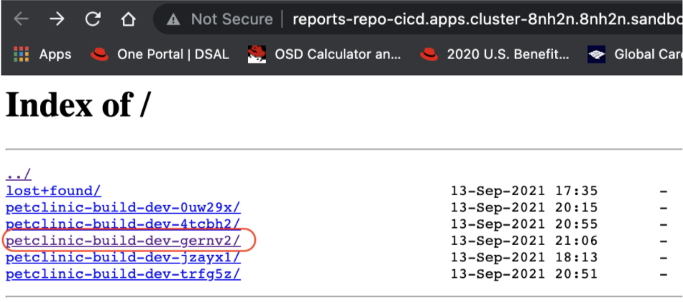
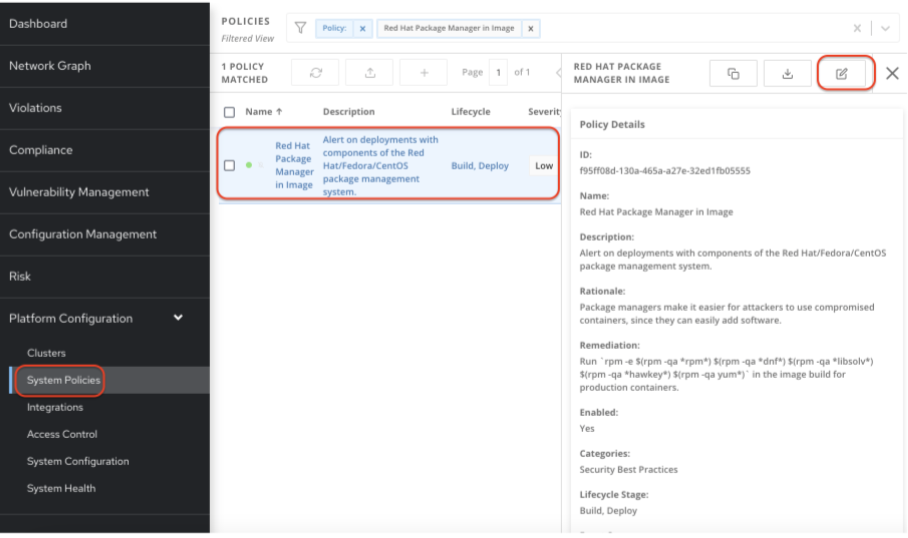
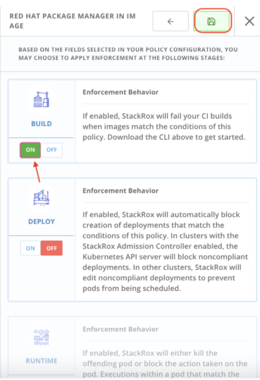
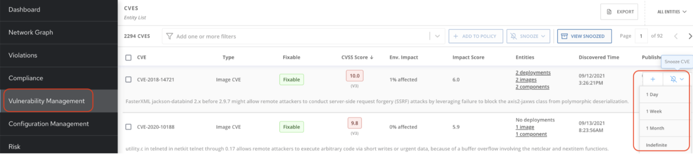

== Lab 4: Implementing DevSecOps to Build and Automate Security into the Application using Red Hat Advanced Cluster Security

=== Lab Objective

The goal of this lab is to learn how to build a secure software factory that orchestrates a combination of different security tools. With the advent of DevSecOps, security is put front and center - it is addressed in terms of people, processes, and technology. Security tools are integrated right into the build process and you could easily break the build if security requirements are not met with the security gates that you build into your CI/CD pipeline.

=== Introduction

The benefits of DevOps and Continuous Integration / Continuous Delivery (CI/CD) have been demonstrated with great success over the years. Organizations have always sought to do more with less. Security was treated as an add-on to the end of the software delivery process in many cases, and it often delayed software delivery. The industry recognized that this had to change. Organizations must continue to meet contractual and regulatory obligations as well as internal security standards, but need to accelerate software delivery to capitalize on opportunity costs. To enable organizations to meet these standards and deliver at the speed of DevOps security has faced the choice of becoming irrelevant or molding to modern software delivery practices. Security is critical to deliver software quickly and has become a metric of software quality, so there was a push to include “Sec” in “DevOps”. With the advent of DevSecOps, Shift Left is a practice intended to find and prevent defects early in the software delivery process. Security tools are integrated directly into the build process. As a result, the CI/CD process can move faster and reduce the length of time to delivery while still continuously improving the quality of each release. +
This lab exercise will focus on some of the technologies used to implement automated security compliance controls within a typical CI/CD application pipeline. +
A number of tools have been installed and pre-configured to support the DevSecOps pipeline. Most of these tools are running containerized within the Red Hat OpenShift cluster. Here is the pipeline we will be stepping through during our lab:

image:images/lab4-devsecops01.png[800,800]

In our DevSecOps CI/CD pipeline we will be using several technologies such as:

- https://www.openshift.com/learn/topics/ci-cd[Openshift Pipelines] based on Tekton
- https://www.openshift.com/blog/announcing-openshift-gitops[Openshift GitOps] based on ArgoCD
- https://www.redhat.com/en/resources/advanced-cluster-security-for-kubernetes-datasheet[Openshift Advanced Cluster Security for Kubernetes]
- https://docs.openshift.com/container-platform/latest/registry/architecture-component-imageregistry.html[Openshift Container Registry]
- https://www.sonarqube.org/[SonarQube]
- https://www.sonatype.com/products/repository-oss?topnav=true[Nexus]
- https://junit.org/junit5/[JUnit]
- https://gogs.io/[Gogs]
- https://tekton.dev/docs/triggers/[Git Webhook]
- https://gatling.io/[Gatling]
- https://www.zaproxy.org/[Zap Proxy]

[#beforeyoustart]
=== Before you start

The information from your instructor will be used in this lab:

- Access to RHEL 8 VM (bastion) with username and password
- OpenShift Console URL
- OpenShift API server
- OpenShift admin user password

Here is an example of the registration information:

image:images/lab4-devsecops02.png[800,800]

=== User Requirements

- Up-To-Date Browser: Chrome and Firefox recommended
- Command-line with ‘oc’ tool is included in the bastion VM that comes with the lab.

* SSH into your assigned VM similar to the below command:
+
|===
| ssh lab-user@bastion.GUID.sandbox####.opentlc.com

|===
+
* To check if you have the oc command line utility, open the terminal and run the following command:
+
|===
| oc version

|===
+
* To get the console URL from command-line:
+
|===
|[lab-user@bastion ~]$++oc login -u admin api.cluster-{GUID}.{GUID}.sandbox###.opentlc.com++:6443

|===
+
API server information for ‘oc login’ can be found in the xref:beforeyoustart[Before You Start].
+
* Alternatively, if you want to setup oc client on your laptop, perform the following steps:
+
** Login to the OpenShift console. OpenShift console admin user password information is provided by the instructor.
Select the question mark in the top right corner and select “Command Line Tools”
+
image:images/lab4-devsecops03.png[200,200]
+
** Download the oc command line tool for the operating system of your choice.
** Move the oc command line tool to your system executables location for simplicity of access throughout the exercise.
+
|===
|For example, on Macbook, run the command mv <insert-download-path> /usr/local/bin ++/usr/local/bin/
|===
+
* Internet access to the lab environment
* Internet access to GitHub

=== Lab 4.1 Continuous Integration

This first module will run an OpenShift Pipeline and let you explore the steps in a sample secure pipeline. +
In this lab, you will learn how to start the Tekton pipeline and how to use the tasks to integrate the security and gitops tools within the development lifecycle.

. There are three ways to start the pipeline:
** Option 1: Use Developer UI to start
.. Browse to the OpenShift Console URL in your browser
.. Login to the console using your provided credentials
.. If you are not already in the Developer Perspective, select Developer to switch to the developer console in the top left corner.
+
image:images/lab4-devsecops04.png[200,200]
+
.. Navigate to the “ocp-workshop” project
+
image:images/lab4-devsecops05.png[200,200]
+
.. Click 'Pipelines' on the left menu to view all pipelines
+
image:images/lab4-devsecops06.png[400,700]
+
.. Click onto the “petclinic-build-dev” pipeline
+
image:images/lab4-devsecops07.png[600,800]
+
.. Click “Action” → select “start”
+
image:images/lab4-devsecops08.png[200,700]
+
.. Under “Workspaces”, select PVC and then choose the PVC petclinic-build-workspace as the shared storage path that your pipelines will use at runtime. workspace/PVC/petclinic-build-workspace and
.. Under “maven-settings” select Config Map and choose “maven-settings” as the Config Map
.. Select start
+
** Option 2: Command-line to start the pipeline
A convenient way to start the pipeline while testing and it is a way to simulate a PR or push to git and trigger the pipeline. It is for users who prefer the CLI to start the pipeline.
+
.. Run:
+
|===
|oc create -f https://raw.githubusercontent.com/piggyvenus/devsecops-demo/develop/run/pipeline-build-dev-run.yaml[https://raw.githubusercontent.com/piggyvenus/devsecops-demo/develop/run/pipeline-build-dev-run.yaml] -n ocp-workshop
|===
+
** Option 3: When new code is pushed to the git repo, it will also trigger the pipeline to start.
This option may be the most popular from a developer perspective. The pipeline starts from a PR or a push into the git repo and the webhook automatically starts the pipeline.
+
.. From the dev console, click `Search` on the left nav menu
.. Type 'route' and click `Route` from the list
+
image:images/lab4-devsecops09.png[400,400]
+
.. Click the `Gogs` route to open the gogs URL:
+
image:images/lab4-devsecops10.png[400,600]
+
.. Click on the `Sign In`, to log in with the _gogsadmin_ credentials:
+
image:images/lab4-devsecops11.png[500,400]
+
|===
|User: gogsadmin
|Password: openshift
|===
+
.. Select the spring-petclinic repository inside of the gogsadmin account:
+
image:images/lab4-devsecops12.png[400,700]
+
.. Click into the README.md, click in `Edit this file` and introduce a change:
+
image:images/lab4-devsecops13.png[400,700]
+
.. Commit the change that you introduced into the README.md:
+
image:images/lab4-devsecops14.png[400,700]
+
[NOTE] This is only for demo purposes, usually the push to master it’s non recommended, and it’s a Pull Request / Merge Request from another branch (such as develop) that it’s used instead.
+
.. The pipeline will start automatically, so jump to step 6 to see the Pipeline Runs console in order to check the pipeline running.
+
. Open the browser using the provided OpenShift console URL
. Login to the console using the provided credential
. Click to `Developer` to switch to the developer console
+
image:images/lab4-devsecops04.png[200,200]
+
. Make sure you are in the `ocp-workshop` project
+
image:images/lab4-devsecops15.png[300,300]
+
. Click `Pipelines` on the left menu to view all pipelines
+
image:images/lab4-devsecops16.png[400,700]
+
. Click onto Pipeline `petclinic-build-dev` and click onto the `Pipeline Runs` tab.
+
image:images/lab4-devsecops17.png[400,700]
+
.  Click onto the Pipeline Run
+
You will see the Pipeline Run as shown below when it starts.
+
image:images/lab4-devsecops18.png[500,700]
+
When the pipeline run completes, this is the view.
+
image:images/lab4-devsecops19.png[500,700]
+
[Note] step “image-check” has failed in your pipeline run. This is due to an important severity vulnerability in the image being caught by a pipeline gate policy, stopping the deployment:
+
image:images/lab4-devsecops20.png[500,700]
+
The next module, lab 4.2 will walk you through what’s happened and how to resolve it securely. +
[Note] In addition to triggering a pipeline run manually, every push to the spring-petclinic git repository on the Gogs git server executes the pipeline.
. Explore the pipeline! Once the pipeline is started, you can click on each detailed step to explore logs for each step. We’ll direct some of the explorations in the next few steps.
.. *Source Clone* - app source code is pulled from the Git (Gogs) server installed in your lab.
[Note] Files persist between steps in the pipeline via workspace that is pre-defined in the pipeline.
+
image:images/lab4-devsecops24.png[400,700]
+
... Copy the git repo URL. Open a browser tab to explore the code
... The URL should take you to the Gogs git repo as shown below.
+
image:images/lab4-devsecops25.png[600,700]
+
... Click onto `gogsadmin` and there are 2 repositories for this lab.
+
The credentials of gogsadmin user are:
+
|===
|User: gogsadmin
|Pass: openshift
|===
+
.. *Dependency Report* is a step in the pipeline that creates a report of the app dependencies from the source code and uploads it to the report server repository.
+
image:images/lab4-devsecops26.png[300,700]
+
Let’s look at the report!
+
... From the dev console, click `Search` on the left nav menu
... Click Resources, type `route`, and click `Route` from the list
+
image:images/lab4-devsecops09.png[400,400]
+
... Click on the reports repo link
+
image:images/lab4-devsecops27.png[300,700]
+
... Click onto the `petclinic-build` link from the page
+
image:images/lab4-devsecops28.png[300,500]
+
... Continue to click on spring-petclinic → target → site
... Click on the `Dependencies` from the page. You may examine the details from that page by scrolling down
+
image:images/lab4-devsecops29.png[300,700]
+
.. *Unit tests* task is executed in parallel with dependency report.
+
image:images/lab4-devsecops30.png[300,700]
+
. *Release-app* is where** **the application is packaged as a JAR and released to the Sonatype Nexus snapshot repository.
+
image:images/lab4-devsecops31.png[300,700]
+
. *Build-image* step is when a container image is built in DEV environment using S2I, and pushed to OpenShift internal registry, and tagged with spring-petclinic:[branch]-[commit-sha] and spring-petclinic:latest
+
image:images/lab4-devsecops32.png[300,700]

=== Lab 4.2 DevSecOps steps using Advanced Cluster Security

Red Hat Advanced Cluster Security (ACS) for Kubernetes controls clusters and applications from a single console, with built-in security policies. +
First-generation container security platforms focus on the container. ACS delivers the next generation in container security, with a Kubernetes-native architecture that leverages Kube's declarative data and built-in controls for richer context, native enforcement, and continuous hardening. In addition, ACS focuses on Kubernetes helps DevOps and Security teams operationalize security, simplifying the process of protecting the cloud-native application stack.

In this lab, you will learn how ACS integrates into the CI/CD process. ACS not only simplifies the process, but provides visibility to the security team in your organization.
Using https://docs.openshift.com/acs/cli/getting-started-cli.html[roxctl] and ACS API, we integrated into our pipeline several additional security steps into our DevSecOps pipeline:

. The *image scan* step uses the ACS Scanner to scan the image generated and pushed in the last step.
+
image:images/lab4-devsecops33.png[300,700]
+
In the logs of this step, there is a direct link to the image scan in ACS.  +
[NOTE] If you see a security certificate warning proceeding to that link, ignore it. +
Copy and paste it into another tab in order to get more information about the scanned image. Enter the following information:
+
|===
|User: admin
|Pass: stackrox
|===
+
The URL takes you to Vulnerability Management. Here you can see an overview of the vulnerabilities (CVEs) included in this image.
+
.. Under the Deployment tab
The ACS tool is aware of if this image is deployed. Since the first pipeline didn’t pass all of its gates, at first, there will be no deployments.

.. Under the Component tab
This is a view of all of the components in this image. It lists relevant information, such as the number of CVEs that can be fixed with an upgrade of the component, top CVSS score associated with any of the CVEs in the component, and other deployments that include each component.
+
image:images/lab4-devsecops34.png[500,700]
+
For example, if you click on the tomcat 9.0.31 component, you will see the details of the component as shown below. This page shows the risk priority, the CVEs information, location of the component and the version of the component to upgrade to in order to remediate the CVE.
+
image:images/lab4-devsecops35.png[500,700]
+
.. Click “X” on the top left to go back
.. Under CVEs tab
This is an overall view of the vulnerabilities in the image.
+
image:images/lab4-devsecops36.png[500,700]
+
.. Go back to the overview, and scroll down to the `Image findings` section, you will see the fixable CVEs. These are CVEs where ACS knows there is a fix available.
+
image:images/lab4-devsecops37.png[300,700]
+
.. Under Dockerfile tab
+
These details components and CVEs per step. This can be useful so you know which step to update.
+
image:images/lab4-devsecops38.png[400,700]
+
Feel free to continue to explore ACS before continuing to review the pipeline. Understanding security checks and tool capabilities are a key part of this lab and can help raise your knowledge of a secure software delivery pipeline.

. The *Image Check* step of the pipeline notes the build-time violations of the different security policies defined in ACS.
+
image:images/lab4-devsecops39.png[400,700]
+
image:images/lab4-devsecops40.png[400,700]
+
We have defined system policies in ACS. This step checks build-time and deploy-time violations of security policies, and any deployment uses this image for the application. This pipeline will fail at this task and will not continue to the next task. This is because we set the policy enforcement in the ACS.
This can be useful if you want to block the deployment of highly vulnerable applications from deploying.
+
. *Deploy-check* shows the violating the policies in the log. The log shows the violations but it did not fail at this task because the deployment enforcement is not on in this example. We will explore more on the policy in the later lab.
+
image:images/lab4-devsecops41.png[400,700]
+
[Note] these 3 steps (deploy-check, image-check and image-scan) are executed in parallel to save time in our DevSecOps pipeline.
+
. If *image-check* fails, go to the pipeline run and click `image-check`. The bottom of the log shows `Error: Violated a policy with CI enforcement set.` The reason for the error is because ACS enforces the policy from building and deploying if a violation occurs. This integrates ACS via the roxctl in the Tekton task.
. When an image violates the policies, the best practice is to fix the code and execute the pipeline until it passes the checks. As you can see, the logs reported the list of violations and remediation. Developers can take the information from `image-check` task’s log and make changes accordingly. When the fix is checked into Git, the pipeline will be triggered. We have prepared the xref:fiximage[bonus exercise for fixing the image]. If you like to continue to test other tasks on the pipeline, we can add an exception to the policy to exclude the spring-petclinic.
Adding an exception to a policy can be useful when developers need to fix the code, and the CI process needs to continue the testing.
+
[NOTE] Please be aware that fixing the code to pass the violation will be the recommended approach.
+
Assuming that you will want to just add the exception to bypass the policy for spring-petclinic build.
+
.. When you inspect the log from the image-check task, you will find the below message which caused the failure:
+
|===
|✗ Image image-registry.openshift-image-registry.svc:5000/ocp-workshop/spring-petclinic@sha256:ece54d2923654c36f4e97bc0410f5c027871c5b7483e977cfc6c2bd56fef625d failed policy '*Fixable Severity at least Important*' *(policy enforcement caused failure)*
|===
+
.. Click `waffle icon` image:images/lab4-devsecops42.png[20,20] to get the console links → select `Red Hat Advanced Cluster Security For Kubernetes` as shown below.
+
image:images/lab4-devsecops43.png[700,300]
+
.. You will be prompted to log in to the ACS console → click `Advanced` → Click the `Proceed to central-stackrox.apps.cluster...` link to proceed.
.. Enter the following information:
+
|===
|User: admin
|Pass: stackrox
|===
+
.. Click login and you will see the ACS dashboard screen as shown below.
+
image:images/lab4-devsecops44.png[300,700]
+
.. Click image:images/lab4-devsecops45.png[20,20] on the top left → click Platform Configuration → select System Policy
+
image:images/lab4-devsecops46.png[100,200]
+
.. Under System Policies, put the policy name *Fixable Severity at least Important* in the search field and hit enter. The policy will list as the result.
+
image:images/lab4-devsecops47.png[300,700]
+
.. Click onto the policy to get to the policy details page. The Policy page allows you to clone, export, and edit the policy. If it is available, it shows the remediation, so the developer can use the information to fix the image. The lifecycle stage information is where the policy enforcement takes place. In this lab, since this enable policy is violated, it will not pass the build and deploy stages in the pipeline.
+

+
.. Let’s edit the policy by clicking 
.. We want to add an exception in this policy only for spring-petclinic build.
.. Scroll down to `Excluded Images (Build Lifecycle only)``
.. Type:
+
|===
|image-registry.openshift-image-registry.svc:5000/ocp-workshop/spring-petclinic
|===
+
.. Click onto the “Create “image...”
+

+
.. Click the  icon 3 times. Click off under the build icon. This may be useful when the development team wants to continue to test the pipeline. While you can turn off the enable policy, it is best practice to update the application and enforce the policy to gate the CI process.
+

+
.. You can review the enforcement behavior before clicking in 'save' icon the following screen.
.. Switch back to the OpenShift developer console, and click pipeline on the nav under “ocp-workshop” project
+
image:images/lab4-devsecops52.png[300,700]
+
.. Rerun the pipeline
+
image:images/lab4-devsecops53.png[300,700]
+
.. Click onto the Pipeline Runs tab and click on the Pipeline Run we started
+
image:images/lab4-devsecops54.png[300,700]
+
.. Because the build enforcement is turned off for the policy, we are now able to complete the pipeline build. The development team should go back and upgrade the application based on the ACS reports for image check and deploy check information.
+
image:images/lab4-devsecops55.png[300,700]
+
.. If you finish the xref:fiximage[bonus lab] to fix the image, go back to the policy and remove the exception in the Policy.
.. Kubernetes kustomization files are updated in the *update deployment step* with the latest image [commit-sha] in the overlays for dev. This will ensure that our applications are deployed using the specific built image in this pipeline.
+
image:images/lab4-devsecops56.png[300,700]

=== Lab 4.3 Continuous Delivery Using GitOps

GitOps is a declarative way to implement continuous deployment for cloud native applications. You can use GitOps to create repeatable processes for managing OpenShift Container Platform clusters and applications across multi-cluster Kubernetes environments. GitOps handles and automates complex deployments at a fast pace, saving time during deployment and release cycles. +
The GitOps workflow pushes an application through development, testing, staging, and production. GitOps either deploys a new application or updates an existing one, so you only need to update the repository; GitOps automates everything else.

Argo CD continuously monitors the configurations stored in the Git repository and uses Kustomize to overlay environment-specific configurations when deploying the application to DEV and STAGE environments.

image:images/lab4-devsecops57.png[300,700]

. The ArgoCD application syncs the manifests in our Gogs git repositories, and applies the changes automatically into the namespaces defined:
.. Click on the waffle icon on the top to get to the console links and select “Cluster Argo CD”
+
image:images/lab4-devsecops43.png[300,300]
+
.. It will take you to the Argo CD login. If it is the first time you log in to Argo CD, you will need to click `Advanced` → click `Proceed to openshift-gitops-server-openshift-gitops.apps…` link
.. Login as user admin and please run the follow command to get the auto generated password as shown below:
+
....
argoPass=$(oc get secret/openshift-gitops-cluster -n openshift-gitops -o jsonpath='{.data.admin\.password}' | base64 -d)
....
+
.. Once logged in, you will see the applications from the Argo CD console as shown below.
+
image:images/lab4-devsecops58.png[500,600]
+
.. Click onto `dev-spring-petclinic` and access to the application
. ArgoCD will deploy every manifest that is defined in the branch/repo of our application:
+
image:images/lab4-devsecops59.png[300,700]
+
.. Back to the OpenShift Dev console, click `Topology` on the left navigation menu under devsecops-dev project. Click the arrow to access the application URL.
+
image:images/lab4-devsecops60.png[300,500]
+
* Application shows as below.
+
image:images/lab4-devsecops61.png[500,500]
+
.. Go back to the Argo CD console. Click `Applications` on the top left
+
image:images/lab4-devsecops62.png[300,300]
+
.. Click `stage-spring-petclinic`
+
image:images/lab4-devsecops63.png[300,700]
+
.. Click image:images/lab4-devsecops64.png[30,40] on the top menu to deploy to the application to devsecops-qa and wait until “Synced” as shown below.
+
image:images/lab4-devsecops65.png[300,700]
+
.. Back to the OpenShift Dev console, click `Topology` on the left navigation menu under devsecops-qa project. Click the arrow to access the application URL.
+
image:images/lab4-devsecops66.png[300,300]
+
.. The application is now deployed to the QA project as shown below.
+
image:images/lab4-devsecops67.png[300,500]

=== Lab 4.4 PostCI - Dynamic Application Security and Testing (DAST)

*Dynamic application security testing (DAST)* is designed to detect conditions indicative of a security vulnerability in an application in its running state.  +
Once our application is deployed, we need to ensure our application is stable and performant and also that nobody can hack our application easily.

. Our CI in Openshift Pipelines waits until the ArgoCD app is fully synced (*Wait Application step*) and our app and all the resources are deployed
.. Go to the successful pipeline run, and go to the step *wait-application*
+
image:images/lab4-devsecops68.png[300,700]
+
.. Click onto the step, it will take you to the log as shown below
+
image:images/lab4-devsecops69.png[300,700]
+
. Click on the step *perf-test-clone*
+
The performance tests are cloned (*Performance Tests Clone*) into our pipeline workspace as shown below.
+
image:images/lab4-devsecops70.png[300,700]
+
. Click onto step *pentesting-test*
+
The pentesting is executed (*Pentesting Test*) using the web scanner https://www.zaproxy.org/[OWASP Zap Proxy] using a baseline in order to check the possible vulnerabilities, and a Zap Proxy report is uploaded to the report server repository.
+

+
See the result from the bottom of the log.
+
image:images/lab4-devsecops72.png[300,700]
+
. A performance report is uploaded to the report server repository.
.. Click `Route` on the left navigation, click `reports-repo` route location.
+
image:images/lab4-devsecops73.png[300,700]
+
.. The link has the name that is corresponding to the name of the PipelineRun.
.. You will click on the link with the same name as your PipelineRun
+

+
.. You should see a similar link as shown.
+
image:images/lab4-devsecops75.png[300,400]
+
.. Go to petclinic-build-dev-XXXXXX.html under the route location
+
image:images/lab4-devsecops76.png[300,700]
+
. In parallel, the performance tests are executed using the load test https://gatling.io/[Gatling]. Click “perfomance-test” from the pipeline run.
+
image:images/lab4-devsecops77.png[300,700]
+
.. Scroll down to see the report location
+
image:images/lab4-devsecops78.png[300,700]
+
.. Go back to your report repo location:
+
image:images/lab4-devsecops79.png[300,400]
+
.. Click on the link that matches the name of the pipeline run
.. Click the link as shown in the image below. Notice this location shows in the log as well.
+
image:images/lab4-devsecops80.png[200,400]
+
.. You will see the result of the performance test page similar to the image below.
+
image:images/lab4-devsecops81.png[400,700]

=== Lab 4.5 Security Policies and CI Violations

In this demo, we can control the security policies applied to our pipelines, scanning the images and analyzing the different deployment templates used to deploy our applications. +
We can enforce the different Security Policies in ACS, failing our CI pipelines if a violation of this policy appears in each step of our DevSecOps pipelines (steps “image-check”, “image-scan”, “deploy-check”).

* Click on the `waffle icon` and select `Red Hat Advanced Cluster Security for Kubernetes`
+
image:images/lab4-devsecops43.png[300,300]
+
* Login using credential admin/stackrox to ACS console.
+
image:images/lab4-devsecops82.png[300,700]
+
* Click Platform Configuration → System Policies
+
image:images/lab4-devsecops83.png[200,200]
+
Security Policies can be defined at the BUILD level (during the build/push of the image), or at the DEPLOYMENT level (preventing deployment of the application).
* Click on the Package manager policy
+
image:images/lab4-devsecops84.png[300,700]
+
For example, this Security Policy checks if an RH Package Manager (dnf, yum) is installed in your Image, and will FAIL the pipeline if it detects that the image built contains any RH Package Manager:
* Click  for editing the policy on the top left
* You will be able to modify the policy details. You can define the lifecycle stages for the policy and other properties.  The enable Policy option is where you control the CI to fail or pass.
+
image:images/lab4-devsecops85.png[500,500]
+
* Click  to review all the details before hitting `save`
+
image:images/lab4-devsecops87.png[300,300]
+
This ensures that we have total control of our pipelines, and no image is pushed into your registry or deployed in your system that surpasses the Security Policies defined.

[#fiximage]
=== Bonus suggestion for Lab 4.2: Fixing the image

To show a complete demo and show the transition from a `bad image` to an image that passes the build enforcement, we can update the Tekton task of the image build and fix the image.
In this example, we will be enabling the enforcement of the `Red Hat Package Manager in Image` policy in ACS, which will fail our pipeline at the image-check as both yum and rpm package managers are present in our base image.

. Add an exception to bypass the violation in the *Fixable Severity at least important* policy as we did in the previous section.
. Enable enforcement of the *Red Hat Package Manager in Image* policy:
.. Go to Platform Configuration → System Policies
.. Search for *Red Hat Package Manager in Image* policy
+
image:images/lab4-devsecops88.png[300,400]
+
.. Click onto the `*Red Hat Package Manager in Image*` policy
+

+
.. Click "Next" until you reach the enforcement tab
.. Enable the build time enforcement and save
+

+
.. Go to the OpenShift Dev UI, click Pipelines on the left → click `petclinic-build-dev` pipeline → click Actions on the top right corner → select `Start last run`
+
image:images/lab4-devsecops91.png[300,700]
+
.. Check and confirm that it fails on the *image-check* step as the image has the "rpm" and "yum" package managers installed. Notice the suggestion from the *image-check* step:
+
image:images/lab4-devsecops92.png[400,500]
+
.. We will effectively update the image with this remediation suggestion.
. Update the tekton task:
. Delete the s2i-java-11 task
.. From the OpenShift Administrator UI, make sure you are in the ocp-workshop project and then go to Pipelines > Tasks and delete the s2i-java-11 task.
+
image:images/lab4-devsecops93.png[300,700]
+
.. With the Tekton cli tkn task delete s2i-java-11
. Apply the new update task from your command terminal:
+
|===
|kubectl apply -f ++https://raw.githubusercontent.com/piggyvenus/devsecops-docs/main/s2ijava-mgr.yaml++ --namespace=ocp-workshop

|===
+
. Re-run the pipeline, your deployment now succeeds. Congratulations to the developers!
[Note] You can check the https://raw.githubusercontent.com/rcarrata/devsecops-demo/main/fix-image/s2ijava-mgr.yaml[*fix-image/s2ijava-mgr.yaml]*** **file for more details on how the image was fixed. We have added a step to the build task, and we leverage buildah to remove the package managers from the image (search for "rpm" or "yum" in the file).
+
image:images/lab4-devsecops94.png[300,700]

=== Bonus exercise: Temporarily Snoozing CVEs

ACS allows you to temporarily disable the CVEs for a period of time.
You will see the image-check task is reporting the violations information from the log.

image:images/lab4-devsecops95.png[300,700]

In some situations, you may want to snooze the CVEs for a period of time. Here is what you can do:

. Go to the ACS console via the `waffle icon` and click on the `Red Hat Advanced Clustered Security for Kubernetes` link.
Click Vulnerability Management left menu and click on the CVEs button  on the top.
. You can look for the CVEs that you like to snooze and set up snooze by selecting the duration that you need.
+

=== Bonus exercise: Notification

ACS can be integrated with several Notifiers for alerting if certain events happen in the clusters managed. In our case, we integrated with Slack in order to receive notifications when some Policies are violated in order to have more useful information:

image:images/lab4-devsecops97.png[300,500]

These policy notifications can be enabled by each system policy enabled in our system, so you can create your own notification baseline in order to have only the proper information received in your systems. +
[Note] By now the integration is manual. WIP to automate it. +
Here are the steps to set up slack integration with ACS based on the official https://help.stackrox.com/docs/integrate-with-other-tools/integrate-with-slack/[Integrate with Slack] documentation in Stackrox.

. Create a Slack App, enable Incoming Webhooks and get the Webhook URL
. Configure the Stackrox Kubernetes Security Platform
+
image:images/lab4-devsecops98.png[300,500]
+
. Enable the Notifications in the system policies: Platform Configuration -> System Policies -> Select Policy -> Actions -> Enable Slack Notifications
+
image:images/lab4-devsecops99.png[200,300]

=== Troubleshooting

==== Code Analysis Failures

- Issue:
Sometimes Code Analysis raises an error when mvn is running the maven install 'sonar:sonar':

....
[[1;31mERROR[m] Failed to execute goal+
[32morg.apache.maven.plugins:maven-compiler-plugin:3.8.1:testCompile[m [1m(default-testCompile)[m on
project [36mspring-petclinic[m: [1;31mCompilation failure[m
[[1;31mERROR[m]
[1;31m/workspace/source/spring-petclinic/src/test/java/org/springframework/samples/petclinic/service/ClinicServiceTests.java:[30,51]
cannot access org.springframework.samples.petclinic.owner.Pet[m
[[1;31mERROR[m] [1;31m  bad class file:
/workspace/source/spring-petclinic/target/classes/org/springframework/samples/petclinic/owner/Pet.class[m
[[1;31mERROR[m] [1;31m    class file contains wrong class:
org.springframework.boot.test.autoconfigure.orm.jpa.DataJpaTest[m
[[1;31mERROR[m] [1;31m    Please remove or make sure it appears in the correct subdirectory of the
classpath.[m
[[1;31mERROR[m] [1;31m[m
[[1;31mERROR[m] -> [1m[Help 1][m
[[1;31mERROR[m]
....

- Resolution:
Just rerun the pipeline and will succeed without changing anything additional. The results will succeed afterward:
....
[[1;34mINFO[m] Analyzed bundle 'petclinic' with 20 classes+
[[1;34mINFO[m] Analyzed bundle 'petclinic' with 20 classes
[[1;34mINFO[m]
[[1;34mINFO[m] [1m--- [0;32mmaven-jar-plugin:3.1.2:jar[m [1m(default-jar)[m @
[36mspring-petclinic[0;1m ---[m
[[1;34mINFO[m]
[[1;34mINFO[m] [1m--- [0;32mspring-boot-maven-plugin:2.2.5.RELEASE:repackage[m [1m(repackage)[m @
[36mspring-petclinic[0;1m ---[m
[[1;34mINFO[m] Replacing main artifact with repackaged archive
[[1;34mINFO[m] [1m------------------------------------------------------------------------[m
[[1;34mINFO[m] [1;32mBUILD SUCCESS[m
[[1;34mINFO[m] [1m------------------------------------------------------------------------[m
[[1;34mINFO[m] Total time: 01:55 min
[[1;34mINFO[m] Finished at: 2021-07-23T07:37:09Z
[[1;34mINFO[m] Final Memory: 118M/1245M
[[1;34mINFO[m] [1m------------------------------------------------------------------------[m
....

==== JUnit Tests Failures

Refer to the Code Analysis. Just rerun it. It will fix the error.

====  Failure uploading the zap proxy report into the upload server

After the zap proxy task is executed the upload to the report repo server fails due to wrong folder structure:
....
+ ls -lhrt /zap/wrk
total 76K

-rw-r--r--. 1 zap zap 75K Aug 20 10:41 petclinic-build-devm9hqv.html
+ echo 'Uploading the report into the report server'
Uploading the report into the report server

+ curl -u reports:reports -F path=petclinic-build-devm9hqv.html -F file=/zap/wrk/petclinic-build-devm9hqv.html -X POST http://reports-repo:8080/upload
  % Total    % Received % Xferd  Average Speed   Time    Time     Time  Current
                                 Dload  Upload   Total   Spent    Left  Speed

  0     0    0     0    0     0      0      0 --:--:-- --:--:-- --:--:--     0
100   335  100    36  100   299   7200  59800 --:--:-- --:--:-- --:--:-- 67000
{"message":"Internal Server Error"}
....

Fix the zap-proxy task and replace the line 99, with the content of the following curl to upload properly
|===
|curl -u $(params.REPORTS_REPO_USERNAME):$(params.REPORTS_REPO_PASSWORD) -F path=$PIPELINERUN_NAME/$PIPELINERUN_NAME.html -F file=@/zap/wrk/$PIPELINERUN_NAME.html -X POST $(params.REPORTS_REPO_HOST)/upload; echo ""

|===

After that rerun the pipeline and check that effectively the zap proxy report its uploaded to the reports server:
....
+ curl -u reports:reports -F path=petclinic-build-dev-6f4569/petclinic-build-dev-6f4569.html -F file=@/zap/wrk/petclinic-build-dev-6f4569.html -X POST http://reports-repo:8080/upload
% Total % Received % Xferd Average Speed Time Time Time Current
Dload Upload Total Spent Left Speed

0 0 0 0 0 0 0 0 --:--:-- --:--:-- --:--:-- 0
100 76435 100 89 100 76346 22250 18.2M --:File has been uploaded to petclinic-build-dev-6f4569/petclinic-build-dev-6f4569.html 🚀--:-- --:--:-- --:--:-- 18.2M
+ echo ''
....

image:images/lab4-devsecops100.png[300,700]
