== Lab 4: Implementing DevSecOps to Build and Automate Security into the Application using Red Hat Advanced Cluster Security

=== Lab Objective

The goal of this lab is to learn how to build a secure software factory that orchestrates a combination of different security tools. With the advent of DevSecOps, security is put front and center - it is addressed in terms of people, processes, and technology. Security tools are integrated right into the build process and we could easily break the build if security requirements are not met with the security gates that we build into the CI/CD pipeline.

=== Introduction

The benefits of DevOps and Continuous Integration / Continuous Delivery (CI/CD) have been demonstrated with great success over the years. Organizations have always sought to do more with less. Security was treated as an add-on to the end of the software delivery process in many cases, and it often delayed software delivery. The industry recognized that this had to change. Organizations must continue to meet contractual and regulatory obligations as well as internal security standards, but need to accelerate software delivery to capitalize on opportunities. To enable organizations to meet these standards and deliver at the speed of DevOps security has faced the choice of becoming irrelevant or molding to modern software delivery practices. Security is critical to deliver software quickly and has become a metric of software quality, so there was a push to include “Sec” in “DevOps.” With the advent of DevSecOps, Shift Left is a practice intended to find and prevent defects early in the software delivery process. Security tools are integrated directly into the build process. As a result, the CI/CD process can move faster and reduce the length of time to delivery while still continuously improving the quality of each release. +
This lab exercise will focus on some of the technologies used to implement automated security compliance controls within a typical CI/CD application pipeline. +
A number of tools have been installed and pre-configured to support the DevSecOps pipeline. Most of these tools are running containerized within the Red Hat OpenShift cluster. Here is the pipeline we will be stepping through during our lab:

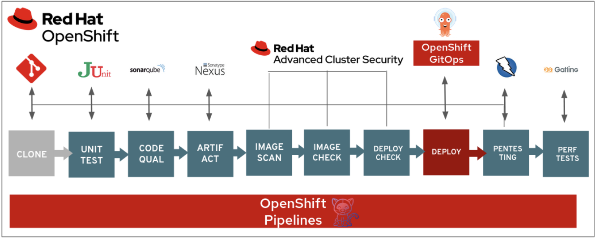

In our DevSecOps CI/CD pipeline, we will be using several technologies such as:

- https://www.openshift.com/learn/topics/ci-cd[OpenShift Pipelines] based on https://tekton.dev[Tekton]
- https://www.openshift.com/blog/announcing-openshift-gitops[OpenShift GitOps] based on https://argoproj.github.io/[ArgoCD]
- https://www.redhat.com/en/resources/advanced-cluster-security-for-kubernetes-datasheet[Red Hat Advanced Cluster Security for Kubernetes]
- https://docs.openshift.com/container-platform/latest/registry/architecture-component-imageregistry.html[OpenShift Container Registry]
- https://www.sonarqube.org/[SonarQube]
- https://www.sonatype.com/products/repository-oss?topnav=true[Nexus]
- https://junit.org/junit5/[JUnit]
- https://gogs.io/[Gogs]
- https://tekton.dev/docs/triggers/[Git Webhook]
- https://gatling.io/[Gatling]
- https://www.zaproxy.org/[Zap Proxy]

[#beforeyoustart]
=== Before you start

The information from the instructor will be used in this lab:

- Access to RHEL 8 VM (bastion) with username and password
- OpenShift Console URL
- OpenShift API server
- OpenShift admin user password

Here is an example of the registration information:

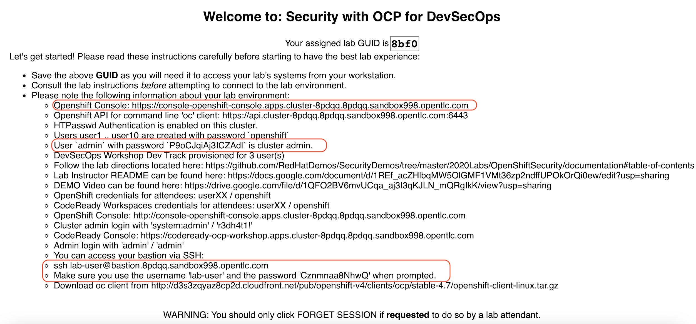

=== User Requirements

- Up-To-Date Browser: Chrome and Firefox recommended
- Command-line with ‘oc’ tool is included in the bastion VM that comes with the lab.

* SSH into the assigned VM similar to the below command:
+
[source]
----
 ssh lab-user@bastion.GUID.sandbox####.opentlc.com
----
+
* To check if the oc command-line utility is available, open the terminal and run the following command:
+
[source]
----
 oc version
----
+
* To get the console URL from command-line:
+
[source]
----
oc login -u admin api.cluster-{GUID}.{GUID}.sandbox###.opentlc.com:6443
----
+
API server information for ‘oc login’ can be found in the xref:beforeyoustart[Before You Start].
+
* Alternatively, if we want to setup oc client on our laptop, perform the following steps:
+
** Log in to the OpenShift console. OpenShift console admin user password information is provided by the instructor.
Select the question mark in the top right corner and select “Command Line Tools”
+
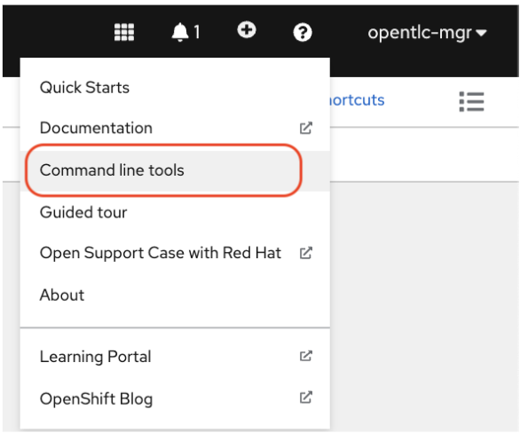
+
** Download the oc command-line tool for the operating system of your choice.
** Move the oc command-line tool to the system executables location for simplicity of access throughout the exercise.
+
For example, on Macbook, run the command
+
|===
|mv <insert-download-path> /usr/local/bin /usr/local/bin/
|===
+
* Internet access to the lab environment
* Internet access to GitHub

=== Lab 4.1 Continuous Integration

This first module will run an OpenShift Pipeline and let us explore the steps in a sample secure pipeline. +
In this lab, we will learn how to start the Tekton pipeline and how to use the tasks to integrate the security and gitops tools within the development lifecycle.

. There are three ways to start the pipeline:
** Option 1: Use Developer UI to start
.. Browse to the OpenShift Console URL in the browser
.. Log in to the console using the provided credentials
.. If we are not already in the Developer Perspective, select Developer to switch to the developer console in the top left corner.
+
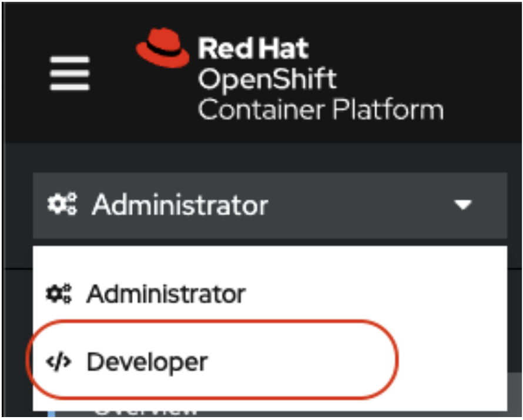
+
.. Navigate to the “ocp-workshop” project
+
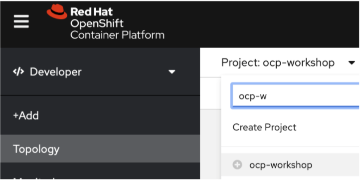
+
.. Click 'Pipelines' on the left menu to view all pipelines
+
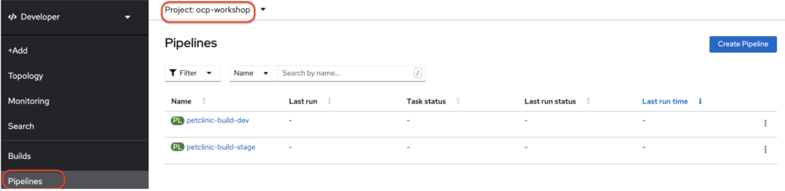
+
.. Click onto the “petclinic-build-dev” pipeline
+
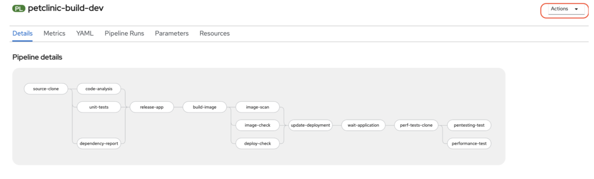
+
.. From the top right corner, click “Actions” → select “start”
+
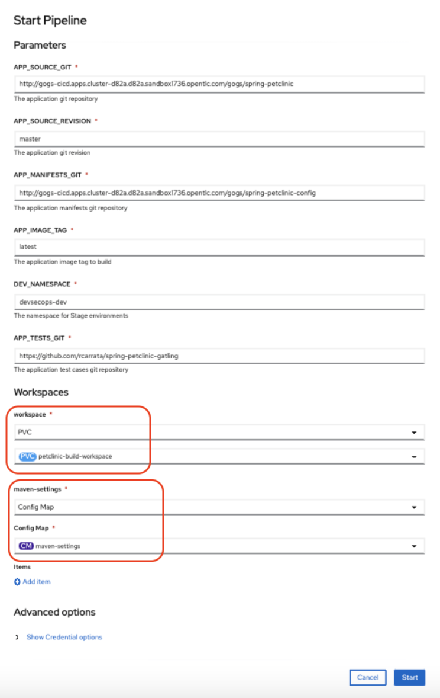
+
.. Under “Workspaces”, select PVC and then choose the PVC petclinic-build-workspace as the shared storage path that the pipelines will use at runtime.
.. Under “maven-settings” select Config Map and choose “maven-settings” as the Config Map
.. Click start
+
** Option 2: Command-line to start the pipeline
The command-line is a convenient way to start the pipeline while testing, and it is a way to simulate a PR or push to git and trigger the pipeline. It is for users who prefer the CLI to start the pipeline.
+
.. Run:
+
[source]

|===
|oc create -f https://raw.githubusercontent.com/RedHatDemos/SecurityDemos/master/2021Labs/OpenShiftSecurity/documentation/labs-artifacts/pipeline-build-dev-run.yaml -n ocp-workshop

|===
+
** Option 3: When new code is pushed to the git repo, it will also trigger the pipeline to start. In this lab, git repo is Gogs. The steps below are for pushing code via the “Gogs” git repo.
This option may be the most popular from a developer perspective. The pipeline starts from a PR or a push into the git repo and the webhook automatically starts the pipeline.
+
.. From the dev console, click `Search` on the left nav menu.
.. Type 'route' and click `Route` from the list.
+
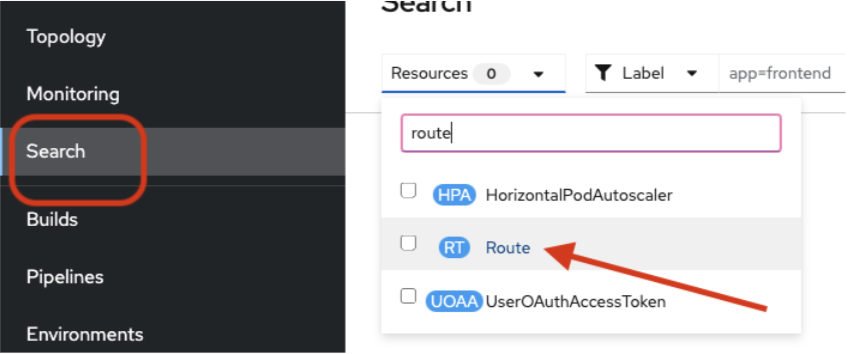
+
.. Click the `Gogs` route to open the gogs URL:
+
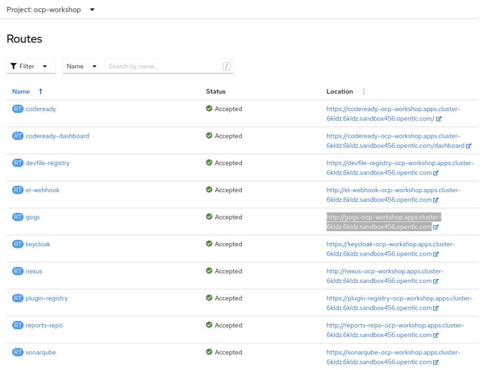
+
.. Click on the `Sign In`, to log in with the _gogsadmin_ credentials:
+
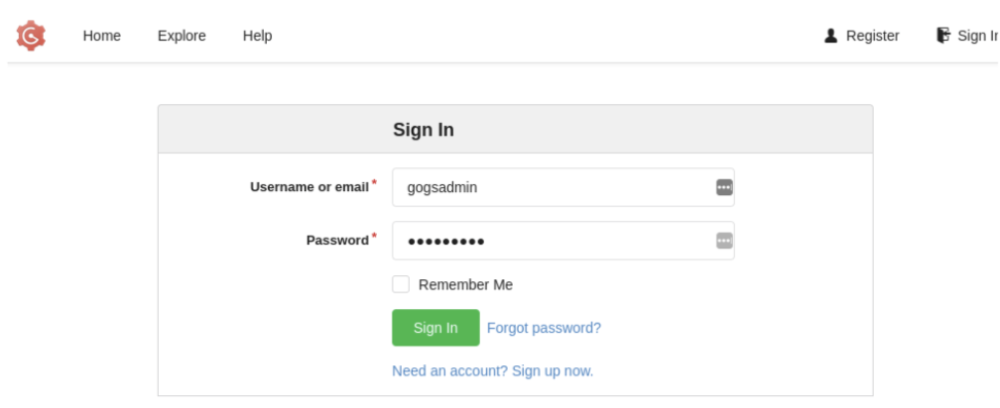
+
|===
|User: gogsadmin
|Password: openshift
|===
+
.. Select the spring-petclinic repository inside of the gogsadmin account:
+
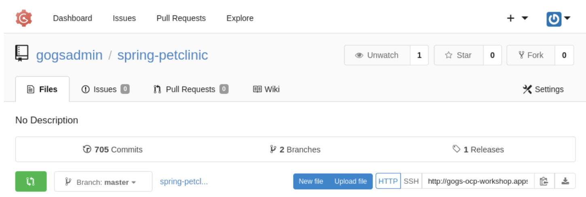
+
.. Click into the README.md, click in `Edit this file` and introduce a change:
+
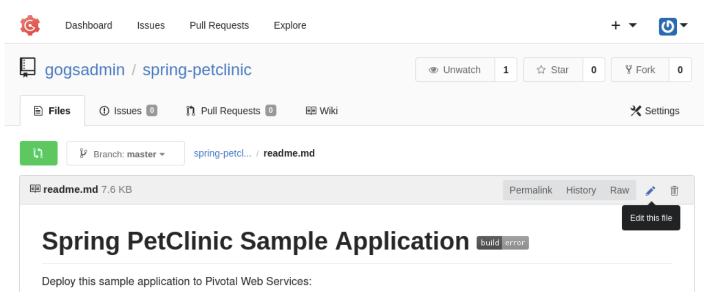
+
.. Commit the change that we introduced into the README.md:
+
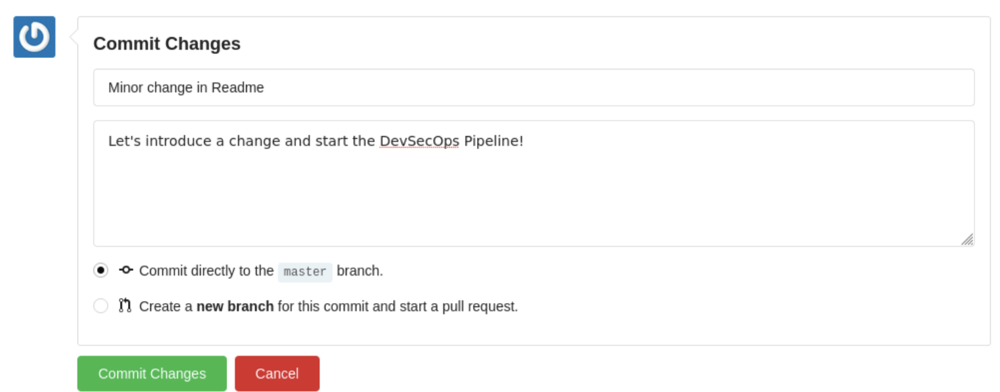
+
[Note] This is only for demo purposes. Usually, the push to master is not recommended, and it’s a Pull Request / Merge Request from another branch (such as develop) that is used instead.
+
.. The pipeline will be triggered automatically, please skip to step 6 of this lab to see the Pipeline Runs console.
+
. Open the browser using the provided OpenShift console URL.
. Log in to the console using the provided credentials.
. Click to `Developer` to switch to Developer's console.
+

+
. Make sure the `ocp-workshop` project is selected.
+
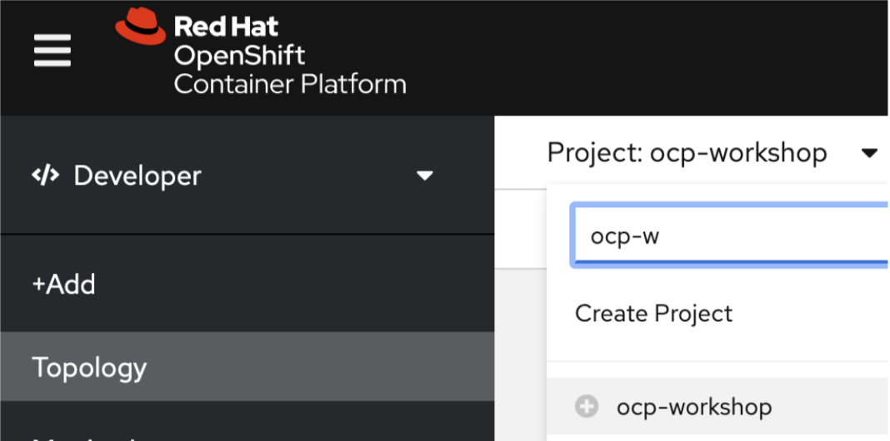
+
. Click `Pipelines` on the left menu to view all pipelines.
+
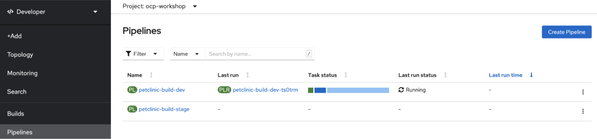
+
. Click onto Pipeline `petclinic-build-dev` and click onto the `Pipeline Runs` tab.
+
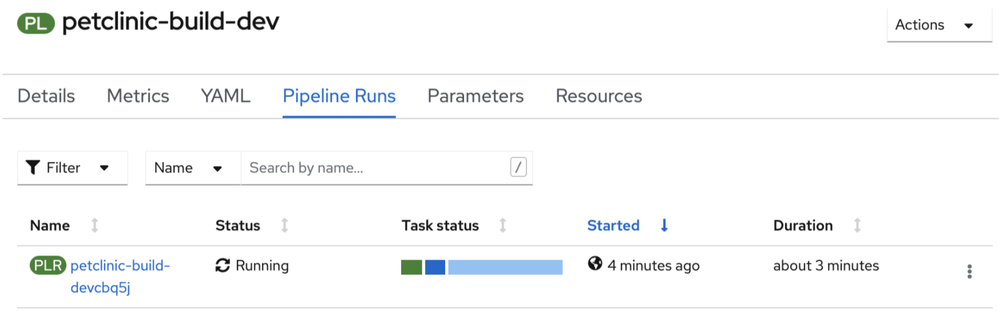
+
.  Click onto the Pipeline Run.
+
Please see the Pipeline Run as shown below when it starts.
+
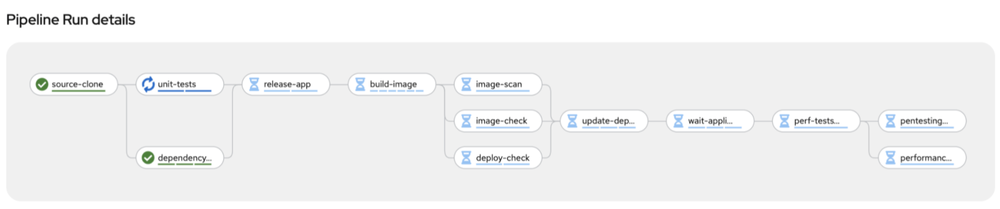
+
The pipeline run will fail at step “image-check” in the pipeline run. This is due to an Important severity level vulnerability in the image detected by a pipeline gate policy, stopping the deployment.
+
image:images/lab4-devsecops20.png[500,700]
+
The vulnerability has to be fixed for the pipeline to complete successfully. We will do it in the next module. Here is what a successful run looks like.
+
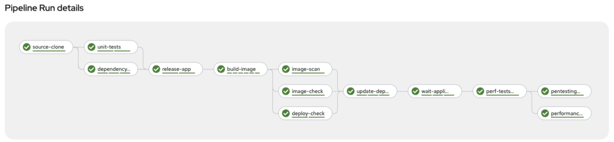
+
The next module, lab 4.2 will walk through what’s happened and how to resolve it securely.
+
[Note] In addition to triggering a pipeline run manually, every push to the `spring-petclinic` Git repository on the Gogs server kick off the pipeline via configired Pipeline triggers.
. Explore the pipeline! Once the pipeline is started, we can click on each detailed step to explore logs for each step. We’ll direct some of the explorations in the next few steps.
.. *Source Clone* - app source code is pulled from the Git (Gogs) server installed in this lab.
+
[Note] Files persist between steps in the pipeline via workspace that is pre-defined in the pipeline.
+
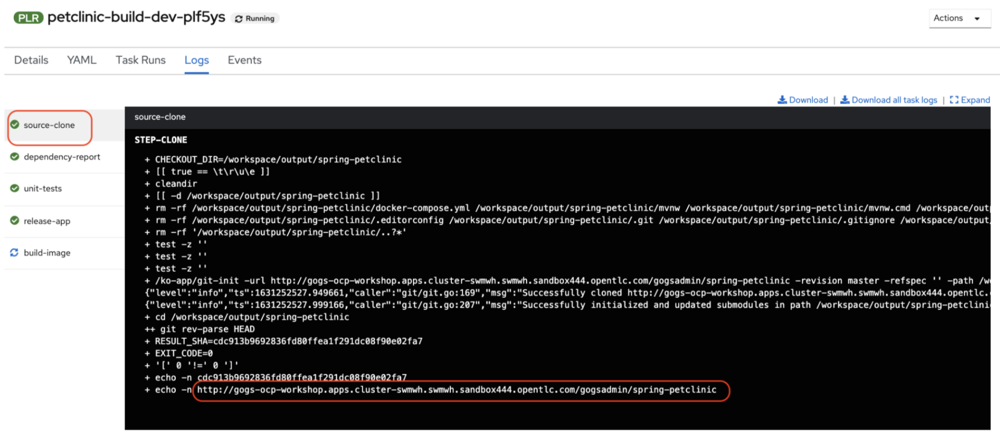
+
... Copy the Git repo URL. Open a browser tab to explore the code
... The URL takes us to the Gogs git repo as shown below.
+
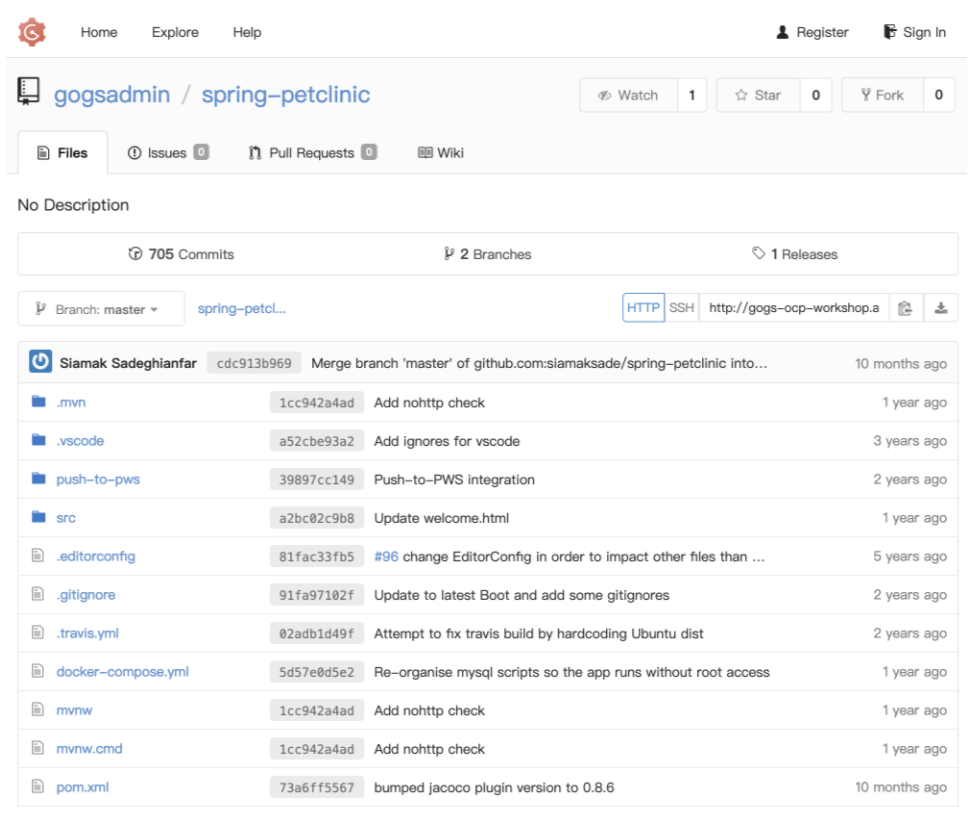
+
... Click onto `gogsadmin` and there are 2 repositories for this lab.
+
The credentials for `gogsadmin` user are:
+
|===
|User: gogsadmin
|Pass: openshift
|===
+
.. *Dependency Report* is a step in the pipeline that creates a report of the app dependencies from the source code and uploads it to the report server repository.
+
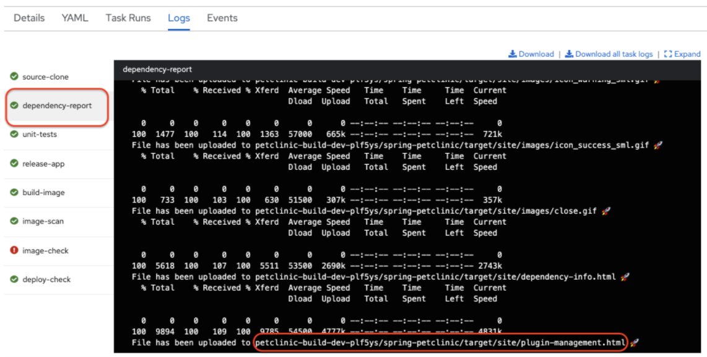
+
Let’s look at the report!
+
... From the dev console, click `Search` on the left nav menu
... Click Resources, type `route`, and click `Route` from the list
+

+
... Click on the reports repo link
+
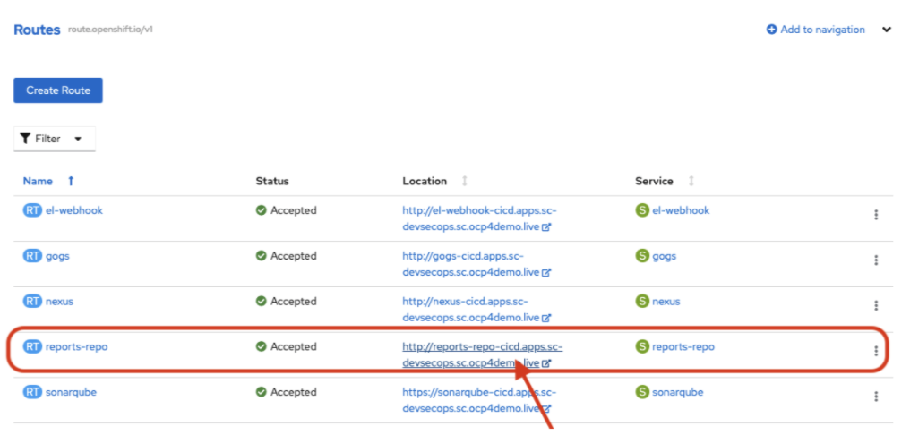
+
... Click onto the `petclinic-build` link from the page
+
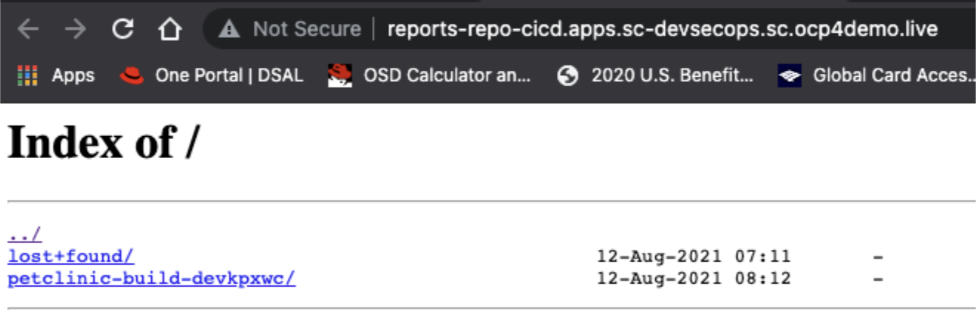
+
... Continue to click on spring-petclinic → target → site
... Click on the `Dependencies` from the page. We may examine the details from that page by scrolling down
+
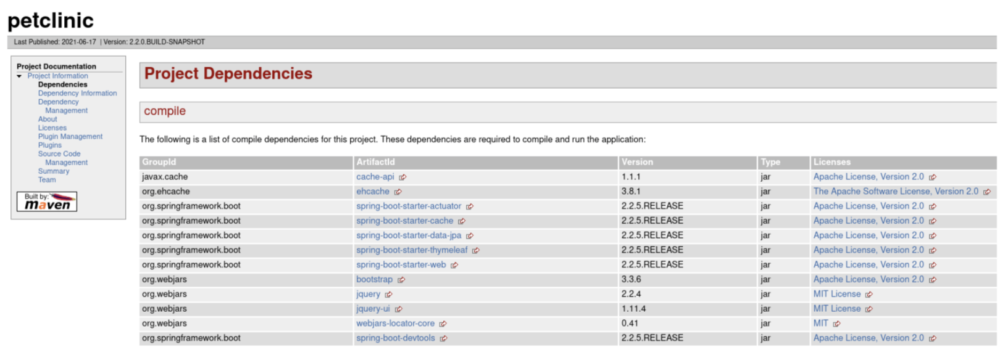
+
.. *Unit tests* task is executed in parallel with dependency report.
+
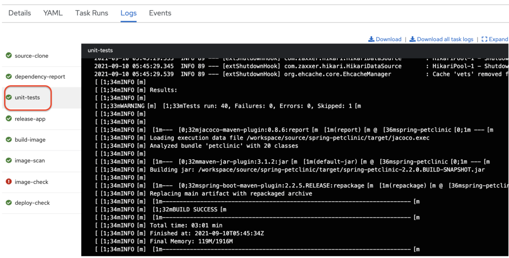
+
. *Release-app* is where** **the application is packaged as a JAR and released to the Sonatype Nexus snapshot repository.
+
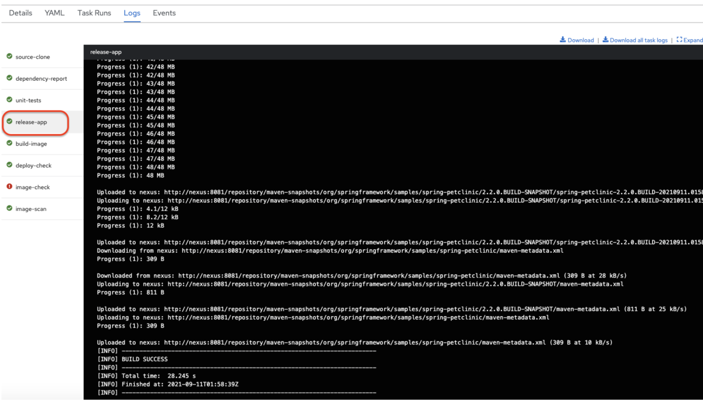
+
. *Build-image* step is when a container image is built in DEV environment using S2I, pushed to OpenShift internal registry, and tagged with `spring-petclinic:[branch]-[commit-sha]` and `spring-petclinic:latest`
+
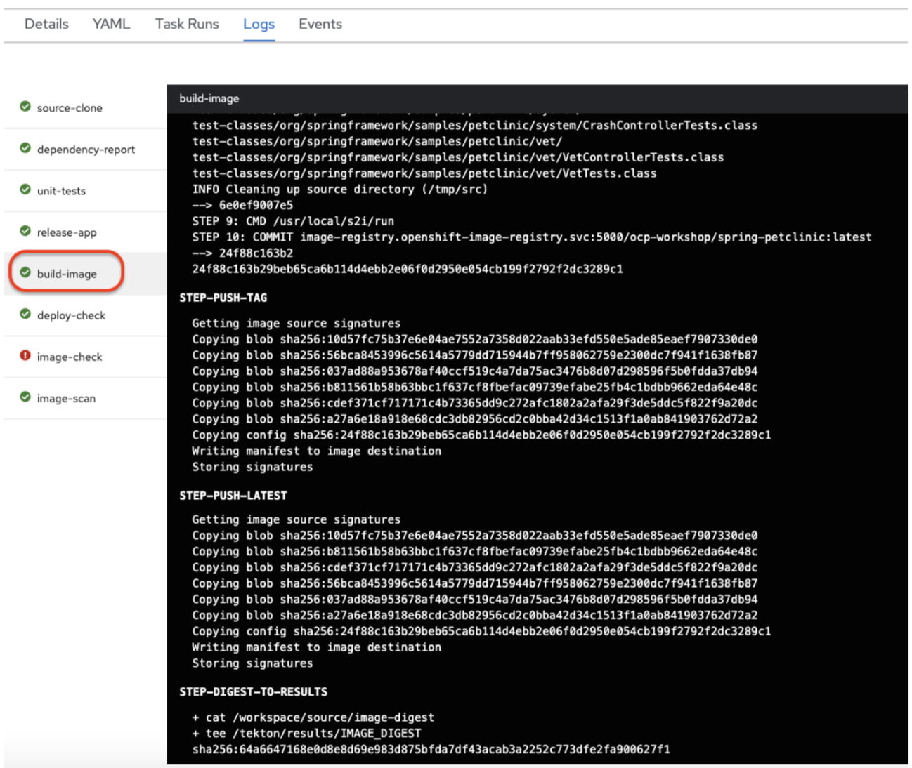

=== Lab 4.2 DevSecOps steps using Advanced Cluster Security

Red Hat Advanced Cluster Security (ACS) for Kubernetes controls clusters and applications from a single console, with built-in security policies. +
First-generation container security platforms focus on the container. ACS’s focus on Kubernetes helps DevOps and Security teams operationalize security, with a Kubernetes-native architecture that leverages Kube's declarative data and built-in controls for richer context, native enforcement, and continuous hardening. In addition, ACS focuses on Kubernetes helps DevOps and Security teams operationalize security, simplifying the process of protecting the cloud-native application stack.

In this lab, we will learn how ACS integrates into the CI/CD process. ACS not only simplifies the process but provides visibility to the security team in our organization.
Using https://docs.openshift.com/acs/cli/getting-started-cli.html[roxctl] and ACS API, we integrated several additional security steps into our DevSecOps pipeline:

. The *image scan* step uses the ACS Scanner to scan the image generated and pushed in the last step.
+
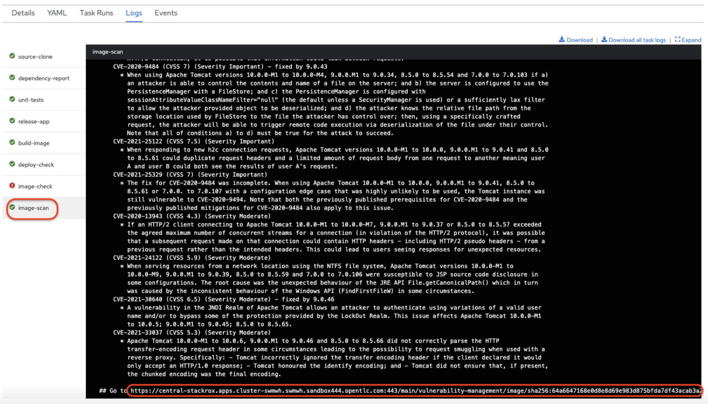
+
The error below in the log is caused by the `pretty` format is deprecated.
+
|===
|ERROR:	invalid output format "pretty" used. You can only specify json or csv
|===
+
To change the format you can do the steps below.

.. Click `Pipelines` on the left menu
.. Click onto the `petclinic-build-dev` pipeline
.. Select `Actions` -> `Edit Pipeline`
.. Click onto the `image-scan` task and use `csv` instead of `pretty`
+
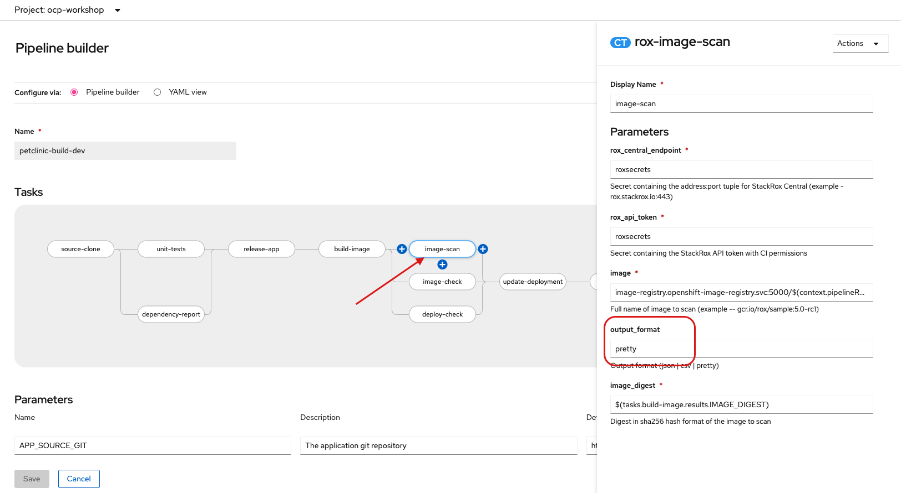
+
.. Click `Save`
.. Optionally select `Actions` -> rerun and you will see the actual output of the image-scan.
+
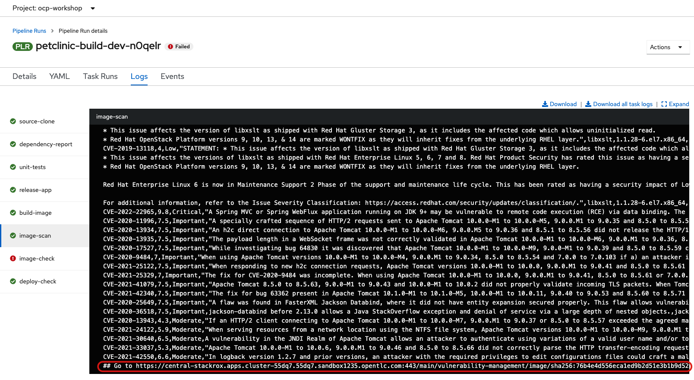
+
In the logs of this step, there is a direct link to the image scan in ACS.
+
[Note] If we see a security certificate warning proceeding to that link, ignore it. +
Copy and paste URL into another tab in order to get more information about the scanned image - it would open ACS Centra login screen Enter the following information:
+
|===
|User: admin
|Pass: stackrox
|===
+
The URL takes us to Vulnerability Management. Here is an overview of the vulnerabilities (CVEs) found in this image:
+
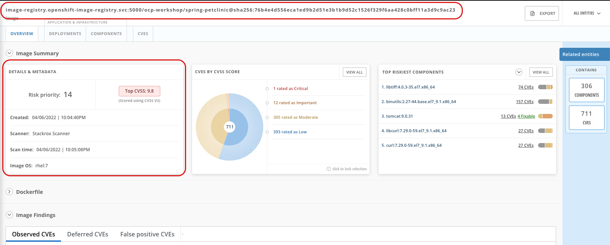
+
.. Under the Deployment tab
The ACS tool is aware of if this image is deployed. Since the first pipeline didn’t pass all of its gates and image was not pushed, at first there will be no deployments displayed.

.. Under the Component tab
This is a view of all of the components in this image. It lists relevant information such as the number of CVEs that can be fixed with an upgrade of the component, top CVSS score associated with any of the CVEs in the component, and other deployments that include each component.
+
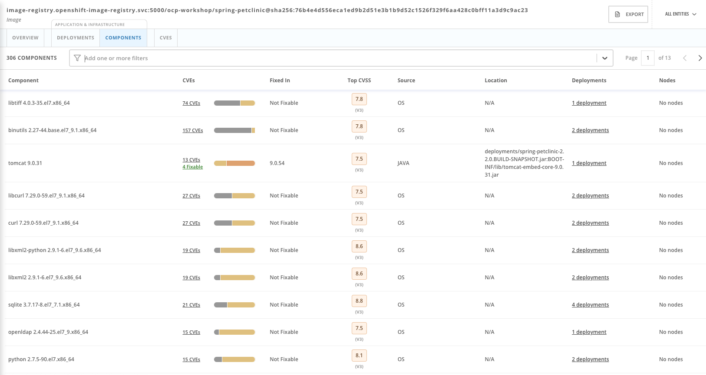
+
For example, if we click on the tomcat 9.0.31 component, we will see the details of the component as shown below. This page shows the risk priority, the CVE's information, the location of the component, and the version of the component to upgrade to in order to remediate the CVE.
+
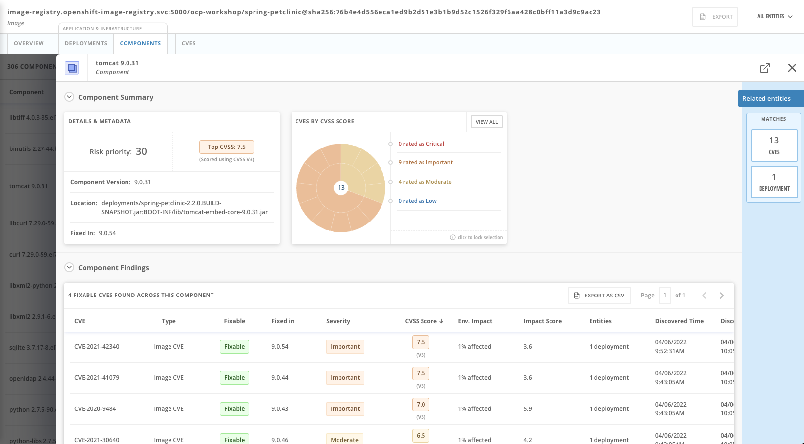
+
.. Click “X” on the top right to go back
.. CVEs tab presents a view of all vulnerabilities of the image
+
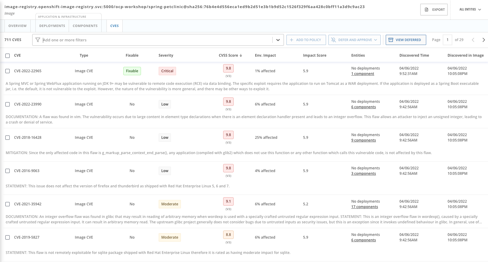
+
.. Go back to the `Overview` tab, and scroll down to the `Image findings` section, we will see the fixable CVEs. These are CVEs where ACS knows there are fixes available.
+
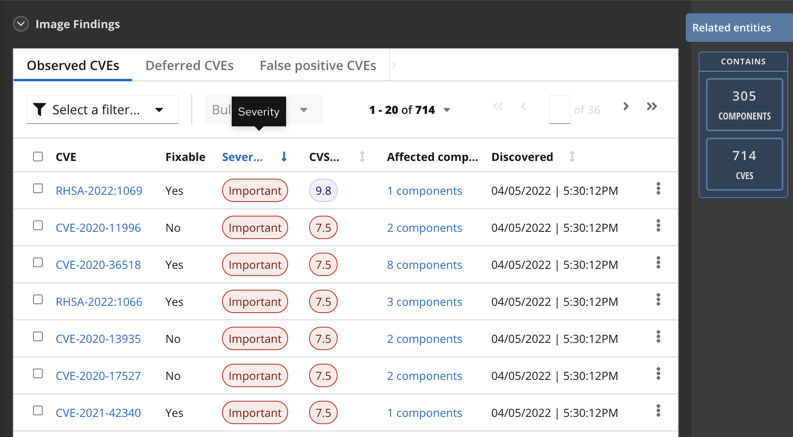
+
.. Click '>' to expand `Dockerfile` section above the `Image Findings` section, the detailed image components and related CVEs are shown per each step, per the ACS CVE database.
+
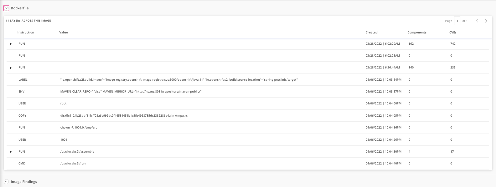
+
Feel free to continue to explore ACS before continuing to review the pipeline. Understanding security checks and tool capabilities are a key part of this lab and can help raise the knowledge of a secure software delivery pipeline.
+
Now, go back to OpenShift Developer console.
. The *Image Check* step of the pipeline
+
[Note] The build-time violations of the different security policies defined in ACS.
+
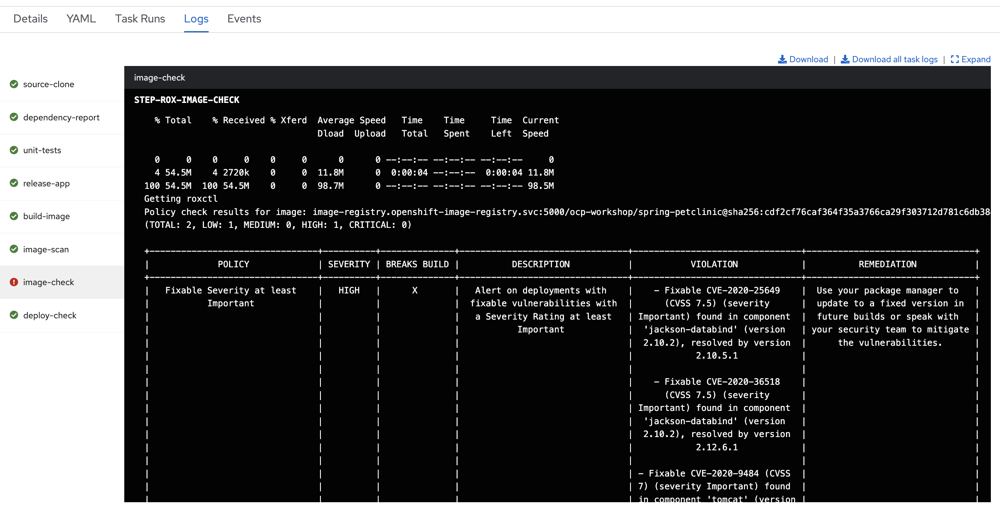
+
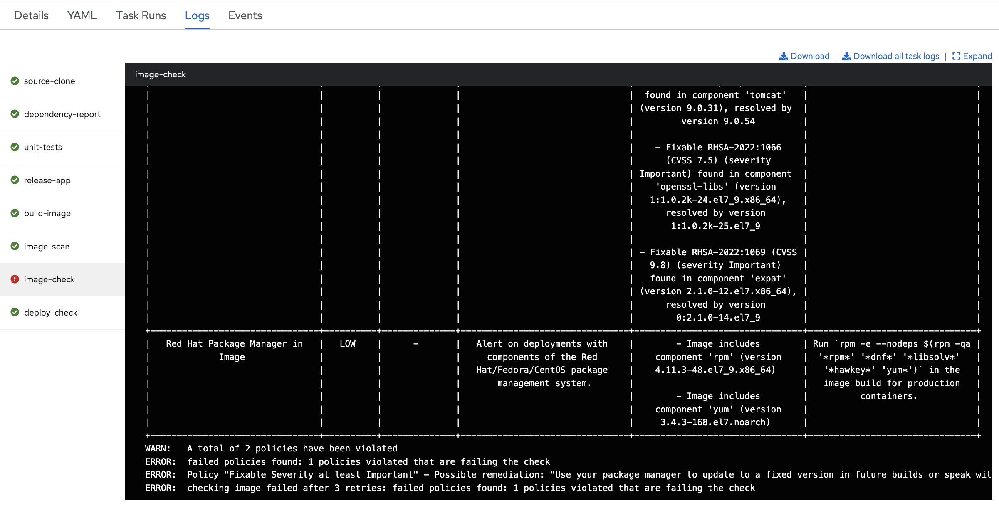
+
This step checks build-time and deploy-time violations of security policies defined in ACS for any deployment that uses this image. Due to security policy violations, this pipeline fails at this task because we set security Policy enforcement in ACS.
Scanning images is critical to prevent highly vulnerable containerized applications from deployment.

. *Deploy-check* shows the violation of the policies in the log. The log shows the violations, but it did not fail at this task because the deployment enforcement is not on in this example. We will explore more on the policy in the later lab.
+
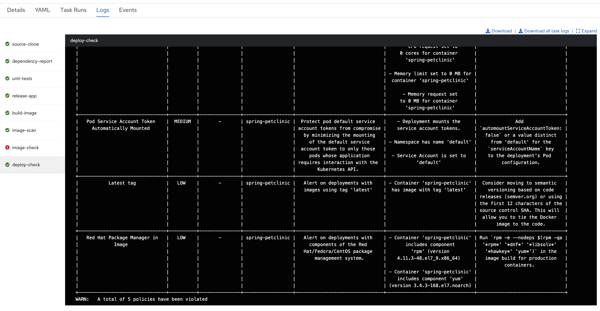
+
[Note] These 3 steps (*deploy-check, image-check, and image-scan*) are executed in parallel to save time in our DevSecOps pipeline.
+
. If *image-check* fails, go to the pipeline run and click `image-check`. The bottom of the log shows `Error: failed policies found: 1 policy violated that are failing the check.` The reason for the error is because ACS enforces the policy from building and deploying if a violation occurs. The pipeline integrates ACS via the `roxctl` CLI in Tekton pipeline tasks.
+
When an image violates the policies, the best practice is to fix the code and execute the pipeline until it passes the checks. The logs reported the list of violations and remediation. Developers can take the information from the `image-check` task’s log and make changes accordingly. When the fix is checked into Git, the pipeline will be triggered. We have prepared the xref:fiximage[bonus exercise for fixing the image]. If we would like to continue to test other tasks on the pipeline, we can add an exception to the policy to exclude the `spring-petclinic`.
Adding an exception to a policy can be useful when developers need to fix the code, and the CI process needs to continue the testing.
+
[Note] Please be aware that fixing the image source code to remove such violations will be the recommended approach.
+
Assuming that we will add an exception to bypass the policy for `spring-petclinic` image build.
+
.. When we inspect the log from the *image-check* task, we will find the below message which caused the failure:
+
|===
|✗ Image image-registry.openshift-image-registry.svc:5000/ocp-workshop/spring-petclinic@sha256:ece54d2923654c36f4e97bc0410f5c027871c5b7483e977cfc6c2bd56fef625d and '*ERROR: Policy "Fixable Severity at least Important"*'
|===
+
.. Click `waffle icon`  to get the console links → select `Red Hat Advanced Cluster Security For Kubernetes` as shown below.
+
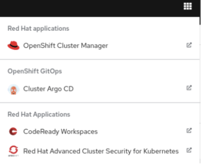
+
.. You will be prompted to log in to the ACS console → click `Advanced` → `Proceed to central-stackrox.apps.cluster...` link to proceed.
.. Enter the following login credentials:
+
|===
|User: admin
|Pass: stackrox
|===
+
.. Click `Login` - you should land on the ACS page as shown below.
+
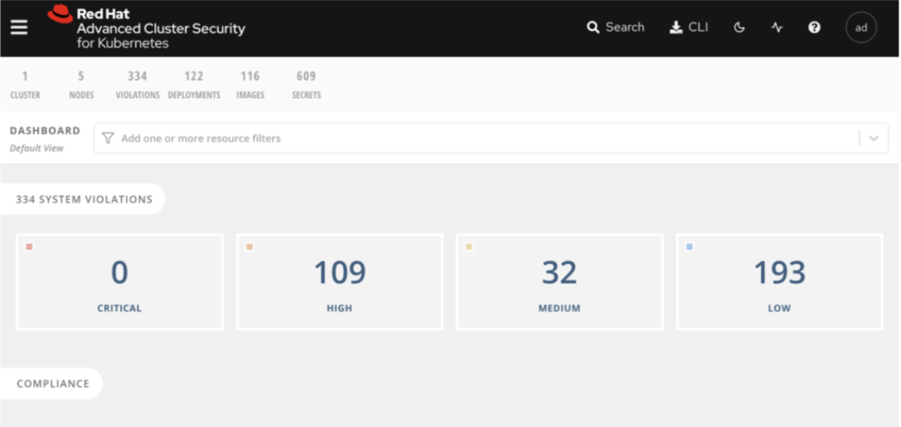
+
.. Click  on the top left → click Platform Configuration → select Policies
+
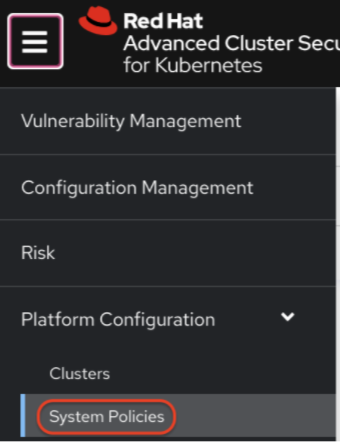
+
.. Under Policies, put the policy name *Fixable Severity at least Important* in the search field and hit Enter. The policy will list as the result.
+
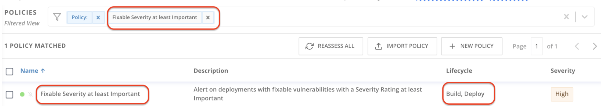
+
* Click onto `Fixable Severity at least Important` to open Policy details page. The Policy page allows Edit, Clone, Export and Disable policy under `Actions`. Click 'Edit policy' under `Actions`. Developers can use the information in the guidance to fix the image. The lifecycle stage information is where the policy enforcement takes place. Since the enabled policy is violated, it will not pass the Build and Deploy stages in the pipeline.
+
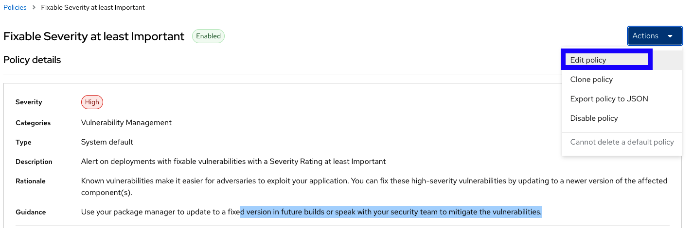
+
* Click `Next` on the Policy Details
* Click `Next` on the Policy Behavior
* Click `Next` on Policy Criteria  in order to get to the Policy Scope section UI to specify the image to be excluded from checking
* In the Exclude Images section, type the following to filter the options in the `Excluded Images (Build Lifecycle only)` list:
+
|===
|image-registry.openshift-image-registry.svc:5000/ocp-workshop/spring-petclinic
|===
+
* Select the `Create "image-registry.openshift-image-registry.svc:5000/ocp-workshop/spring-petclinic" option.
+
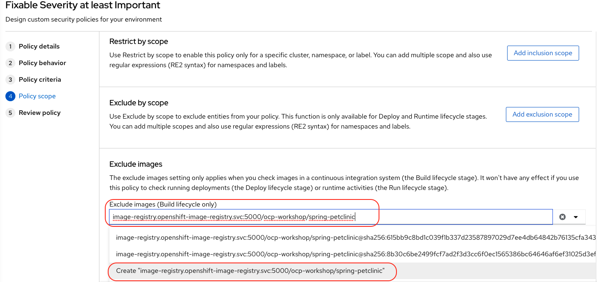
+
* Click `Next`
* Please review Policy Summary before clicking `Save`
+
.. Now, the updated `Fixable Severity at least Important` policy with excluded image is shown below:
+
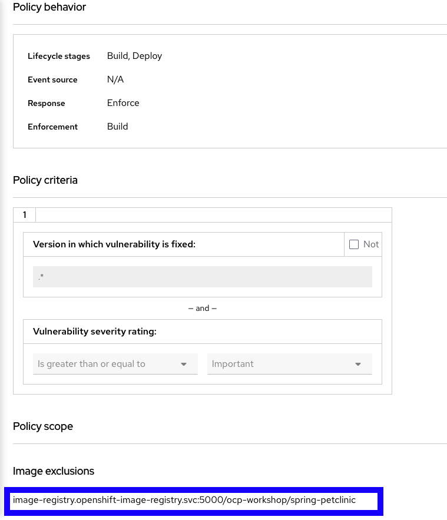
+
.. Switch back to the OpenShift Developer console, and select the failing Pipeline on the nav under “ocp-workshop” project
+
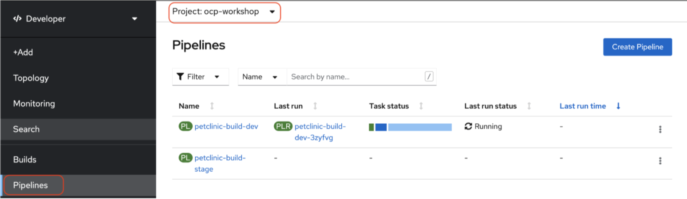
+
.. Rerun the pipeline
+
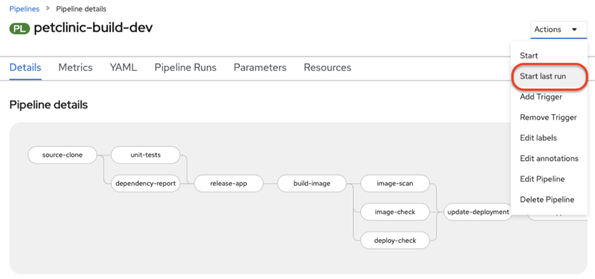
+
.. Click onto the Pipeline Runs tab and select the one just started - it should now complete successfully
+
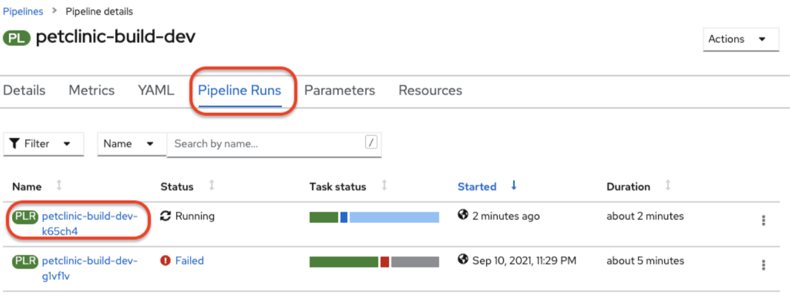
+
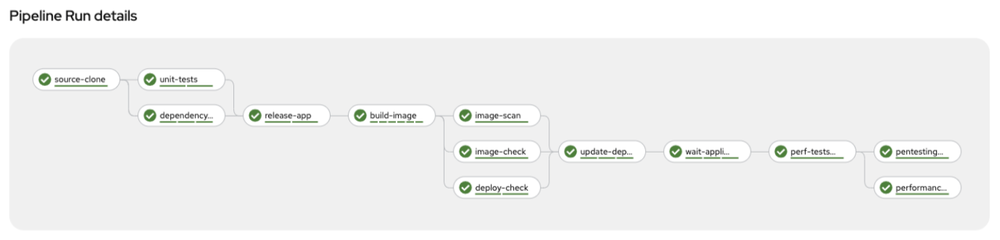
+

.. [Notes]: There still are warnings for other, non-critical, ACS Policy violations in the `image-scan` step, but they don't block the pipeline from completion
+
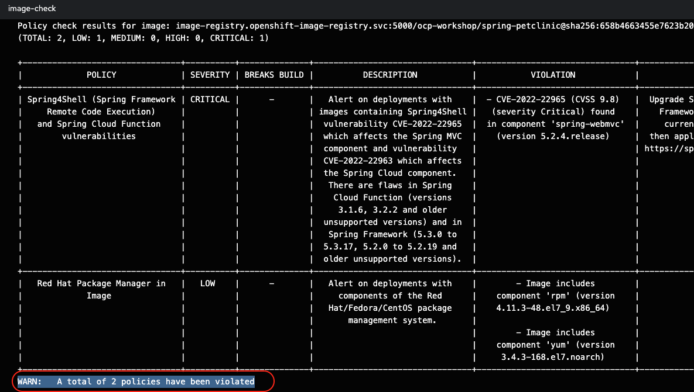
+
.. If you finish the xref:fiximage[bonus lab] to fix the source image vulnerability, go back to the above Policy and remove the excluded `spring-petclinic` image from there.
.. Kubernetes kustomization files are updated in the *update deployment step* with the latest image [commit-sha] in the overlays for dev. This will ensure that our applications are deployed using the specific built/tagged image in this pipeline.
+
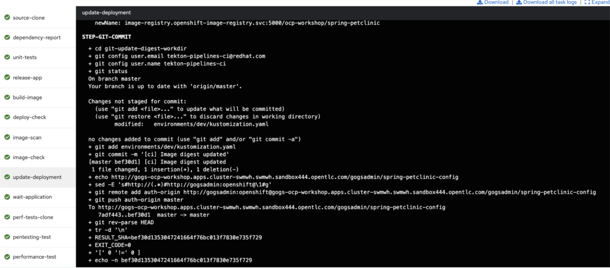

=== Lab 4.3 Continuous Delivery Using GitOps

https://www.redhat.com/en/topics/devops/what-is-gitops[GitOps] is a declarative way to implement continuous deployment for Cloud-native applications. We can use GitOps to create repeatable processes for managing OpenShift Container Platform clusters and applications across multi-cluster Kubernetes environments. GitOps handles and automates complex deployments at a fast pace, saving time during deployment and release cycles. +
The GitOps workflow pushes an application through development, testing, staging, and production. GitOps either deploys a new application or updates an existing one, so we only need to update the repository; GitOps automates everything else.

Argo CD continuously monitors the configurations stored in the Git repository and uses Kustomize to overlay environment-specific configurations when deploying the application to DEV and STAGE environments.

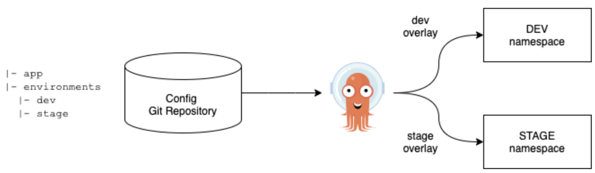

. The ArgoCD application syncs the manifests in our Gogs git repositories, and applies the changes automatically into the namespaces defined:
.. Click on the waffle icon on the top to get to the console links and select “Cluster Argo CD”
+

+
.. The link redirects to the Argo CD login. If it is the first time logging in to Argo CD, please click `Advanced` → `Proceed to openshift-gitops-server-openshift-gitops.apps…` link.
.. In order to be able to log in as an "admin" user, please first retrieve its password by running the command as shown below.
+
[source]
----
oc get secret/openshift-gitops-cluster -n openshift-gitops -o jsonpath='{.data.admin\.password}' | base64 -d
----
+
.. Once logged in, the applications are listed on the Argo CD console as shown below.
+
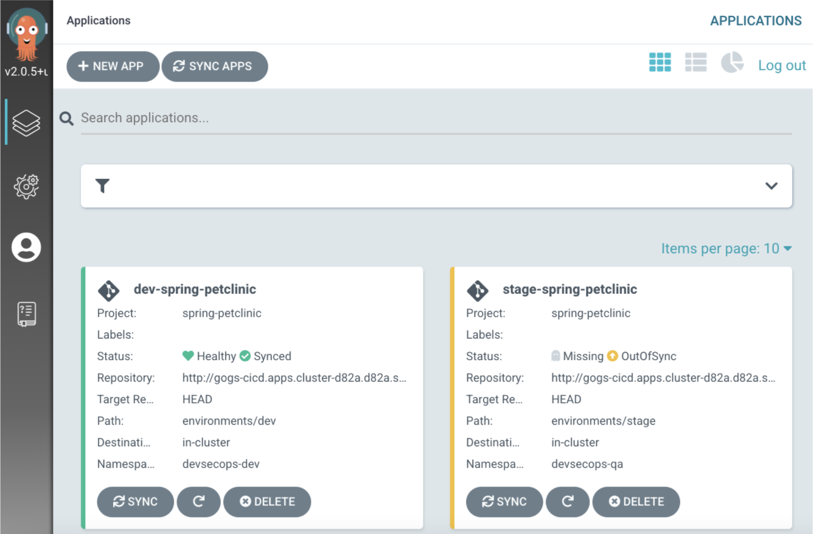
+
.. Click onto `dev-spring-petclinic` to access the application.
. ArgoCD will deploy every manifest that is defined in the branch/repo of our application. The application shows “Synced”.
+
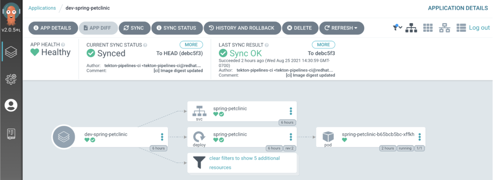
+
.. Click  to view the details of the `dev-spring-petclinic` application.
+
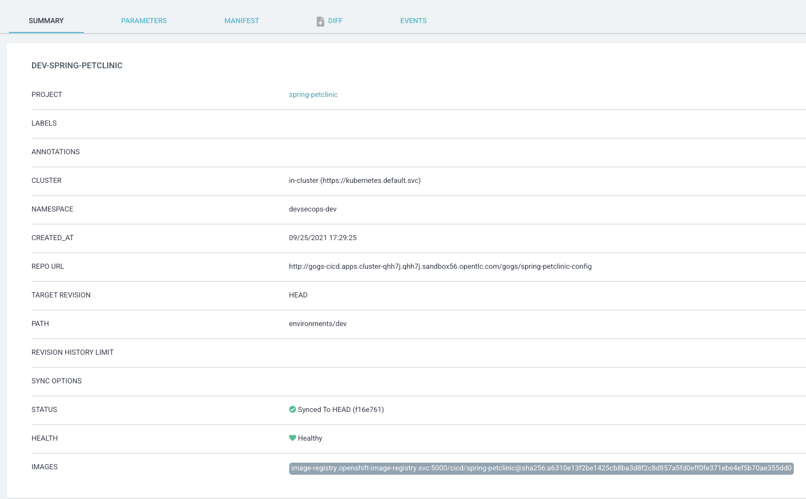
+
.. The details above show the namespace where the application is deployed. Back to the OpenShift Dev console, click `Topology` on the left navigation menu under devsecops-dev project. Click the arrow to access the application URL.
+
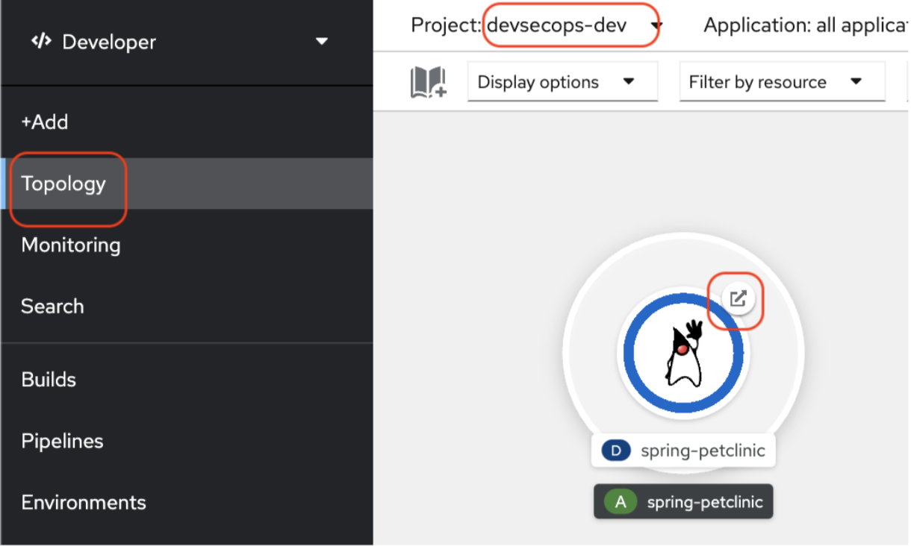
+
* Application shows as below.
+
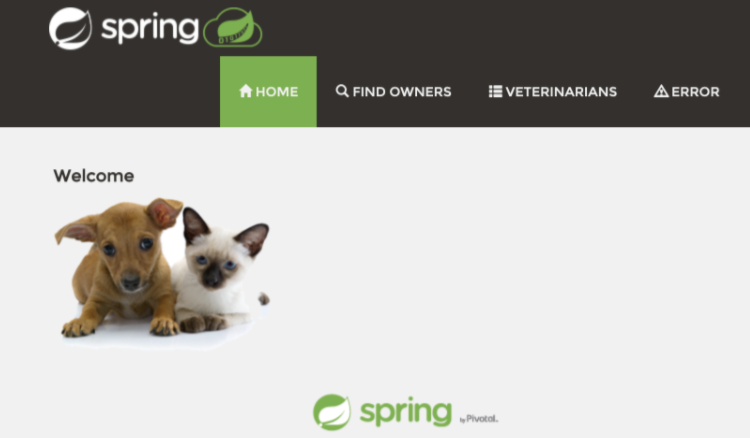
+
.. Go back to the Argo CD console. Click `Applications` on the top left.
+
[Note] The namespace for `stage-spring-petclinic` is set to devsecops-qa.
+
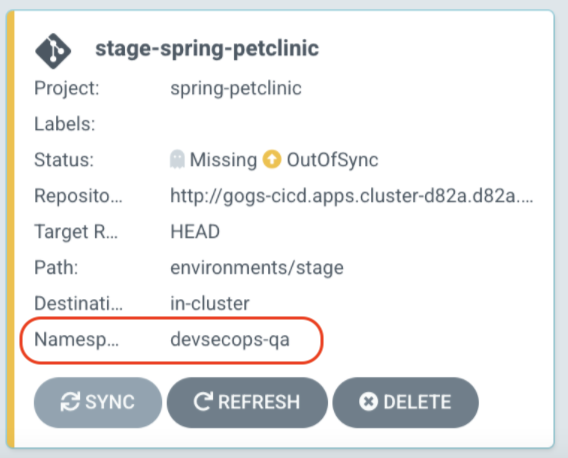
+
.. Click `stage-spring-petclinic`
+
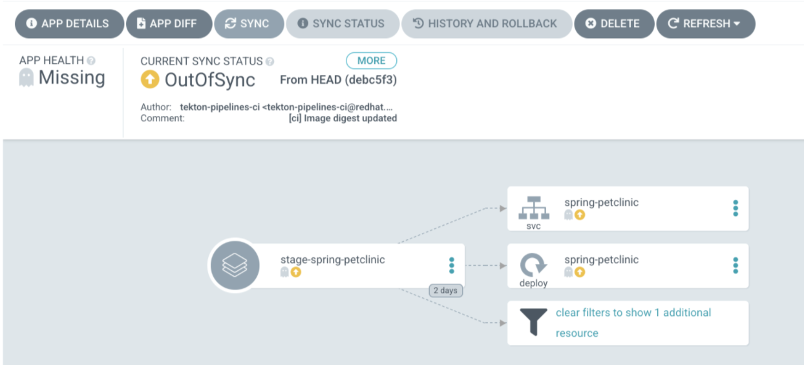
+
.. Click 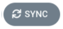 on the top menu to deploy the application to devsecops-qa and wait until “Synced” as shown below.
+
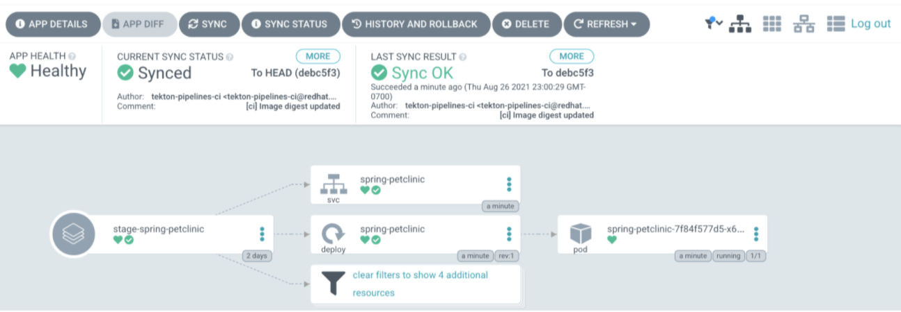
+
.. Back to the OpenShift Dev console, click `Topology` on the left navigation menu under devsecops-qa project. Click the arrow to access the application URL.
+
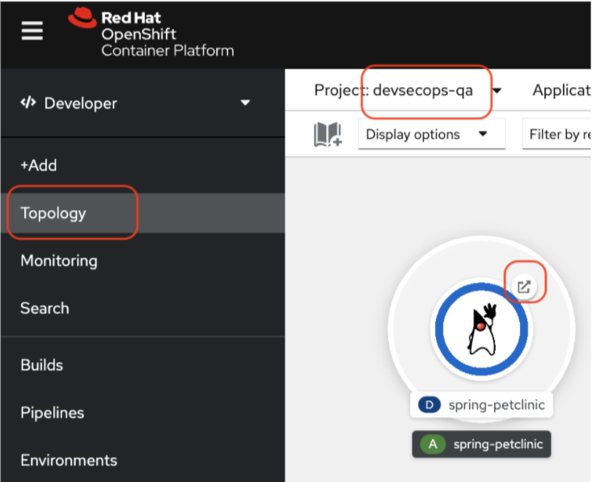
+
.. The application is now deployed to the devsecops-qa project as shown below.
+
image:images/lab4-devsecops67.png[300,500]

=== Lab 4.4 PostCI - Dynamic Application Security and Testing (DAST)

*Dynamic application security testing (DAST)* is designed to detect conditions indicative of a security vulnerability in an application in its running state. DAST has an important role in helping to identify vulnerabilities in an application during production. Running a DAST penetration test enables us to find those vulnerabilities before an attacker does.
In this lab, ZAP is used to perform application security testing as an example. Performance tests and penetration tests start in parallel after the application is promoted from Dev to QA.

. Our CI in Openshift Pipelines waits until the ArgoCD app is fully synced (*Wait Application step*) and our app and all the resources are deployed
.. Go to the successful pipeline run, and go to the step *wait-application*
+
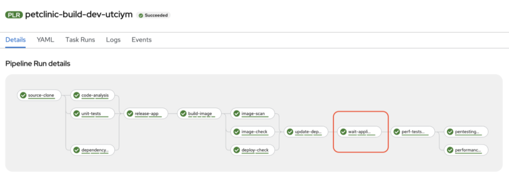
+
.. Click onto the step, the log is shown below.
+
This step authenticates into an ArgoCD instance and initiates the synchronization process for 'dev-spring-petclinic' application from Git repo (gogs) to the target project in the OCP cluster.
+
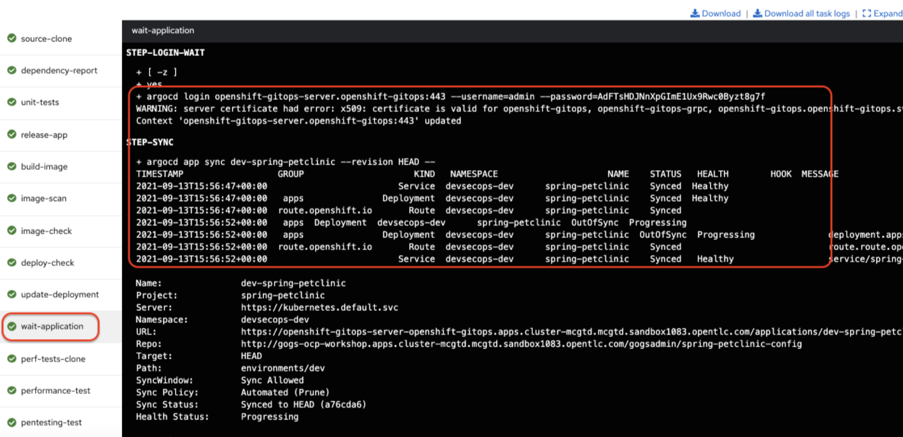
+
. Click on the pipeline the step *perf-test-clone*
+
The performance tests are cloned (*Performance Tests Clone*) into our pipeline workspace as shown below.
+
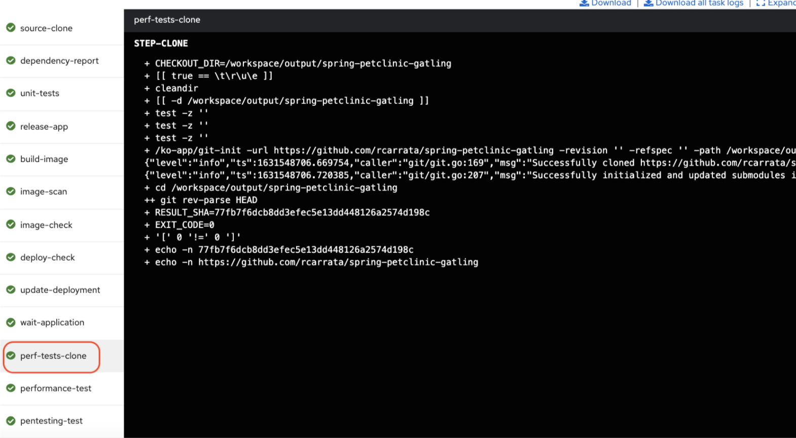
+
. Click onto step *pentesting-test*
+
The pentesting is executed (*Pentesting Test*) using the web scanner https://www.zaproxy.org/[OWASP Zap Proxy] using a baseline to check the possible vulnerabilities. A Zap Proxy report is uploaded to the report server repository.
See the result from the bottom of the log.
+
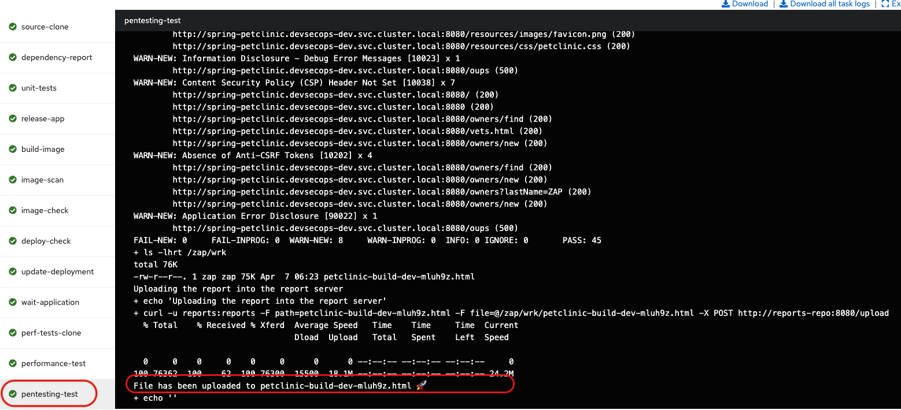
+
. A performance report is uploaded to the report server repository.
.. Click `Route` on the left navigation, click `reports-repo` route location.
+
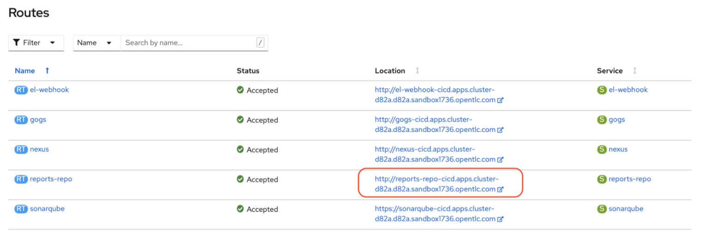
+
.. The link has the name that corresponds to the name of the PipelineRun.
.. Please click on the link with the same name as the PipelineRun. A similar link is shown below.
+
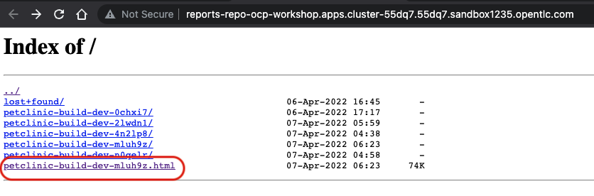
+
.. Go to petclinic-build-dev-XXXXXX.html under the route location
+
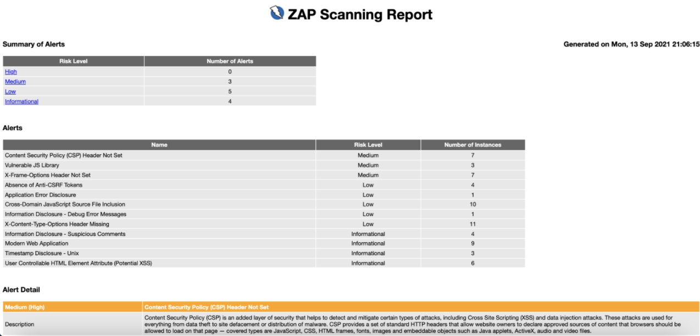
+
. In parallel, the performance tests are executed using the load test https://gatling.io/[Gatling]. Click “performance-test” from the pipeline run.
+
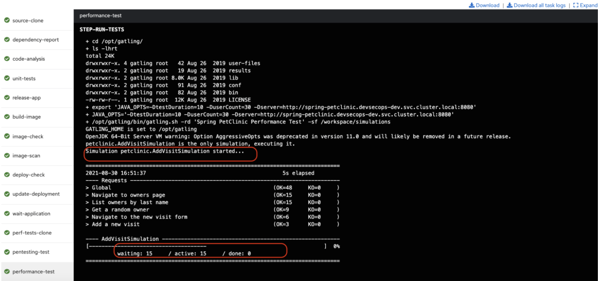
+
.. Scroll down to see the report location
+
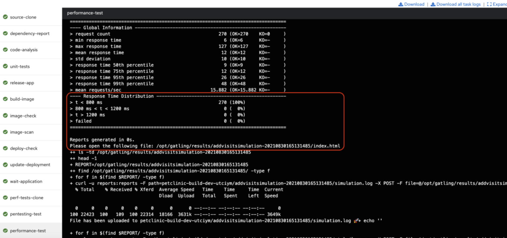
+
.. Go back to the report repo location:
+
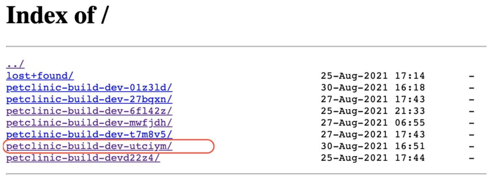
+
.. Click on the link that matches the name of Pipeline Run, then select the link corresponding to the "addvisitsimulation" performance test that is also shown in the `performance-test` task log.
+
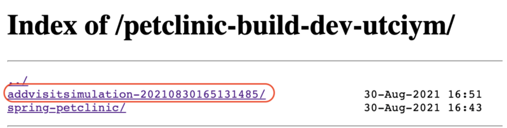
+
.. Please see the result of the performance test page similar to the image below.
+
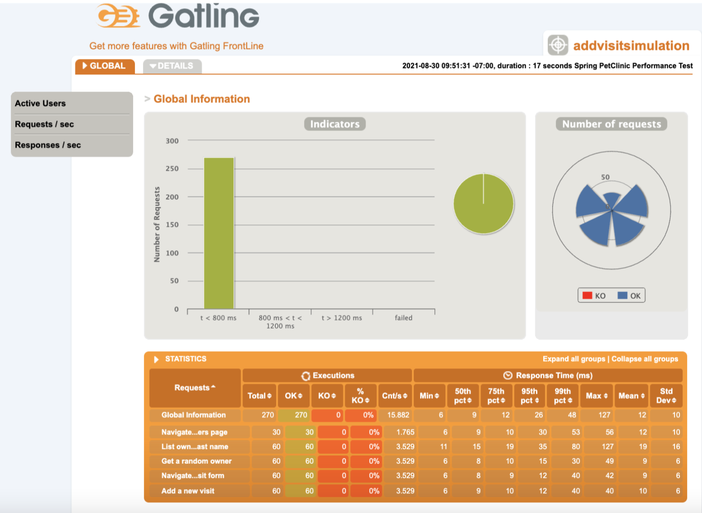

=== Lab 4.5 Security Policies and CI Violations

In this demo, we can control the security policies applied to our pipelines, scan the images, and analyze the different deployment templates used to deploy our applications. +
We can enforce the different Security Policies in ACS, failing our CI pipelines if a violation of this policy appears in each step of our DevSecOps pipelines (steps “image-check”, “image-scan”, “deploy-check”).

* Click on the `waffle icon` and select `Red Hat Advanced Cluster Security for Kubernetes`
+

+
* Log in using credentials `admin/stackrox` to ACS console.
+
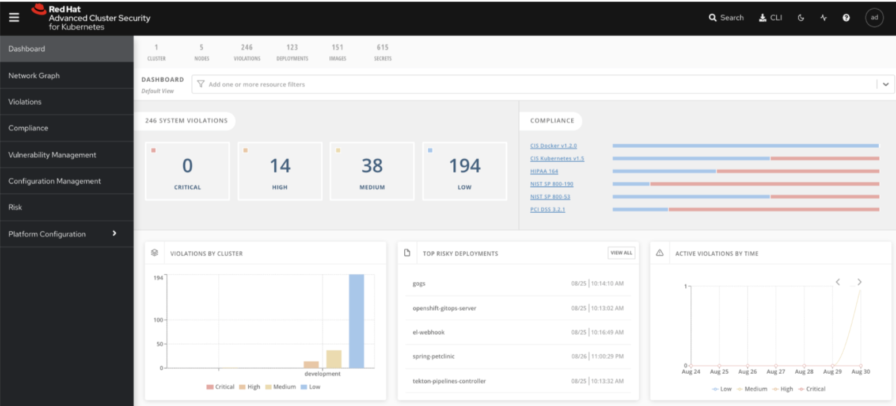
+
* Click Platform Configuration → Policies
+
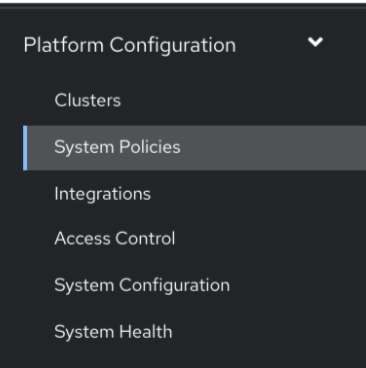
+
Security Policies can be defined at the BUILD level (during the build/push of the image), or at the DEPLOYMENT level (preventing the deployment of the application).
* Click on the `Red Hat Package manager in Image` policy
+
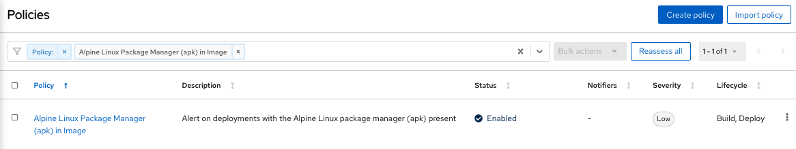
+
For example, this Security Policy checks if an RH Package Manager (dnf, yum) is in the application Image and will FAIL the pipeline if it detects that the image built contains any RH Package Manager.
* The policy details can be modified. Also, the lifecycle stages are defined by the policy and other properties. The enablement of the Policy option is where the user controls the CI to fail or pass.
+
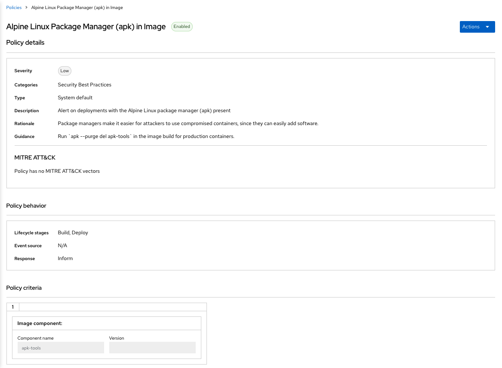
+
* Click `Actions` -> `Edit policy`
* Click `Next` on `Policy Details`
* Select `Inform and enforce` under Response method
* Select `Enforce on Build` for Build
+
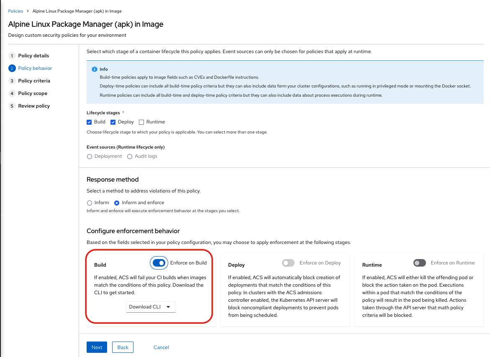
+
* Click `Next` 3 times and `Save`
This policy enforcement ensures that DevOps team have total control of SDLC: no image is pushed into the image registry or is deployed to the cluster that surpasses the defined Security Policies.

[#fiximage]
=== Bonus suggestion for Lab 4.2: Fixing the source image

To show a complete DevSecOps demo and show the transition from a `bad image` to an image that passes the Build policy security check, we can update the Pipeline task of the image build and fix the image source.
In this example, we will be enabling the `Red Hat Package Manager in Image` policy in ACS, which will initially fail our pipeline at the image-check as both yum and rpm package managers are present in our base image.

. Add an exception to bypass the violation in the *Fixable Severity at least important* policy as we did in the previous section.
. Enable enforcement of the *Red Hat Package Manager in Image* policy:
.. Go to `Platform Configuration` → `Policies`
.. Search for `Red Hat Package Manager in Image` policy
+
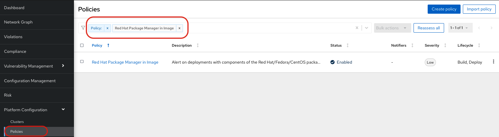
+
.. Click onto the `Red Hat Package Manager in Image` policy
.. Click `Actions` -> `Edit policy`
.. Click `Next`
.. Select `Inform and enforce` in Response method
.. Ensure selection of `Enforce on Build` in Build under `Configure enforcement behavior` section
+

+
.. Click `Next` until reaching `Review policy` page
.. Click `Save` (if any modification apply)
.. Go to the OpenShift Dev UI, click Pipelines on the left → click `petclinic-build-dev` pipeline → click `Actions` on the top right corner → select `Start last run` to re-run pipeline with same parameters
+
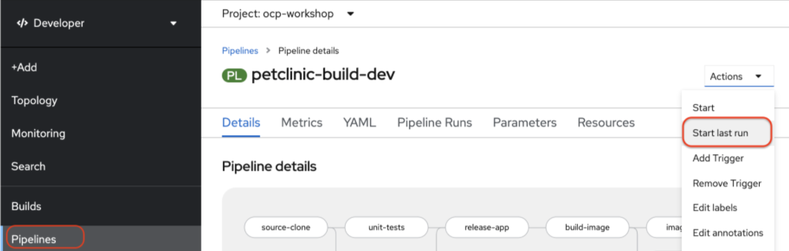
+
.. Check and confirm that pipeline fails on the *image-check* step as the built image has the "rpm" and "yum" package managers installed. Notice the suggestion from the *image-check* step:
+
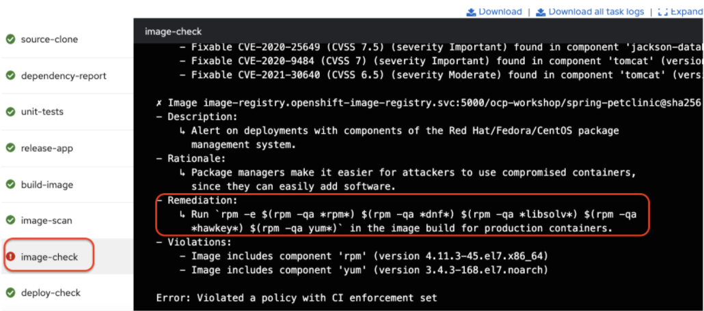
+
.. We will effectively update the image following this remediation suggestion.
. Instead of updating the `s2i-java-11` Tekton pipeline task that actually builds the image, we are replacing it with a corrected version.
.. From the OpenShift Administrator UI, make sure the `ocp-workshop` project is selected before going to Pipelines -> Tasks and delete the `s2i-java-11` task.
+
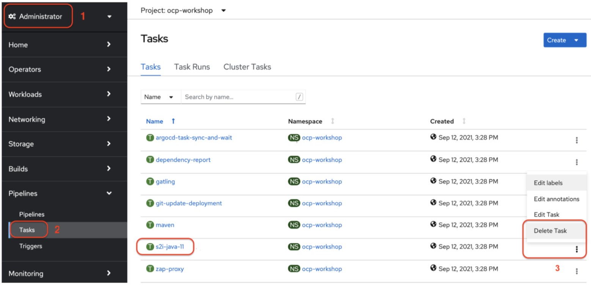
+
.. Or from the Tekton cli
+
|===
|tkn task delete s2i-java-11
|===
+
. Apply the new update task from the command terminal:
+
|===
|kubectl apply -f https://raw.githubusercontent.com/RedHatDemos/SecurityDemos/master/2021Labs/OpenShiftSecurity/documentation/labs-artifacts/s2ijava-mgr.yaml --namespace=ocp-workshop
|or, using OpenShift CLI:
|oc apply -f https://raw.githubusercontent.com/RedHatDemos/SecurityDemos/master/2021Labs/OpenShiftSecurity/documentation/labs-artifacts/s2ijava-mgr.yaml  -n ocp-workshop
|===
+
..Observe the confirmation of task creation:
..task.tekton.dev/s2i-java-11 created

. Re-run the pipeline that previously failed - the deployment now succeeds, congratulations to the developers!
. The pipeline  *image-check* task run result will be similar to the one below.
+
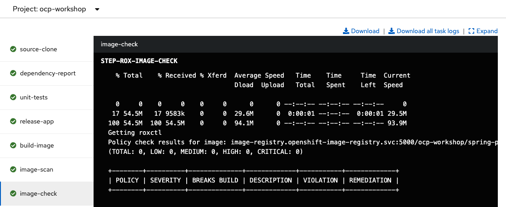
+
[Note] Please examine the contents of https://raw.githubusercontent.com/RedHatDemos/SecurityDemos/master/2021Labs/OpenShiftSecurity/documentation/labs-artifacts/s2ijava-mgr.yaml[*labs-artifacts/s2ijava-mgr.yaml]*** **file for more details on how the image was fixed.
We have added a step to the build task, using `buildah` CLI tool to remove the problematic package managers from the image (search for "rpm" or "yum" in the file).
+
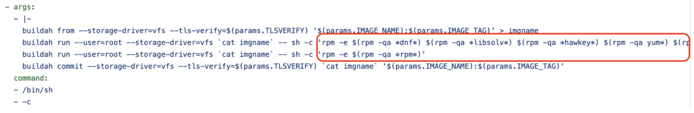

=== Bonus Exercise: Defer CVEs or Mark as "False Positive"

If we just want to `snooze` violation notifications for particular CVEs instead of fixing a problematic image and/or adding exceptions to Policies for build/deploy stages. ACS allows users to temporarily disable notifications for CVEs for a period of time.

[Note] Deferring CVEs would disable violation notifications for those CVE for ALL policies that include it.

For this lab, we can defer the CVEs that cause the image-check to fail and continue to build the pipeline. We will see that *image-check* task is reporting some Fixable violations information from the pipeline task log:

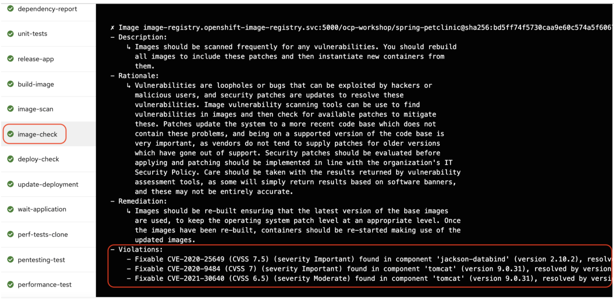

Here are the steps to snooze the CVEs for a period of time:

. Navigate to the ACS console via the `waffle icon` and click on the `Red Hat Advanced Clustered Security for Kubernetes` link.
Click Vulnerability Management left menu and click on the CVEs button  on the top.
. We can look for the detected CVEs and request Deferral by selecting the duration needed (Until Fixable, 2 Weeks, 30 Days, 90 Days, Indefinite).
+
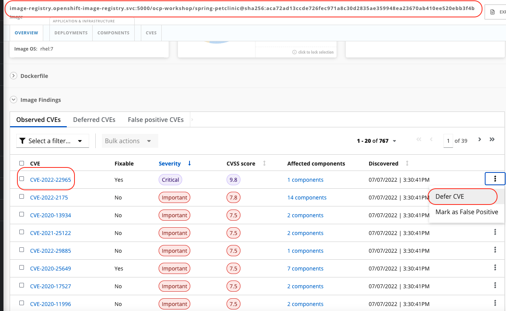
+
.. Submit a request for selected Deferral period or marking as `False positive` (exclusion of the CVE from notifications)
+
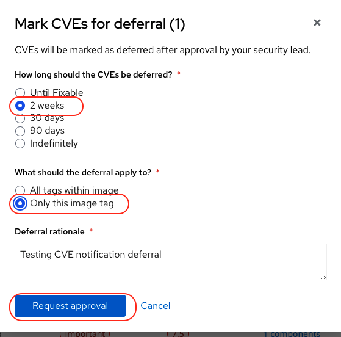
+
.. Upon approval by your Security lead (corresponding to designated role in ACS), notifications for selected CVE violation will be 'snoozed' for selected period of time or permanently, depending on request

=== Bonus Exercise: Notifications

ACS can be integrated with several Notifiers for alerting if certain security events happen in managed clusters. In our case, we integrate with Slack to receive notifications when some Policies are violated to have more useful information:

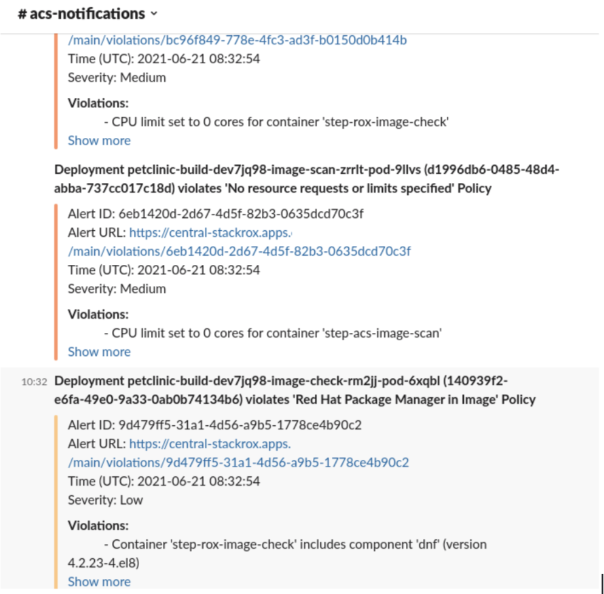

These policy notifications can be configured for each system policy enabled in our ACS Central, so we can create our own notification baselines in order to have only the proper information received in our systems. +
Here are the steps to set up slack integration with ACS based on the official https://docs.openshift.com/acs/3.70/integration/integrate-with-slack.html/[Integrate with Slack] documentation in ACS.

. Create a Slack App, enable Incoming Webhooks and get the Webhook URL using instruction https://docs.openshift.com/acs/3.70/integration/integrate-with-slack.html#configure-slack_integrate-with-slack[here]
+
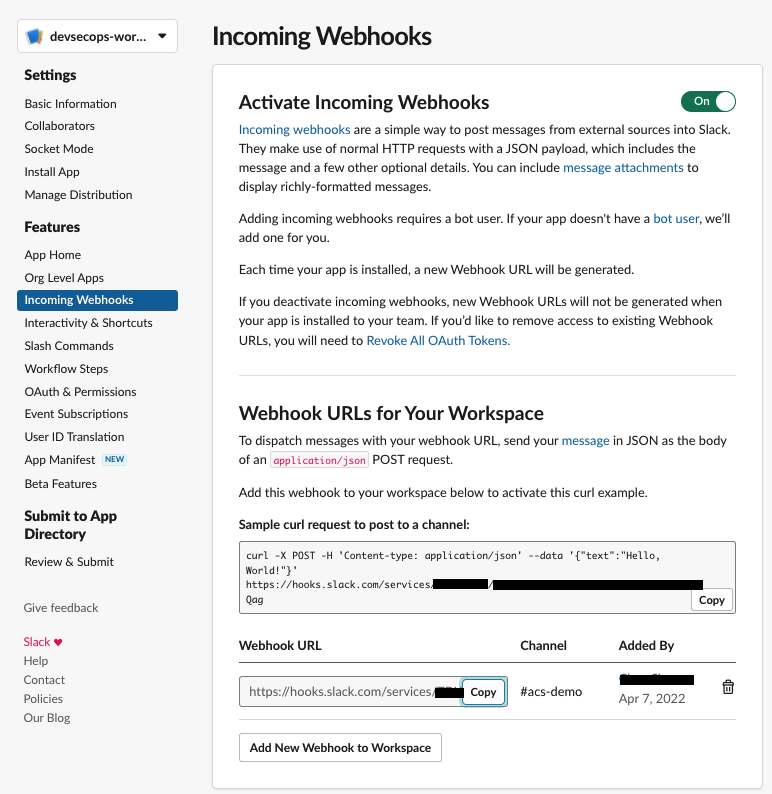
+
. Select `Platform Configuration` -> `Integration`
+
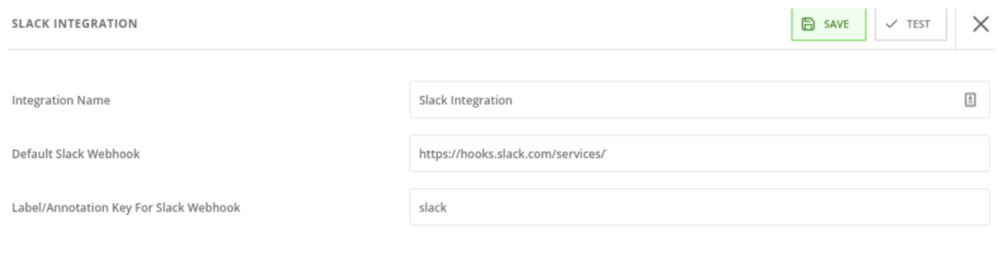
+
. Click `Slack` and Click `New integration`
. Enter Slack App channel information in the form below.
+
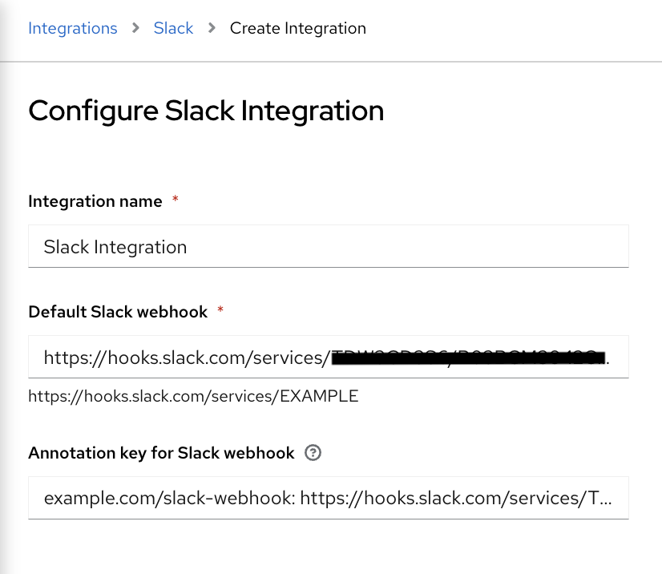
+
. Enable the Notifications in the system policies: Select `Platform Configuration` -> `Policies`
.. Select a Policy -> Click `Actions` -> `Edit policy`
.. Select checkbox next to `Slack Notifier` in the Attach Notifiers section of Policy details screen, click `Next` a few times and Save policy.
.. You should be getting notifications when this policy violation is triggered   
+
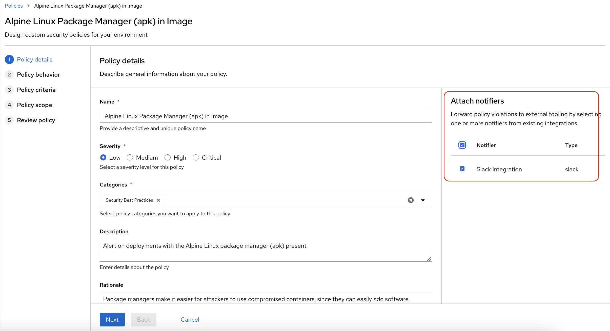

=== Troubleshooting Tips

==== Code Analysis Failures

- Issue:
Sometimes Code Analysis raises an error when mvn is running the maven install 'sonar:sonar':

[source]
----
[[1;31mERROR[m] Failed to execute goal+
[32morg.apache.maven.plugins:maven-compiler-plugin:3.8.1:testCompile[m [1m(default-testCompile)[m on
project [36mspring-petclinic[m: [1;31mCompilation failure[m
[[1;31mERROR[m]
[1;31m/workspace/source/spring-petclinic/src/test/java/org/springframework/samples/petclinic/service/ClinicServiceTests.java:[30,51]
cannot access org.springframework.samples.petclinic.owner.Pet[m
[[1;31mERROR[m] [1;31m  bad class file:
/workspace/source/spring-petclinic/target/classes/org/springframework/samples/petclinic/owner/Pet.class[m
[[1;31mERROR[m] [1;31m    class file contains wrong class:
org.springframework.boot.test.autoconfigure.orm.jpa.DataJpaTest[m
[[1;31mERROR[m] [1;31m    Please remove or make sure it appears in the correct subdirectory of the
classpath.[m
[[1;31mERROR[m] [1;31m[m
[[1;31mERROR[m] -> [1m[Help 1][m
[[1;31mERROR[m]
----

- Resolution:
Just rerun the pipeline and will succeed without changing anything additional. The results will succeed afterward:
[source]
----
[[1;34mINFO[m] Analyzed bundle 'petclinic' with 20 classes+
[[1;34mINFO[m] Analyzed bundle 'petclinic' with 20 classes
[[1;34mINFO[m]
[[1;34mINFO[m] [1m--- [0;32mmaven-jar-plugin:3.1.2:jar[m [1m(default-jar)[m @
[36mspring-petclinic[0;1m ---[m
[[1;34mINFO[m]
[[1;34mINFO[m] [1m--- [0;32mspring-boot-maven-plugin:2.2.5.RELEASE:repackage[m [1m(repackage)[m @
[36mspring-petclinic[0;1m ---[m
[[1;34mINFO[m] Replacing main artifact with repackaged archive
[[1;34mINFO[m] [1m------------------------------------------------------------------------[m
[[1;34mINFO[m] [1;32mBUILD SUCCESS[m
[[1;34mINFO[m] [1m------------------------------------------------------------------------[m
[[1;34mINFO[m] Total time: 01:55 min
[[1;34mINFO[m] Finished at: 2021-07-23T07:37:09Z
[[1;34mINFO[m] Final Memory: 118M/1245M
[[1;34mINFO[m] [1m------------------------------------------------------------------------[m
----

==== JUnit Tests Failures

Refer to the Code Analysis. Just rerun it. It will fix the error.

====  Failure uploading the zap proxy report into the upload server

After the zap proxy task is executed the upload to the report repo server fails due to wrong folder structure:
[source]
----
+ ls -lhrt /zap/wrk
total 76K

-rw-r--r--. 1 zap zap 75K Aug 20 10:41 petclinic-build-devm9hqv.html
+ echo 'Uploading the report into the report server'
Uploading the report into the report server

+ curl -u reports:reports -F path=petclinic-build-devm9hqv.html -F file=/zap/wrk/petclinic-build-devm9hqv.html -X POST http://reports-repo:8080/upload
  % Total    % Received % Xferd  Average Speed   Time    Time     Time  Current
                                 Dload  Upload   Total   Spent    Left  Speed

  0     0    0     0    0     0      0      0 --:--:-- --:--:-- --:--:--     0
100   335  100    36  100   299   7200  59800 --:--:-- --:--:-- --:--:-- 67000
{"message":"Internal Server Error"}
----

Fix the zap-proxy task and replace the line 99, with the content of the following curl to upload properly
[source]
----
curl -u $(params.REPORTS_REPO_USERNAME):$(params.REPORTS_REPO_PASSWORD) -F path=$PIPELINERUN_NAME/$PIPELINERUN_NAME.html -F file=@/zap/wrk/$PIPELINERUN_NAME.html -X POST $(params.REPORTS_REPO_HOST)/upload; echo ""
----

After that rerun the pipeline and check that effectively the zap proxy report its uploaded to the reports server:
[source]
----
+ curl -u reports:reports -F path=petclinic-build-dev-6f4569/petclinic-build-dev-6f4569.html -F file=@/zap/wrk/petclinic-build-dev-6f4569.html -X POST http://reports-repo:8080/upload
% Total % Received % Xferd Average Speed Time Time Time Current
Dload Upload Total Spent Left Speed

0 0 0 0 0 0 0 0 --:--:-- --:--:-- --:--:-- 0
100 76435 100 89 100 76346 22250 18.2M --:File has been uploaded to petclinic-build-dev-6f4569/petclinic-build-dev-6f4569.html 🚀--:-- --:--:-- --:--:-- 18.2M
+ echo ''
----

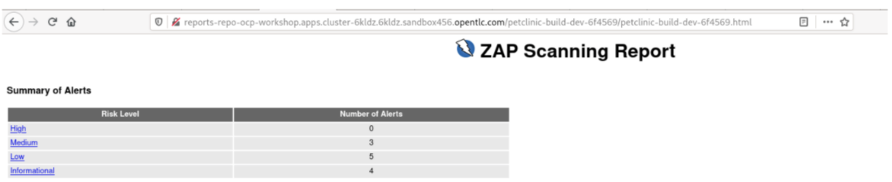
