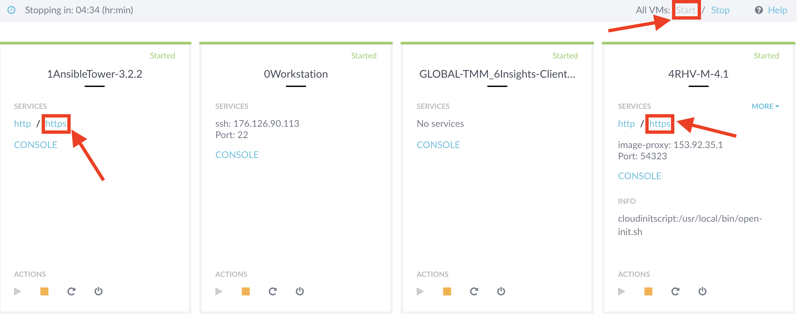
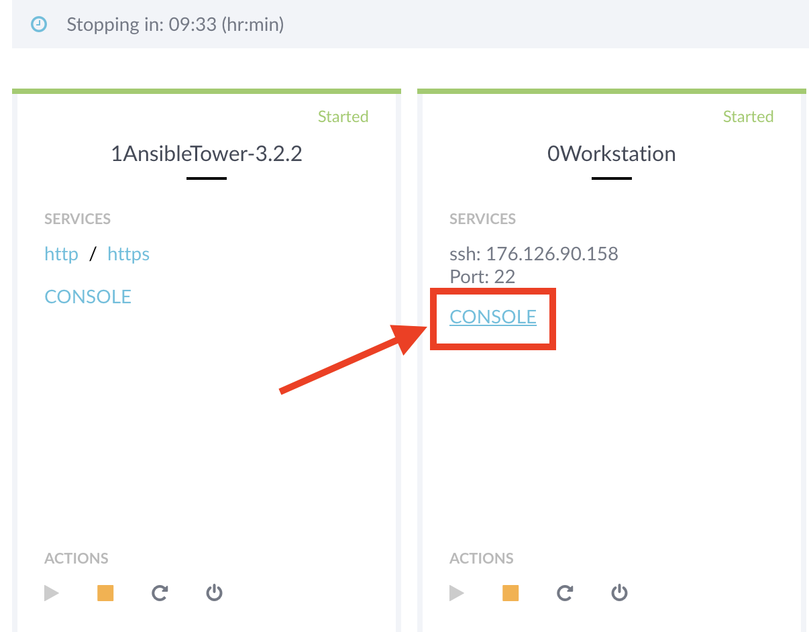

== Lab 0: Setup steps

=== Logging into all the Red Hat Products
Let’s log into the Red Hat Products that you will use in this lab so they are ready to use.

. Open your web browser to https://www.opentlc.com/guidgrabber/guidgrabber.cgi[Guid Grabber^]
. In your *Red Hat Summit Lab Information* webpage, take note of your assigned GUID. You will use this GUID to access your lab's systems. *Click on the link at the bottom of this page* to access your lab environment.
+
image:images/lab0-welcomescreen.png[1000,1000]
+
. From this page, you will be able to access all of the Red Hat Products that you will use in this lab. *Press the start button* at the top right to turn on all the Red Hat Product VMs. Then, *click on https* for all the Red Hat Products to access the UI. *Log into the UI of all the Red Hat Products* with *admin* as the Username and *r3dh4t1!* as the Password.
+

+
NOTE: You cannot use the Chrome web browser to access the Openstack Horizon UI since it will never accept the SSL certificate. The default web browser on your Summit lab laptop is Firefox, so this is not a problem for the lab.

. From this same page, open up the console for the *Workstation* system.
+

. Next, from the *Workstation* system, SSH into the Satellite server, *sat6.summit.example.com*, as *root*, and issue the following command: *katello-service restart* . This will restart the katello service and ensure that Satellite is ready to use for our lab.
+
[source, text]
[lab-user@workstation]$ sudo -i
[root@workstation]# ssh sat6.summit.example.com
[root@sat6]# katello-service restart

=== Turning on *some* of your VMs
. Before starting the lab steps, you will need to turn on *some* (NOT all) of your VMs. Log into CloudForms with *admin* as the Username and *r3dh4t1!* as the Password.

. On the left menus, navigate to *Compute -> Infrastructure -> Virtual Machines.*
+
image:images/lab0-infra-vms.png[500,500]

. Select the following VMs: *lab5-vm1*, *lab5-vm2* , and *lab7-vm1*.
Navigate to the top *Power* button and select *Power On*.
+
image:images/lab0-turnonselectvms.png[1000,1000]

. Click *OK*. 
. Do not close your CloudForms UI since you will be using it in future lab exercises.

link:README.adoc#table-of-contents[ Table of Contents ] | link:lab1.adoc[ Lab 1]
