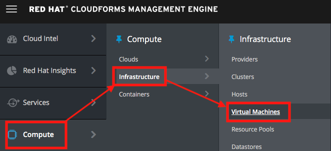
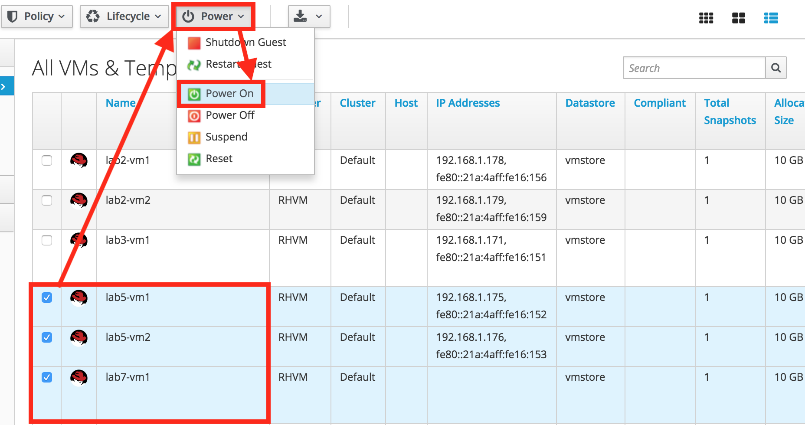

== Lab 0: Setup steps

=== Logging into all the Red Hat Products
Let’s log into the Red Hat Products that you will use in this lab so they are ready to use.

. Follow the directions  https://github.com/RedHatDemos/RHTE-2018/blob/master/GG/gg-dedicated.adoc[here^] in order to obtain your lab GUID.  This GUID will be used to access your unique lab environment.

. In your lab information webpage, take note of your assigned GUID. You will use this GUID to access your lab's systems.  It will be embedded in your lab environment's host names.

. From the lab environment information page, copy the hostname of the *Workstation* system (it should be workstation-GUID.rhpds.opentlc.com where GUID matches your environment's guid).

. Open a terminal window on your desktop environment and make sure you can SSH into the workstation host as you see below:
+
[source, text]
[localhost ~]$ ssh root@workstation-GUID.rhpds.opentlc.com
+
NOTE: Replace GUID with your lab's GUID. Use the password *r3dh4t1!*

. Log into the *Satellite* host.
+
[source]
----
[root@workstation-GUID ~]# ssh sat6.example.com
----

. On the Satellite server, restart katello-service and logout
+
[source]
----
[root@sat6 ~]# katello-service restart
[root@sat6 ~]# logout
----

. Log into the *CloudForms* host.
+
[source]
----
[root@workstation-GUID ~]# ssh cfme.example.com
----

. On the CloudForms server, restart ansible-tower-service and logout
+
[source]
----
[root@cfme ~]# ansible-tower-service restart
[root@cfme ~]# logout
----

. The lab environment information page contains a list of links to all of the Red Hat Products that you will use in this lab.  With the exception of the link for rhvm and osp12, click each of the links on this page.  Each link should open a new tab. You will have to accept the SSL certificates for each page when the warning appears.  Each application should accept the *admin* as the user name and *r3dh4t1!* as the password. *You will not be using the UIs for rhvm and osp12 directly which is why you do not need to log into these.*
+
NOTE: You cannot use the Chrome web browser to access the Openstack Horizon UI since it will not accept its SSL certificate.

=== Turning on *some* of your VMs
. Before starting the lab steps, you will need to turn on *some* (NOT all) of your VMs. Go to the CloudForms (cfme-GUID.rhpds.opentlc.com) tab.  If not already logged in, do so with *admin* as the Username and *r3dh4t1!* as the Password.

. On the left menus, navigate to *Compute -> Infrastructure -> Virtual Machines.*
+

. Select the following VMs: *lab2-vm1*, *lab2-vm2*, *lab5-vm1*, *lab5-vm2*, and *lab7-vm1*.
Navigate to the top *Power* button and select *Power On*.
+

. Click *OK*.
. Do not close your CloudForms UI since you will be using it in future lab exercises.

link:README.adoc#table-of-contents[ Table of Contents ] | link:lab1.adoc[ Lab 1]
