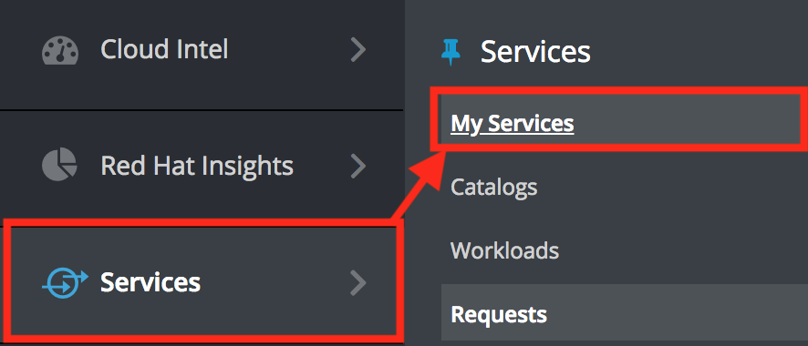

== Lab 1: Provisioning a security compliant host

=== Goal of Lab 1
The goal of this lab is to create a security compliant host at provisioning time in Red Hat Virtualization at the push of a button using Red Hat CloudForms and Ansible Automation. Specifically, in this lab exercise, you will use Red Hat CloudForms and Ansible Automation inside CloudForms for your custom provisioning automation workflow.

=== Introduction
Red Hat CloudForms provides users the ability to create self-service catalogs.  Through the use of catalogs, Red Hat CloudForms provides support for executing free form automation as a service and also allow for multi-tiered service provisioning to deploy layered workloads across hybrid environments. You can create customized dialogs that will give consumers of the services the ability to input just a few parameters and provision the entire service. In addition to using the native ruby language, free form automation workflows using the service catalog of Red Hat CloudForms can call Ansible Tower job templates or Ansible playbooks.

=== Lab 1.1 Provisioning a security compliant host at the push of a button using Red Hat CloudForms and Ansible Automation
. Log into CloudForms with *admin* as the Username and *r3dh4t1!* as the Password.

. Navigate to Services -> Catalogs.
+
image:images/lab1.1-services-catalog.png[200,200]
+
. Order the *RHEL 7.5 on RHV* service.
+
image:images/lab1.1-all-services.png[600,600]
+
. Name the VM *lab1-vm1*, choose a security profile and click on *Submit*.
+
image:images/lab1.1-order-service.png[400,400]
+
. From the service request page, click on the Refresh button until the service request shows *Approved*.
+
image:images/lab1.1-services-requests.png[400,400]
+
. Navigate to Services -> My Services.
+

+
. Click on the *RHEL 7.5 on RHV* service and then click on the Provisioning tab to view the Ansible output.
+
image:images/lab1.1-myservice.png[400,400]
+
. Press the refresh button periodically to refresh the Provisioning Ansible output.
+
image:images/lab1.1-service-results.png[400,400]
+
. Review the Ansible playbook output by scrolling down.
+
image:images/lab1.1-ansible-output.png[400,400]
+
. Log out of CloudForms.

link:README.adoc#table-of-contents[ Table of Contents ] | link:lab2.adoc[ Lab 2]
