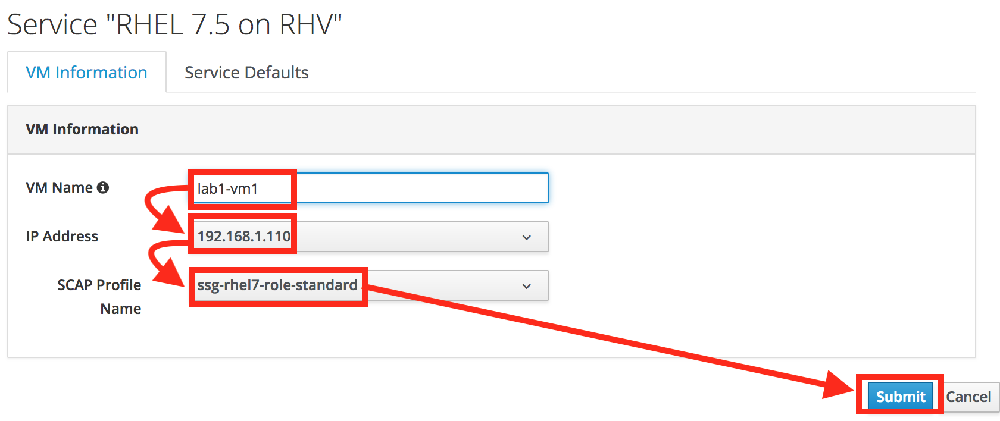
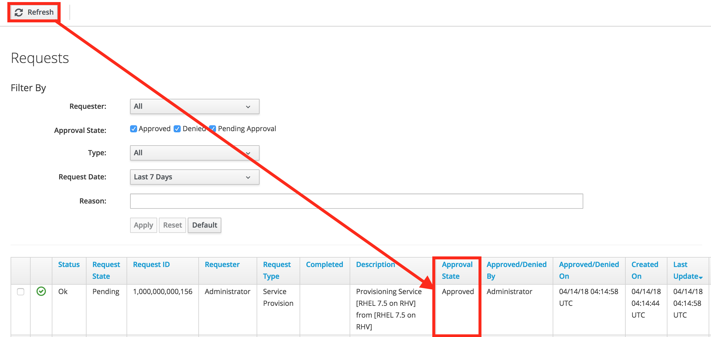
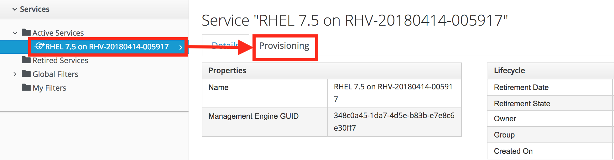
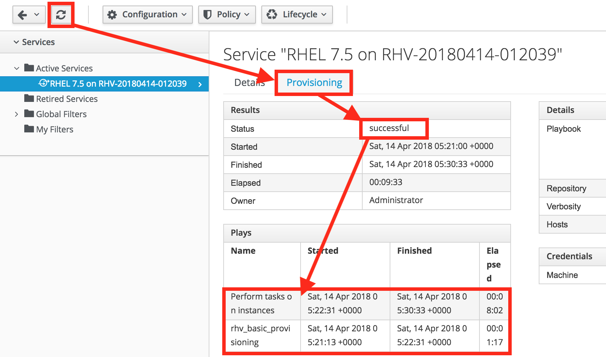
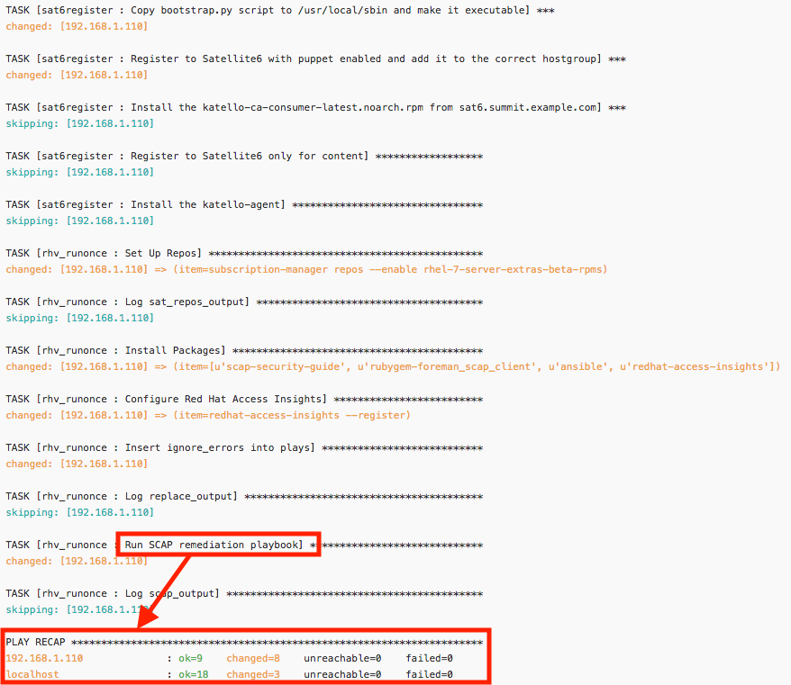
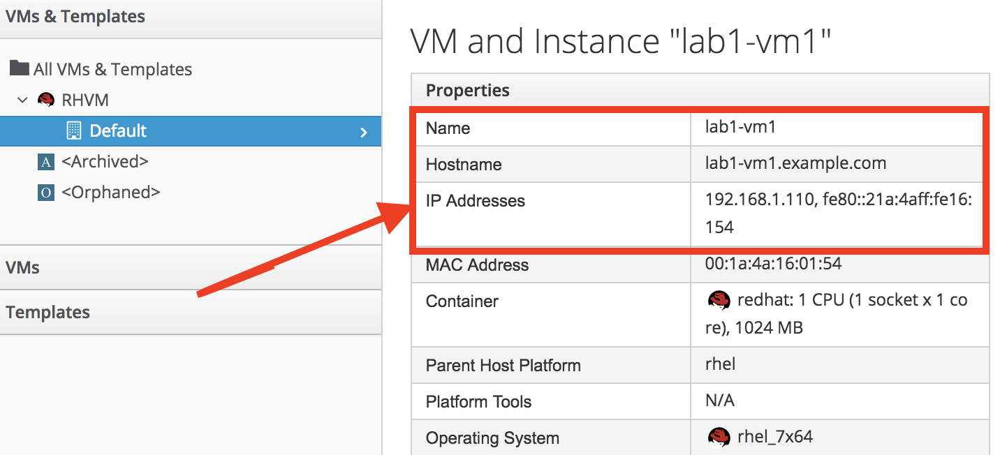

= Lab 1: Provisioning a security compliant host

== Goal of Lab 1
The goal of this lab is to create a security compliant host at provisioning time in Red Hat Virtualization at the push of a button using Red Hat CloudForms and Ansible Automation. Specifically, in this lab exercise, you will use Red Hat CloudForms and Ansible Automation inside CloudForms for your custom provisioning automation workflow.

=== Introduction
Red Hat CloudForms provides users the ability to create self-service catalogs.  Through the use of catalogs, Red Hat CloudForms provides support for executing free form automation as a service and also allow for multi-tiered service provisioning to deploy layered workloads across hybrid environments. You can create customized dialogs that will give consumers of the services the ability to input just a few parameters and provision the entire service. In addition to using the native ruby language, free form automation workflows using the service catalog of Red Hat CloudForms can call Ansible Tower job templates or Ansible playbooks directly from Red Hat CloudForms.

In this lab exercise, we will execute a custom provisioning service in the Red Hat CloudForms service catalog. From here, we will run customized Ansible provisioning playbooks to provision a Red Hat Enterprise Linux 7.5 host on Red Hat Virtualization that is locked down to a specific SCAP Profile chosen by the user from the Red Hat CloudForms service dialog. Red Hat Enterprise Linux 7.5 ships with Ansible SCAP remediation playbooks for various SCAP Profiles. In this lab exercise, these Ansible playbooks are presented to the user as SCAP Profiles to choose from to lock down the newly provisioned Red Hat Enterprise Linux 7.5 host against the chosen SCAP profile.

As a result, users can easily provision a security compliant host using any of the provided SCAP security profiles in Red Hat Enterprise Linux 7.5. Users also have the ability to use custom security profiles to lock down a provisioned system against your specific security controls. You can easily create custom modified security profiles using SCAP workbench (which is also provided as part of Red Hat Enterprise Linux).

==== Lab 1.1 Provisioning a security compliant host at the push of a button using Red Hat CloudForms and Ansible Automation
. On the CloudForms appliance (cfme-GUID.rhpds.opentlc.com) log in with *admin* as the user name and *r3dh4t1!* as the password (if not already logged in).

. Navigate to *Services -> Catalogs*.
+
image:images/lab1.1-services-catalog.png[200,200]

. Order the *RHEL 7.5 on RHV* service.
+
image:images/lab1.1-all-services.png[900,900]

. Name the VM *lab1-vm1*, choose the default IP Address *192.168.1.110* , and choose the *ssg-rhel7-role-standard* SCAP Profile from the drop down. Click on *Submit*. This will provision a Red Hat Enterprise Linux 7.5 VM in Red Hat Virtualization that is locked down to the *ssg-rhel7-role-standard* SCAP Profile.
+

. From the Service Requests page, click on the *Refresh* button at the top until the service request shows *Approved*. Note that this default approval workflow can be customized.
+

. Navigate to *Services -> My Services*.
+
image:images/lab1.1-services-myservices.png[400,400]

. Click on the *RHEL 7.5 on RHV* service and then click on the *Provisioning* tab to view the Ansible output.
+

. Press the refresh button periodically to refresh the Provisioning Ansible output.
+
NOTE: After clicking on refresh you will need to click on the *Provisioning* tab to view the Ansible output.
+

. Review the Ansible provisioning playbook output by scrolling all the way down. Notice that the Ansible *PLAY RECAP* shows no failures, which means that the Ansible provisioning playbook ran successfully.
+

+
NOTE: You may see something similar to `FAILED - RETRYING: Wait for asynchronous job to complete (100 retries left).` under the *TASK* sections.  This is a retry, not a catastrophic failure, and is expected.

. Go back to the top of the screen and click on the *Details* tab. Then click on your newly provisioned *lab1-vm1* VM.
+
image:images/lab1.1-provisionedvm.png[400,400]

. Notice that the *lab1-vm1* VM provisioned successfully and now has a hostname and the IP address you assigned it during provisioning.
+

link:README.adoc#table-of-contents[ Table of Contents ] | link:lab2.adoc[ Lab 2]
