== Lab 2: Utilizing OpenSCAP in Satellite 6 for security scanning, auditing, and remediation

=== Goal of Lab 2
The goal of this lab is to introduce you to OpenSCAP in Satellite 6. OpenSCAP is the integrated security scanning, auditing, and remediation tool in Satellite 6.

=== Introduction
Security compliance management is the ongoing process of defining security policies, auditing for compliance with those policies and resolving instances of non-compliance. Once a security policy is defined, an audit is conducted to verify compliance with the policy. Any non-compliance is managed according to the organization's configuration management policies. Security policies vary in their scope, from being host-specific to industry-wide, so there is a need for flexibility in their definition.

The Security Content Automation Protocol (SCAP) enables the definition of security configuration policies. For example, a security policy might specify that for hosts running Red Hat Enterprise Linux, login via SSH is not permitted for the root account.

In Satellite 6, tools provided by the OpenSCAP project are used to implement security compliance auditing. For more information about OpenSCAP see the link:https://access.redhat.com/documentation/en-us/red_hat_enterprise_linux/7/html/security_guide/index[Red Hat Enterprise Linux 7 Security Guide]. The Satellite web UI enables scheduled compliance auditing and reporting on all hosts under management by Red Hat Satellite.

=== Introduction to SCAP content provided in Satellite 6
Before creating a SCAP compliance policy for a host, you need SCAP content.

SCAP content is a datastream format containing the configuration and security baseline against which hosts are checked. Checklists are described in the extensible checklist configuration description format (XCCDF) and vulnerabilities in the open vulnerability and assessment language (OVAL). Checklist items, also known as rules express the desired configuration of a system item. For example, you may specify that no one can log in to a host over SSH using the root user account. Rules can be grouped into one or more profiles, allowing multiple profiles to share a rule. SCAP content consists of both rules and profiles.

You can either create SCAP content or obtain it from a vendor. Supported profiles are provided for Red Hat Enterprise Linux in the scap-security-guide package. The creation of SCAP content is outside the scope of this lab, but see the link:https://access.redhat.com/documentation/en-us/red_hat_enterprise_linux/7/html/security_guide/index[Red Hat Enterprise Linux 7 Security Guide] or Red Hat Enterprise Linux 6 Security Guide for information on how to download, deploy, modify, and create your own content. The SCAP content provided with Red Hat Enterprise Linux is compliant with SCAP specification 1.2.

The default SCAP content provided with the OpenSCAP components of Satellite 6 depends on the version of Red Hat Enterprise Linux:

* On Red Hat Enterprise Linux 6, content for Red Hat Enterprise Linux 6 is installed.
* On Red Hat Enterprise Linux 7, content for both Red Hat Enterprise Linux 6 and Red Hat Enterprise Linux 7 is installed.

When you install the SCAP components in Satellite as defined in the link:https://access.redhat.com/documentation/en-us/red_hat_satellite/6.3/html/administering_red_hat_satellite/chap-red_hat_satellite-administering_red_hat_satellite-security_compliance_management/[Administering Red Hat Satellite Guide], all of the Red Hat default content will show up in Satellite so no extra steps are necessary to add the SCAP content to Satellite.  But if you had customized content that you wrote yourself or if you have a modified policy and you wanted to upload that modified version , you can do that in the Satellite UI under *Hosts → SCAP contents*.

. Take a look at the default SCAP content provided with the OpenSCAP components of Satellite 6 by navigating to *Hosts → SCAP contents*.
+
image:images/lab2-scapcontents.png[1000,1000]
+
NOTE: To save time on this lab exercise, the SCAP components in Satellite were already installed for you. This is why you are seeing the default content under *Hosts → SCAP contents*. In addition, customized content named *rhel7-custom* has also been uploaded here. The *rhel7-custom* compliance policy is a simple compliance policy that just checks to see if the AIDE package is installed.

=== Creating a SCAP compliance policy for a host
Now that you have SCAP content defined in Satellite, you can create a SCAP compliance policy for a host.

. Navigate to *Hosts → Policies* and click on *New Compliance Policy* at the top right.
+
image:images/lab2-newcompliancepolicy.png[1000,1000]
+
NOTE: A SCAP compliance policy takes one of the security profiles that are available in your SCAP content and applies it to a group of systems(as defined in your Hostgroups). You can also overwrite your SCAP content with a tailoring file. You will learn more about how to use tailoring files later in this lab exercise.

. In the *Create Policy* tab,
* For the compliance policy *Name*, type *RHEL7_Standard*.
* For the *Description*, type *RHEL7 Standard System Compliance Policy*.
* Click *Next*.
+
image:images/lab2-createpolicy.png[1000,1000]

. In the *SCAP Content* tab,
* For *SCAP Content*, choose the *Red Hat rhel7 default content*.
* For *XCCDF Profile*, choose *Standard System Security Profile*.
* Do not select anything for *Tailoring File*. We will add a tailoring file later and skip this step for now.
+
NOTE: Satellite 6.3 introduced the Tailoring Files feature. Tailoring Files allow existing OpenSCAP policies to be tailored, or customized, without forking or rewriting the policy. It is important to note that the Tailoring files feature does not provide the abililty to create tailoring files. A Tailoring file can be created using SCAP Workbench(which is included in Red Hat Enterprise Linux). Once you have a Tailoring file you can upload it and assign the Tailoring File to a policy.

* Click *Next*.
+
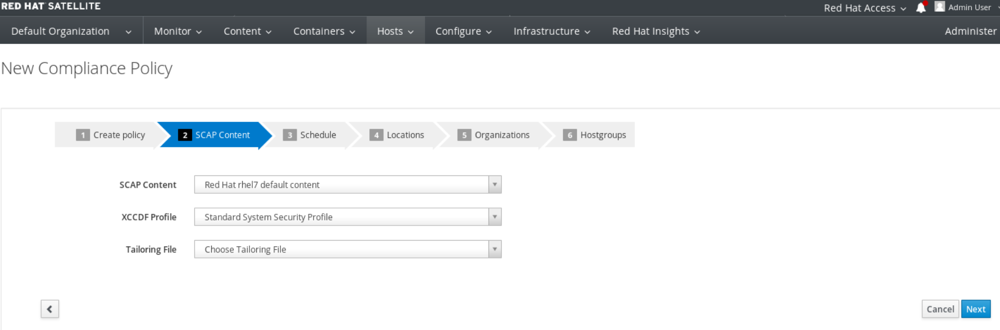

. In the *Schedule* tab,
* For *Period*, choose *Weekly*.
* For *Weekday* choose *Thursday*.
+
NOTE: Whatever is defined here as a schedule is executed as a cron job on the client. For Period, if you selected Custom, you can define normal cron syntax to define when the schedule is going to run.
* Click *Next*.
+
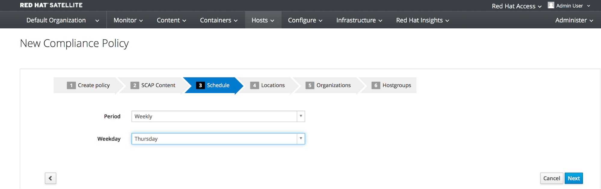

. In the *Locations* tab,
* Click the *Default Location* to move it over to the *Selected items* box. This will associate the compliance policy with this Location.
* Click *Next*.
+
image:images/lab2-locations.png[1000,1000]

. In the *Organizations* tab,
* (If not already on the right) Click the *Default Organization* to move it over to the *Selected items* box. This will associate the compliance policy with this *Organization*.
* Click *Next*.
+
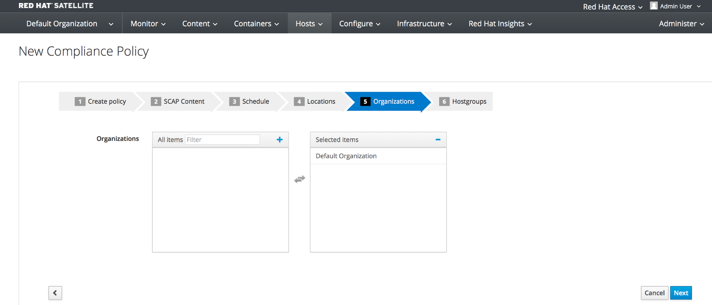

. In the *Hostgroups* tab,
* Click *base_with_puppet_75* to move it over to the *Selected items* box. The compliance policy will apply to this selected *Hostgroup*.
+
NOTE: Hostgroups are groupings of systems that are built and configured the same. You can use Hostgroups as a means to roll out certain compliance policies to certain subsets of your systems.

. Click *Submit*.
+
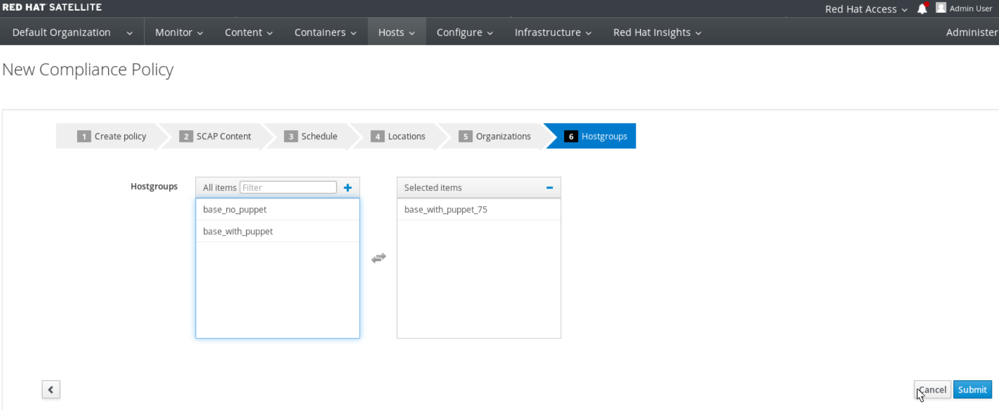

=== Executing the compliance policy scan on a host
. Now that you have defined SCAP compliance policies in Satellite,
you can go ahead and run a SCAP compliance policy scan on a host. Navigate to *Hosts -> All hosts*
+
image:images/lab2-hostsallhosts.png[1000,1000]

. Next, put a check mark next to *lab2-vm1.example.com*. This is a RHEL 7.5 pre-provisioned host that you will execute a SCAP compliance policy scan on. Then, at the top right, navigate to *Select Action -> Schedule Remote Job*.
+
image:images/lab2-scheduleremotejob.png[1000,1000]

. Now, for *Job Category* , select *Puppet*. Then, notice that for *Job template*, *Puppet Run Once - SSH Default* is automatically selected for you. Leave everything else as is. Press *Submit*.
+
image:images/lab2-puppet.png[1000,10000]

+
NOTE: This is the equivalent to running puppet agent --test. This will ensure that we have the latest updates to the compliance policies. This will also ensure that we set up all the SCAP components, which are delivered via the puppet agent.  Satellite provides a puppet module and a means for the puppet module to set up all the SCAP components. Normally, in production, the puppet agent run automatically occurs within 30 mins so the puppet agent --test is not necessary. We are just doing this in the lab to avoid waiting 30 mins for the puppet agent to run.

. Now that the SCAP components are installed, configured on the client, and Satellite knows about all the SCAP compliance policies, let's execute a SCAP compliance policy scan on *lab2-vm1.example.com*.
Navigate to *Hosts -> All hosts* again. Then, put a check mark next to *lab2-vm1.example.com*. At the top right, navigate to *Select Action -> Schedule Remote Job*.
+
image:images/lab2-hostsallhosts.png[1000,1000]
+
image:images/lab2-scheduleremotejob.png[1000,1000]

. This time under *Job Category*, select *OpenSCAP*. Then, notice that for *Job template*, *Run OpenSCAP scans* is automatically selected for you. Leave everything else as is. Press *Submit*.
+
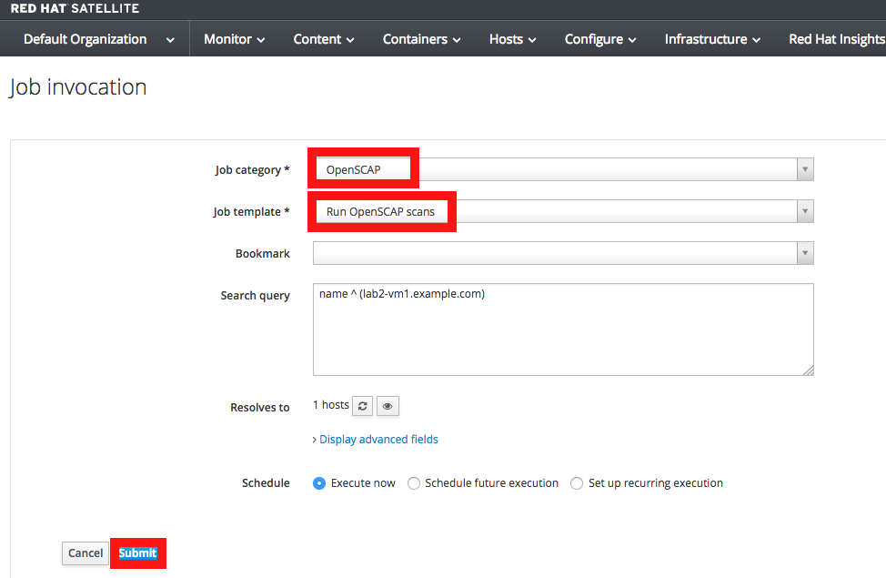

. Notice that 5 SCAP compliance policy scans are being executed on this *lab2-vm1.example.com* host. This host is part of the *base_with_puppet_75* Hostgroup and all 5 SCAP compliance policies have been configured to include the *base_with_puppet_75* Hostgroup. As a result, all 5 SCAP compliance policies are being executed on this host.
+
image:images/lab2-jobinvocation.png[1000,1000]

. Click on the *Hosts* tab. Wait for the *Status* column to say *success*. Once the *Status* column says *success*, click on *lab2-vm1.example.com* in the *Hosts* column.
+
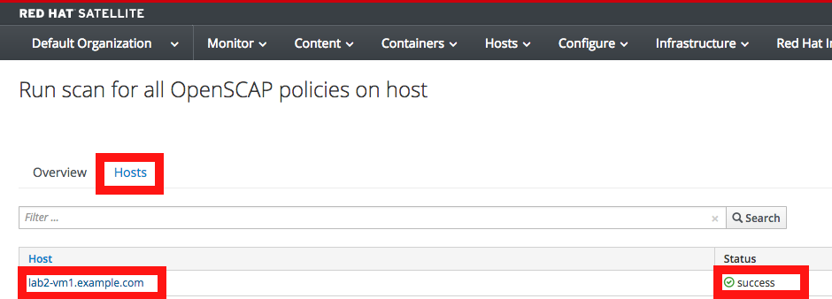

 . Here you can see the output from the successful run with *Exit status: 0*. This is the command line output from the client itself and can be useful for debugging purposes in the event the job fails.
Notice in this output that the results of the SCAP compliance scans are uploaded and the reports of the scans will be automatically created for you.
+
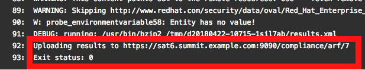

. Click on the *Back to Job* button at the top right.
+
image:images/lab2-backtojob.png[1000,1000]

. You are now back at the *Overview* page for the OpenSCAP scan that you ran on the *lab2-vm1.example.com* host. Notice again that the OpenSCAP scan on this host completed with 100% Success.
+
image:images/lab2-successcircle.png[1000,1000]

=== View the OpenSCAP scan results report in Satellite 6
. Now let's view the SCAP scan results reports for the host, *lab2-vm1.example.com*. Navigate to *Hosts → Reports*.
+
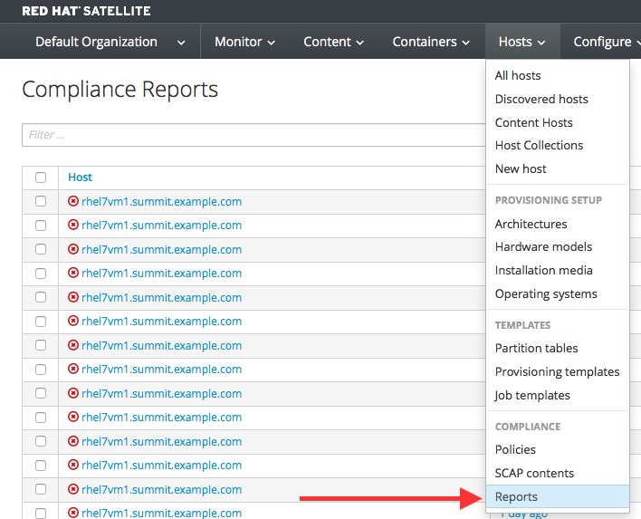

. Notice that there are 5 Compliance reports for the 5 SCAP compliance policies (RHEL7_Standard, RHEL7_PCI_DSS, rhel7-custom, RHEL7_Common, and rhel7-base) that were executed on this host.
+
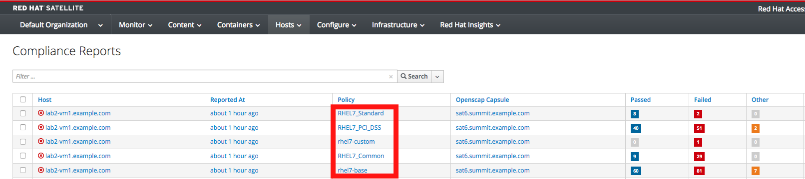

. Click on the report for the *RHEL7_Standard Policy* by clicking the link in the second *Reported At* column.
+
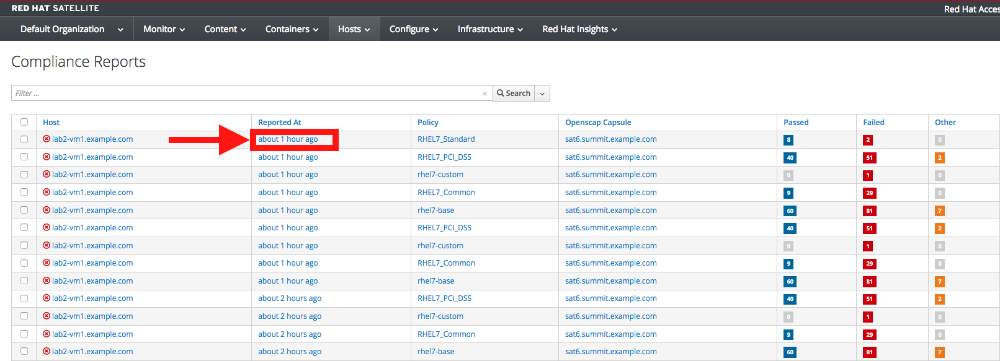

. In this report, you can see the security rules that have passed and failed at a high level which allows you to see the security posture of a system based upon an assigned audit policy.

. To see the detailed full report, click on *View full report* at the top right.
+
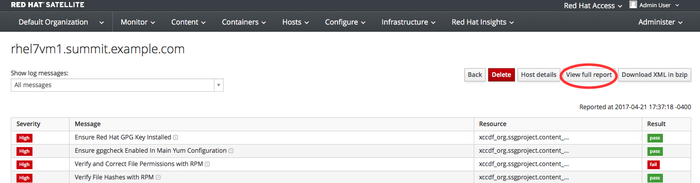

. Glance through this report to see what rules passed/failed, severity of the rules, etc.  Notice that you can click on each rule for a deeper drill down.

. *Click the back arrow* on your web browser to go back to the previous report summary page. *Click the back arrow* again on your web browser to get back to the page with the full list of Compliance Reports.
+
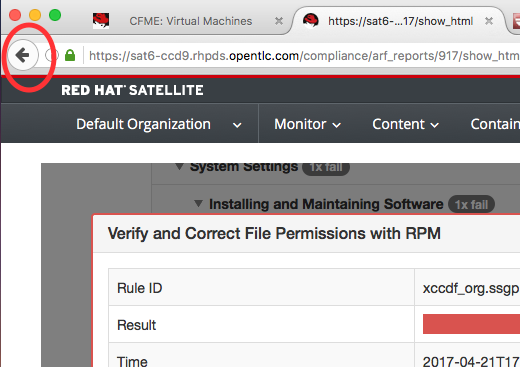

. Now, Click on the report for the *rhel7-custom* compliance policy by clicking the link in the second *Reported At* column.
+
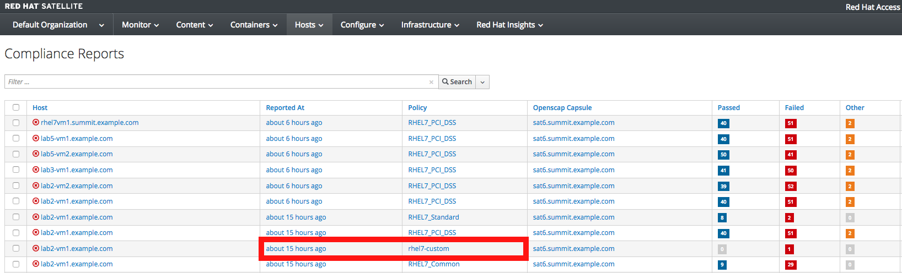

. Notice that the *rhel7-custom* compliance policy only checks whether or not the AIDE package is installed. You can see from the report for the *rhel7-custom* policy that this compliance check failed. Therefore, the AIDE package is not installed on this host (lab2-vm1.example.com).

. Take a look at the top right buttons in the Satellite UI. Notice also that you can *Download the XML* of the report in bzip or HTML as well. *Click the Back button* from the top right of the Satellite UI. You are now back at the page with the full list of Compliance Reports.
+
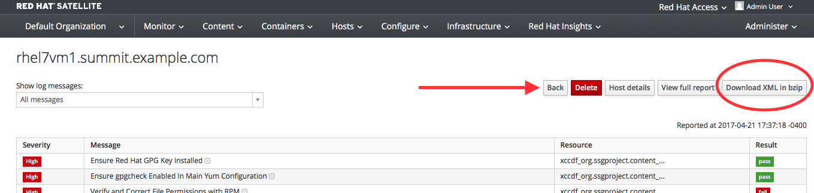

. Notice the search bar at the top of the Satellite UI. Here, you can filter the compliance reports search with various filters. *Type compliance_failed > 0 and press Search.* This will find any compliance report that have greater than 0 compliance failures.
+
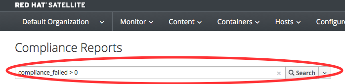

=== Fixing a specific OpenSCAP scan failure
. Now let's fix the OpenSCAP scan failure from the *rhel7-custom* compliance policy. Remember that this compliance check failed since the AIDE package is not installed on the *lab2-vm1.example.com* host. Let's fix this OpenSCAP scan failure by installing the AIDE package on the *lab2-vm1.example.com* host.

. Open the console for your workstation system by clicking on the console button of your workstation system from the *Red Hat Summit Lab Information* webpage that has all your lab environment's power controls and consoles.
+
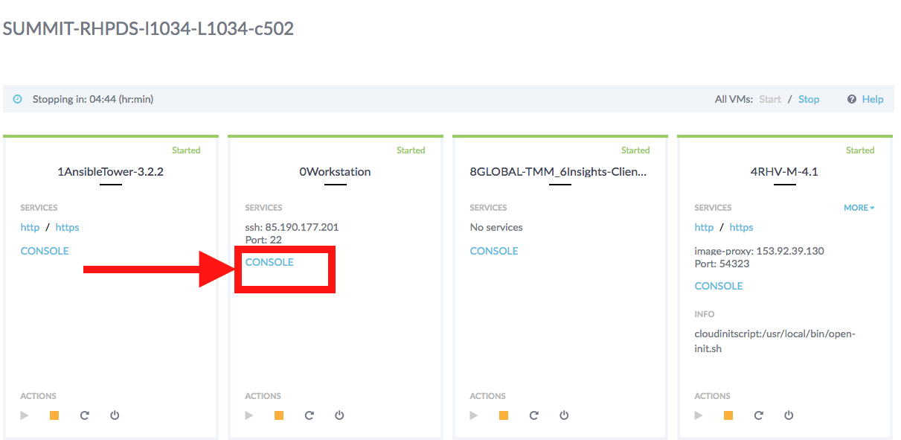

. Login to your workstation system with *lab-user* as the username and *r3dh4t1!* as your password. Now, as root, log into the *lab2-vm1.example.com* host.
+
[source]
----
$ sudo -i
# ssh lab2-vm1.example.com
----

. Confirm that the AIDE package is not installed.
[source]
----
# rpm -qa aide
----

. Now let's install the AIDE package onto the *lab2-vm1.example.com* host.
[source]
----
# yum -y install aide
----
. We will re-execute the *rhel7-custom* compliance policy scan on the *lab2-vm1.example.com* host later in this lab exercise to confirm that the *rhel7-custom* policy scan now passes.

=== Tailoring (customizing) an existing OpenSCAP compliance policy with a tailoring file

As mentioned earlier, Satellite 6.3 introduced the tailoring files feature. Tailoring files allow existing OpenSCAP policies to be tailored, or customized, without forking or rewriting the policy. In other words, tailoring files allow you to add or ignore rules in the default policy content file. So if the rule is enabled in both the default content and the tailoring file, then the rule is enabled. If the rule is disabled in the tailoring file, but enabled in the default content, then the rule is disabled. If the rule is disabled in the default policy content file but enabled in the tailoring file , then the rule is enabled.

It is important to note that the tailoring files feature does not provide the ability to create tailoring files. A tailoring file can be created using SCAP Workbench(which is included in Red Hat Enterprise Linux). Once you have a tailoring file you can upload it and assign the Tailoring File to a policy.

. First, let's upload a tailoring file into Satellite. Navigate to https://<URL_of_your_Satellite_server>/pub. From here, download the *ssg-rhel7-ds-tailoring-standard.xml* file onto your laptop. This is the one we will use for this lab exercise. Feel free to download the other tailoring files for your own use later.

. From Satellite, navigate to *Hosts -> Tailoring Files*
+
image:images/lab2-tailoringfilesmenu.png[600,600]

. Click on *New Tailoring File*. Then, enter *Tailoring File for Standard Compliance Policy* in the Name text box. For the *Scap file*, Click *Browse*, navigate to the location containing the SCAP DataStream Tailoring File and select *Open*. For the *Locations* tab, click the *Default Location* to move it over to the *Selected Items* box. This will associate this tailoring file with this *Location*. For the *Organizations* tab, (If not already on the right), Click the *Default Organization* to move it over to the *Selected Items* box. This will associate this tailoring file with this *Organization*. Press *Submit*.
+
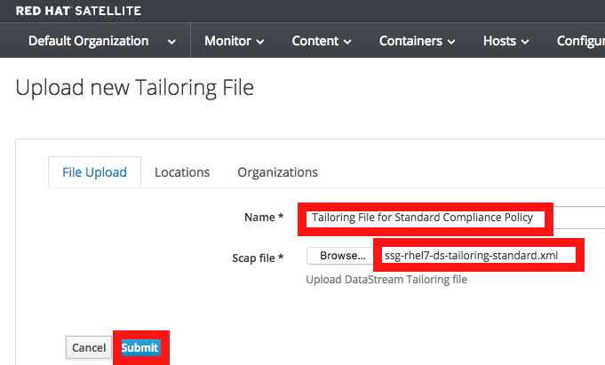

. Now let's assign this tailoring file to a compliance policy. Navigate to *Hosts → Policies*. For the *RHEL7_Standard* compliance policy that you created earlier, click on *Edit*.
+
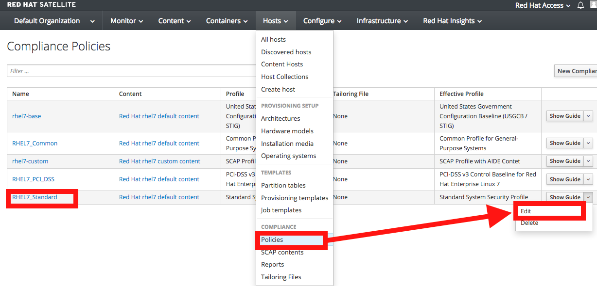

. Under the *SCAP Content* tab, select the tailoring file we uploaded earlier in the *Tailoring File* section. Note that the *XCCDF Profile in Tailoring File* section automatically got filled in once you select your tailoring file. Press *Submit*.
+
image:images/lab2-addtailoringfiletopolicy.png[600,600]

+
NOTE: Tailoring files are able to contain multiple XCCDF Profiles. Also, Satellite does not enforce that the tailoring file match the XCCDF profile. However, you need to make sure that they match to avoid running into errors when using the tailored compliance policy.

=== Re-executing the compliance policy scan on the host and viewing the OpenSCAP scan results reports

In the previous lab exercise steps, we assigned the tailoring file to the *Standard* compliance policy and we fixed the OpenSCAP compliance scan error for the *rhel7-custom* compliance policy by installing AIDE on the *lab2-vm1.example.com* host. We can now re-execute the compliance policy scan on the *lab2-vm1.example.com* host and generate the report of the OpenSCAP compliance scans.

. Navigate to *Hosts -> All hosts*
+
image:images/lab2-hostsallhosts.png[1000,1000]

. Next, put a check mark next to *lab2-vm1.example.com*. Then, at the top right, navigate to *Select Action -> Schedule Remote Job*.
+
image:images/lab2-scheduleremotejob.png[1000,1000]

. Now, for *Job Category* , select *Puppet*. Then, notice that for *Job template*, *Puppet Run Once - SSH Default* is automatically selected for you. Leave everything else as is. Press *Submit*. This puppet job should finish quickly and you should see a green circle with 100% success.
+
image:images/lab2-puppet.png[1000,10000]

. Now that the SCAP components are installed, configured on the client, and Satellite knows about all the SCAP compliance policies, let's execute a SCAP compliance policy scan on *lab2-vm1.example.com*.
Navigate to *Hosts -> All hosts* again. Then, put a check mark next to *lab2-vm1.example.com*. At the top right, navigate to *Select Action -> Schedule Remote Job*.
+
image:images/lab2-hostsallhosts.png[1000,1000]
+
image:images/lab2-scheduleremotejob.png[1000,1000]

. This time under *Job Category*, select *OpenSCAP*. Then, notice that for *Job template*, *Run OpenSCAP scans* is automatically selected for you. Leave everything else as is. Press *Submit*. Notice that the 5 compliance policy scans are being executed on the *lab2-vm1.example.com* host.
+

. You are now at the *Overview* page for the OpenSCAP scan that you ran on the *lab2-vm1.example.com* host. Notice on the lower left that the 5 compliance policy scans are being executed on the *lab2-vm1.example.com* host (foreman_scap_client 1, 3, 5, etc).  Wait for the OpenSCAP scap job to finish. After a few mins, you will notice that the OpenSCAP scan on this host completed with 100% Success.
+
image:images/lab2-successcircle.png[1000,1000]

. Now let's view the SCAP scan results reports again for the host, *lab2-vm1.example.com*. Navigate to *Hosts → Reports*.
+

. Notice that there are 5 new Compliance reports for the 5 SCAP compliance policies (RHEL7_Standard, RHEL7_PCI_DSS, rhel7-custom, RHEL7_Common, and rhel7-base) that were executed on this host.

+
NOTE: For the recently run *RHEL7_Standard* compliance policy, notice that 19 rules now pass(vs 8 rules that passed before) and 3 rules now fail (vs 2 rules failing before). This is because of the tailoring file we attached to the *RHEL7_Standard* compliance policy. Also, notice that now the 1 rule in the *rhel7-custom* policy now passes (vs failing before).
+
image:images/lab2-scapreportafter.png[1000,1000]

. Take a closer look at the OpenSCAP compliance policy scan report for *rhel7-custom* by clicking on the report for the *rhel7-custom* policy by clicking the link in the second *Reported At* column. Notice that now this policy passes since AIDE is now installed on this *lab2-vm1.example.com* host.
+
image:images/lab2-custompolicypass1.png[1000,1000]
+
image:images/lab2-custompolicypass2.png[1000,1000]

. In addition, let's see how many hosts are compliant to the *rhel7-custom* compliance policy. Navigate to *Hosts → Policies*. Here, you can see the number of hosts that are compliant and non-compliant with the policy. In addition, you can see how many hosts were never audited and see the report for the *rhel7-custom* policy directly from here as well.
+
image:images/lab2-compliancesummary.png[1000,1000]

=== Viewing the global status indicator in Satellite 6

Compliance status is one of the items that affect the global status of a system. In Satellite, we have the global status indicator, which is an aggregate of all the compliance states on the system. Specifically, in order to determine the global status, Satellite checks the status of: compliance with SCAP policies, build, configuration, execution, errata, subscription, and traces. Whichever is the worst status is what governs the overall status of the system. This is important to note since if you have a system that fails a SCAP policy finding, you’ll be able to see this quickly in the Satellite UI.

. Take a look at the global status indicator by navigating to *Hosts → All Hosts*. Hover over the red circle next to *lab2-vm1.example.com*. Notice that you can see at a high level what is wrong with this host in the text once you hover over the red circle.
+
image:images/lab2-globalstatushover.png[1000,1000]

. Next, let's look at the global status indicator in more depth. Click on *lab2-vm1.example.com*.
+
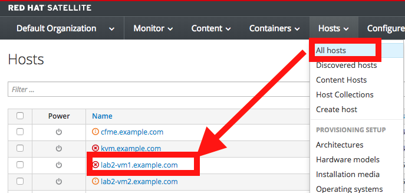

. In the *Properties* box on the left of the Satellite UI, notice that the global *Status* indicator says *Error* due to failing the SCAP scan.
+
image:images/lab2-globalstatusproperties.png[500,500]

=== Managing Users and Roles

For the administrator, Red Hat Satellite provides the ability to create, modify, and remove users. Also, it is possible to configure access permissions through assigning roles to users. We will not be diving deep into Users and Roles in this lab exercise. For more details on managing users and roles in Satellite, see the guide on link:https://access.redhat.com/documentation/en-us/red_hat_satellite/6.3/html/administering_red_hat_satellite/chap-red_hat_satellite-administering_red_hat_satellite-users_and_roles[Administering Red Hat Satellite].

. Satellite does have a default *Compliance viewer* and *Compliance manager* role. You can customize these roles and assign these roles to users. Users with the *Compliance manager* role can create new compliance policies and associate them with Hostgroups. Users with the *Compliance viewer* role can only view compliance reports.

+
image:images/lab2-roles.png[200,200]
+
image:images/lab2-complianceroles.png[200,200]

<<top>>

link:README.adoc#table-of-contents[ Table of Contents ] | link:lab3.adoc[ Lab 3]
