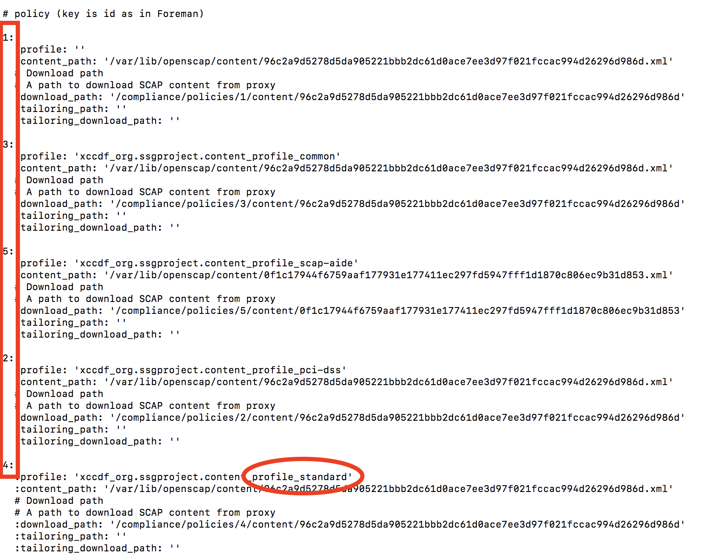

== Lab 2: Utilizing OpenSCAP in Satellite 6 for security scanning, auditing, and remediation

=== Goal of Lab 2
The goal of this lab is to introduce you to OpenSCAP in Satellite 6. OpenSCAP is the integrated security scanning, auditing, and remediation tool in Satellite 6.

=== Introduction
Security compliance management is the ongoing process of defining security policies, auditing for compliance with those policies and resolving instances of non-compliance. Once a security policy is defined, an audit is conducted to verify compliance with the policy. Any non-compliance is managed according to the organization's configuration management policies. Security policies vary in their scope, from being host-specific to industry-wide, so there is a need for flexibility in their definition.

The Security Content Automation Protocol (SCAP) enables the definition of security configuration policies. For example, a security policy might specify that for hosts running Red Hat Enterprise Linux, login via SSH is not permitted for the root account.

In Satellite 6, tools provided by the OpenSCAP project are used to implement security compliance auditing. For more information about OpenSCAP see the link:https://access.redhat.com/documentation/en-us/red_hat_enterprise_linux/7/html/security_guide/index[Red Hat Enterprise Linux 7 Security Guide]. The Satellite web UI enables scheduled compliance auditing and reporting on all hosts under management by Red Hat Satellite.

=== Introduction to SCAP content provided in Satellite 6
Before creating a SCAP compliance policy for a host, you need SCAP content.

SCAP content is a datastream format containing the configuration and security baseline against which hosts are checked. Checklists are described in the extensible checklist configuration description format (XCCDF) and vulnerabilities in the open vulnerability and assessment language (OVAL). Checklist items, also known as rules express the desired configuration of a system item. For example, you may specify that no one can log in to a host over SSH using the root user account. Rules can be grouped into one or more profiles, allowing multiple profiles to share a rule. SCAP content consists of both rules and profiles.

You can either create SCAP content or obtain it from a vendor. Supported profiles are provided for Red Hat Enterprise Linux in the scap-security-guide package. The creation of SCAP content is outside the scope of this lab, but see the link:https://access.redhat.com/documentation/en-us/red_hat_enterprise_linux/7/html/security_guide/index[Red Hat Enterprise Linux 7 Security Guide] or Red Hat Enterprise Linux 6 Security Guide for information on how to download, deploy, modify, and create your own content. The SCAP content provided with Red Hat Enterprise Linux is compliant with SCAP specification 1.2.

The default SCAP content provided with the OpenSCAP components of Satellite 6 depends on the version of Red Hat Enterprise Linux:

* On Red Hat Enterprise Linux 6, content for Red Hat Enterprise Linux 6 is installed.
* On Red Hat Enterprise Linux 7, content for both Red Hat Enterprise Linux 6 and Red Hat Enterprise Linux 7 is installed.

When you install the SCAP components in Satellite as defined in the link:https://access.redhat.com/documentation/en-us/red_hat_satellite/6.3/html/administering_red_hat_satellite/chap-red_hat_satellite-administering_red_hat_satellite-security_compliance_management/[Administering Red Hat Satellite Guide], all of the Red Hat default content will show up in Satellite so no extra steps are necessary to add the SCAP content to Satellite.  But if you had customized content that you wrote yourself or if you have a modified policy and you wanted to upload that modified version , you can do that in the Satellite UI under *Hosts → SCAP contents*.

. Take a look at the default SCAP content provided with the OpenSCAP components of Satellite 6 by navigating to *Hosts → SCAP contents*.
+
image:images/lab2-scapcontents.png[1000,1000]

=== Creating a SCAP compliance policy for a host
Now that you have SCAP content defined in Satellite, you can create a SCAP compliance policy for a host.

. Navigate to *Hosts → Policies* and click on *New Compliance Policy* at the top right.
+
image:images/lab2-newcompliancepolicy.png[1000,1000]

. In the *Create Policy* tab,
* For the compliance policy *Name*, type *RHEL7_Standard*.
* For the *Description*, type *RHEL7 Standard System Compliance Policy*.
* Click *Next*.
+
image:images/lab2-createpolicy.png[1000,1000]

. In the *SCAP Content* tab,
* For *SCAP Content*, choose the *Red Hat rhel7 default content*.
* For *XCCDF Profile*, choose *Standard System Security Profile*.
* Click *Next*.
+
image:images/lab2-scapcontent.png[1000,1000]

. In the *Schedule* tab,
* For *Period*, choose *Weekly*.
* For *Weekday* choose *Thursday*.
+
NOTE: Whatever is defined here as a schedule is executed as a cron job on the client. For Period, if you selected Custom, you can define normal cron syntax to define when the schedule is going to run.
* Click *Next*.
+
image:images/lab2-schedule.png[1000,1000]

. In the *Locations* tab,
* Click the *Default Location* to move it over to the *Selected items* box. This will associate the compliance policy with this Location.
* Click *Next*.
+
image:images/lab2-locations.png[1000,1000]

. In the *Organizations* tab,
* (If not already on the right) Click the *Default Organization* to move it over to the *Selected items* box. This will associate the compliance policy with this *Organization*.
* Click *Next*.
+
image:images/lab2-organizations.png[1000,1000]

. In the *Hostgroups* tab,
* Click *base_with_puppet* to move it over to the *Selected items* box. The compliance policy will apply to this selected *Hostgroup*.

. Click *Submit*.
+
image:images/lab2-hostgroups.png[1000,1000]

=== Executing the compliance policy on a host
. After you have defined the SCAP compliance policy in Satellite, SSH into your workstation host at
*workstation-<GUID>.rhpds.opentlc.com* as *lab-user*. An ssh key is already in the home directory of your laptop, which should allow you to login without a password. Should a password be required, use r3dh4t1!  your password.
+
[source, text]
---
$ ssh lab-user@workstation-<GUID>.rhpds.opentlc.com
---
. Now that you are in the workstation host, as root, SSH into your newly provisioned RHEL 7.5 VM, *lab1-vm1*, from the previous lab. This host has already been registered to both Red Hat Satellite 6 and Red Hat Insights for you.
+
[source, text]
---
$ sudo -i
# ssh lab1-vm1.example.com
---
. As root, run the puppet agent:
+
[source, text]
---
# puppet agent --test
---
+
NOTE: Ignore the Warning that appears regarding the “Local environment”.

. This will set up all the SCAP components, which are delivered via the puppet agent.  Satellite provides a puppet module and a means for the puppet module to set up all the SCAP components. Normally, in production, the puppet agent run automatically occurs within 30 mins so the puppet agent --test is not necessary. We are just doing this in the lab to avoid waiting 30 mins for the puppet agent to run.

. Now that the SCAP components are installed and configured on the client, take a look at the SCAP configuration on the client which is stored in /etc/foreman_scap_client/config.yaml
+
[source, text]
---
#  less /etc/foreman_scap_client/config.yaml
---
+
NOTE: In this yaml file, you will see some basic information such as what server will your reports be uploaded to which is defined by your Hostgroup, certification information such as what certificates were used to authenticate, and towards the bottom, you’ll see your policy ID(s) which are the SCAP policies which you associated in the Satellite UI to its Hostgroup.

. In the above */etc/foreman_scap_client/config.yaml* file, look for the Policy ID for the *standard* profile, which is the RHEL7_Standard compliance policy we created earlier. In the example /etc/foreman_scap_client/config.yaml file below, notice that the Policy ID is 4 for the *standard* profile. However, your Policy ID may be different.
+

. Type *q* to exit *less*.
. Execute the RHEL7_Standard compliance policy on your newly provisioned RHEL 7.5 VM, *lab1-vm1*, from the previous lab using the Policy ID number found in the previous step (where X is the Policy ID found earlier):
+
[source, text]
---
#  foreman_scap_client X
---

This will run the scap scan, bzip the scan results, and upload the results to Satellite.  Wait for the command to complete before continuing.

=== View the SCAP scan results report in Satellite 6
. Go back to your Satellite UI and view your SCAP scan results report for your RHEL7_Standard compliance policy by navigating to *Hosts → Reports*.
+
image:images/lab2-hostreports.png[600,600]

. Click on the report you just created by clicking on the *most recent* report for *lab1-vm1* by clicking the link in the second *Reported At* column (do not click the host link).
+
image:images/lab2-mostrecentreport.png[600,600]

. In this report, you can see the security rules that have passed and failed at a high level which allows you to see the security posture of a system based upon an assigned audit policy.

. To see the detailed full report, click on *View full report* at the top right.
+
image:images/lab2-viewfullreport.png[1000,1000]

. Glance through this report to see what rules passed/failed, severity of the rules, etc.  Notice that you can click on each rule for a deeper drill down.

. *Click the back arrow* on your web browser to go back to the previous report summary page.
+
image:images/lab2-backarrowreport.png[500,500]

. Take a look at the top right buttons in the Satellite UI. Notice also that you can Download the XML of the report in bzip as well. *Click the Back button* from the top right of the Satellite UI.
+
image:images/lab2-downloadxml.png[1000,1000]

. Navigate back to *Hosts -> Reports*
+
image:images/lab2-hostreports.png[600,600]

. Notice the search bar at the top of the Satellite UI. Here, you can filter the compliance reports search with various filters. *Type compliance_failed > 0 and press Search.* This will find any compliance report that have greater than 0 compliance failures.
+
image:images/lab2-compliancefailedfilter.png[1000,1000]

. Click the back arrow on your web browser to go back to your full list of compliance reports.
+
image:images/lab2-backfullcompliancereports.png[1000,1000]

. Click on the report you just created again by clicking on the most recent report for *lab1-vm1* by clicking the link in the second Reported At column (again do not click the host link).
+
image:images/lab2-mostrecentreport2.png[1000,1000]

. Click on *View full report* at the top right again.
+
image:images/lab2-viewfullreport.png[1000,1000]

=== Scanning a host using a custom security profile using a SCAP tailoring file
I love kpop
. Bonchon Fried Chicken
* I love double fried chicken from bonchon

<<top>>

link:README.adoc#table-of-contents[ Table of Contents ] | link:lab3.adoc[ Lab 3]
