== Lab 3: How to use the control policy engine in Red Hat CloudForms and Red Hat Ansible Automation to enforce automated compliance with security policies

== Goal of Lab 3
The goal of this lab is to introduce you to the power and flexibility of Red Hat CloudForms and Red Hat Ansible Automation to enforce compliance with your security policies in an automated fashion.

Specifically, using a combination of Red Hat CloudForms and Red Hat Ansible Automation, you will: enforce the installation of the AIDE package, determine if an Openstack instace is vulnerable to the Meltdown and Spectre vulnerabilities, and enforce Openstack security group membership.

== Introduction
Red Hat CloudForms provides unified hybrid cloud management across your entire heterogenous environment, including virtual, private cloud, public cloud, and container environments. It is an agentless solution, delivered as a virtual appliance, highly scalable and provides deep continuous visibility and discovery of your entire infrastructure. The Red Hat CloudForms control and policy engine provides compliance and governance capabilities right in the GUI of CloudForms. A control policy is created in the Red Hat CloudForms control and policy engine by defining an Event, Condition, and Action. The Action can be one of the defined actions in the Red Hat CloudForms control engine or it can be free-form automation. The Red Hat CloudForms automate engine can be utilized to execute free-form automation using either the native ruby language or using the integrated Ansible to execute Ansible playbooks.  Red Hat CloudForms is also able to communicate directly to your Ansible Tower instance to execute your Ansible playbooks.

Red Hat Ansible Automation is integrated in Red Hat CloudForms. It is a simple, powerful, and agentless IT automation technology that can help improve your current processes, migrate applications for better optimization, and provide a single language for DevOps practices across your organization including Developers, Operations, and the Security Team.

Ansible Tower by Red Hat provides a graphical user interface for Ansible with a visual dashboard, a centralized API for your Ansible automation, role-based access control for increased security, job scheduling, graphical inventory management, and real-time job status updates thus providing you all the IT automation features you need to support your enterprise.

Red Hat Ansible Automation is great for security automation because it is agentless, only requires SSH/WinRM, supports desired state, is extensible and modular, has a push-based architecture, and provides easy targeting based on facts.

=== Lab 3.1 Using Red Hat CloudForms compliance policy with Red Hat Ansible Automation to enforce the installation of the AIDE package
. On the CloudForms appliance (cfme-GUID.rhpds.opentlc.com) log in with *admin* as the user name and *r3dh4t1!* as the password (if not already logged in).

. Navigate to *Control -> Explorer*.
+
image:images/lab3.1-control-explorer.png[200,200]

. Navigate to *Policy Profiles -> Lab 3.1 Enforce-AIDE -> Lab 3.1 Enforce AIDE Package*.
+
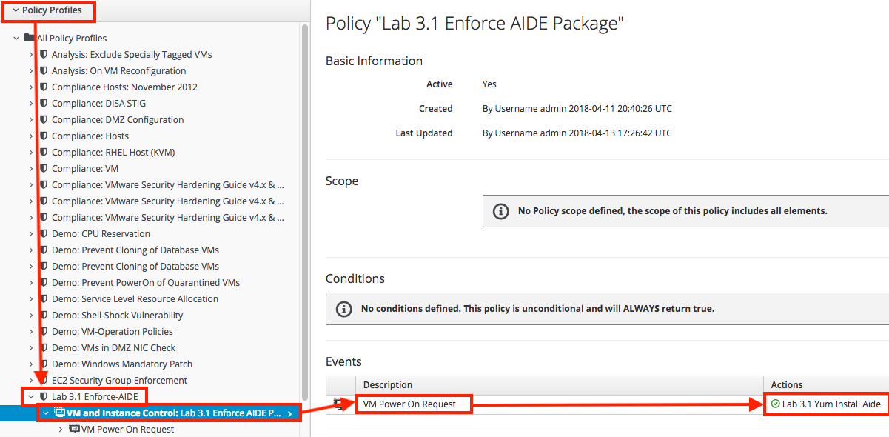
+
NOTE: This control policy dictates that when a VM is powered on, install the AIDE package.

. Click on this control policy by clicking on the event action that says *Lab 3.1 Yum Install Aide*.
+
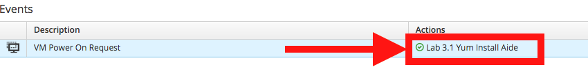

. Notice that this control policy is invoking a custom automation by calling an Ansible playbook that will install the AIDE package.
+
image:images/lab3.1-invokecustomautomation.png[400,400]

. Navigate to Services -> Workloads
+
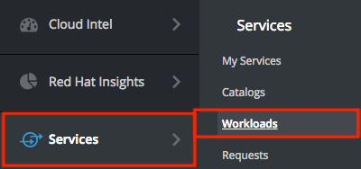

. Click on *lab3-vm1* which will take you to the VM summary page.
+
image:images/lab3.1-clickonvm.png[500,500]
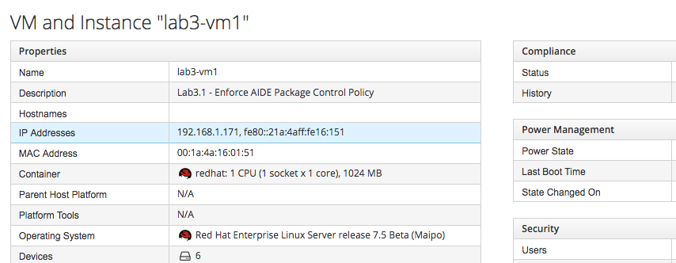

. Click on *Policy -> Manage Policies*
+
image:images/lab3.1-policy-manage-policies.png[400,400]

. Verify that the Lab 3.1 control policy is assigned and click on *Cancel* to exit.
+
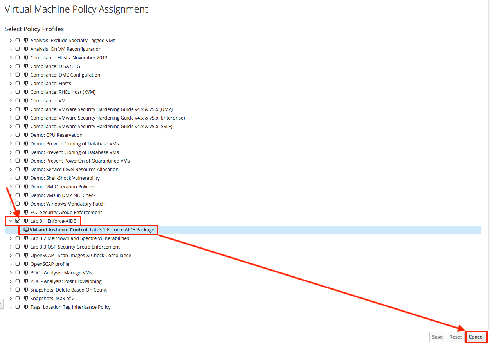

. From the VM summary page power on the VM. This will trigger the control policy to execute an Ansible playbook to install the AIDE package. Note that it can take a minute or so for the package to be installed.
+
image:images/lab3.1-power-on.png[200,200]

. Note the IP address for *lab3-vm1*.
+
image:images/lab3.1-vm-ipaddress.png[400,400]

. If not already there, log into to the bastion host as *lab-user* from your desktop system *replacing GUID with your lab's GUID*. Use the password *r3dh4t1!* for *lab-user*.

+
[source]
----
[localhost ~]$ ssh lab-user@workstation-GUID.rhpds.opentlc.com
----

. If not already root, become *root* and then log into the *lab3-vm1.example.com* host using its IP address *192.168.1.171*.
+
[source]
----
[lab-user@workstation-GUID ~]$ sudo -i
[root@workstation-GUID ~]# ssh 192.168.1.171
----

. Once logged in check to see if the *AIDE* package is installed.
+
NOTE: It may take a couple of minutes for the aide package to appear. So keep trying!
+
[source]
----
[root@lab3-vm1 ~]# rpm -qa --last aide
aide-0.15.1-13.el7.x86_64  Thu 12 Apr 2018 04:26:59 PM EDT
----

. Log out of the ssh session.

=== Lab 3.2 Using Red Hat CloudForms compliance policy to determine if an OpenStack instance is vulnerable to the Meltdown and Spectre vulnerabilities
. Open a private browser window in your web browser.  In the private browser window go to the CloudForms appliance URL (cfme-GUID.rhpds.opentlc.com) and log in with *labuser* as the user name and *r3dh4t1!* as the password.
+
NOTE: labuser is a restricted user that was created by the admin. This user can only see his/her VMs and has limited functionality in CloudForms.

. Navigate to Services -> Workloads if not already there.
+
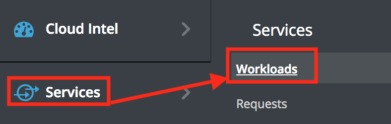

. You will see that the VM is non-compliant. Click on the VM *lab3-vm2* to go to the summary screen.
+
image:images/lab3.2-all-vms.png[500,500]

. In the upper right hand corner click on *Compliance Status*.
+
image:images/lab3.2-compliance-status.png[400,400]
+
. Expand and see the details of this compliance check. You will see that the VM is vulnerable to the Meltdown and Spectre vulnerabilities.
+
image:images/lab3.2-compliance-status-view.png[400,400]
+
NOTE: For the sake of time, the vulnerable kernel packages have already been patched by updating this VM to the latest kernel packages.
+
. Click on the back arrow to navigate back to the VM summary page.
+
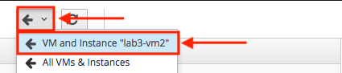
+
. From the VM summary page click on Packages.
+
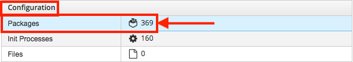
+
. Scroll down to find the kernel package and note the version *693.el7*.
+
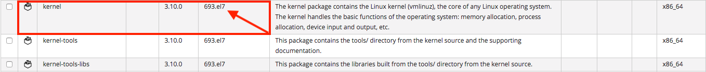
+
. To mitigate against the Meltdown and Spectre vulnerabilities, the kernel package needs to be version *830.el7* or higher. Click on the *back arrow* to navigate back to the VM summary page.
+

+
. Click on *Configuration -> Perform SmartState Analysis*. This will launch a job that will scan the VMs packages and other metadata.
+
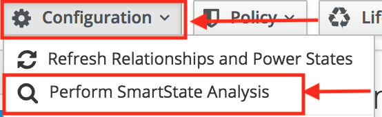
+
. Click on *Lab User -> Tasks* to monitor the scan jobs status.
+
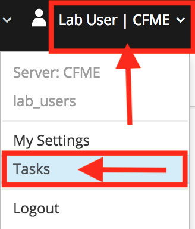
+
. Click on the *Refresh* button periodically until the scan job has completed (about 3 minutes). Afterwards, *click on the job* and this will take you back to the VM summary page.
+
image:images/lab3.2-task-results.png[600,600]
+
. Click on *Policy -> Check Compliance of Last Known Configuration*
+
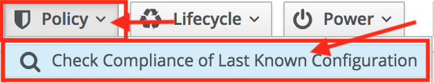
+
. Click on the *Refresh* button until the VM is compliant.
+
image:images/lab3.2-compliant-success.png[600,600]

=== Lab 3.3 Using Red Hat CloudForms control engine to enforce OpenStack Security Group membership

. Switch to the browser tab that is logged in to CloudForms as *admin* and then navigate to *Control -> Explorer*.
+
image:images/lab3.3-control-explorer.png[200,200]
+
. Navigate to *Policy Profiles -> Lab 3.3 OSP Security Group Enforcement -> Lab 3.3 OSP Attach Security Group Policy*. You will notice that this policy states that when an OpenStack instance is powered on, ensure that the *Production* security group is attached.
+
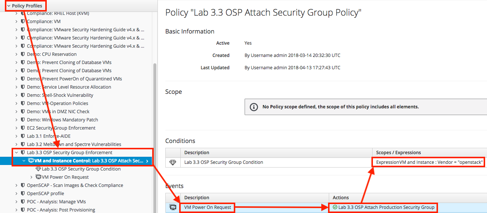
+
. Navigate to Compute -> Cloud -> Instances.
+
image:images/lab3.3-computecloudinstances.png[500,500]
+
. Click on the VM *lab3-vm3* to go to the VM summary page.
+
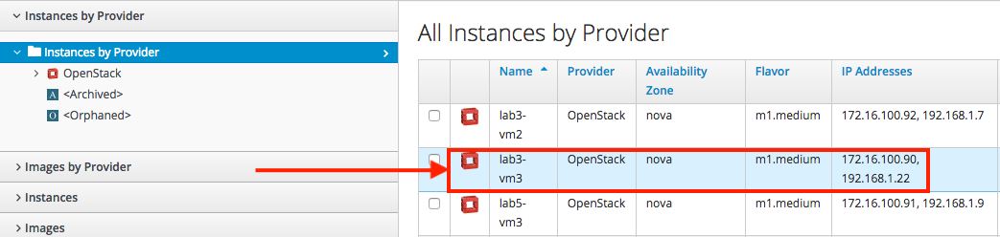
+
. Click on *Policy -> Manage Policies*.
+
image:images/lab3.3-policy-manage-policies.png[400,400]
+
. Verify that the Lab 3.3 control policy is assigned and click on *Cancel* to exit.
+
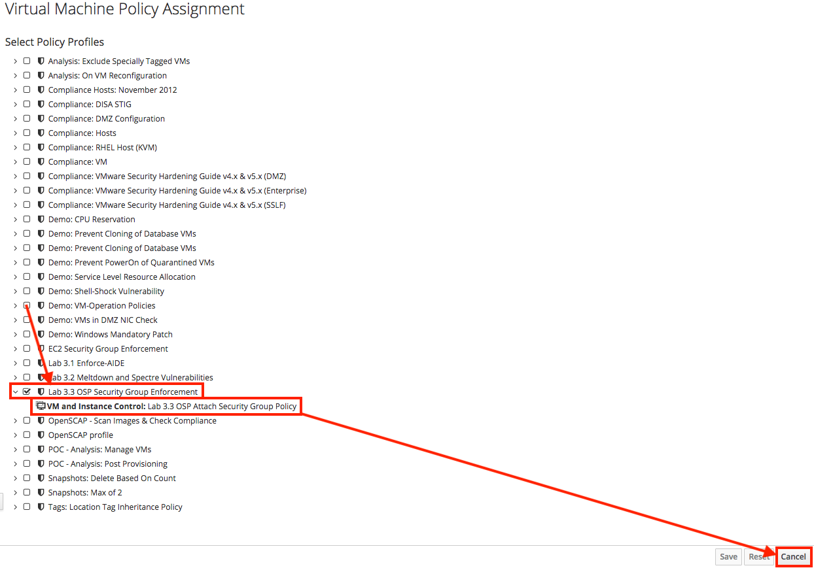
+
. From the VM summary page, locate *Relationships* and click on *Security Groups*.
+
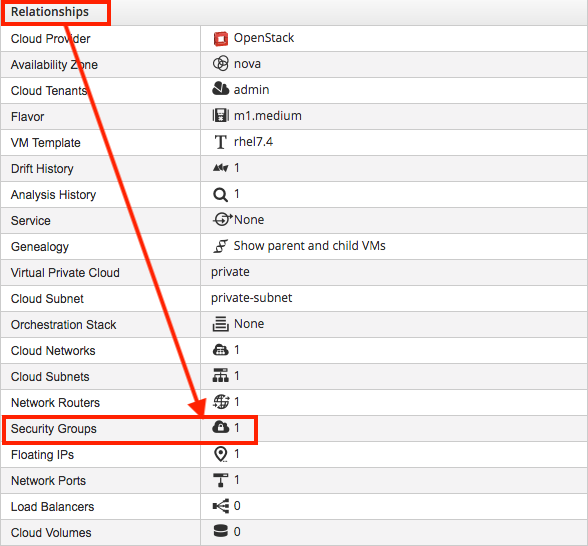
+
. You will see that the VM only has 1 security group.
+
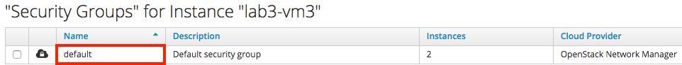
+
. Click on the *back* arrow to navigate back to the VM summary page.
+
image:images/lab3.3-back-arrow.png[200,200]
+
. From the VM summary page *power on* the VM. This will trigger the control policy to ensure that the *Production* security group is applied.
+
image:images/lab3.3-power-on.png[200,200]
+
. Click on the *refresh button* until the VM has powered on and the security group count has changed. Once changed, click on *Security Groups* again.
+
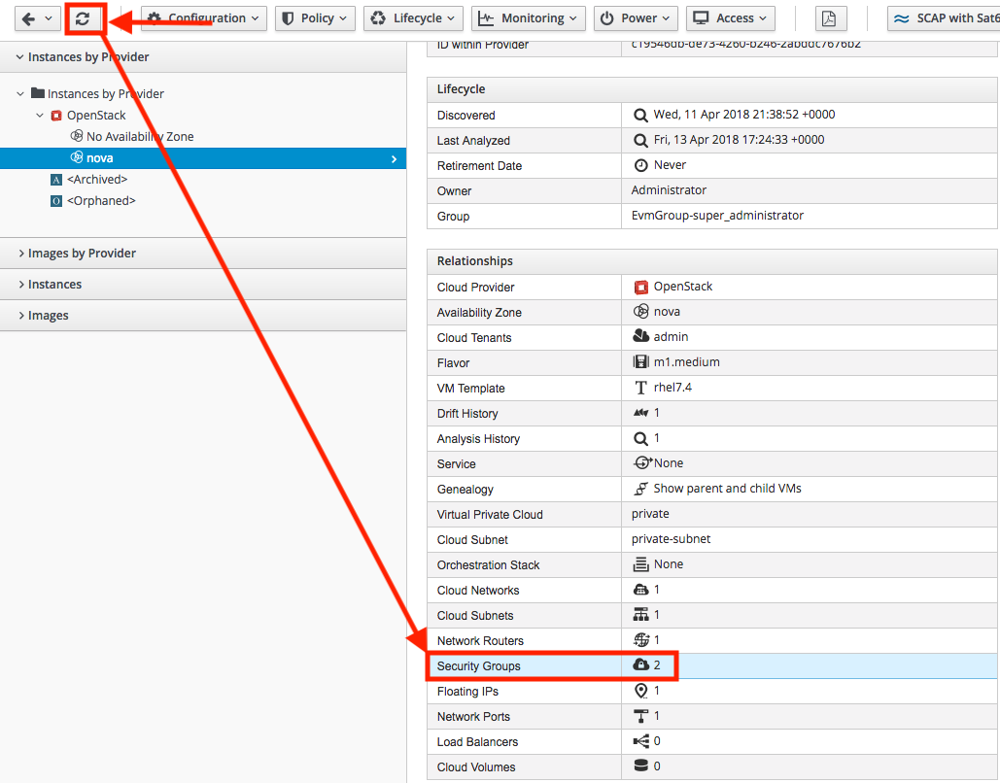
+
. You will now notice that the *Production* security group has been applied automatically due to the control policy set on this Openstack instance.
+
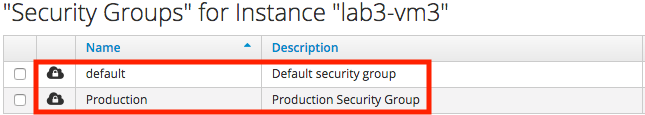

link:README.adoc#table-of-contents[ Table of Contents ] | link:lab4.adoc[Lab 4]
