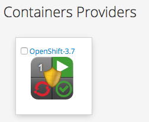
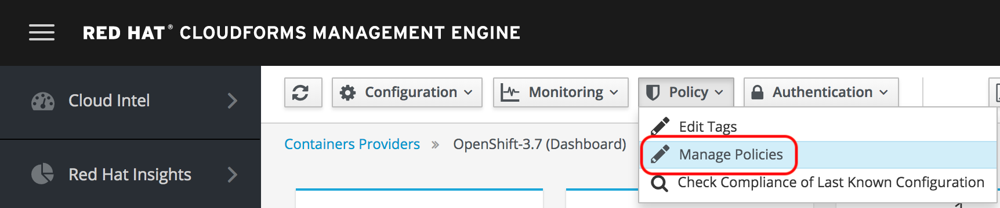
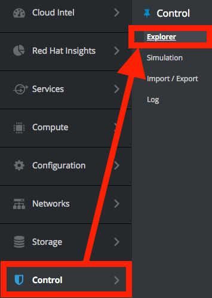
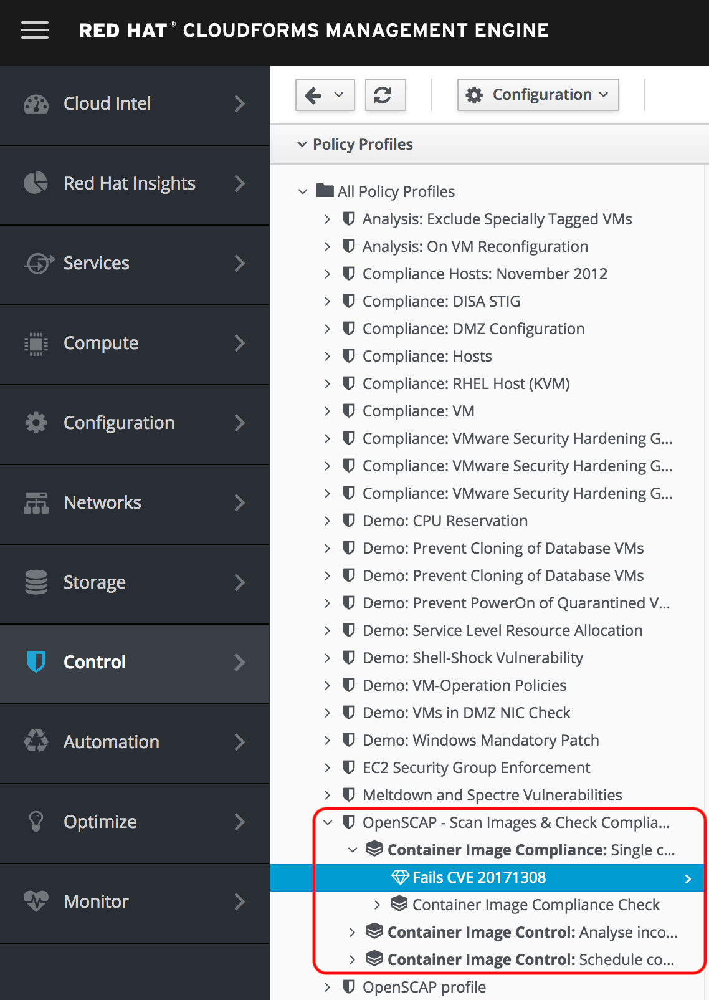
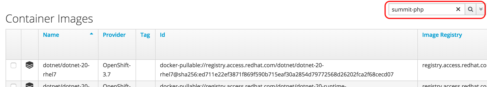
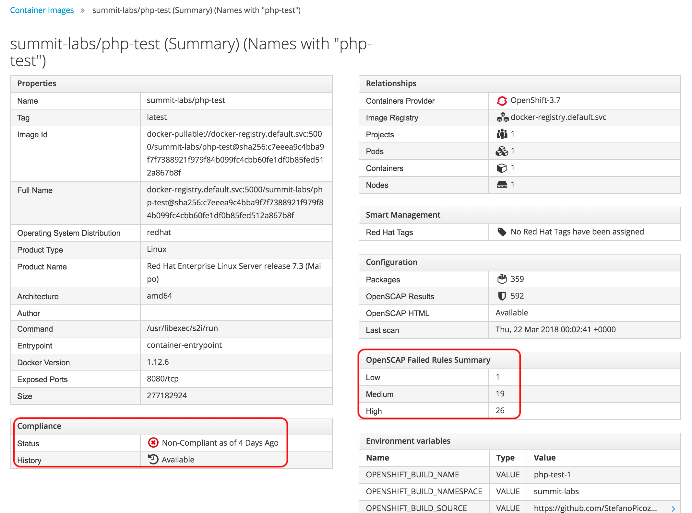
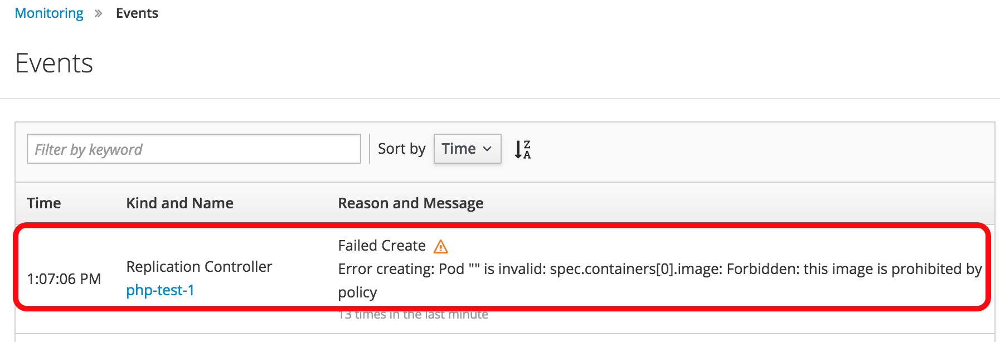
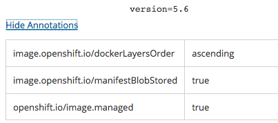

== Lab 4: Managing the security of Red Hat Openshift container images from Red Hat CloudForms

=== Goal of Lab 4
The goal of this lab is demonstrate how you can use Red Hat CloudForms to manage the security of Red Hat Openshift container images. Specifically, we will see how you can use the Red Hat CloudForms control engine to prevent Red Hat Openshift container images with high severity vulnerabilities from running in Red Hat Openshift.

=== Introduction
Red Hat CloudForms has a container scanning feature, using the integrated OpenSCAP scanner, that allows Red Hat CloudForms to flag images in the container registry in which it has found vulnerabilities. Specifically, Red Hat CloudForms can apply an annotation to an image in the OpenShift container registry when it finds high severity vulnerabilities after doing a scan on it. Then, Red Hat Openshift will prevent new containers from running this image with the high severity vulnerabilities.

Red Hat CloudForms has multiple ways a container image scan can be initiated: scheduled scan of the registry, scan based on a newly discovered image in the registry, or a manual execution of the scan via smart state analysis. Having this scanning feature with native integration in Red Hat CloudForms allows for near real time monitoring of your images within the Red Hat Openshift environment. Once Red Hat CloudForms flags an image in the registry, the next time someone tries to start the vulnerable image, Red Hat Openshift will alert the user that the image execution was blocked based on the policy annotation set by Red Hat CloudForms.

=== Red Hat OpenShift Container Image Vulnerability Remediation

In this lab, you'll learn how Red Hat CloudForms can help you scan container images running in Red Hat OpenShift Container Platform. We'll use built-in OpenShift functionality to remediate those images and redeploy the applications. Finally, we'll make sure CloudForms picks up the new images and catalogs the fresh results.

. If you have not already done so, log into CloudForms as *admin* using *r3dh4t1!* as the password.
+
. Using the menu on the left side of the screen, browse to *Compute ->   Containers ->   Providers*.
+
image:images/ocp-ss2.png[400,400]
+
. Click on the *Openshift-3.7* provider. Here, you will see an overview of the OpenShift Container Platform provider that has been added to your lab environment. On the top menu, click on *Policy ->  Manage Policies*.
+

. Notice the single policy that is currently enabled for this *Openshift-3.7* provider, *OpenSCAP - Scan Images & Check Compliance*.
+
image:images/ocp-ss4-2.png[400,400]
image:images/lab4-ocpprovidercontrolpolicydetails.png[400,400]
+
. To see what this policy does, using the menu on the left, browse to *Control ->  Explorer*.
+

. Find the *OpenSCAP - Scan Images & Check Compliance* policy profile and let's see what actions it takes. In this control policy, as new images are discovered by CloudForms, a SmartState Analysis will happen automatically and scan the container image for known CVE based vulnerabilities. CloudForms will then use this data to check whether the container image is in compliance with defined vulnerability checks. It will also mark any image that violates these constraints with a *deny-execution* annotation.
+
NOTE: In this lab example, we are only analyzing against the pass/fail evaluation of a single CVE. In a production environment, you would adjust this condition to analyze against CVE vulnerabilities that your organization has deemed necessary.
+

+
. Using the menu on the left side of the screen, browse to *Compute ->  Containers ->  Container Images*. In the search box in the upper right portion of the window, search for *summit-php* and click on the image returned in the result.
+

+
. Notice all of the details that CloudForms discovers about the container image, including properties, relationships to other objects, OpenSCAP results, and compliance. This particular image has 26 high severity vulnerabilities. In this same view, in the *Environment Variables* section, note that this image is based on PHP 5.5.
+

+
image:images/lab4-phpversion.png[400,400]

. Now, go to your OpenShift UI. Log in as *admin* using *r3dh4t1!* as your password. In the OpenShift UI, browse to the *summit-labs* project using the *My Projects* list on the right side of the screen.
+
NOTE: If you do not see the *summit-labs* project in the list, click on the *View All* link in the *My Projects* list.

. You’ll notice a familiar looking application running in here, *summit-php*. If we denied execution, why is it still running? Simply because we don’t want to rip an application out that may already be in production. The deny execution policy prevents additional containers from being instantiated. Let's give it a try. Expand the summit-php deployment in the main window and click the up arrow next to the Pod circle. Rather than quickly adding an additional pod, it will be prevented from doing so.
+
image:images/ocp-ss10.png[600,600]
+
. Click on *Monitoring* on the left side menu.
+
. Click on *View Details* in the Events list on the right hand side and observe the detailed message on why your application is not scaling up. Notice that there was an error in creating additional containers for this application due to the deny execution policy that is in place for this container image which has several severity high vulnerabilities.
+
image:images/lab4-monitoringviewdetails.png[1000,1000]

+
. If you’d like to see why this is happening behind the scenes, using the menu on the left, browse to *Builds ->  Images*. Select the *summit-php* image stream and then click on the *latest* tag.
+
image:images/lab4-buildsimages.png[400,400]
image:images/lab4-latestimage.png[400,400]

. Scroll to the bottom of the screen and click on *Show Annotations*. Note the *images.openshift.io/deny-execution* annotation is set to true.
+
image:images/lab4-showannotations.png[400,400]
image:images/lab4-denyexecutiontrue.png[400,400]

. Now, let's perform some steps to fix our application. Still in the OpenShift UI, browse to *Builds ->  Builds* using the menu on the left hand side of the screen. Click on the *summit-php* build.
+
image:images/lab4-buildsmenu.png[300,300]
image:images/lab4-buildsname.png[400,400]

.  Select the *Configuration* tab. Note on this tab that this application was based on the php:5.5 image when it was built, which is an older version that brought along those 26 high severity vulnerabilities discovered earlier by CloudForms.
+
image:images/ocp-ss16.png[400,400]
+
. Since containers are immutable, we need to build a new container image based on a version of PHP without all of these high severity vulnerabilities. From this same screen, click *Actions ->  Edit* at the top right of your screen.
+
image:images/lab4-actionsedit.png[200,200]

. In the *Image Configuration* section, we’re simply going to tell OpenShift to rebuild this *summit-php* application using a newer version of PHP. Change the PHP image tag from *5.5 ->  5.6* and *click Save*. OpenShift will automatically start building a new image for this application to use based on PHP 5.6.
+
image:images/ocp-ss18.png[600,600]
+
. Click on the Overview tab on the left. You’ll see that the application is already rolling out based on this newly built image.
+
image:images/lab4-overview.png[400,400]
image:images/ocp-ss19.png[600,600]
+
. In the *Builds ->  Images* menu on the left, select the *summit-php* image stream and click on the *latest* tag again. Scroll down and click on *Show Annotations* and you’ll see there is no deny-execution assigned to this image anymore.
+
image:images/lab4-buildsimages.png[400,400]
image:images/lab4-latestimage.png[400,400]
image:images/lab4-showannotations.png[400,400]

. Back in CloudForms, browse to *Compute ->  Containers ->  Container Images* using the menu on the left side of the screen. You should now see two images when searching for *summit-php*. Click on the *latest* container image.
+
image:images/lab4-latestcontainerimage.png[600,600]

. Notice that the container image details, such as packages, OpenSCAP results, etc are already populated. This is because we assigned a control policy to our Openshift provider earlier in this lab exercise to automatically scan all newly discovered images.
+
image:images/lab4-compliant.png[400,400]

NOTE: If yours is not populated yet, give it a couple of minutes to finish the scan and results collection.

. Notice that this time, this container image passes the compliance check. Automated remediation of the same application, different version of PHP, and less vulnerabilities!
+
image:images/lab4-compliantdetails.png[400,400]
image:images/lab4-summarydetails.png[400,400]

<<top>>

link:README.adoc#table-of-contents[ Table of Contents ] | link:lab5.adoc[Lab 5]
