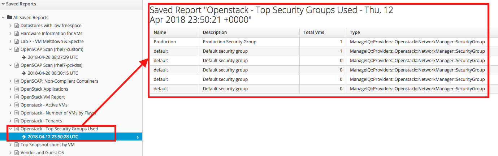
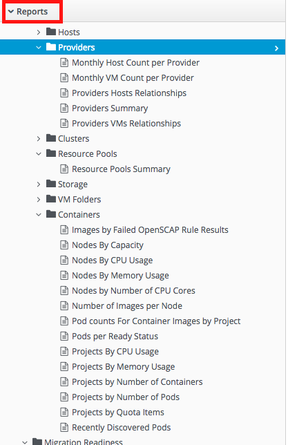

== Lab 6: Viewing Security related reports for Red Hat Openstack Platform and Red Hat Openshift Container Platform

=== Goal of Lab 6
The goal of this lab is to view other security related reports in Red Hat CloudForms for a hybrid environment. Specifically, we will look at security related reports for Red Hat Openstack Platform and Red Hat Openshift Container Platform.

=== Introduction
Red Hat CloudForms has a robust reporting engine built into the product that allows you to create reports using any of the introspective data collected from your heterogeneous infrastructure. This data is stored either in an internal or external PostgreSQL database. You can use this collected data when creating reports , in control policies , or in automation workflows in Red Hat CloudForms.

=== Viewing Security related reports for Red Hat Openstack Platform
. Log into CloudForms with *admin* as the username and *r3dh4t1!* as the password.
. Navigate to *Cloud Intel -> Reports*.
+
image:images/lab5-cloudintelreports.png[500,500]

. Navigate to the report named *Openstack - Top Security Groups Used*. Take a look at this report. In this report, we can see the top Openstack security groups. Here, we see that the Production and default security groups are tied, with both having 1 VM that is attached to these security groups.
+

=== Viewing Security related reports for Red Hat Openshift Platform
. From CloudForms, take a look at the report named *OpenSCAP: Non-Compliant Containers*. In this report, we can see the not only the Container Name, but also the Container State, Image Name, whether it is OpenSCAP Compliant, what the last OpenSCAP Scan Date is and what the OpenSCAP scan Severity is.
+
image:images/lab6-ocpreport.png[1000,1000]

+
NOTE: Feel free to take a look at other reports that can be created as well by clicking on the *Reports* accordian. Note that you can also create custom reports specific to items you want to see that are not a part of this reports list.
+

link:README.adoc#table-of-contents[ Table of Contents ] | link:lab7.adoc[ Lab 7]
