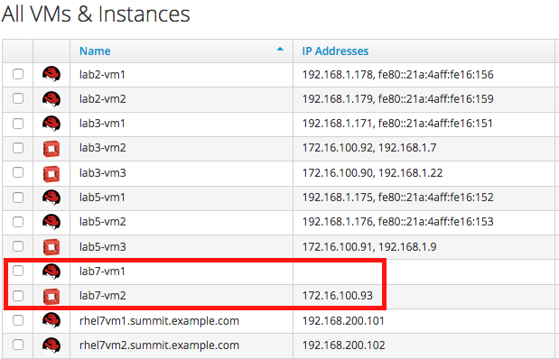
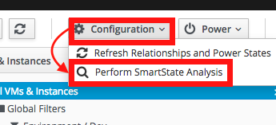

== Lab 7: Reporting on the impact of the Meltdown and Spectre vulnerabilities across a hybrid environment

=== Goal of Lab 7
In this lab, we will learn how to take advantage of reports to understand the impact of the Meltdown and Spectre vulnerabilities across a hybrid environment

=== Introduction
Three vulnerabilities have been identified in fundamental layers of modern processors. Two of these vulnerabilities ( CVE-2017-5753 and CVE-2017-5715) have been branded together as “Spectre”, while one (CVE-2017-5754) has been branded as “Meltdown”.
The vulnerabilities allow one process to improperly read the memory of another process or the operating system kernel. The attack can be executed by anyone person/acct/service that exists on a system to read any memory the attacker desires. Currently, the attack is not easy to execute, and takes a high degree of skill and sophistication.
These vulnerabilities concern many CPU architectures and many of the operating systems that enable that hardware. Working with industry leaders, Red Hat has developed kernel security updates for products in our portfolio to address these vulnerabilities. We are working with our customers and partners to make these updates available, along with the information our customers need to quickly secure their physical systems, virtual images, and container-based deployments.

=== Deep inspection of Meltdown and Spectre vulnerable systems across Openstack and Container Environments

In this lab exercise, as a security officer/auditor, you are given access to information of the systems in your environment by the admin. This is an effective way to give security officers/auditors access to information about systems without giving direct root and edit access to systems, which is limited to the admins.

. Log into CloudForms as the security officer/auditor with *security* as the username and *r3dh4t1!* as the password.

+
NOTE: This security compliance officer/auditor user is a restricted user in Red Hat CloudForms and only have the permissions to view and create reports and scan machines. The admin has configured this user to have only this capability in CloudForms.

. Now let's navigate to *lab7-vm1* and *lab7-vm2*. Navigate to *Services -> Workloads*
+
image:images/lab7-serviceworkloads.png[400,400]

. These are the list of VMs and Instances that the security officer/auditor user can see in this environment , as permitted by the admin. In this lab exercise, we will focus on *lab7-vm1* and *lab7-vm2*. Notice that *lab7-vm1* is a Red Hat Virtualization VM and *lab7-vm2* is a Red Hat Openstack instance. Click on *lab7-vm1*.
+

. Now let's execute a scan of this *lab7-vm1* VM so we get the latest deep OS level details of this VM. Click on *Configuration -> Perform SmartState Analysis*
+

. Press the *refresh* button at the top and watch the *Last Analyzed* section in the *Lifecycle* section. When the date here gets updated to the current date and time then your analysis scan has completed.
+
image:images/lab7- 

<<top>>

link:README.adoc#table-of-contents[ Table of Contents ] | link:lab8.adoc[Lab 8]
