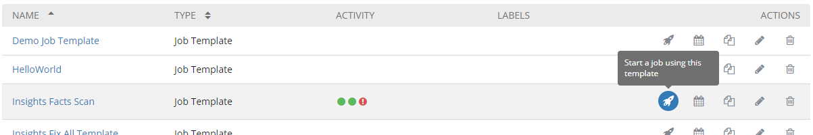
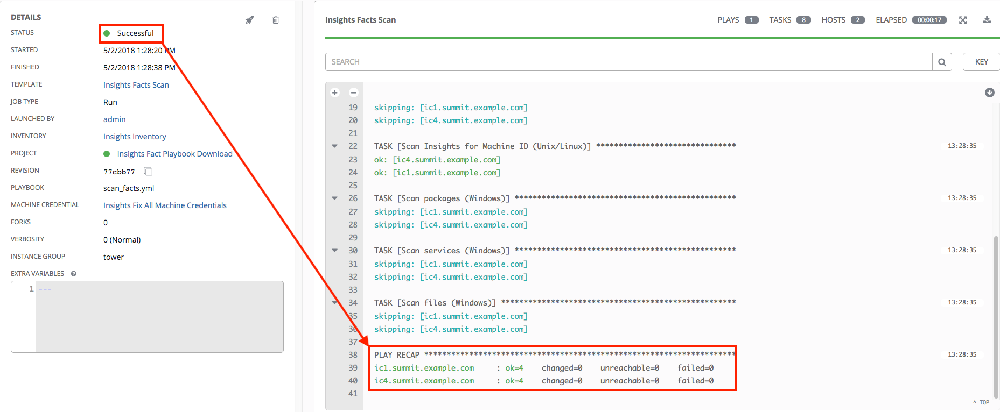
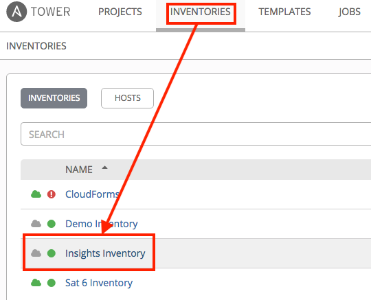
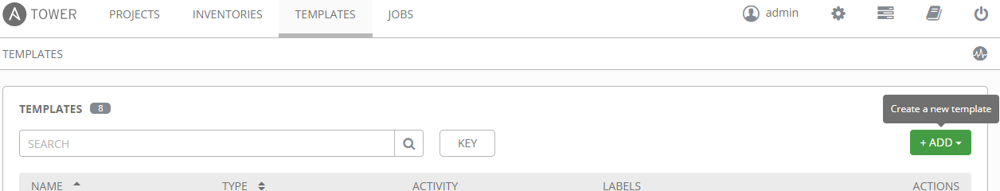
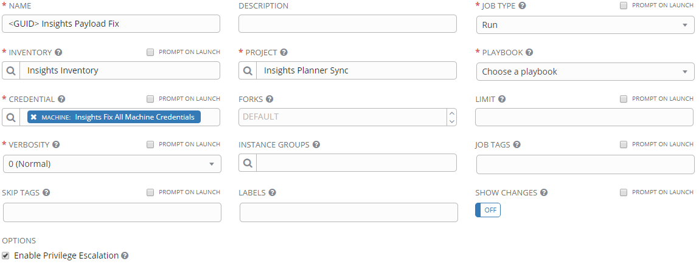
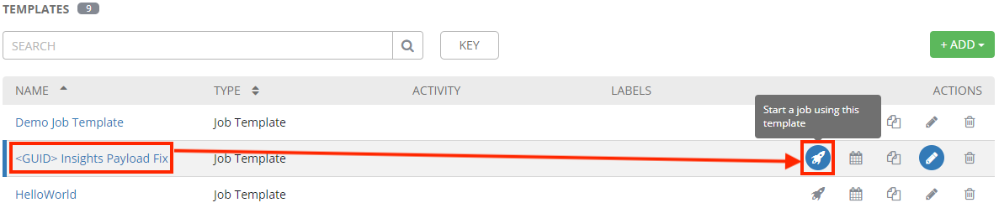
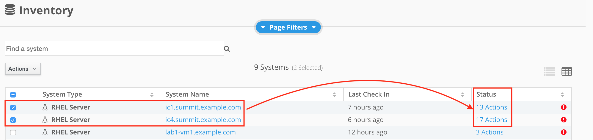
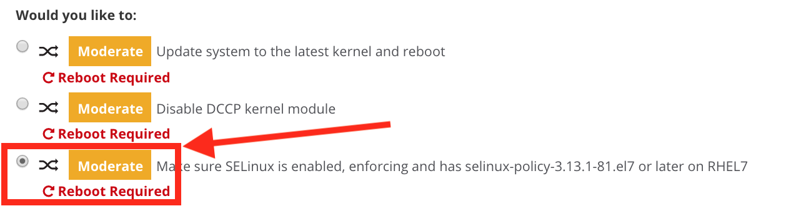
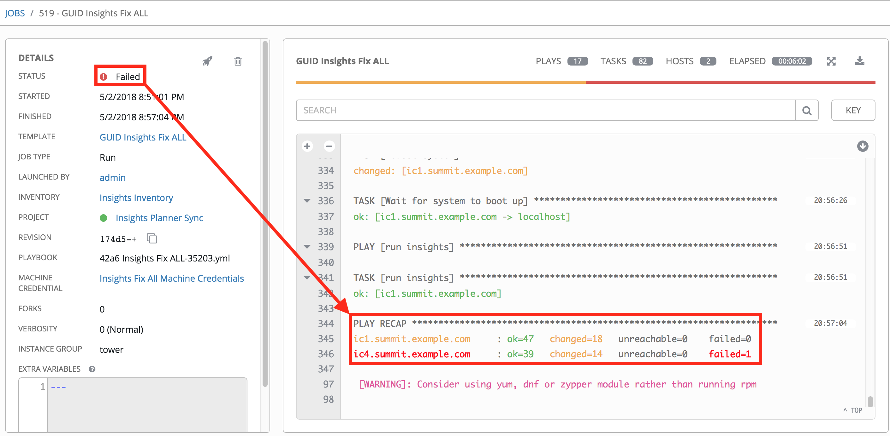
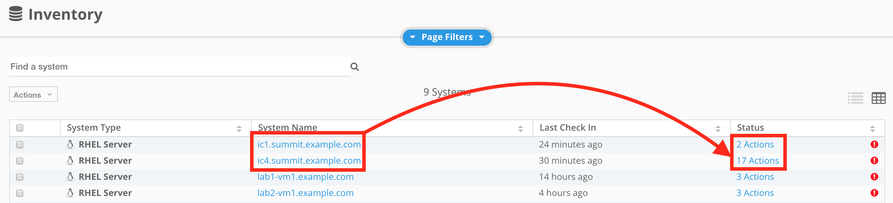

== Lab 8: Proactive Security and Automated Risk Management with Red Hat Insights

=== Goal of Lab 8
The goal of this lab is to introduce you to the proactive security capabilities of Red Hat Insights. In this lab, we will focus only on the specific security features of Red Hat Insights.

=== Introduction
Red Hat Insights was designed to proactively evaluate the security, performance, and stability of your Red Hat platforms by providing prescriptive analytics of your systems. Red Hat Insights helps move you from reactive to proactive systems management, delivers actionable intelligence, and increases visibility of infrastructure risks and the latest security threats. Operational analytics from Red Hat Insights empowers you to prevent downtime and avoid firefighting while responding faster to new risks.

Red Hat Insights recommendations are tailored for the individual system where risk is detected. This allows you to be certain that actions identified by Insights are validated and have a verified resolution for each detected risk, reducing false positives you may experience from critical risks identified by third-party security scanners. Red Hat Insights provides predictive analysis of security risk in your infrastructure based on a constantly evolving threat feed from Red Hat.

Through analysis of Red Hat Insights metadata and curated knowledge based on over fifteen years of enterprise customer support, Red Hat is able to identify critical security vulnerabilities, statistically frequented risks, and known bad configurations. We scale this knowledge to our customers with Red Hat Insights reporting and alerts, allowing prediction of what will happen on a monitored system, why it will happen, and how to fix a problem before it can occur.

Red Hat Insights functionality is integrated into Red Hat’s Customer Portal, Red Hat Satellite, Red Hat CloudForms, and Ansible Tower by Red Hat.  Recommendations from Red Hat Insights are human-readable and in most cases can simply be copy and pasted into the terminal to resolve the issue. You may also automate remediation of hosts in your infrastructure with Red Hat Insights generated Ansible playbooks or Ansible Tower by Red Hat integration.

=== Lab 8.1 Preparing Red Hat Insights Clients
To prepare Red Hat Insights clients we must first register each node with Satellite and install the Red Hat Insights agent

==== Lab 8.1.1 Registering host *ic1.summit.example.com* to Red Hat Satellite and install Red Hat Insights agent
. If not already there, log into to the workstation host from your desktop system replacing *GUID* with your lab's *GUID*:
+
[source]
----
[lab-user@localhost ~]$ ssh workstation-GUID.rhpds.opentlc.com
----

. If not already root, become *root* and then log into the *ic1.summit.example.com*.
+
[source]
----
[lab-user@workstation-GUID ~]$ sudo -i
[root@workstation-GUID ~]# ssh ic1.summit.example.com
----

. Download the Red Hat Satellite *bootstrap.py* script and make it executable.
+
[source]
----
[root@ic1 ~]# curl -O http://sat6.summit.example.com/pub/bootstrap.py
[root@ic1 ~]# chmod +x bootstrap.py
----

. Execute *bootstrap.py* with the necessary parameters to register this node to Red Hat Satellite 6.
+
[source]
----
[root@ic1 ~]# ./bootstrap.py -l admin -p r3dh4t1! -s sat6.summit.example.com -o 'Default Organization' -L 'Default Location' -g base_with_puppet -a base_with_puppet -f

...
Complete!
Uploading Enabled Repositories Report
Loaded plugins: product-id
[SUCCESS], [2018-05-01 14:24:26], [/usr/bin/yum -y remove rhn-setup rhn-client-tools yum-rhn-plugin rhnsd rhn-check rhnlib spacewalk-abrt spacewalk-oscap osad 'rh-*-rhui-client' 'candlepin-cert-consumer-*'], completed successfully.
----

. Install and Register with Red Hat Insights:
+
NOTE: On RHEL 7.5, the client RPM has been renamed to insights-client, but this laboratory machines are using RHEL 7.0 and 7.3 for demonstration purposes, so the package name is still the old one.
+
[source]
----
[root@ic1 ~]# yum install -y redhat-access-insights
[root@ic1 ~]# redhat-access-insights --register
This host has already been registered.
Automatic daily scheduling for Insights has been enabled.
Starting to collect Insights data
Uploading Insights data, this may take a few minutes
Upload completed successfully!
----

==== Lab 8.1.2 Registering Red Hat Insights host *ic4.summit.example.com* to Red Hat Satellite
. If not already there, log into to the bastion host from your desktop system replacing *GUID* with your lab's *GUID*:
+
[source]
----
[lab-user@localhost ~]$ ssh workstation-GUID.rhpds.opentlc.com
----

. If not already root, become *root* and then log into the *ic1.summit.example.com*.
+
[source]
----
[lab-user@workstation-GUID ~]$ sudo -i
[root@workstation-GUID ~]# ssh ic4.summit.example.com
----

. Download the Red Hat Satellite *bootstrap.py* script and make it executable.
+
[source]
----
[root@ic4 ~]# curl -O http://sat6.summit.example.com/pub/bootstrap.py
[root@ic4 ~]# chmod +x bootstrap.py
----

. Execute *bootstrap.py* with the necessary parameters to register this node to Red Hat Satellite 6.
+
[source]
----
[root@ic4 ~]# ./bootstrap.py -l admin -p r3dh4t1! -s sat6.summit.example.com -o 'Default Organization' -L 'Default Location' -g base_with_puppet -a base_with_puppet -f

...
Complete!
Uploading Enabled Repositories Report
Loaded plugins: product-id
[SUCCESS], [2018-05-01 14:34:26], [/usr/bin/yum -y remove rhn-setup rhn-client-tools yum-rhn-plugin rhnsd rhn-check rhnlib spacewalk-abrt spacewalk-oscap osad 'rh-*-rhui-client' 'candlepin-cert-consumer-*'], completed successfully.
----

. Install and Register with Red Hat Insights:
+
NOTE: On RHEL 7.5, the client RPM has been renamed to insights-client, but this laboratory machines are using RHEL 7.0 and 7.3 for demonstration purposes, so the package name is still the old one.
+
[source]
----
[root@ic4 ~]# yum install -y redhat-access-insights
[root@ic4 ~]# redhat-access-insights --display-name=ic4.summit.example.com --register
This host has already been registered.
Automatic daily scheduling for Insights has been enabled.
Starting to collect Insights data
Uploading Insights data, this may take a few minutes
Upload completed successfully!
----
+
Notice the *--display-name* parameter. This allows you to set the displayed hostname to something other than the default for a system within Insights. This is useful if you wish to obfuscate the hostnames that are used in analysis. Be aware that hostnames must resolve properly for Ansible playbooks and tower management to work for automated remediation, so the display name should match a valid hostname, even if it isn't the publicly accessible DNS name.

=== Lab 8.2 Manually fixing the payload injection security issue
In this section, we will manually fix the specific *Kernel vulnerable to man-in-the-middle via payload injection (CVE-2016-5696)* on *ic1.summit.example.com* without causing downtime.

. Going back to the Satellite UI, click on *Red Hat Insights → Overview*, where you could see all your registered systems, actions summary (highlighted by priority) as well as latest updates from Red Hat.
+
image:images/lab8.1-insightsoverview.png[1000,1000]

. From your Satellite 6.3 UI, click on *Red Hat Insights → Inventory*.
+
image:images/lab8.1-inventory.png[1000,1000]

. Click on your client VM, which is *ic1.summit.example.com*. You will see the list of issues affecting it when clicking on the system name.
+
image:images/lab8.1-listofissues.png[1000,1000]

. Notice that your system shows up with multiple security vulnerabilities.
+
NOTE: One of the security issues listed is the Meltdown and Spectre vulnerability. This is the security issue that says *Kernel vulnerable to side-channel attacks in modern microprocessors(CVE-2017-573/Spectre, CVE-2017-5754/Meltdown)*. To save time, we will NOT be fixing this particular security issue in this lab exercise since the fix for Meltdown and Spectre requires a kernel upgrade, which requires a reboot of the system.
+
NOTE: Our objective is to fix the payload injection problem without causing downtime, and see that it no longer appears as a vulnerability in Red Hat Insights. Specifically, this payload injection problem causes the kernel to be vulnerable to man-in-the-middle via payload injection. A flaw was found in the implementation of the Linux kernel's handling of networking challenge ack link:https://tools.ietf.org/html/rfc5961[RFC 5961] where an attacker is able to determine the shared counter. This flaw allows an attacker located on different subnet to inject or take over a TCP connection between a server and client without needing to use a traditional man-in-the-middle (MITM) attack.

. Use your browser’s search function to search for *payload injection*.
+
image:images/lab8.1-payloadinjectionsearch.png[1000,1000]
+
NOTE: Reading the description for the vulnerability shows that the sysctl variable is set to a level that allows being exploited. We want to do the active mitigation by changing the sysctl variable and making it permanent on reboot. In this case, we do not want to update the kernel or reboot since we don’t want downtime.

. If not already there, log into to the workstation host from your desktop system replacing *GUID* with your lab's *GUID*:
+
[source]
----
[lab-user@localhost ~]$ ssh workstation-GUID.rhpds.opentlc.com
----

. If not already root, become *root*, log in to your two Red Hat Insights client machine *ic1.summit.example.com*
+
[source]
----
[lab-user@workstation-GUID ~]$ sudo -i
[root@workstation-GUID ~]# ssh ic1.summit.example.com
----

. Now, as *root*, perform the recommended active mitigation. Edit the */etc/sysctl.conf* file to add the mitigation configuration, and reload the kernel configuration:
+
[source]
----
[root@ic1 ~]# echo "net.ipv4.tcp_challenge_ack_limit = 2147483647" >> /etc/sysctl.conf
[root@ic1 ~]# sysctl -p
net.ipv4.tcp_challenge_ack_limit = 100
net.ipv4.tcp_challenge_ack_limit = 2147483647
----

. After applying the active mitigation, we want to have the system report any changes, run the following command as root on ic1.summit.example.com:
+
[source]
----
# redhat-access-insights
Starting to collect Insights data
Uploading Insights data, this may take a few minutes
Upload completed successfully!
----

. Wait until this step completes before moving to the next step.
. From your Satellite UI, click on *Red Hat Insights → Inventory*.
+
image:images/lab8.1-insightsinventory.png[1000,1000]

. Click on your client VM, *ic1.summit.example.com*. You will notice than the number of actions has decreased.
+
image:images/lab8.1-actionsdecreased.png[1000,1000]

. Use your browser’s search function to search for *payload injection*. You will notice that this payload injection issue is no longer listed due to fixing the vulnerability.
+
image:images/lab8.1-payloadinjectionsearch-again.png[1000,1000]

. Congratulations, you’re no longer impacted by the payload injection vulnerability!

=== Lab 8.3 Automatically fixing the payload injection security issue via Ansible Playbook

It is also possible to automate some of the issues with an Ansible Playbook that Insights provides us. You can see that in the top left corner of every single issue with the Ansible logo in blue if a playbook is available or in grey if it’s not.

. For this part of the lab exercise, we will fix the payload injection vulnerability using an Ansible playbook versus fixing it manually like we did in the previous exercise. We will execute these steps on the *ic4.summit.exmaple.com* VM.
+
image:images/lab8.2-ansibleavailable.png[1000,1000]

. Now we need to create a plan in which the issues that are found will be solved using an Ansible Playbook. In order to do so, from your Satellite 6.3 UI, click on *Red Hat Insights → Planner*.
+
image:images/lab8.2-ansibleplaybook-payloadinjection.png[1000,1000]

. Click on *Create a plan*.
+
image:images/lab8.2-createaplan.png[1000,1000]

. Name the plan: *GUID* Payload Remediation. Replacing *GUID* with your lab's *GUID*, select *ic4.summit.example.com* for Specific System and choose the *Kernel vulnerable to man-in-the-middle via payload injection (CVE-2016-5696)* CVE and click on *Save*.
+
NOTE: Since this is a shared Insights environment naming this with your GUID will make it easier to find when its time to select the plan for remediation.
+
image:images/lab8.2-playbookbuilder.png[1000,1000]

. As you can see, there are two ways to solve this issue, one is by updating the kernel, and the other one is apply the needed changes to the */etc/sysctl.conf* file, add the mitigation configuration, and reload the kernel configuration.
Insights gives us the opportunity to choose the resolution that we want. In this lab we want to prevent unplanned downtime for this issue, so select *Set sysctl ip4 challenge ack limit* as your preferred choice and then click on the *Save* button.
+
image:images/lab8.2-setacklimit.png[1000,1000]

. Once the plan is saved, the planner screen is shown where you can see the newly created plan, as well as the issues it resolves and the systems affected.
+
image:images/lab8.2-saveplanneroutput.png[1000,1000]

. Now that we have a plan built to resolve the Payload vulnerability for *ic4.summit.exampl.com*, we need to sync the Red Hat Insights information with Ansible Tower.

. Login with *admin* / *r3dh4t1!* to Tower at https://tower-GUID.rhpds.opentlc.com replacing *GUID* with your lab's *GUID*.

. Click on *Templates* from the main menu at the top. Find the *Insights Facts Scan* Job and click the *Rocket* under the Actions.
+

. The Job Details output will pop up and you should let the job run to completion. At the end the Status should show Successful.
+

. Navigate to *Inventories* and click on *Insights Inventory*.
+

. Click *Hosts* and click on the host *ic4.summit.example.com*.
+
image:images/lab8.3-tower-inv-hosts.png[600,600]

. By clicking the *Insights* option for this host you can see all of the risks and vulnerabilities associated with this host.
+
image:images/lab8.3-insights-issues.png[1000,1000]
+
NOTE: In an upcoming version of Tower you will be able to remediate directly from this interface, but for this lab we will continue using the Insights Planner interface from within Satellite to accomplish our tasks in conjunction with Tower.

. Navigate to *Projects* from the main menu at the top and find the *Insights Planner Sync* project, and click the Cloud with a download arrow under ACTIONS to the right of the project name.
+
image:images/lab8.3-insights-sync-scm.png[1000,1000]

. The sync should complete successfully, and now you're ready to remediate with Tower.
+
NOTE: Tower can also identify Insights issues on managed hosts. All of the above projects and plans can be sync'd and updated automatically with Tower via the API or with scheduled runs.

. Navigate to *Templates* and click on *+ADD* and select the *Job Template* dropdown. We will create a job template to run one of the plans we created. You should have created the plan with your unique *GUID* from this lab.
+

. For the name of the template use: *GUID* Payload Fix. Job Type should be *Run*. For Inventory select *Insights Inventory*. For Project select *Insights Planner Sync* (you may need to navigate to a different page to find this project). In the Playbook Dropdown Choose a playbook that you created with your unique GUID in the Insights Planner. For credential select *Insights Fix All Machine Credentials*. The final task is to click *Enable Privilege Escalation* under OPTIONS, and click Save.
+

. Scroll down to where the Templates are listed below the New Template fields, or click Templates from the Main Tower menu. Find the template you created.
+

. Click the rocket for the template you created. This will launch the job and run the playbook you selected from the dropdown. If everything is successful you will see a status of *Successful* in he DETAILS pane, and the ansible-playbook run output on the right.
+
image:images/lab8.3-insights-template4.png[1000,1000]

. Now navigate back to your Satellite UI at https://sat-GUID.rhpds.opentlc.com and from the Satellite UI, click on *Red Hat Insights → Inventory* you will notice that *ic4.summit.example.com* has one less issue, since we resolved the kernel vulnerability that we created the Plan and playbook for.
+
image:images/lab8.2-afteransiblefix.png[1000,1000]
+
NOTE: When the execution if a playbook is completed, the Insights agent is also run as part of this Ansible playbook, so the latest state of the system is reporting into Insights automatically.

=== Lab 8.4 [BONUS LAB] Automatically fix all the issues on client systems using Ansible Tower

In this lab exercise, we will attempt to fix all the issues on the client systems, *ic1.summit.example.com* and *ic4.summit.example.com*.

. Open your browser to the Red Hat Satellite server https://sat6-GUID.rhpds.opentlc.com (replacing *GUID* with your lab's *GUID*) and login as username *admin* and password *r3dh4t1!*, if not already logged in.

. Click on *Red Hat Insights → Inventory*.
+
image:images/lab8.4-insights-inventory.png[200,200]

. Select both *ic1.summit.example.com* and *ic4.summit.example.com* systems and note the number of actions each client need to take in order to be resolved.
+

. Click on Actions, on the top left corner, and then select *Create a new Plan / Playbook*.
+
image:images/lab8.3-createplan.png[200,200]

. Enter a plan name of *GUID Insights Fix ALL*, replacing *GUID* with your lab's *GUID*. Choose all *Actions*, do this by clicking on the box by the Action label at the top. Then click *Save*.
+
image:images/lab8.3-screen.png[800,800]

. You are given the option to choose between different ways to solve your issues. For this exercise in order to save some time, choose actions that do not require a reboot if possible.
+

. You should see all the issues this plan is going to solve as well as the affected systems.
+
image:images/lab8.3-planner.png[1000,1000]
+
NOTE: Now that we have a plan built to resolve most of the vulnerabilities for our two nodes, we need to sync the Red Hat Insights information with Ansible Tower.

. Login with *admin* / *r3dh4t1!* to Tower at https://tower-GUID.rhpds.opentlc.com replacing *GUID* with your lab's *GUID*.

. Click on *Templates* from the main menu at the top. Find the *Insights Facts Scan* Job and click the *Rocket* under the Actions.
+

. The Job Details output will pop up and you should let the job run to completion. At the end the Status should show Successful.
+

. Navigate to *Projects* from the main menu at the top and find the *Insights Planner Sync* project, and click the Cloud with a download arrow under ACTIONS to the right of the project name.
+
image:images/lab8.3-insights-sync-scm.png[1000,1000]

. The sync should complete successfully, and now you're ready to remediate with Tower.

. Navigate to *Templates* and click on *+ADD* and select the *Job Template* dropdown. We will create a job template to run one of the plans we created. You should have created the plan with your unique *GUID* from this lab.
+

. For the name of the template use: *GUID* Insights Fix ALL. Job Type should be *Run*. For Inventory select *Insights Inventory*. For Project select *Insights Planner Sync* (you may need to navigate to a different page to find this project). In the Playbook Dropdown Choose a playbook that you created with your unique GUID in the Insights Planner, i.e. *GUID Insights Fix ALL*. For credential select *Insights Fix All Machine Credentials*. The final task is to click *Enable Privilege Escalation* under OPTIONS, and click *Save*.
+
image:images/lab8.4-insights-template2.png[1000,1000]

. Scroll down to where the Templates are listed below the New Template fields, or click Templates from the Main Tower menu. Find the template you created and click the *rocket* for the template you created.
+
image:images/lab8.4-insights-fix-all.png[1000,1000]

. This will launch the job and run the playbook you selected from the dropdown. If everything is successful you will see a status of *Successful* in he DETAILS pane, and the ansible-playbook run output on the right.
+
IMPORTANT: It is possible that one of the nodes will fail during remediation. This is simply an environmental issue and will be addressed in future releases of this lab exercise.
+

+
NOTE: There are some actions that will not have Ansible playbook generation capability, so you may have to do those manually, but you can knock out a majority of the vulnerabilities with Insights Plans and Ansible Tower. Just repeat the steps to create plans, sync them, and create and run the remediation template.

. Now navigate back to your Satellite UI at https://sat-GUID.rhpds.opentlc.com and from the Satellite UI, click on *Red Hat Insights → Inventory* you will notice that *ic1.summit.example.com* and *ic4.summit.example.com* less issues than before.
+

<<top>>

link:README.adoc#table-of-contents[ Table of Contents ]
