== Lab 8: Proactive Security and Automated Risk Management with Red Hat Insights

=== Goal of Lab 8
The goal of this lab is to introduce you to the proactive security capabilities of Red Hat Insights. In this lab, we will focus only on the specific security features of Red Hat Insights.

=== Introduction
Red Hat Insights was designed to proactively evaluate the security, performance, and stability of your Red Hat platforms by providing prescriptive analytics of your systems. Red Hat Insights helps move you from reactive to proactive systems management, delivers actionable intelligence, and increases visibility of infrastructure risks and the latest security threats. Operational analytics from Red Hat Insights empowers you to prevent downtime and avoid firefighting while responding faster to new risks.

Red Hat Insights recommendations are tailored for the individual system where risk is detected. This allows you to be certain that actions identified by Insights are validated and have a verified resolution for each detected risk, reducing false positives you may experience from critical risks identified by third-party security scanners. Red Hat Insights provides predictive analysis of security risk in your infrastructure based on a constantly evolving threat feed from Red Hat.

Through analysis of Red Hat Insights metadata and curated knowledge based on over fifteen years of enterprise customer support, Red Hat is able to identify critical security vulnerabilities, statistically frequented risks, and known bad configurations. We scale this knowledge to our customers with Red Hat Insights reporting and alerts, allowing prediction of what will happen on a monitored system, why it will happen, and how to fix a problem before it can occur.

Red Hat Insights functionality is integrated into Red Hat’s Customer Portal, Red Hat Satellite, Red Hat CloudForms, and Ansible Tower by Red Hat.  Recommendations from Red Hat Insights are human-readable and in most cases can simply be copy and pasted into the terminal to resolve the issue. You may also automate remediation of hosts in your infrastructure with Red Hat Insights generated Ansible playbooks or Ansible Tower by Red Hat integration.

=== Lab 8.1 Preparing Red Hat Insights Clients
To prepare Red Hat Insights clients we must first register each node with Satellite and install the Red Hat Insights agent

==== Lab 8.1.1 Registering host *ic1.summit.example.com* to Red Hat Satellite and install Red Hat Insights agent
. If not already there, log into to the workstation host from your desktop system replacing *GUID* with your lab's *GUID*:
+
[source]
----
[lab-user@localhost ~]$ ssh workstation-GUID.rhpds.opentlc.com
----

. If not already root, become *root* and then log into the *ic1.summit.example.com*.
+
[source]
----
[lab-user@workstation-GUID ~]$ sudo -i
[root@workstation-GUID ~]# ssh ic1.summit.example.com
----

. Download the Red Hat Satellite *bootstrap.py* script and make it executable.
+
[source]
----
[root@ic1 ~]# curl -O http://sat6.summit.example.com/pub/bootstrap.py
[root@ic1 ~]# chmod +x bootstrap.py
----

. Execute *bootstrap.py* with the necessary parameters to register this node to Red Hat Satellite 6.
+
[source]
----
[root@ic1 ~]# ./bootstrap.py -l admin -p r3dh4t1! -s sat6.summit.example.com -o 'Default Organization' -L 'Default Location' -g base_with_puppet -a base_with_puppet -f

...
Complete!
Uploading Enabled Repositories Report
Loaded plugins: product-id
[SUCCESS], [2018-05-01 14:24:26], [/usr/bin/yum -y remove rhn-setup rhn-client-tools yum-rhn-plugin rhnsd rhn-check rhnlib spacewalk-abrt spacewalk-oscap osad 'rh-*-rhui-client' 'candlepin-cert-consumer-*'], completed successfully.
----

. Install and Register with Red Hat Insights:
+
NOTE: On RHEL 7.5, the client RPM has been renamed to insights-client, but this laboratory machines are using RHEL 7.0 and 7.3 for demonstration purposes, so the package name is still the old one.
+
[source]
----
[root@ic1 ~]# yum install -y redhat-access-insights
[root@ic1 ~]# redhat-access-insights --register
This host has already been registered.
Automatic daily scheduling for Insights has been enabled.
Starting to collect Insights data
Uploading Insights data, this may take a few minutes
Upload completed successfully!
----

==== Lab 8.1.2 Registering Red Hat Insights host *ic4.summit.example.com* to Red Hat Satellite
. If not already there, log into to the bastion host from your desktop system replacing *GUID* with your lab's *GUID*:
+
[source]
----
[lab-user@localhost ~]$ ssh workstation-GUID.rhpds.opentlc.com
----

. If not already root, become *root* and then log into the *ic1.summit.example.com*.
+
[source]
----
[lab-user@workstation-GUID ~]$ sudo -i
[root@workstation-GUID ~]# ssh ic4.summit.example.com
----

. Download the Red Hat Satellite *bootstrap.py* script and make it executable.
+
[source]
----
[root@ic4 ~]# curl -O http://sat6.summit.example.com/pub/bootstrap.py
[root@ic4 ~]# chmod +x bootstrap.py
----

. Execute *bootstrap.py* with the necessary parameters to register this node to Red Hat Satellite 6.
+
[source]
----
[root@ic4 ~]# ./bootstrap.py -l admin -p r3dh4t1! -s sat6.summit.example.com -o 'Default Organization' -L 'Default Location' -g base_with_puppet -a base_with_puppet -f

...
Complete!
Uploading Enabled Repositories Report
Loaded plugins: product-id
[SUCCESS], [2018-05-01 14:34:26], [/usr/bin/yum -y remove rhn-setup rhn-client-tools yum-rhn-plugin rhnsd rhn-check rhnlib spacewalk-abrt spacewalk-oscap osad 'rh-*-rhui-client' 'candlepin-cert-consumer-*'], completed successfully.
----

. Install and Register with Red Hat Insights:
+
NOTE: On RHEL 7.5, the client RPM has been renamed to insights-client, but this laboratory machines are using RHEL 7.0 and 7.3 for demonstration purposes, so the package name is still the old one.
+
[source]
----
[root@ic4 ~]# yum install -y redhat-access-insights
[root@ic4 ~]# redhat-access-insights --register
This host has already been registered.
Automatic daily scheduling for Insights has been enabled.
Starting to collect Insights data
Uploading Insights data, this may take a few minutes
Upload completed successfully!
----

=== Lab 8.2 Manually fixing the payload injection security issue
In this section, we will manually fix the specific *Kernel vulnerable to man-in-the-middle via payload injection (CVE-2016-5696)* on *ic1.summit.example.com* without causing downtime.

. Going back to the Satellite UI, click on *Red Hat Insights → Overview*, where you could see all your registered systems, actions summary (highlighted by priority) as well as latest updates from Red Hat.
+
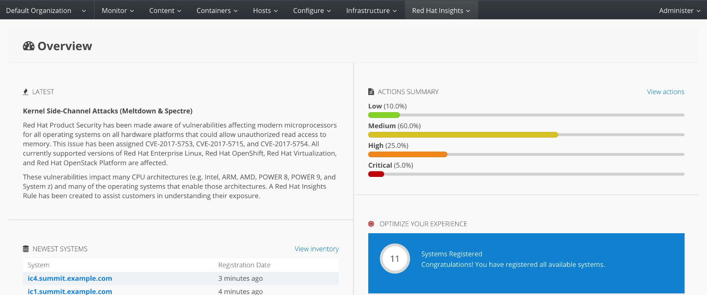

. From your Satellite 6.3 UI, click on *Red Hat Insights → Inventory*.
+
image:images/lab8.1-inventory.png[1000,1000]

. Click on your client VM, which is *ic1.summit.example.com*. You will see the list of issues affecting it when clicking on the system name.
+
image:images/lab8.1-listofissues.png[1000,1000]

. Notice that your system shows up with multiple security vulnerabilities.
+
NOTE: One of the security issues listed is the Meltdown and Spectre vulnerability. This is the security issue that says *Kernel vulnerable to side-channel attacks in modern microprocessors(CVE-2017-573/Spectre, CVE-2017-5754/Meltdown)*. To save time, we will NOT be fixing this particular security issue in this lab exercise since the fix for Meltdown and Spectre requires a kernel upgrade, which requires a reboot of the system.
+
NOTE: Our objective is to fix the payload injection problem without causing downtime, and see that it no longer appears as a vulnerability in Red Hat Insights. Specifically, this payload injection problem causes the kernel to be vulnerable to man-in-the-middle via payload injection. A flaw was found in the implementation of the Linux kernel's handling of networking challenge ack link:https://tools.ietf.org/html/rfc5961[RFC 5961] where an attacker is able to determine the shared counter. This flaw allows an attacker located on different subnet to inject or take over a TCP connection between a server and client without needing to use a traditional man-in-the-middle (MITM) attack.

. Use your browser’s search function to search for *payload injection*.
+
NOTE: Reading the description for the vulnerability shows that the sysctl variable is set to a level that allows being exploited. We want to do the active mitigation by changing the sysctl variable and making it permanent on reboot. In this case, we do not want to update the kernel or reboot since we don’t want downtime.
+
image:images/lab8.1-payloadinjectionsearch.png[1000,1000]

. If not already there, log into to the workstation host from your desktop system replacing *GUID* with your lab's *GUID*:
+
[source]
----
[lab-user@localhost ~]$ ssh workstation-GUID.rhpds.opentlc.com
----

. If not already root, become *root*, log in to your two Red Hat Insights client machine *ic1.summit.example.com*
+
[source]
----
[lab-user@workstation-GUID ~]$ sudo -i
[root@workstation-GUID ~]# ssh ic1.summit.example.com
----

. Now, as *root*, perform the recommended active mitigation. Edit the */etc/sysctl.conf* file to add the mitigation configuration, and reload the kernel configuration:
+
[source]
----
[root@ic1 ~]# echo "net.ipv4.tcp_challenge_ack_limit = 2147483647" >> /etc/sysctl.conf
[root@ic1 ~]# sysctl -p
net.ipv4.tcp_challenge_ack_limit = 100
net.ipv4.tcp_challenge_ack_limit = 2147483647
----

. After applying the active mitigation, we want to have the system report any changes, run the following command as root on ic1.summit.example.com:
+
[source]
----
# redhat-access-insights
Starting to collect Insights data
Uploading Insights data, this may take a few minutes
Upload completed successfully!
----

. Wait until this step completes before moving to the next step.
. From your Satellite UI, click on *Red Hat Insights → Inventory*.
+
image:images/lab8.1-insightsinventory.png[1000,1000]

. Click on your client VM, *ic1.summit.example.com*. You will notice than the number of actions has decreased.
+
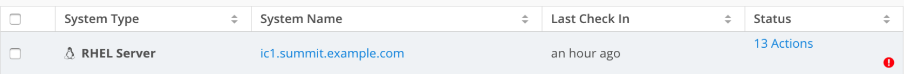

. Use your browser’s search function to search for *payload injection*. You will notice that this payload injection issue is no longer listed due to fixing the vulnerability.
+
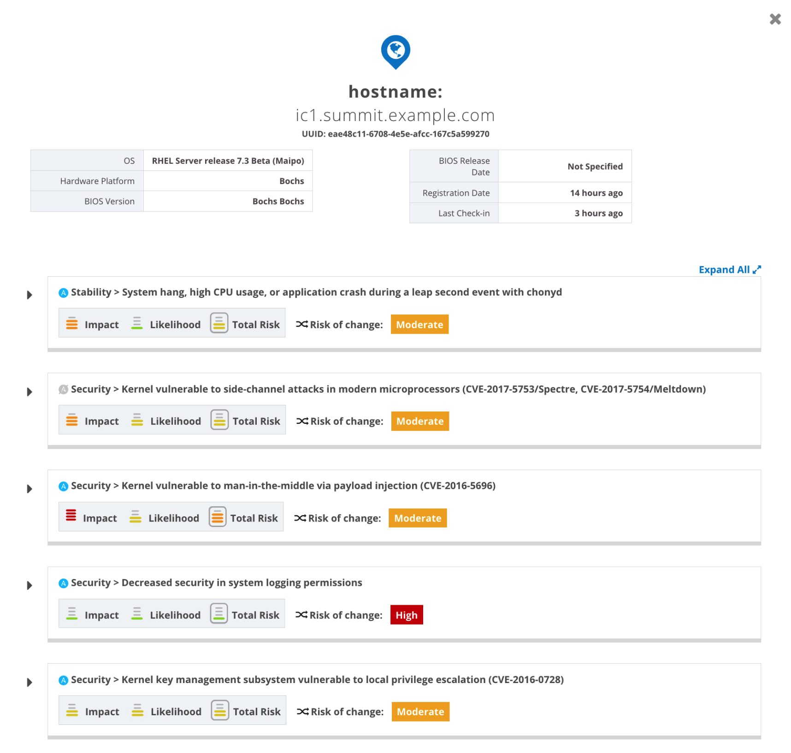

. Congratulations, you’re no longer impacted by the payload injection vulnerability!

=== Lab 8.3 Automatically fixing the payload injection security issue via Ansible Playbook

It is also possible to automate some of the issues with an Ansible Playbook that Insights provides us. You can see that in the top left corner of every single issue with the Ansible logo in blue if a playbook is available or in grey if it’s not.

image:images/lab8.2-ansiblelogo.png[1000,1000]

. For this part of the lab exercise, we will fix the payload injection vulnerability using an Ansible playbook versus fixing it manually like we did in the previous exercise. We will execute these steps on the *ic4.summit.exmaple.com* VM.
+
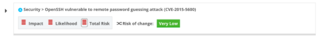

. Now we need to create a plan in which the issues that are found will be solved using an Ansible Playbook. In order to do so, from your Satellite 6.3 UI, click on *Red Hat Insights → Planner*.
+
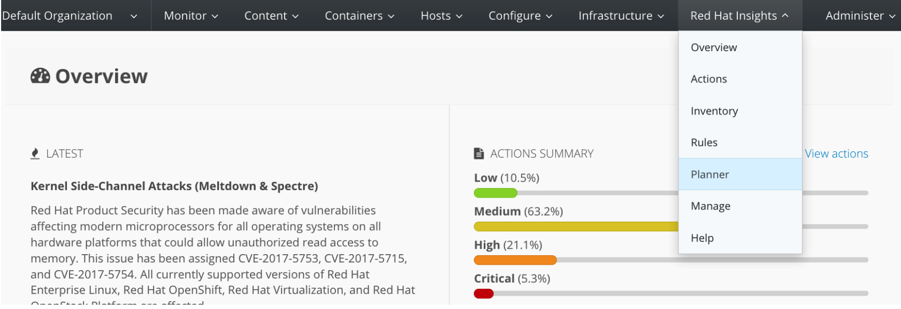

. Click on *Create a plan*.
+
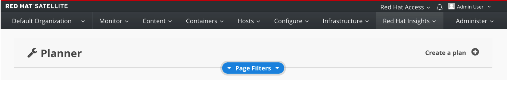

. Name the plan *Payload*, select *ic4.summit.example.com* for Specific System and choose the *Kernel vulnerable to man-in-the-middle via payload injection (CVE-2016-5696)* CVE and click on *Save*.

+
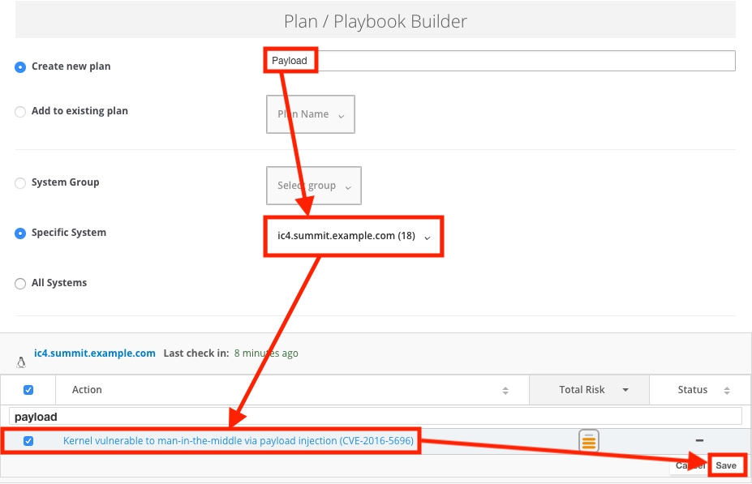

. As you can see, there are two ways to solve this issue, one is by updating the kernel, and the other one is apply the needed changes to the */etc/sysctl.conf* file, add the mitigation configuration, and reload the kernel configuration.
Insights gives us the opportunity to choose the resolution that we want. Select *Set sysctl ip4 challenge ack limit* as your preferred choice and then click on the *Save* button.
+
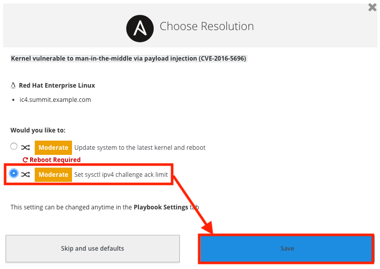

. Once the plan is saved, the planner screen is shown where you can see the newly created plan, as well as the issues it resolves and the systems affected.
+
image:images/lab8.2-saveplanneroutput.png[1000,1000]

NOTE: Normally you would download the playbook and execute it. However, for your convenience this playbook has already downloaded for you to the /root directory on the Ansible Tower server. Now let's log into the Ansible Tower server and execute the playbook.

. If not already there, log into to the workstation host from your desktop system replacing *GUID* with your lab's *GUID*:
+
[source]
----
[lab-user@localhost ~]$ ssh workstation-GUID.rhpds.opentlc.com
----

. If not already root, become *root* and then log into the Ansible Tower system *tower.example.com* host.
+
[source]
----
[lab-user@workstation-GUID ~]$ sudo -i
[root@workstation-GUID ~]# ssh tower.example.com
----

. Once logged into the Ansible Tower server, inspect the Ansible Playbook that Insights has created automatically for you.
+
[source]
----
[root@tower ~]# cat payload-injection.yml
----

. Remediate the payload injection security issue by executing the Ansible Playbook.
+
[source]
----
[root@tower ~]# ansible-playbook payload-injection.yml
----
+
NOTE: Please note that when the execution is completed, the Insights agent is also run as part of this Ansible playbook, so the latest state of the system is reporting into Insights automatically.

. Now from the Satellite UI, click on *Red Hat Insights → Inventory* you will notice that *ic4.summit.example.com* has one less issue.
+
image:images/lab8.2-afteransiblefix.png[1000,1000]

=== Lab 8.4 Automatically fix all the issues on client systems
In this lab exercise, we will fix all the issues on the client systems, *ic1.summit.example.com* and *ic4.summit.example.com*.

. From the Satellite UI, click on *Red Hat Insights → Inventory* so we can focus on systems *ic1.summit.example.com* and *ic4.summit.example.com*, please notice these two show numerous actions each to be resolved.
+
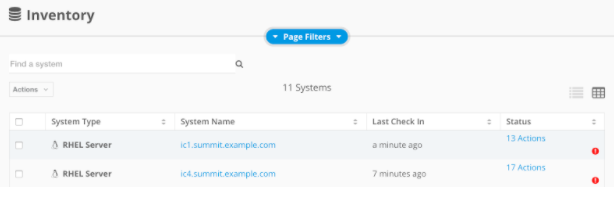

. In the inventory screen, select both systems and click on Actions, on the top left corner, and then select Create a new Plan / Playbook
+
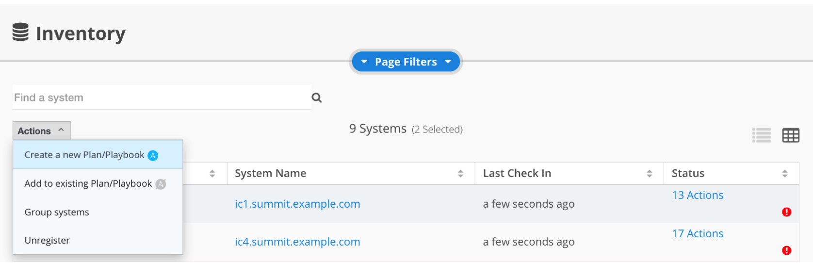

. This way, we are going to create an Ansible Playbook based plan to solve issues on those two specific systems (systems can also be grouped as per our convenience, from that very same menu).

. The Plan / Playbook Builder screens will appear. Please make sure to fill the boxes as follows:
* Plan name: fix-ic-all
* Actions: all (do this by clicking on the box by the Action label at the top).
+
Your screen should look like:
+
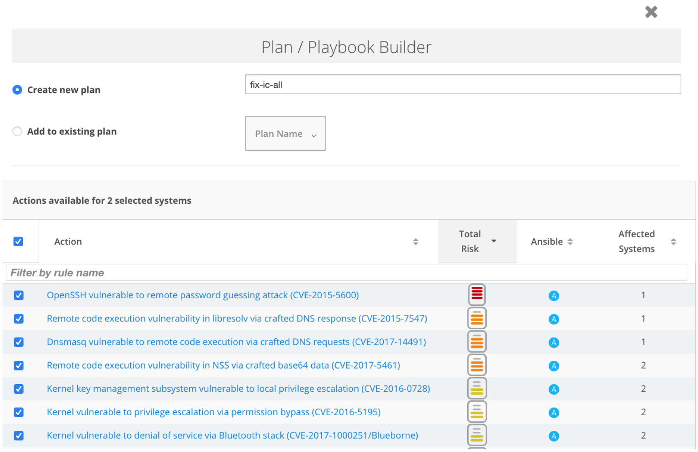

. Then click on the *Save* button in the bottom right corner.

. As before, you are given the option to choose between different ways to solve your issues. In this lab, we’ve chosen to go for the ones that do not require a reboot, in order to save some time.
+
The plan description screen will appear.
+
You should see all the issues this plan is going to solve as well as the affected systems.
+
image:images/lab8.3-planner.png[1000,1000]

. Scrolling down the screen, you should be able to download the playbook. Per your convenience, this has already been downloaded to the tower machine.
+
image:images/lab8.3-downloadplaybook.png[1000,1000]

. Like in the previous exercise, we need to log into the Ansible Tower machine in order to run the Ansible Playbook.

. If not already there, log into to the bastion host from your desktop system *replacing GUID with your lab's GUID*:
+
[source]
----
[lab-user@localhost ~]$ ssh workstation-GUID.rhpds.opentlc.com
----

. If not already root, become *root* and then log into the Ansible Tower system *tower.summit.example.om* host.
+
[source]
----
[lab-user@workstation-GUID ~]$ sudo -i
[root@workstation-GUID ~]# ssh tower
----

. Once logged into Ansible Tower, inspect the Ansible Playbook that Insights has created automatically for you. Once you are done looking through the Ansible playbook, Type *:q!* to exit out of vi.
+
[source]
----
[root@tower ~]# vi fix-ic-all.yml
----

. Now, simply proceed to remediate the payload injection security issue by executing the Ansible Playbook.
+
[source]
----
[root@tower ~]# ansible-playbook fix-ic-all.yml
----
Please note that when the execution is completed (this may take a while), the Insights agent is also run as part of the Ansible playbook, so the latest state of the system is reporting into Insights automatically.

. Now from the Satellite UI, click on *Red Hat Insights → Inventory* you will notice that system *ic4.summit.example.com* has one less issue, just like *ic1.summit.example.com*.
+
NOTE: This step may take long time as there are many issues that require updates and reboots.

<<top>>

link:README.adoc#table-of-contents[ Table of Contents ]
