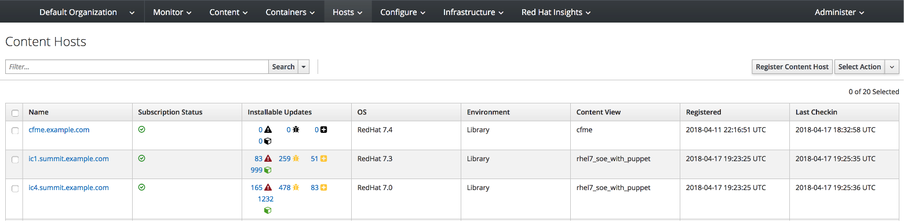

== Lab 8: Proactive Security and Automated Risk Management with Red Hat Insights

=== Goal of Lab 8
The goal of this lab is to introduce you to the proactive security capabilities of Red Hat Insights.

In this lab, we will focus only on the specific security features of Red Hat Insights.

=== Introduction
Red Hat Insights was designed to proactively evaluate the security, performance, and stability of your Red Hat platforms by providing prescriptive analytics of your systems. Red Hat Insights helps move you from reactive to proactive systems management, delivers actionable intelligence, and increases visibility of infrastructure risks and the latest security threats. Operational analytics from Red Hat Insights empowers you to prevent downtime and avoid firefighting while responding faster to new risks.

Red Hat Insights recommendations are tailored for the individual system where risk is detected. This allows you to be certain that actions identified by Insights are validated and have a verified resolution for each detected risk, reducing false positives you may experience from critical risks identified by third-party security scanners. Red Hat Insights provides predictive analysis of security risk in your infrastructure based on a constantly evolving threat feed from Red Hat.

Through analysis of Red Hat Insights metadata and curated knowledge based on over fifteen years of enterprise customer support, Red Hat is able to identify critical security vulnerabilities, statistically frequented risks, and known bad configurations. We scale this knowledge to our customers with Red Hat Insights reporting and alerts, allowing prediction of what will happen on a monitored system, why it will happen, and how to fix a problem before it can occur.

Red Hat Insights functionality is integrated into Red Hat’s Customer Portal, Red Hat Satellite, Red Hat CloudForms, and Ansible Tower by Red Hat.  Recommendations from Red Hat Insights are human-readable and in most cases can simply be copy and pasted into the terminal to resolve the issue. You may also automate remediation of hosts in your infrastructure with Red Hat Insights generated Ansible playbooks or Ansible Tower by Red Hat integration.

=== Lab 8.1 Fixing the payload injection security issue in your system using Red Hat Insights from the Satellite UI

==== Cleaning up the Red Hat Insights client systems

You’ve been put in charge of some newly acquired servers. Before you bring these servers into your environment, you decide to first audit and clean up what is inside these servers first.

. If not already there, log into to the bastion host from your desktop system *replacing GUID with your lab's GUID*:
+
[source]
----
[lab-user@localhost ~]$ ssh workstation-GUID.rhpds.opentlc.com
----

. If not already root, become *root* , log in to your two Red Hat Insights client machines (ic1.summit.example.com and ic4.summit.example.com), and make sure your old Red Hat Satellite information is removed. Let's start with *ic1.summit.example.com*.
+
[source]
----
[lab-user@workstation-GUID ~]$ sudo -i
[root@workstation-GUID ~]# ssh ic1.summit.example.com

[root@ic1 ~]# subscription-manager clean
[root@ic1 ~]# rm -fv /etc/rhsm/ca/katello*
[root@ic1 ~]# rm -fv /etc/rham/facts/katello*
[root@ic1 ~]# rm -rfv /var/lib/puppet
[root@ic1 ~]# yum remove -y katello-ca-consumer
[root@ic1 ~]# exit
----

. Let's repeat these steps and remove our old Red Hat Satellite information from *ic4.summit.example.com* as well.
+
[source]
----
[root@workstation-GUID ~]# ssh ic4.summit.example.com

[root@ic4 ~]# subscription-manager clean
[root@ic4 ~]# rm -fv /etc/rhsm/ca/katello*
[root@ic4 ~]# rm -fv /etc/rham/facts/katello*
[root@ic4 ~]# rm -rfv /var/lib/puppet
[root@ic4 ~]# yum remove -y katello-ca-consumer*
[root@ic4 ~]# exit
----

==== Adding your Red Hat Insights hosts to Red Hat Satellite

. Let's pull down new bootstrap script from the Red Hat Satellite 6 server for both the Red Hat Insights hosts (ic1.summit.example.com and ic4.summit.example.com). Let's start with *ic1.summit.example.com*.

+
[source]
----
[root@workstation-GUID ~]# ssh ic1.summit.example.com

[root@ic1 ~]# curl https://sat6.summit.example.com/pub/bootstrap.py > bootstrap.py --insecure

[root@ic1 ~]# chmod +x bootstrap.py

[root@ic1 ~]# ./bootstrap.py -l admin -s sat6.summit.example.com -o 'Default Organization' -L 'Default Location' -g base_with_puppet -a base_with_puppet
[root@ic1 ~]# exit
----
. Now let's repeat the above steps for *ic4.summit.example.com*. Don't forget to ssh into *ic4.summit.example.com* this time around.

+
NOTE: If bootstrap.py fails with this error: *[RUNNING], [2018-04-19 06:28:43], [Calling Foreman API to create a host entry associated with the group & org]
An error occured: HTTP Error 422: Unprocessable Entity
url: https://sat6.summit.example.com:443/api/v2/hosts/
code: 422*  , this means that machine has never been register using subscription manager. In this case, you just have to delete the hosts from the Satellite UI.

. On the Red Hat Satellite server (sat6-GUID.rhpds.opentlc.com), log in with *admin* as the username and *r3dh4t1!* as your password.

. Go to *Hosts → All Hosts* and you will see them listed as follows:
+
image:images/lab8.1-allhosts.png[1000,1000]

. Select *ic1.summit.example.com* and *ic4.summit.example.com* and delete them by going to Select *Action → Delete Hosts*, as in the following screen.
+
image:images/lab8.1-deletehosts.png[1000,1000]

. Now, re-run the bootstrap.py script for both *ic1.summit.example.com* and *ic4.summit.example.com*. Refer back to the previous steps to see the commands to do this.

. When logging into the Satellite UI you should see your systems registered. Go to *Hosts → Content Hosts* and you will see them listed as follows:
+

=== Installing the Red Hat Insights client

. Now it’s the time to install the Insights RPM and register your system to Red Hat Insights.

+
NOTE: On RHEL 7.5, the client RPM has been renamed to insights-client, but this laboratory machines are using RHEL 7.0 and 7.3 for demonstration purposes, so the package name is still the old one.

+
NOTE: The bootstrap script provided in this lab already downloads and registers your hosts to Satellite, but in an environment where bootstrap script is not used, the needed steps are as follows:

. To install Insights RPM in each of your systems issue the following command:
+
[source]
[root@ic1 ~]# yum install redhat-access-insights

. And then, simply register each machine with Red Hat Insights as follows:
+
[source]
[root@ic1 ~]# redhat-access-insights --register
This host has already been registered.
Automatic daily scheduling for Insights has been enabled.
Starting to collect Insights data
Uploading Insights data, this may take a few minutes
Upload completed successfully!

=== Fixing the payload injection security issue
. Now, going back to the Satellite UI, click on Red Hat Insights → Overview, where you could see all your registered systems, actions summary (highlighted by priority) as well as latest updates from Red Hat.
+
image:images/lab8.1-insightsoverview.png[1000,1000]

. In this lab, we will fix the specific *Kernel vulnerable to man-in-the-middle via payload injection (CVE-2016-5696)* on your client VMs without causing downtime.

. From your Satellite 6.3 UI, click on *Red Hat Insights → Inventory*.
+
image:images/lab8.1-inventory.png[1000,1000]

. Click on your client VM, which is *ic1.summit.example.com*. You will see the list of issues affecting it when clicking on the system name.
+
image:images/lab8.1-listofissues.png[1000,1000]

. Notice that your system shows up with multiple security vulnerabilities.

+
NOTE: One of the security issues listed is the Meltdown and Spectre vulnerability. This is the security issue that says *Kernel vulnerable to side-channel attacks in modern microprocessors(CVE-2017-573/Spectre, CVE-2017-5754/Meltdown)*. To save time, we will NOT be fixing this particular security issue in this lab exercise since the fix for Meltdown and Spectre requires a kernel upgrade, which requires a reboot of the system.

+
NOTE: Our objective is to fix the payload injection problem without causing downtime, and see that it no longer appears as a vulnerability in Red Hat Insights. Specifically, this payload injection problem causes the kernel to be vulnerable to man-in-the-middle via payload injection. A flaw was found in the implementation of the Linux kernel's handling of networking challenge ack link:https://tools.ietf.org/html/rfc5961[RFC 5961] where an attacker is able to determine the shared counter. This flaw allows an attacker located on different subnet to inject or take over a TCP connection between a server and client without needing to use a traditional man-in-the-middle (MITM) attack.

. Use your browser’s search function to search for *payload injection*.

+
NOTE: Reading the description for the vulnerability shows that the sysctl variable is set to a level that allows being exploited. We want to do the active mitigation by changing the sysctl variable and making it permanent on reboot. In this case, we do not want to update the kernel or reboot since we don’t want downtime.
+
image:images/lab8.1-payloadinjectionsearch.png[1000,1000]

. . If not already there, log into to the bastion host from your desktop system *replacing GUID with your lab's GUID*:
+
[source]
----
[lab-user@localhost ~]$ ssh workstation-GUID.rhpds.opentlc.com
----

. If not already root, become *root* , log in to your two Red Hat Insights client machines (ic1.summit.example.com and ic4.summit.example.com), and make sure your old Red Hat Satellite information is removed. Let's start with *ic1.summit.example.com*.
+
[source]
----
[lab-user@workstation-GUID ~]$ sudo -i
[root@workstation-GUID ~]# ssh ic1.summit.example.com
----

. Now, as *root*, perform the recommended active mitigation. Edit the */etc/sysctl.conf* file to add the mitigation configuration, and reload the kernel configuration:
+
[source]
----
[root@ic1 ~]# echo "net.ipv4.tcp_challenge_ack_limit = 2147483647" >> /etc/sysctl.conf

[root@ic1 ~]#  sysctl -p
net.ipv4.tcp_challenge_ack_limit = 100
net.ipv4.tcp_challenge_ack_limit = 2147483647
----

. After applying the active mitigation, we want to have the system report any changes, run the following command as root on ic1.summit.example.com:
+
[source]
# redhat-access-insights
Starting to collect Insights data
Uploading Insights data, this may take a few minutes
Upload completed successfully!

Wait until this step completes before moving to the next step.

. From your Satellite 6.3 UI, click on *Red Hat Insights → Inventory*.
+
image:images/lab8.1-insightsinventory.png[1000,1000]

. Click on your client VM, which is *ic1.summit.example.com*. You will notice than the number of actions has decreased.
+
image:images/lab8.1-actionsdecreased.png[1000,1000]

. Use your browser’s search function to search for *payload injection*. You will notice that this payload injection issue is no longer listed due to fixing the vulnerability.
+
image:images/lab8.1-payloadinjectionsearch-again.png[1000,1000]

Congratulations, you’re no longer vulnerable to the payload injection vulnerability!

<<top>>

link:README.adoc#table-of-contents[ Table of Contents ]
