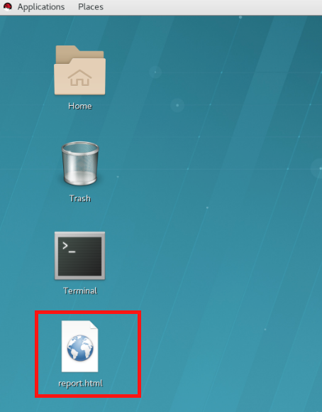
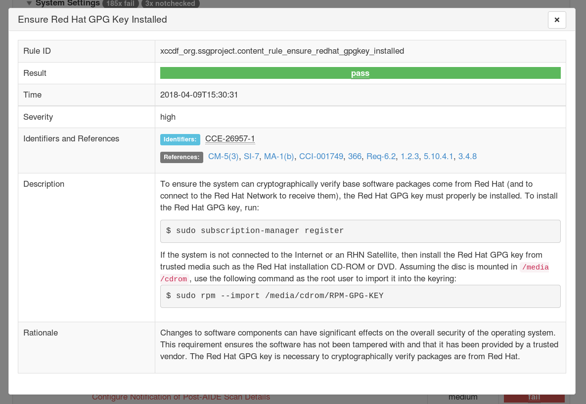
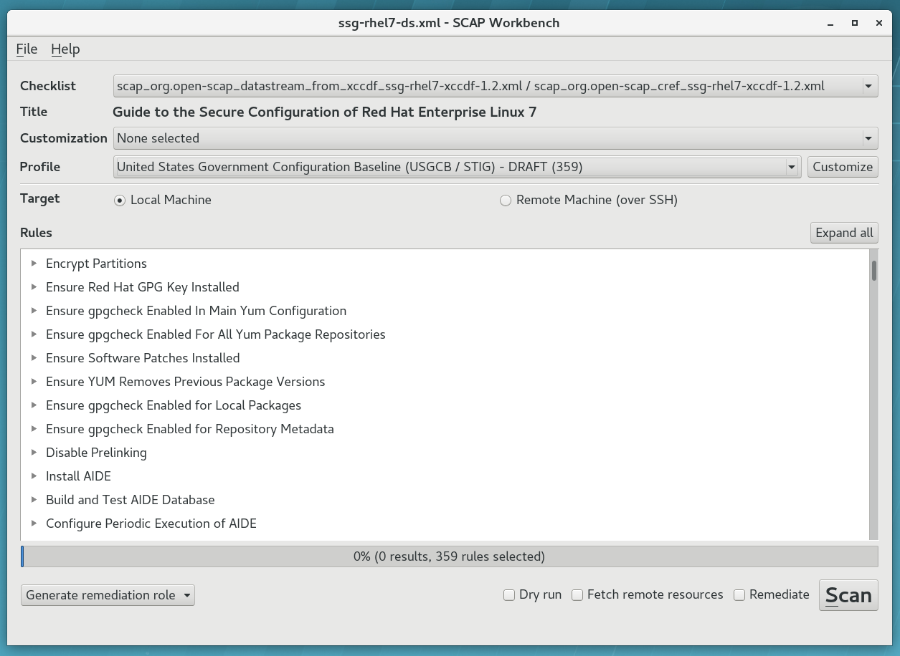
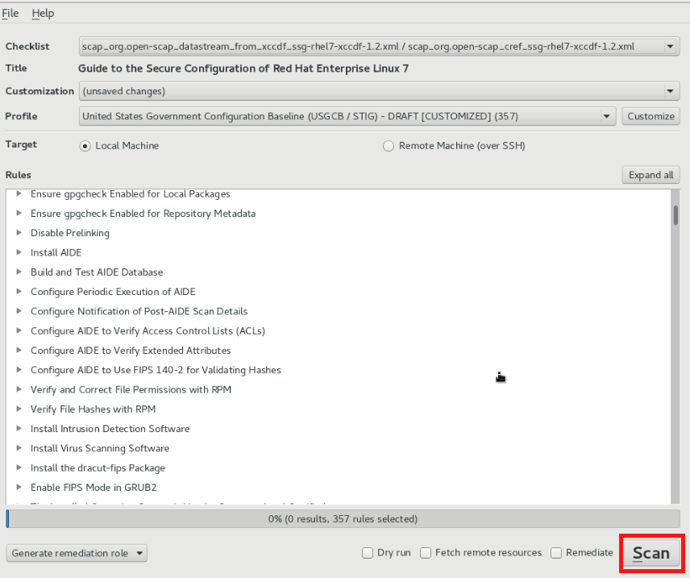

= Lab 1: OpenSCAP Basics and Command Line Scanning

== Goal of Lab
The goal of this lab exercise is to introduce you to the basics of automated security scanning and remediations with OpenSCAP and Ansible.

== Introduction
OpenSCAP is a family of open source SCAP tools and content that help users create standard security checklists for enterprise systems. Natively shipping in Red Hat Enterprise Linux, OpenSCAP provides practical security hardening advice for Red Hat technologies and links to compliance requirements, making deployment activities like certifications and accreditations easier.

OpenSCAP allows you to perform both vulnerability and security compliance checks in a fully automated way. Several integrations for continuous scanning exist but in this lab exercise, we will focus on one-off scanning to get started.

== Pre-Configured Set Up Steps (Already done for you)
All of the steps in this pre-configured set up section have already been done for you. This section is for your reference only so you know what steps have already been pre-configured in this lab environment for you.

.  Red Hat Enterprise Linux 7.5 is installed on the *openscap.example.com* host. We have also pre-installed several packages on the *openscap.example.com* host.

. Specifically, we pre-installed *openscap-scanner*, *scap-security-guide*, and *Ansible*. Take a look at the comments above each installation command for more details.
+
 # the tool that performs the scanning
 [root@openscap]# yum install openscap-scanner
 # project that brings in security policies we will load and test agains
 [root@openscap]# yum install scap-security-guide
 # we will need this later for Ansible based remediations
 [root@openscap]# yum install ansible python-firewall

. You can verify a successful installation by running:
+
 [root@openscap]# oscap -V

 OpenSCAP command line tool (oscap) 1.2.17
 Copyright 2009--2017 Red Hat Inc., Durham, North Carolina.

 ==== Supported specifications ====
 XCCDF Version: 1.2
 OVAL Version: 5.11.1
 CPE Version: 2.3
 CVSS Version: 2.0
 CVE Version: 2.0
 Asset Identification Version: 1.1
 Asset Reporting Format Version: 1.1
 CVRF Version: 1.1
 ...
+
Notice that this command outputs the OpenSCAP version and versions of supported standards. If during your own installation it says `oscap` command not found, you need to install the OpenSCAP tooling since this means that OpenSCAP has not been installed successfully.

. Finally, SCAP Workbench has also been installed on the *workstation.example.com* workstation bastion host for you.
+
 # GUI tool for scanning and content customization, a front-end for OpenSCAP
 [root@workstation] yum install scap-workbench

== Lab 1.1 Security scanning with OpenSCAP
. If not already there, log into to the workstation bastion host as *lab-user* from your desktop system *replacing GUID with your lab's GUID*. Use the password *r3dh4t1!*
+
[source]
----
[localhost ~]$ ssh lab-user@workstation-GUID.rhpds.opentlc.com
----

. Log into the *openscap.example.com* host as *root*.
+
[source]
----
[lab-user@workstation-GUID ~]$ ssh root@openscap.example.com
----

. Let's take a look at the compliance content provided by `scap-security-guide`:
+
 [root@openscap]# rpm -ql scap-security-guide
 ...
 /usr/share/xml/scap/ssg/content/ssg-rhel7-cpe-dictionary.xml
 /usr/share/xml/scap/ssg/content/ssg-rhel7-cpe-oval.xml
 /usr/share/xml/scap/ssg/content/ssg-rhel7-ds.xml
 /usr/share/xml/scap/ssg/content/ssg-rhel7-oval.xml
 /usr/share/xml/scap/ssg/content/ssg-rhel7-xccdf.xml
 ...

. Notice that the provided content in `scap-security-guide` covers a wide range of security baselines such as PCI-DSS, STIG, C2S, Common, CJIS, and others. Also notice that Ansible remediation playbooks are included for these various security baselines as well in the provided content in the `scap-security-guide` .

. Move to the `content` folder so we can avoid typing long paths:
+
 [root@openscap]# cd /usr/share/xml/scap/ssg/content

. First, let's check which compliance profiles are available for rhel7.
+
----
 [root@openscap]# oscap info ssg-rhel7-ds.xml
----
Notice that there are several compliance profiles included such as the Standard System Security Profile, PCI-DSS, C2S, Common Profile for General-Purpose Systems, and many others.

 . Next, let's perform our first baseline testing scan with the vanilla OSPP profile. Notice in our command below that we can skip the profile ID prefix to make the command simpler. The real ID is xccdf_org.ssgproject.content_profile_ospp-rhel7.

  [root@openscap]# oscap xccdf eval --profile ospp-rhel7 ./ssg-rhel7-ds.xml
+
Now, you will see the compliance scan results for every security control in the OSPP security baseline profile.

. Now, let's store the results of the scan this time:
* use --results-arf to get machine readable results archive
* use --report to get human readable report (can also be generated from ARF after the scan as you see in the next optional step)

 [root@openscap]# oscap xccdf eval --profile ospp-rhel7 --results-arf /tmp/arf.xml --report /tmp/report.html ./ssg-rhel7-ds.xml

. (Optional) You can also generate the HTML report separately:
+
 [root@openscap]# oscap xccdf generate report /tmp/arf.xml > /tmp/report.html

. Now, let's copy the *report.html* over to the workstation bastion host, set the correct permissions on *report.html* file so it is viewable, and view the report from the workstation bastion host in a web browser.
+
 [root@openscap]# exit
 [lab-user@workstation-GUID ~]$ scp root@openscap.example.com:/tmp/report.html /home/lab-user/Desktop
 [lab-user@workstation-GUID ~]$ chmod 644 /home/lab-user/Desktop/report.html
 [lab-user@workstation-GUID ~]$ chown lab-user /home/lab-user/Desktop/report.html

. Now, go back to your *Lab Information* webpage from the *Lab 0 setup steps* and click on the console button for your workstation bastion host. Login as *lab-user* with *r3dh4t1!* as the password.
+
image:images/lab1.1-workstationconsole.png[300,300]
image:images/lab1.1-labuserlogin.png[300,300]

. Once you log in, you'll notice the report that you just created on the Desktop. Double click on this report. You will see the compliance scan results for every security control in the OSPP security baseline profile in HTML format.
+

image:images/lab1.1-scapreport.png[500,500]

. Rules can have several types of results but the most common ones are *pass* and *fail*, which indicate whether or not the particular security control has passed or failed the scan.

. Click on the rule title in the HTML report.
+
image:images/lab1.1-clickrule.png[600,600]

. This will bring up a pop-up dialog that allows you to examine why a particular OpenSCAP security rule failed or passed. For example, if an OpenSCAP security rule is testing file permissions on a list of files, it will specify which files failed and what are their permission bits.

image::images/scap_report_fail.png[HTML report: A rule that is failing]

== Lab 1.2 Customizing existing SCAP security content using SCAP workbench
. Now, go back to your *Lab Information* webpage from the *Lab 0 Setup steps* and click on the console button for your workstation bastion host. Login as *lab-user* with *r3dh4t1!* as the password.
+
image:images/lab1.1-workstationconsole.png[300,300]
image:images/lab1.1-labuserlogin.png[300,300]

. Once you log in, navigate to the *Applications* menu at the top and go to *System Tools -> SCAP Workbench*.
+
image:images/lab1.2-scapworkbenchmenu.png[400,400]

. After Workbench starts, select *RHEL7* and click on *Load Content* to open the compliance content for Red Hat Enterprise Linux 7.
+
image:images/lab1.2-scapsecurityguide.png[600,600]
+

. Let's customize the US Government Configuration Baseline (USGCB). Select this profile from the *Profile* drop-down list. Click *Customize*.
+
image:images/lab1.2-selectcustomize.png[700,700]

. In the *Customize Profile* pop-up window, leave the default New Profile ID name and click *OK*.
+
image:images/lab1.2-newprofileID.png[500,500]

. Now you can select and unselect rules according to your organization's needs and change values such as minimum password length to tailor the compliance profile. After you are done customizing click *OK* to save the profile. You have now created a new custom profile.
+
image::images/scap_workbench_tailoring.png[SCAP Workbench content customization]

. Now let's run a test scan with the new custom profile we just created. Click *Scan* and inspect the results. When prompted for the password for *lab-user*, type *r3dh4t1!*. This will take a few minutes so feel free to move on with the lab exercise and not wait until the scan is completed.
+

. (Optional) You can save it to a tailoring file by selecting File->Save Customization Only.
+
image:images/lab1.2-savecustomization.png[300,300]

== Lab 1.3 Security Remediations with OpenSCAP and Ansible
Putting the machine into compliance (for example by changing its configuration) is called *remediation* in the SCAP terminology. Remediation changes the configuration of the machine and it is possible that you will lock yourself out or disable important workloads! As a result, it is best practice to test the remediation changes before deploying.

. If not already there, log into to the workstation bastion host as *lab-user* from your desktop system *replacing GUID with your lab's GUID*. Use the password *r3dh4t1!*
+
[source]
----
[localhost ~]$ ssh lab-user@workstation-GUID.rhpds.opentlc.com
----
. Log into the *openscap.example.com* host as *root*.
+
[source]
----
[lab-user@workstation-GUID ~]$ ssh root@openscap.example.com
----

. All remediations will be executed on the *openscap.example.com* host. You will not make modifications to any other hosts, including the *workstation.example.com* host.

. Let's generate an Ansible playbook that will put the *openscap.example.com* machine into compliance. Let's go ahead and generate a playbook from the results:
* use --fix-type ansible to request an ansible playbook with the fixes
+
 [root@openscap]# oscap xccdf generate fix --fix-type ansible --result-id "" arf.xml > playbook.yml

. (Optional) Generate bash remediation script and run it on target machine(s). This can be accomplished by running:
* use --fix-type bash to request a bash script with the fixes
* after the script is generated change its permissions so that we can run it
+
 [root@openscap]# oscap xccdf generate fix --fix-type bash --result-id "" arf.xml > bash-fix.sh
 [root@openscap]# chmod +x bash-fix.sh
 [root@openscap]# ./bash-fix.sh

. Notice that in both cases we are using empty result-id. This is a trick to avoid specifying the full result ID.

. We will focus on the Ansible remediation options in this next part of the lab exercise.

. Let's open the generated playbook using a text editor. In this example, we will use nano as our text editor (but feel free to use vi as well).
+
....
[root@openscap]# nano playbook.yml
---
###############################################################################
#
# Ansible remediation role for the results of evaluation of profile xccdf_org.ssgproject.content_profile_ospp-rhel7
# XCCDF Version:  1.2
#
...
#
# How to apply this remediation role:
# $ ansible-playbook -i "192.168.1.155," playbook.yml
# $ ansible-playbook -i inventory.ini playbook.yml
#
###############################################################################
....

. Exploring the playbook further you will see the tasks that set up the machine:
+
....
   - name: Ensure gpgcheck Enabled For All Yum Package Repositories
      with_items: "{{ yum_find.files }}"
      lineinfile:
        create: yes
        dest: "{{ item.path }}"
        regexp: '^gpgcheck'
        line: 'gpgcheck=1'
      tags:
        - ensure_gpgcheck_never_disabled
        - high_severity
        - unknown_strategy
        - low_complexity
        - medium_disruption
        - CCE-26876-3
        - NIST-800-53-CM-5(3)
        - NIST-800-53-SI-7
        - NIST-800-53-MA-1(b)
        - NIST-800-171-3.4.8
        - PCI-DSS-Req-6.2
        - CJIS-5.10.4.1
....

. You can customize the playbook by changing the variables listed at the top of the generated file. Let's change the password minimum length by setting the `var_password_pam_minlen` to 18. After making this change, press *control + x* , then type *y* and press *enter* in your nano text editor to save your changes.
+
....
   vars:
      var_accounts_password_minlen_login_defs: 6
      var_accounts_minimum_age_login_defs: 7
      var_accounts_maximum_age_login_defs: 60
      var_account_disable_post_pw_expiration: 35
      var_password_pam_maxrepeat: 2
      var_password_pam_maxclassrepeat: 4
      var_password_pam_dcredit: -1
      var_password_pam_minlen: 18
...
....

. Let's run the playbook locally in check mode to see how it would change the machine to put it into compliance. Because of a known issue in the SCAP Security Guide content, let's use "--skip-tags build_aide_database,firewalld_sshd_port_enabled". Make sure you run this on the *openscap.example.com* host:
+
 [root@openscap]# ansible-playbook -i "localhost," -c local --check --skip-tags aide_build_database,firewalld_sshd_port_enabled playbook.yml
+
....
...
TASK [Import RedHat GPG key] ******************************************************************************************************************************************************************
ok: [localhost]

TASK [Find All Yum Repositories] **************************************************************************************************************************************************************
ok: [localhost]

TASK [Ensure gpgcheck Enabled For All Yum Package Repositories] *******************************************************************************************************************************
changed: [localhost] => (item={u'uid': 0, u'woth': False, u'mtime': 1521757296.0285208, u'inode': 301678, u'isgid': False, u'size': 82, u'isuid': False, u'isreg': True, u'gid': 0, u'ischr': False, u'wusr': True, u'xoth': False, u'islnk': False, u'nlink': 1, u'issock': False, u'rgrp': True, u'path': u'/etc/yum.repos.d/rhel.repo', u'xusr': False, u'atime': 1523305034.24276, u'isdir': False, u'ctime': 1521757296.029521, u'isblk': False, u'wgrp': False, u'xgrp': False, u'dev': 64771, u'roth': True, u'isfifo': False, u'mode': u'0644', u'rusr': True})
changed: [localhost] => (item={u'uid': 0, u'woth': False, u'mtime': 1523307691.5074177, u'inode': 83765, u'isgid': False, u'size': 143282, u'isuid': False, u'isreg': True, u'gid': 0, u'ischr': False, u'wusr': True, u'xoth': False, u'islnk': False, u'nlink': 1, u'issock': False, u'rgrp': True, u'path': u'/etc/yum.repos.d/redhat.repo', u'xusr': False, u'atime': 1523307693.8396184, u'isdir': False, u'ctime': 1523307691.5084178, u'isblk': False, u'wgrp': False, u'xgrp': False, u'dev': 64771, u'roth': True, u'isfifo': False, u'mode': u'0644', u'rusr': True})

TASK [Ensure YUM Removes Previous Package Versions] *******************************************************************************************************************************************
changed: [localhost]

TASK [Check existence of yum on Fedora] *******************************************************************************************************************************************************
skipping: [localhost]

TASK [Ensure GPG check Enabled for Local Packages (Yum)] **************************************************************************************************************************************
changed: [localhost] => (item=/etc/yum.conf)
...
....

<<top>>

link:README.adoc#table-of-contents[ Table of Contents ] | link:lab2_SELinux.adoc[Lab 2: SELinux]
