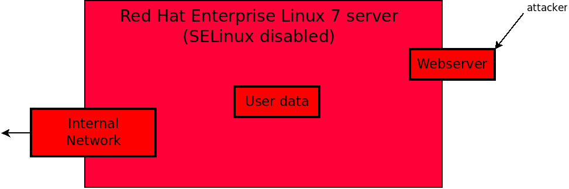
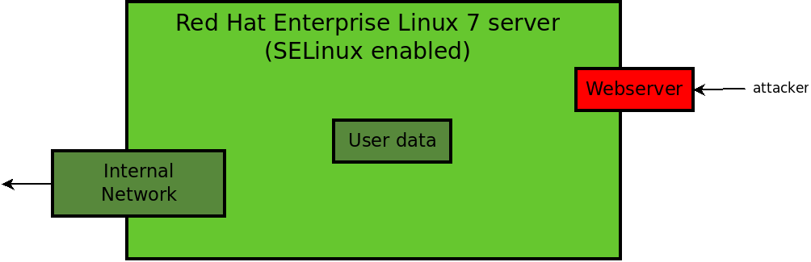

= Lab 2: Security Enhanced Linux

== Goal of Lab 2
The goal of this lab is to use Security Enhanced Linux (SELinux) to help mitigate against attacks due to privilege escalation vulnerabilities in a three part exercise.

* In the first part of this lab exercise, you will become a hacker and try to execute a real vulnerability on a given Red Hat Enterprise Linux 7 system and explore how SELinux can help to protect this system.
* In the second part of this lab exercise, you will turn SELinux on for an environment of web servers in an automated fashion using Ansible.
* In the last part of this lab exercise, you will configure SELinux according to a U.S. Department of Defense STIG security control policy rule.

== Introduction
Security Enhanced Linux (SELinux) can help to proactively mitigate systems from the consequences of exploits during the window of vulnerability. Specifically, this is the time window before a security fix is released. This protection is done by defining SELinux policies on your systems.

=== SELinux policy
SELinux *isolates* all processes running on the system to *mitigate* attacks which take advantage of privilege escalation vulnerabilities. A privilege escalation vulnerability means that a process gains more access rights than it should have. To prevent this, SELinux enforces Mandatory Access Control (MAC) mechanism over all processes. It labels every process, file, or directory according to rules specified in a security policy known as the SELinux policy. The SELinux policy also specifies how processes interact with each other and how they can access files and directories. SELinux denies every action that it is not explicitly allowed by the SELinux policy.

In one of the below exercises, we'll see an example where using this process isolation can help protect us from a privilege escalation vulnerability of an exploit.

=== Introduction to the Shellshock vulnerability and SELinux

The Shellshock vulnerability is a bash exploit and the root issue was that you could put any command after _env_ variable in a command , which allowed you to execute any arbitrary code. The following pictures shows an example of the bash explout on an apache server.

If you would have a _cgi_ script accessing user data or internal network then this script could compromise either internal network or user data on your system.

The first question which usually comes to mind in term of SELinux and Shellshock is *_What does SELinux do to mitigate against the Shellshock bash exploit?_*

The important fact to understand is that *SELinux does not block the exploit* but it would *prevent escallation of confined domains*. These confined domains are defined by SELinux policy installed on a system. Because *SELinux controls on their types (SELinux labels)*, the process is doing what it was designed to do and can not access what is not allowed in SELinux policy.

The picture below shows the situation described above with enabled SELinux and with SELinux in enforcing mode at this time.

Our possible _cgi_ scripts executed by an attacker can not access either user data or certain parts of internal network as it is defined in SELinux policy.

How is it done practically? How do types, which ensure described process separation, look in reality? Read below text and practice to get answers.

== Lab 2.1 Exploiting Red Hat Enterprise Linux 7 with Shellshock vulnerability

=== Goal of Lab 2.1
In this first exercise, let's become a hacker and try to exploit Red Hat Enterprise Linux 7 with the Shellshock vulnerability.

As an administrator of Red Hat Enterprise Linux 7 servers, I want to have enabled SELinux for my webserver environment to mitigate damage by zero day vulnerbalities.

The lab exercise is split into three steps:

. Exploiting a RHEL system with SELinux in Permissive mode
. Exploiting a RHEL system with SELinux in Enforcing mode
. Analyzing SELinux denials

=== Lab 2.1.1 exercise steps

The exploit will be executed from the _selinux1.example.com_ system.

. If not already there, log into to the bastion host from your desktop system *replacing GUID with your lab's GUID*:
+
[source]
[lab-user@localhost ~]$ ssh workstation-GUID.rhpds.opentlc.com

. If not already root, become *root* and then log into the _selinux1.example.com_ system.
+
[source]
[lab-user@workstation-GUID ~]$ sudo -i
[root@workstation-GUID ~]# ssh root@selinux1.example.com

. Move to directory /root/selinux_sctipts/ where are all the scripts needed for provide attack.

    [root@selinux1 ~]# cd /root/selinux_scripts

We will now need to open two terminals( both selinux1.example.com): one for listening on 9999 tcp port and the second one for executing the exploit script. Below, in the next part of the lab exercise, we will open two terminals, connect both of them to the selinux1.example.com systems and change directory to /root/selinux_scripts.

Let's see this visually. Take a look at the image below. This image describes the flow of how the exploit that will be executed. On the left side is the victim server (selinux4 system). From the attacker machine(which is the selinux1 system), a http request will be sent and part of this httpd request will be to open the shell to the attacker machine listening on tcp port 9999.

image:images/lab2-shellshock-flow.png[]

== Lab 2.1.2 Exploiting system with SELinux in Permissive mode

Now let's go through the steps we just described above.
The _selinux4_ system has SELinux in permissive mode by default. It is running the Apache service running with an older version of bash. Everything is ready to run the exploit.

Based on flow of the ShellShock attack we learned about earlier, it's necessary to start listening on tcp port 9999 on the selinux1 system.

    [root@selinux1 selinux_scripts]# nc -lvp 9999
    Ncat: Version 7.50 ( https://nmap.org/ncat )
    Ncat: Listening on :::9999
    Ncat: Listening on 0.0.0.0:9999

Ncat is a feature-packed networking utility which reads and writes data across networks from the command line.

Now, from another terminal (still for the selinux1 system), let's run the exploit:

    [root@selinux1 selinux_scripts]# ./shellshock_exploit.sh

Right now, on the terminal where nc command was executed, a bash prompt should now appear.

    [root@selinux1 selinux_scripts]# nc -lvp 9999
    Ncat: Version 7.50 ( https://nmap.org/ncat )
    Ncat: Listening on :::9999
    Ncat: Listening on 0.0.0.0:9999
    Ncat: Connection from 192.168.0.24.
    Ncat: Connection from 192.168.0.24:38668.
    bash: no job control in this shell
    bash-4.2$

For testing purpose, few commands could be executed on victim (_selinux4_ machine)

    bash-4.2$ id
    id
    uid=48(apache) gid=48(apache) groups=48(apache) context=system_u:system_r:httpd_sys_script_t:s0
    bash-4.2$ uname -a
    uname -a
    Linux selinux4.example.com 3.10.0-418.el7.x86_64 #1 SMP Thu May 26 20:35:02 EDT 2016 x86_64 x86_64 x86_64 GNU/Linux

    # exit

Command _id_ prints real and effecitve user and group IDs, where we could see that user and group is apache. It's because cgi scripts are started with apache owner.
Command _uname_ prints system information, where is hostname described, it's selinux4.example.com, which means it's victim system. These commands proofs that attack was successful

==== Lab 2.1.2 Set SELinux to enforcing mode

Victim server (_selinux4_ system) has SELinux in permissive mode. Now, let's switch SELinux to enforcing and repeat the attack.

Connect to _selinux4_ and switch to Enforcing mode

    [root@selinux1 selinux_scripts]# ssh root@selinux4
    [root@selinux4 ~]# setenforce 1
    [root@selinux4 ~]# exit

=== Lab 2.1.3 Exploiting system with SELinux in Enforcing mode

Right now, attack will be repeated but SELinux is in Enforcing mode on victim server (_selinux4_ system)

Based on flow of the _ShellShock_ attack, it's necessary to start listening on tcp port 9999 on _selinux1_ system.

    [root@selinux1 selinux_scripts]# nc -lvp 9999
    Ncat: Version 7.50 ( https://nmap.org/ncat )
    Ncat: Listening on :::9999
    Ncat: Listening on 0.0.0.0:9999

_Ncat_ is a feature-packed networking utility which reads and writes data across networks from the command line.

Now, from another terminal for the selinux1 system, let's run the exploit

    [root@selinux1 selinux_scripts]# ./shellshock_exploit.sh

As you can see, there is no bash prompt on terminal where you used _nc_ command, because SELinux blocked this access. SELinux did its job!

==== Lab 2.1.4 Analyzing SELinux denial

Let's analyze what happened and why SELinux blocked ShellShock exploit.

Connect to selinux4 system from selinux1 machine

    [root@selinux1 selinux_scripts]# ssh root@selinux4
    [root@selinux4 ~]# ausearch -m AVC -ts today | grep name_connect
    type=AVC msg=audit(1524909646.681:86): avc:  denied  { name_connect } for  pid=2091 comm="bashbug.sh" dest=9999 scontext=system_u:system_r:httpd_sys_script_t:s0 tcontext=system_u:object_r:jboss_management_port_t:s0 tclass=tcp_socket

This is avc record from Audit daemon, which saying that cgi script called bashbug.sh labeled as httpd_sys_script_t tried to connect to tcp port 9999 labeled as jboss_management_port_t. Fortunately there is no allow rules for this access, so it was denied by kernel and SELinux mitigate this attack.

= Lab 2.2 Enabling SELinux via Ansible

=== Goal of Lab 2.2

As an enterprise administrator I want to enable SELinux in my environment with an Apache server using both custom and standard paths for web files so that my Apache server is fully confined by SELinux. I want to use linux-system-roles/selinux as an ansible role which configures SELinux.

=== Lab Detailed User Story

As an enterprise administrator I have an environment with Apache webservers where both default and custom paths for Apache web files are used.

 * /var/www/html (default)
 * /var/www_new/html (custom)

These web files are accessible using tcp/80 and tcp/7070 ports on each web server.

 * selinux2.example.com:80 (default)
 * selinux2.example.com:7070 (custom)

SELinux is disabled for all web servers by default. I want to turn SELinux on for all web servers without breaking any functionality and use linux-system-roles/selinux ansible role for it.

=== Implementation

The SELinux part of the lab environment consists from three machines (needs to be started in lab environment)

 * selinux1, selinux1.example.com (RHEL-7 admin host)
 * selinux2, selinux2.example.com (RHEL-7 host)
 * selinux3, selinux3.example.com (RHEL-6 host)

The first _selinux1.example.com_ host will be used as an admin interface to setup another two hosts where all configuration steps will be proceeded. The whole entire _Enabling SELinux via Ansible_ lab exercise is divided to four steps.

. Configuration
. Demonstration
. Summary
. Revert script

== Configuration

*Important*: All steps in the _Configuration_ section have been already performed in the Summit lab environment. They are mentioned from an informative purpose and they need to executed (except the package installation) only if you use the revert script for this lab

=== Lab 2.2.1 Basic environment configuration

. If not already there, log into to the bastion host from your desktop system *replacing GUID with your lab's GUID*:
+
[source]
[lab-user@localhost ~]$ ssh workstation-GUID.rhpds.opentlc.com

. If not already root, become *root* and then log into the _selinux1.example.com_ system.
+
[source]
[lab-user@workstation-GUID ~]$ sudo -i
[root@workstation-GUID ~]# ssh root@selinux1.example.com

. Update DNS records on the _selinux1_ server.

	[root@selinux1 ~]# cat /etc/hosts
	127.0.0.1   localhost localhost.localdomain localhost4 localhost4.localdomain4
	::1         localhost localhost.localdomain localhost6 localhost6.localdomain6

	192.168.0.20 selinux2
	192.168.0.21 selinux3

. Install the __ansible__ package on the _selinux1_ host.

	[root@selinux1 ~]# yum install ansible -y

. Enter the _selinux_scripts_ working directory on the _selinux1_ host.

	[root@selinux1 ~]# cd /root/selinux_scripts

. Create an inventory file for our Ansible usage.

	[root@selinux1 selinux_scripts]# cat inventory
	selinux2
	selinux3

=== Lab 2.2.2 Configuration of Apache webservers and with disabled SELinux.

In this section, _apache_ webservers will be setup via the _setup_webserver.yml_ playbook on _selinux2_ and _selinux3_ hosts  and SELinux will be turned off to create an environment described in the detailed lab user story.

All ansible commands below should be executed from _selinux1.example.com_

Test whether all servers are available via the _ansible_ command.

. If not already there, log into to the bastion host from your desktop system *replacing GUID with your lab's GUID*:
+
[source]
[lab-user@localhost ~]$ ssh workstation-GUID.rhpds.opentlc.com

. If not already root, become *root* and then log into the _selinux1.example.com_ system.
+
[source]
[lab-user@workstation-GUID ~]$ sudo -i
[root@workstation-GUID ~]# ssh root@selinux1.example.com

	[root@selinux1 selinux_scripts]# ansible all -i inventory -m ping -u root

Ansible script will pass all listed servers in the _inventory_ file and will send test if they are accessible. All servers should return a pong response.

	selinux2.example.com | SUCCESS => {
        	"changed": false,
	        "ping": "pong"
	}

    selinux3.example.com | SUCCESS => {
        "changed": false,
	        "ping": "pong"
	}

Configure Apache web servers on given servers via the _setup_webserver.yml_ playbook.

	[root@selinux1 selinux_scripts]# ansible-playbook -i inventory -u root setup-webserver.yml

The following actions are performed for all hosts mentioned in the _inventory_ file:

 * SELinux is disabled.
 * Apache webservers are
  ** installed
  ** configured to listen on _tcp/80_ and _tcp/7070_ ports via the _linux-sytem-roles/firewall_ ansible role.
  ** configured to use two root directories for web files,

	/var/www/html (default)
	/var/www_new/html (custom)

  ** are rebooted,

At the end we need to install the _setools-console_ package containing SELinux policy quiery tools which will be used for SELinux Troubleshooting.

	[root@selinux1 selinux_scripts]# ssh root@selinux2
	[root@selinux2 ~]# yum install setools-console
    [root@selinux2 ~]# exit

	[root@selinux1 selinux_scripts]# ssh root@selinux3
	[root@selinux3 ~]# yum install setools-console
    [root@selinux3 ~]# exit

== Demonstration

=== Lab 2.2.3 Test configured setup

    [root@selinux1 selinux_scripts]# hostname
    selinux1.example.com

    [root@selinux1 selinux_scripts]# cd /root/selinux_scripts

	[root@selinux1 selinux_scripts]# curl selinux2
	<h1>Default Document Root</h1>

	[root@selinux1 selinux_scripts]# curl selinux2:7070
	<h1>Custom Document Root</h1>

	[root@selinux1 selinux_scripts]# curl selinux3
	<h1>Default Document Root</h1>

	[root@selinux1 selinux_scripts]# curl selinux3:7070
	<h1>Custom Document Root</h1>

    [root@selinux1 selinux_scripts]# ssh root@selinux2
    [root@selinux2 ~]# getenforce
    Disabled

    [root@selinux2 ~]# exit

    [root@selinux1 selinux_scripts]# ssh root@selinux3
    [root@selinux3 ~]# getenforce
    Disabled

    [root@selinux3 ~]# exit

=== Lab 2.2.4 Turning SELinux on

Setup SELinux to _permissive_ mode and relabel whole filesystem.

	[root@selinux1 selinux_scripts]# ansible-playbook -i inventory -u root enable-selinux.yml

SELinux is switched to _permissive_ mode using the _enable-selinux_ playbook. It means that SELinux policy is enabled but is not enforced. We can use the _getenforce_ and _sestatus_ utility to view the current SELinux mode for our server(s).

    [root@selinux1 selinux_scripts]# ssh root@selinux2
    [root@selinux2 ~]# getenforce
    [root@selinux2 ~]# sestatus
    [root@selinux2 ~]# exit

SELinux does not deny access, but denials are logged for actions that would have been denied if running in enforcing mode. In order to show logged denials for certain actions we need to run the _curl_ command. AVC denial(s) will be generated and we can view it via the _ausearch_ command [3].

	[root@selinux1 selinux_scripts]# curl selinux2
	[root@selinux1 selinux_scripts]# curl selinux3

	[root@selinux1 selinux_scripts]# ssh root@selinux2
    [root@selinux2 ~]# ausearch -m AVC -su httpd_t -ts recent

	avc:  denied  { name_bind } for  pid=1830 comm="httpd" src=7070 scontext=system_u:system_r:httpd_t:s0 tcontext=system_u:object_r:unreserved_port_t:s0 tclass=tcp_socket

	avc:  denied  { read } for  pid=1831 comm="httpd" name="index.html" dev="vda3" ino=8511801 scontext=system_u:system_r:httpd_t:s0 tcontext=system_u:object_r:var_t:s0 tclass=file

    [root@selinux2 ~]# exit

=== Lab 2.2.5 SELinux Troubleshooting

SELinux Troubleshooting can be performed on both hosts. We will use the _selinux2_ host for the following examples.

Log into the _selinux2_ host.

	[root@selinux1 selinux_scripts]# ssh root@selinux2

==== Lab 2.2.6 SELinux Port

SELinux _httpd_t_ process domain used for Apache webservers is not able to bind to _tcp/7070_ port by default. There is no default rule for this access in the SELinux policy on the RHEL-7 _selinux2_ host.

	[root@selinux2 ~]# sesearch -A -s httpd_t -t unreserved_port_t -c tcp_socket -p name_bind -C

Note: Use _port_ instead of _unreserved_port_t_ for this query on the _selinux3_ host.

    [root@selinux2 ~]# sesearch -A -s httpd_t -t port_t -c tcp_socket -p name_bind -C

Compare to that Apache webservers can bind other ports and these SELinux port types can be assigned to our selected custom port (_tcp/7070_).

	[root@selinux2 ~]# sesearch -A -s httpd_t -c tcp_socket -p name_bind

==== Lab 2.2.7 SELinux File context

SELinux _httpd_t_ process domain used for Apache webservers is not able to read a general _/var_ content with SELinux _var_t_ file type. There is no rule for this access in the SELinux policy.

	[root@selinux2 ~]# sesearch -A -s httpd_t -t var_t -c file -p read

Compare to that Apache webservers can read a specific content with a specific SELinux file type.

	[root@selinux2 ~]# sesearch -A -s httpd_t -c file -p read

We can use the matchpathcon utility to decide what should be a proper context for our alternative location for web files.

    [root@selinux2 ~]# matchpathcon /var/www/html
	/var/www/html    system_u:object_r:httpd_sys_content_t:s0

    [root@selinux2 ~]# exit

=== Lab 2.2.8 SELinux _setup-selinux.yml_ ansible playbook

According to our SELinux Troubleshooting we will create  an SELinux ansible playbook which will switch SELinux to Permissive mode and will apply all needed changes for our webservers's configuration.

The playbook uses linux-system-roles/selinux ansible role.

    [root@selinux1 selinux_scripts]# hostname
    selinux1.example.com

    [root@selinux1 selinux_scripts]# pwd
    /root/selinux_scripts

	[root@selinux1 selinux_scripts]# cat setup-selinux.yml

        ---
	- hosts: all
	    become: true
        become_user: root
        vars:

        roles:
            - linux-system-roles.selinux

==== Lab 2.2.8 Configure SELinux variables

Note: All code lines are append into the _vars_ section in the _setup_selinux.yml_ ansible playbook.

Switch SELinux to Enforcing mode.

    SELinux_type: targeted
    SELinux_mode: enforcing
    SELinux_change_running: 1

Webservers use the custom _/var/www_new/html_ path for web pages. SELinux labels have to be fixed for this directory and sub directories/files to reflect the default SELinux security labels for the _/var/www/html_ location. It is ensured by the following lines in the playbook:

    SELinux_file_contexts:
        - { target: '/var/www_new(/.*)?', setype: 'httpd_sys_content_t', ftype: 'a' }

Once SELinux security labels are defined in the SELinux context database, these labels should be applied into extended attributes of selected files.  It is ensured by the following lines in the playbook:

    SELinux_restore_dirs:
        - /var/www_new

All web servers are binded to the custom _tcp/7070_ port in our configuration. This setup needs to be reflected in a SELinux configuration. It is ensured by the following lines in the playbook:

    SELinux_ports:
        - { ports: '7070', proto: 'tcp', setype: 'http_port_t', state: 'present' }

==== Lab 2.2.9 Final SELinux _setup-selinux.yml_ ansible playbook

    ---
    - hosts: all
    become: true
    become_user: root
    vars:
        SELinux_type: targeted
        SELinux_mode: enforcing
        SELinux_change_running: 1
        SELinux_file_contexts:
            - { target: '/var/www_new(/.*)?', setype: 'httpd_sys_content_t', ftype: 'a' }
        SELinux_restore_dirs:
            - /var/www_new/
        SELinux_ports:
            - { ports: '7070', proto: 'tcp', setype: 'http_port_t', state: 'present' }

    roles:
        - linux-system-roles.selinux

Apply defined configurations for all servers.

    [root@selinux1 selinux_scripts]# ansible-playbook -i inventory -u root setup-selinux.yml

=== Lab 2.2.10 Re-test configured setup

List all SELinux configuration changes.

    [root@selinux1 selinux_scripts]# ssh selinux2
    [root@selinux2 ~]# semanage export
    [root@selinux2 ~]# exit

    [root@selinux1 selinux_scripts]# ssh selinux3
    [root@selinux3 ~]# semanage -o -
    [root@selinux3 ~]# exit

Check the current SELinux status for all servers..

    [root@selinux1 selinux_scripts]# ansible all -i inventory -u root -a getenforce

Check the functionality with enabled SELinux.

    [root@selinux1 selinux_scripts]# curl selinux2
    [root@selinux1 selinux_scripts]# curl selinux2:7070

    [root@selinux1 selinux_scripts]# curl selinux3
    [root@selinux1 selinux_scripts]# curl selinux3:7070

== Summary

SELinux brings additional security for your environment and very often needs to be additionally modify to reflect the current environment configuration. For these cases, SELinux can be switched to Permissive mode as a debugging mode to not block a basic functionality of systems. With this mode we can run for a time period to debug all possible SELinux AVC denials and it makes turning SELinux on easier. There are many ways how to view or modify the installed SELinux policy. In this lab, we used SELinux Ansible role to distribute all needed changes in the SELinux policy to make our Apache configuration working with SELinux in Enforcing mode.

== Revert script

There is a revert script for the lab environment configuration. This script can be used to start from the scratch with this laband all actions in the _Configuration_ section need to be executed except the package installation.

    [root@selinux1 selinux_scripts]# hostname
    selinux1.example.com

    [root@selinux1 selinux_scripts]# pwd
    /root/selinux_scripts

    [root@selinux1 selinux_scripts]# cat inventory
    selinux2
    selinux3

    [root@selinux1 selinux_scripts]# ansible-playbook -i inventory -u root revert-all.yml

= Lab 2.3 How to set up a system with SELinux confined users

== Goal of Lab 2.3

In Red Hat Enterprise Linux, Linux users are mapped to the SELinux _unconfined_u_ user by default. All processes run by _unconfined_u_ are in the _unconfined_t_ domain. This means that users can access across the system within the limits of the standard Linux DAC policy. However, a number of confined SELinux users are available in Red Hat Enterprise Linux. This means that users can be restricted to limited set of capabilities. Each Linux user is mapped to an SELinux user using SELinux policy, allowing Linux users to inherit the restrictions placed on SELinux users.

== Lab User Story

As an enterprise administrator I want my systems to follow the STIG rule V-71971 so that my system will be fully confined without unconfined users.
I want one administrator user who can become root and manage the system, and other users to be limited so that they can't become root.

== Implementation

The lab exercise is split into three steps:

. Confine regular Linux users
. Confine Linux root users
. Revert script

=== Lab 2.3.1 exercise steps

Make sure that the "revert script" from previous workshop was executed, even if you didn't do the workshop.

    [root@selinux1 selinux_scripts]# ansible-playbook -i inventory -u root revert-all.yml

== Lab 2.3.2 Confine regular Linux users

All actions are performed on the _selinux2_ host which is a RHEL-7.6 Beta installation.

. If not already there, log into to the bastion host from your desktop system *replacing GUID with your lab's GUID*:
+
[source]
[lab-user@localhost ~]$ ssh workstation-GUID.rhpds.opentlc.com

. If not already root, become *root* and then log into the _selinux1.example.com_ system.
+
[source]
[lab-user@workstation-GUID ~]$ sudo -i
[root@workstation-GUID ~]# ssh root@selinux1.example.com
[root@selinux1 ~]# ssh root@selinux2

Linux users can be assigned to SELinux users using semanage login tool. By default users are mapped to _unconfined_u_:

    [root@selinux2 ~]# semanage login -l

=== Lab 2.3.3 Change the default mapping

In order to change mapping all Linux users we need to modify the record with __default__ which represents all users without explicit mapping.

_system_u_ is a special user used only for system processes and in the future will not be listed.

    [root@selinux2 ~]#  semanage login -m -s user_u -r s0 __default__
    [root@selinux2 ~]#  semanage login -l

=== Lab 2.3.4 Add a test user

After this when users (not root) will log in, their processes will run _user_t_ domain. Every user session but root will run with _user_t_:

    [root@selinux2 ~]#  adduser user42
    [root@selinux2 ~]#  passwd user42
    …

    [root@selinux2 ~]#  ssh user42@localhost
    user42@localhost's password:

    [user42@selinux2 ~]$ id -Z
    user_u:user_r:user_t:s0

    [user42@selinux2 ~]$ ps axZ
    LABEL                     PID TTY    STAT  TIME COMMAND
    -                           1 ?      Ss    0:00 /usr/lib/systemd/systemd --switched-root --system --deserialize 21
    user_u:user_r:user_t:s0  2780 ?      S     0:00 sshd: user42@pts/1
    user_u:user_r:user_t:s0  2781 pts/1  Ss    0:00 -bash
    user_u:user_r:user_t:s0  2808 pts/1  R+    0:00 ps axZ

    # exit

Now we can try if the user can become root. We need to add following line:

    [root@selinux2 ~]#  visudo -f /etc/sudoers.d/administrators
    [root@selinux2 ~]#  grep user42 /etc/sudoers.d/administrators
    user42  ALL=(ALL)       NOPASSWD: ALL

    [root@selinux2 ~]#  ssh user42@localhost
    user42@localhost's password:

    [user42@selinux2 ~]$ sudo -i
    sudo: PERM_SUDOERS: setresuid(-1, 1, -1): Operation not permitted
    sudo: no valid sudoers sources found, quitting
    sudo: setresuid() [0, 0, 0] -> [1001, -1, -1]: Operation not permitted
    sudo: unable to initialize policy plugin

And the same attempt in permissive mode.

    [user42@selinux2 ~]$ exit
    [root@selinux2 ~]#  id -Z
    unconfined_u:unconfined_r:unconfined_t:s0-s0:c0.c1023
    [root@selinux2 ~]#  setenforce 0
    [root@selinux2 ~]#  ssh user42@localhost
    user42@localhost's password:

    [user42@selinux2 ~]$ sudo -i
    [root@selinux2 ~]#  id
    uid=0(root) gid=0(root) groups=0(root) context=user_u:user_r:user_t:s0
    [root@selinux2 ~]# id -Z
    User_u:user_r:user_t:s0
    [root@selinux2 ~]# exit
    [user42@selinux2 ~]$ exit
    [root@selinux2 ~]# setenforce 1

Since in permissive mode SELinux denials are not enforced, _user42_ can become root but we can see that the context stayed _user_t_ and didn't change to _unconfined_t_.

== Lab 2.3.5 Confined Administrator

There are two basic methods how to confine administator user.
Administrator can be directly mapped to _sysadm_u_ SELinux user so that when such user logs in, the session will be run with _sysadm_t_ domain. In this case you need to enable _ssh_sysadm_login_ SELinux boolean in order to allow users assigned _sysadm_u_ to login using ssh.

    [root@selinux2 ~]#  semanage user -m -R "sysadm_r secadm_r" sysadm_u
    [root@selinux2 ~]#  adduser -G wheel -Z sysadm_u admin1
    [root@selinux2 ~]#  passwd admin1

    [root@selinux2 ~]#  semanage login -l | grep admin
    admin1               sysadm_u             s0-s0:c0.c1023       *

    [root@selinux2 ~]#  setsebool -P ssh_sysadm_login on
    [root@selinux2 ~]#  ssh admin1@localhost

    [admin1@selinux2 ~]$ id -Z
    sysadm_u:sysadm_r:sysadm_t:s0-s0:c0.c1023

    [admin1@selinux2 ~]$ sudo -i
    [sudo] password for admin1:

    [root@selinux2 ~]# id -Z
    sysadm_u:sysadm_r:sysadm_t:s0-s0:c0.c1023

Now we can try to perform admin's operation which can be executed only by admin SELinux users.

    [root@selinux2 ~]# systemctl restart sshd
    [root@selinux2 ~]# exit
    [admin1@selinux2 ~]# exit

The other way is to assign u administer users to _staff_u_ and configure _sudo_ so that particular users can gain SELinux administrator role.

    [root@selinux2 ~]# adduser -G wheel -Z staff_u admin2
    [root@selinux2 ~]# passwd admin2
    [root@selinux2 ~]# semanage login -l | grep admin
    admin1               sysadm_u             s0-s0:c0.c1023       *
    admin2               staff_u              s0-s0:c0.c1023       *

    [root@selinux2 ~]#  ssh admin2@localhost
    [admin2@selinux2 ~]$ id -Z
    staff_u:staff_r:staff_t:s0-s0:c0.c1023

    [admin2@selinux2 ~]$ sudo -i
    [sudo] password for admin2:
    -bash: /root/.bash_profile: Permission denied
    -bash-4.2# id -Z
    staff_u:staff_r:staff_t:s0-s0:c0.c1023

Now we can again try to perform administrator's operation which can be executed only by administrator SELinux users.

    -bash-4.2# systemctl restart sshd
    Failed to restart sshd.service: Access denied
    See system logs and 'systemctl status sshd.service' for details.
    -bash-4.2# exit
    [admin2@selinux2 ~]$ exit

To allow admin2 user to gain SELinux administrator role you need to add the following rule to sudoers.

    [root@selinux2 ~]#  visudo -f /etc/sudoers.d/administrators

Append following line to end of file:

    admin2  ALL=(ALL)  TYPE=sysadm_t ROLE=sysadm_r    ALL
    admin2  ALL=(ALL)  TYPE=secadm_t ROLE=secadm_r /usr/sbin/semanage,/usr/sbin/semodule

Admin2 can gain administrator role using sudo now.

    [root@selinux2 ~]#  ssh admin2@localhost
    [admin2@selinux2 ~]$ sudo -i
    [sudo] password for admin2:

    [root@selinux2 ~]# id -Z
    staff_u:sysadm_r:sysadm_t:s0-s0:c0.c1023

    [root@selinux2 ~]# systemctl restart sshd
    [root@selinux2 ~]#

    [root@selinux2 ~]# exit
    [admin2@selinux2 ~]# exit

== Revert script

There is a revert script to restore the default SELinux Users configuration. This script needs to be performed on the _selinux2_ host.

    [root@selinux2 ~]#  hostname
    selinux2.example.com

    [root@selinux2 ~]# cd /root
    [root@selinux2 ~]#  sh confined_users_revert.sh

<<top>>
link:README.adoc#table-of-contents[ Table of Contents ] | link:lab3_NBDE.adoc[Lab 3: NBDE]
