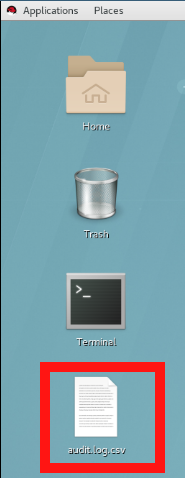

= Lab 6: Auditing on Red Hat Enterprise Linux 7.5

== Goal of Lab

The following lab is an introduction to the auditing capabilities of Red Ha Enterprise Linux.  The exercises below are done on a system installed with Red Hat Enterprise Linux 7.5, and may require modification to work in other lab environments.

== Introduction
The Linux Audit system provides a way to track security-relevant information on your system. Based on pre-configured rules, Audit generates log entries to record as much information about the events that are happening on your system as possible. This information is crucial for mission-critical environments to determine the violator of the security policy and the actions they performed. Audit does not provide additional security to your system; rather, it can be used to discover violations of security policies used on your system. These violations can further be prevented by additional security measures such as SELinux.

== Lab 6.1 Accessing the Audit Lab System

All of the exercises in this lab are run on the _audit.example.com_ host,
either as the *root* or *auditlab* user.  Each set of exercises instructs you
about which user to use, and the username is reflected in the command prompt,
as seen in the examples below:

* The *root* user prompt on _audit.example.com_

	[root@audit ~]#

* The *auditlab* user prompt on _audit.example.com_

	[auditlab@audit ~]$

The recommended way to access the _audit.example.com_ is to open up the terminal and SSH into the
_audit.example.com_ host from the bastion workstation system as shown below.  If done
correctly, you should not need to enter a password.

* SSH command to login to _audit.example.com_ as *root*. Replace GUID with your lab's GUID.

  [localhost ~]$ ssh lab-user@workstation-GUID.rhpds.opentlc.com
	[lab-user@workstation-GUID ~]$ ssh root@audit.example.com

* SSH command to login to _audit.example.com_ as "auditlab"

	[lab-user@workstation-GUID ~]$ ssh auditlab@audit.example.com

== Lab 6.2 Configuring Audit

There are two main audit components in Red Hat Enterprise Linux, the audit
daemon and the kernel itself.  The exercises below demonstrate how to configure
both.

=== Lab 6.2.1 Audit Daemon Configuration

==== Introduction
When the audit daemon is started during the boot process, it reads the
configuration file in _/etc/audit/auditd.conf_.  The different configuration options are explained in the
http://man7.org/linux/man-pages/man5/auditd.conf.5.html[auditd.conf(5)]
manpage.  Three of the more interesting options are the *flush*, *freq*, and *log_format* options:

* *flush* controls how often the audit events are
explicitly flushed to disk
* *freq* determines how frequently the flush happens
* *log_format* option controls the on-disk audit log format.  

For this lab, we will check to ensure that *flush*  is set to *INCREMENTAL_ASYNC*
(asynchronous flushing for performance), *freq* is set to 50 (flush the log
every 50 records), and *log_format* is set to “ENRICHED” (resolves some
information for improved archival value).

The _/etc/audit/auditd.conf_ file
can be modified using any text editor; but in this lab we will use the `sed` command to edit the _auditd.conf_ file.

==== Lab 6.2.1 exercise steps
. If not already there, log into to the workstation bastion host as *lab-user* from your desktop system *replacing GUID with your lab's GUID*. Use the password *r3dh4t1!*
+
[source]
----
[localhost ~]$ ssh lab-user@workstation-GUID.rhpds.opentlc.com
----

. Log into the *audit.example.com* host as *root*.
+
[source]
----
[lab-user@workstation-GUID ~]$ ssh root@audit.example.com
----
. While logged into the_audit.example.com_ system as *root*, run the following commands to edit the
_auditd.conf_ file:

	[root@audit ~]# sed -e 's/^flush.*/flush = INCREMENTAL_ASYNC/' -i /etc/audit/auditd.conf
	[root@audit ~]# sed -e 's/^freq.*/freq = 50/' -i /etc/audit/auditd.conf
	[root@audit ~]# sed -e 's/^log_format.*/log_format = ENRICHED/' -i /etc/audit/auditd.conf

. After the configuration file has been updated, we need to signal to the audit
daemon to reload its configuration.  While logged into the _audit.example.com_
system as *root*, run the following command to force `auditd` to reload its
configuration:

	[root@audit ~]# killall -SIGHUP auditd

=== Lab 6.2.2 Linux Kernel Configuration

The Linux Kernel’s audit subsystem can be configured using the `auditctl`
command.  Using `auditctl` the administrator can add audit event filtering
rules as well as tune the audit subsystem in the kernel.  The different
configuration parameters are explained in the
http://man7.org/linux/man-pages/man8/auditctl.8.html[auditctl(8)] manpage.

==== Lab 6.2.2.1 Pre-Configured Rules

A number of pre-configured audit filter rules are provided with Red Hat
Enterprise Linux. They can be found in _/usr/share/doc/audit-*_.  These filter
rules can be enabled by copying them to the system’s audit filter rule
directory, regenerating the filter configuration, and loading the resulting
filter rule configuration into the kernel.  

In the exercise below, we will enable
some basic audit filters designed to help administrators meet the US Department of Defense Security
Technical Implementation Guide (STIG) for Red Hat Enterprise Linux.

. While
logged into the _audit.example.com_ system as *root*, run the following commands
to enable a number of pre-defined audit filters:

	[root@audit ~]# cat /usr/share/doc/audit-*/rules/README-rules
	[root@audit ~]# rm /etc/audit/rules.d/*
	[root@audit ~]# cp /usr/share/doc/audit-*/rules/10-base-config.rules /etc/audit/rules.d
	[root@audit ~]# cp /usr/share/doc/audit-*/rules/30-stig.rules /etc/audit/rules.d
	[root@audit ~]# cp /usr/share/doc/audit-*/rules/31-privileged.rules /etc/audit/rules.d
	[root@audit ~]# cp /usr/share/doc/audit-*/rules/99-finalize.rules /etc/audit/rules.d
	[root@audit ~]# augenrules --load

+
The `augenrules` tool combines all of the _*.rules_ files located in
_/etc/audit/rules.d_ into the _/etc/audit/audit.rules_ file and loads them
using the `auditctl` command.  You can remove, or rename, any of these files
and rerun the `augenrules --load` command to reconfigure your system.

==== Lab 6.2.2.2 Custom Rules

===== Introduction
Custom audit filters can be loaded into the kernel using the `auditctl`
command.  The different filter options are explained in the
http://man7.org/linux/man-pages/man8/auditctl.8.html[auditctl(8)] manpage.

Custom audit filters can be made persistent by creating a new file in the
_/etc/audit/rules.d_ directory with the _.rules_ file extension.  While not
required, the following naming convention is suggested:

	<priority>-<name>.rules

Where the “<priority>” value falls into these categories:

	10: Kernel and auditctl configuration
	20: Rules that could match general rules but we want a different match
	30: Main rules
	40: Optional rules
	50: Server Specific rules
	70: System local rules
	90: Finalize (immutable)

The pre-configured filter rules provide a great example for how to structure
your custom audit filter rule files, but the basic syntax is that each line is
a series of arguments passed to the `auditctl` command; lines starting with a
“#” are treated as comments and ignored.

===== Lab 6.2.2.2 exercise steps
In
the exercise below, we are going to create an audit filter that will capture audit
events created by the `/usr/bin/ping` program.  We will also configure the
system to tag all of those events with the *rhsummit* key, using the *-k*
option, to make search through the audit log easier.  The *-a always,exit* is
a common way to add audit filter rules, it adds a filter rule to be executed at
syscall exit time, see the
http://man7.org/linux/man-pages/man8/auditctl.8.html[auditctl(8)] manpage for
more detail.

. While logged into the _audit.example.com_ system as *root*, run the
following commands to add a custom audit filter for the `/usr/bin/ping`
application:

	[root@audit ~]# auditctl -a always,exit -F exe=/usr/bin/ping -k rhsummit

. We can make our custom filter rule persistent by adding a new rule file in
_/etc/audit/rules.d_ and reloading our configuration.

. While logged into the
_audit.example.com_ system as *root*, run the following commands to make the
custom filter rule persistent:

	[root@audit ~]# echo "-a always,exit -S all -F exe=/usr/bin/ping -F key=rhsummit" > /etc/audit/rules.d/70-rhsummit_lab.rules
	[root@audit ~]# augenrules --load

. In addition to custom filter rules, this is also the mechanism we use to tweak
the base configuration of the audit subsystem in the Linux Kernel.  While
logged into the _audit.example.com_ system as *root*, run the following command
to increase the audit backlog buffer to 8192 entries:

	[root@audit ~]# auditctl -b 8192

. If we wanted to make the configuration tweak persistent, we could create a new
file in _/etc/audit/rules.d_ with the configuration and reload the audit rules.
While logged into the _audit.example.com_ system as *root*, run the following
commands to make the backlog changes persistent:

	[root@audit ~]# echo "-b 8192" > /etc/audit/rules.d/15-rhsummit_kernel.rules
	[root@audit ~]# augenrules --load

== Lab 6.3 Inspecting Audit Logs

The exercises below show how to search through the audit logs and generate
summary audit reports.  It is important to note that this section requires that
the system is configured as described earlier in this lab.

=== Lab 6.3.1 Generate Audit Events

In order to ensure we have some interesting events in the audit log, open up another terminal and from the
workstation bastion host, login to the _audit.example.com_ system as the *auditlab*
user and run the following commands:

	[lab-user@workstation-GUID ~]$ ssh auditlab@audit.example.com

	[auditlab@audit ~]$ vi /etc/shadow
	(Type :q! to exit vi)

	[auditlab@audit ~]$ date -s "8 Aug 2011 08:00:00 -0400"
	[auditlab@audit ~]$ ping -c 1 127.0.0.1

	[auditlab@audit ~]$ vi ~/project_tps_report.txt
	(Type :q! to exit vi)

=== Lab 6.3.2 Searching for Events

While the audit logs are plaintext files, and normal Linux text searching tools
(e.g. `grep`) can be used to search the audit logs, the audit userspace tools
include a tool specially designed to search and interpret the audit logs,
`ausearch`.  The `ausearch` tool can take a number of command line parameters,
all of which are described in the
http://man7.org/linux/man-pages/man8/ausearch.8.html[ausearch(8)] manpage.

The *-ts* option specifies at what point in the audit logs to start searching,
*-ts today* indicates that only events from today should be considered.  The
*-m* option indicates that you are interested in audit events with the given
record.

. While logged into the _audit.example.com_ system as *root*, run the
following commands to see the login events on the test system:

	[root@audit ~]# ausearch -ts today -m USER_LOGIN

. Multiple record types can be specified, the results include events which
contain either record type.  While logged into the _audit.example.com_ system
as *root*, run the following command to see all of the service start and stop
events:

	[root@audit ~]# ausearch -ts this-month -m SERVICE_START -m SERVICE_STOP

. The *-i* option instructs `ausearch` to interpret the results, translating some
fields into a more human readable form.  The *-k* option searches on the key
assigned to an audit rule.

. While logged into the _audit.example.com_ system as
*root*, run the following command to see all events from today matching the
*access* key:

	[root@audit ~]# ausearch -ts today -i -k access

. The *--uid* option searches for events that match the given UID.
. While logged
into the _audit.example.com_ system as *root*, run the following command to see
today's events from the *auditlab* user that match the *time-change* key:

	[root@audit ~]# ausearch -ts today -i -k time-change --uid auditlab

. The *-f* option searches for events that match on the given file name.
. While
logged into the _audit.example.com_ system as *root*, run the following command
to see all of today's accesses of the *project_tps_report.txt* file:

	[root@audit ~]# ausearch -ts today -i -f project_tps_report.txt

. Finally, we can search for audit events generated by our custom filter rule.
. While logged into the _audit.example.com_ system as *root*, run the following
command to see all events from today matching the *rhsummit* key:

	[root@audit ~]# ausearch -ts today -i -k rhsummit

=== Lab 6.3.3 Generating Reports

Included in the audit userspace tools are three utilities which can be used to
generate a number of reports from the audit log: `aureport`, `aulast`, and
`aulastlog`.  The `aureport` tool can generate a number of different reports,
all of which are described in the
http://man7.org/linux/man-pages/man8/aureport.8.html[aureport(8)] manpage.

. While logged into the _audit.example.com_ system as *root*, run the following
command to create an audit report for today's activity:

	[root@audit ~]# aureport -ts today --summary

. The `aulast` tool generates a report similar to the `last` command, except the
information is collected from the audit log instead of the less reliable utmp
logs.  The _aulast(8)_ manpage provides details on how to run `aulast`, without
any options the output is familiar with the `last` command.

. While logged into
the _audit.example.com_ system as *root*, run the following command to see an
example of an `aulast` report:

	[root@audit ~]# aulast

. Similar to `aulast`, `aulastlog` is designed as a replacement for the `lastlog`
command; the important difference being that `aulastlog` collects data from the
audit log.  The _aulastlog(8)_ manpage provides more information, but running
`aulastlog` without any options results in a useful report.

. While logged into
the _audit.example.com_ system as *root*, run the following command to see an
example:

	[root@audit ~]# aulastlog

=== Lab 6.3.4 Transforming Audit Logs

In addition to searching through the audit logs, the `ausearch` tool can also
be used to transform the results into different formats.  If you have already
done the rest of this lab, you are most likely familiar with the default *raw*
and the *interpreted* formats.  In addition to these formats, there are also
*csv* and *text* formats which can be selected using the *--format* argument.

The *-format* option, as well as several others which can customize the output
of `ausearch`, can be found in the
http://man7.org/linux/man-pages/man8/ausearch.8.html[ausearch(8)] manpage.

. While logged into the _audit.example.com_ system as *root*, run the following
commands to see samples of the *csv* and *text* formats:

	[root@audit ~]# ausearch -ts today --format csv
	[root@audit ~]# ausearch -ts today --format text

. The *csv* output is particularly interesting as it can be imported into
LibreOffice or any other spreadsheet program that accepts files in the
Comma Separated Values (CSV) format.

. While logged into the _audit.example.com_
system as *root*, run the following command to transform today's audit log into
the CSV format suitable for use within LibreOffice:

	[root@audit ~]# ausearch -ts today --format csv --extra-labels --extra-obj2 > /tmp/audit.log.csv

. Next, let's transfer this CSV file from the _audit.example.com_ system to the workstation bastion host
system using `scp`. Then, we'll open the CSV file using LibreOffice from the workstation bastion host.

=== Lab 6.3.5 Viewing the CSV output Audit Log from the workstation bastion host

. If not already there, log into to the workstation bastion host as *lab-user* from your desktop system *replacing GUID with your lab's GUID*. Use the password *r3dh4t1!*
+
[source]
----
[localhost ~]$ ssh lab-user@workstation-GUID.rhpds.opentlc.com
----
. Now, let's transfer the CSV file from the _audit.example.com_ system to the Desktop of the workstation bastion host
system using `scp`.

	[lab-user@workstation-GUID ~]$ scp root@audit.example.com:/tmp/audit.log.csv /home/lab-user/Desktop

. Now, let's take a look at this CSV file from your workstation bastion host.
. Go back to your *Lab Information* webpage and click on the console button for your workstation bastion host. Login as *lab-user* with *r3dh4t1!* as the password.
+
image:images/lab1.1-workstationconsole.png[300,300]
image:images/lab1.1-labuserlogin.png[300,300]

. Notice the CSV file you just copied over from the _audit.example.com_ system on the Desktop of your workstation bastion
host.
+

. Double click on the audit report to view it. Click *Ok* on the Text Import box.
+
image:images/audit-textimportok.png[400,400]

. Take a look at your CSV report.
+
image:images/audit-csvoutput.png[500,500]

== Reset the Lab System (Optional)

If you wanted to re-do all of these audit lab exercises from scratch, you can reset your lab system. In order to reset the system used for this audit lab exercise, run the following commands as
*root* on _audit.example.com_:

	[root@audit ~]# rm /etc/audit/rules.d/*
	[root@audit ~]# cp /usr/share/doc/audit-*/rules/10-no-audit.rules /etc/audit/rules.d
	[root@audit ~]# augenrules --load
	[root@audit ~]# userdel -r auditlab

<<top>>

link:README.adoc#table-of-contents[ Table of Contents ] | link:lab7_AIDE.adoc[ Lab 7: AIDE ]
