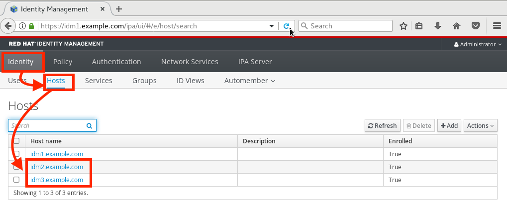
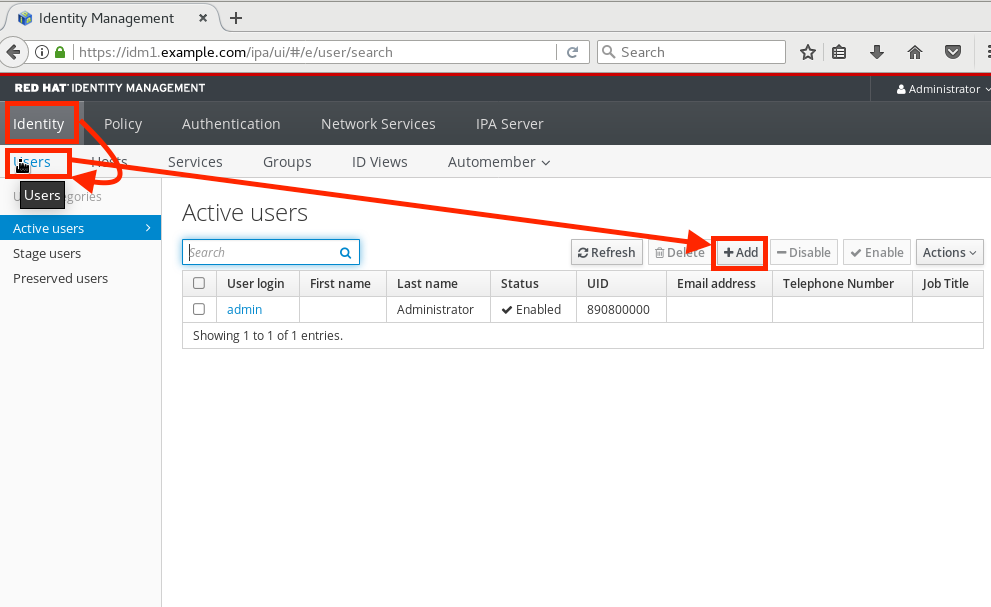
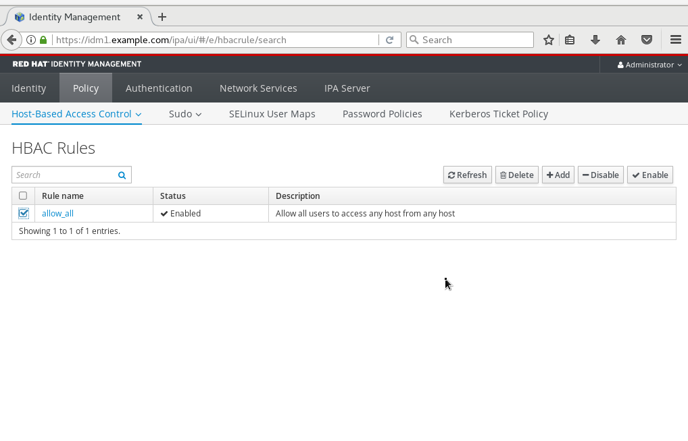

= Lab 8: How to create a single sign-on environment for all of your linux servers using Red Hat Identity Management

== Goal of Lab
In this exercise you are going to configure clients to attach to a Red Hat Identity Management (IdM) server.  The goal is to create a single-sign-on environment for all of your Linux servers to manage users, hosts, and sudo commands from a central console.  This exercise will already have and IdM server installed, and will focus on registering and managing clients.  The objectives for this exercise are:

* Install the IdM client on your client systems
* Configure the client to be part of the IdM realm
* Create users on the idm server and demonstrate single-sign-on
* Create user groups and assign users to those groups
* Create host groups and assign hosts to those groups
* Create sudo command groups that allow escalated privileges
* Integrate user, host and sudo command groups into a policy

== Introduction
The IdM server is a 389 based server that has been configured to manage users, hosts, and sudo commands.  It is kerberos based and can operate as a standalone directory server, or can integrate with any LDAP compliant directory servers (e.g. Microsoft Active Directory).  IdM can also be configured to manage DNS for you Linux environment and provide for dynamic DNS updates.   Because the lab already provides DNS we will not have that enabled.  It will also be configured to create user home directories upon first login.

== Lab 8.1 Verify that the IdM Server is Running
. Navigate to Red Hat Summit Lab GUID information page UI with your environment's power control and consoles. Click on the console for *IdM1*.
+
image:images/idm-console.png[300,300]

. Notice that the *IdM1* system has been installed with a GUI.
Login with username *admin* and *r3dh4t1!* as the password.
+
image:images/idm-login.png[400,400]

. Our server is using a self-signed certificate, so you may need to select and confirm the security exception.  Navigate through the menu at the top to become familiar with the layout.

=== Attach the Client
In this step we are going to attach our servers to the IdM realm.  The servers we are going to attach are:

* idm2.example.com
* idm3.example.com

The ipa-client package has already been installed for your convenience.  Next we are going to log into idm2 and idm3 and configure the client:

[source]
[root@idm2 ~]# ipa-client-install --mkhomedir --no-ntp
domain: example.com
IdM server: idm1.example.com
username: admin
password: r3dh4t1!

You will be asked to proceed with no DNS discovery, and continue configuration, select Yes.  Had we been using IdM with embedded DNS, it would have auto discovered and iput all parameters and simply asked us to confirm.

Your systems are now configured and enrolled in the IdM realm.  You can verify enrollment by logging into the GUI via the browser and viewing the hosts tab.

There are two options in the configuration piece that warrants additional discussion:

[source]
--mkhomedir - this allows you to create a user home directory upon first login
--no-ntp - our lab is using chronyd to synchronize time

In a production environment, you may want to mount home directories remotely so that there are no user accounts or home directories on your servers.

== Lab 8.2 Configuring a Simple User
. In this exercise we will create a user and demonstrate single-sign-on.
. Logon to the GUI at http://idm1.example.com
. Navigate to the Identity -> Users tab
. Select the Add button and fill in:

* User login - user1
* User first name - User
* User last name - One
* New password - password (initial that will have to be changed on first logon)
* Verify password - password
+

image:images/idm-03-user1.png[500,500]
image:images/idm-04-user1.png[500,500]

. Navigate to the Policy -> Host-Based-Access-Control -> HBAC Rules tab

+
NOTE: The default policy allows access to all users and all hosts, something that we will delete shortly, but is good for testing.

. Open the console to idm2.example.com and login as follows:
* username: user1
* password: password
(you will be prompted to change your initial password)
* A home directory will be created on the server

. From the command line type ‘grep user1 /etc/passwd’ and verity that the local account does not exist.

. IdM caches credentials locally in the sssd, and the kerberos ticket you are currently holding may continue to allow/disallow access to a resource after you make a change to a resource on the IdM server.  While there are ways to configure the cache for your specific needs, a quick way to clear the sssd cache is as follows:
+
[source]
RHEL 7:
systemctl stop sssd.service
sss_cache -E
systemctl start sssd.service
+
[source]
RHEL 6:
service sssd stop
sss_cache -E
service sssd start

To test, disable the user account on the IdM server that you just used to successfully login to a server, and note that you are still able to login.  This is due to the kerberos ticket still residing in the sssd cache.  Log out at this user, and clear the cache as the root user.  After clearing the cache, you will no longer be able to login.

== Lab 8.3 User Based Access Control
In this exercise we are going to allow/restrict access to hosts by user.  Let start by clearing the cache on idm2 and idm3 from the previous exercise following the steps previously outlined.

. Next, navigate to the Policy -> Host-Based-Access-Control tab
* Delete or disable the HBAC rule named ‘allow_all’

+

. Create a new rule that allows you access to a specific server
* Select the Add and Edit button to create and edit your rule (a rule name is your choice)

+
image:images/idm-06-policy.png[700,700]

* Under Who select user1 and add them to the policy

+
image:images/idm-07-policy.png[700,700]

* Under Accessing select idm2.example.com as the host and add it to the policy

+
image:images/idm-08-policy.png[700,700]

* Under Via Service select login and sshd and add it to the policy

+
image:images/idm-09-policy.png[700,700]

. Try logging into all idm2 and idm3 servers
* You should be able to logon to the server specified in the policy
* You should be restricted from logging into servers not in the policy

. Clear the cache on the server where you successfully logged in
. Disable the policy to ready the system for the next exercise.

== Lab 8.4 User Group Based Access Control
In this exercise we are going to restrict access to hosts by user group.
. Navigate to Identity -> Groups tab

* Select User Groups under Group Categories in the left panel and add a group
** Provide a user group name and select the Add and Edit button
** Add a user to your user group using the Add button
+
image:images/idm-10-group.png[700,700]
image:images/idm-11-group.png[700,700]

* Select Host Groups under Group Categories in the left panel and add a group
** Provide a host group name and select the Add and Edit button
** Add either the idm2 or idm3 host to your host group

+
image:images/idm-12-group.png[700,700]
image:images/idm-13-group.png[700,700]

* Navigate to the Policy -> Host-Based-Access-Control -> HBAC Rules tab
** Select the add button and create a rule
** Select the newly created rule to edit it

+
image:images/idm-14-hbac.png[700,700]

** Under Who select your user group
** Under Accessing select your host group
** Under Via Service select login and sshd
* Try logging into idm2 and idm3
** You should be able to logon to the server specified in the policy
** You should be restricted from logging into servers not in the policy
* Clear the cache on the server where you successfully logged in
* Do not disable the policy because we are going to add to it in the next step

Grouping users and hosts allows you to move users into and out of groups, thereby, inheriting and disinheriting access.  The real strength with this method comes in the next exercise where we create sudo command groups.  Rather than creating service accounts with shared passwords for a group of administrators you can do the following:

* Add a user to a user group
* That user will inherit access to a specific group of hosts
* That user will also inherit escalated privileges required to perform their role on those hosts
* that user’s activity will be logged centrally

== Lab 8.5 Creating sudo Command Groups
This exercise will build off the previous exercise by adding a sudo command group to the existing policy.  So, in addition to having access to specific hosts, the users in the group will also be granted escalated privileges.  To simplify the demonstration, we will create a sudo command group with one command in it: the ability to execute yum.

. Before creating this to the policy, log into a server that your user (user1) has access to (either idm2 or idm3) from the previous step to verify that you do not have access to escalate and run yum:

[source]
[user1@idm2 ~]# sudo yum update
+
. After three attempts you will be prevented from trying further.  Clear the cache to proceed with this exercise: Please perform the following steps:

* Navigate to the Policy -> Sudo tab
* Select Sudo Commands from the drop down
** Select add to add a command
** Enter /usr/bin/yum

+
image:images/idm-15-sudo.png[700,700]

* Select Sudo Command Groups from the drop down
** Select add to create a group
** Create a new group and add the command from the previous step

+
image:images/idm-16-sudo.png[700,700]
image:images/idm-17-sudo.png[700,700]

* Select Sudo Rules from the drop down
** Select add to create a new rule and select the Add and Edit button
** Add you host group under Access Host Groups
** Add your sudo group under Sudo Allow Command Groups
** Add your user  group under Run as Groups

+
image:images/idm-18-sudo.png[700,700]

* Navigate to Policy -> Host Based Access Control -> HBAC Rules
** Select the rule you created in Step 5 and add sudo as a service in addition to logon and sshd.
** Login to the server and run ‘sudo yum update’

+
image:images/idm-19-sudo.png[700,700]

You could have simplified this by adding a user and a command rather than a user group and command group, but what we want to show is how you can group users, hosts, and sudo commands into one policy, which allows you to add and remove users that will inherit and disinherit access respectively.

<<top>>

link:README.adoc#table-of-contents[ Table of Contents ] | link:lab9_GPG.adoc[ Lab 9: GNU Privacy Guard ]
