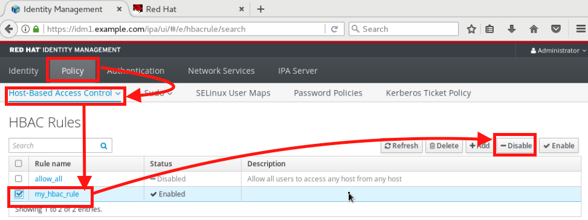
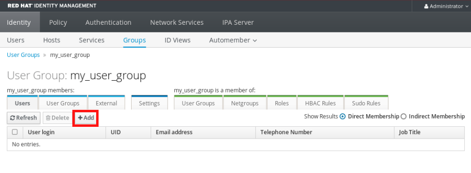

= Lab 8: How to create a single sign-on environment for all of your linux servers using Red Hat Identity Management

== Goal of Lab
In this exercise you are going to configure clients to attach to a Red Hat Identity Management (IdM) server.  The goal is to create a single-sign-on environment for all of your Linux servers to manage users, hosts, and sudo commands from a central console.  This exercise will already have an IdM server installed, and will focus on registering and managing clients.  The objectives for this exercise are:

* Install the IdM client on your client systems
* Configure the client to be part of the IdM realm
* Create users on the idm server and demonstrate single-sign-on
* Create user groups and assign users to those groups
* Create host groups and assign hosts to those groups
* Create sudo command groups that allow escalated privileges
* Integrate user, host and sudo command groups into a policy

We will be doing this lab exercise using the consoles for both your IdM server and clients. You will access the consoles and your lab environment's power control from the Red Hat Summit Lab GUID information UI page.

== Introduction
The IdM server is a 389 based server that has been configured to manage users, hosts, and sudo commands.  It is kerberos based and can operate as a standalone directory server, or can integrate with any LDAP compliant directory servers (e.g. Microsoft Active Directory).  IdM can also be configured to manage DNS for you Linux environment and provide for dynamic DNS updates.   Because the lab already provides DNS we will not have that enabled.  It will also be configured to create user home directories upon first login.

== Lab 8.1 Attaching the Clients to the IdM Realm
. Navigate to Red Hat Summit Lab GUID information UI page. This page has your environment's power control and consoles. Click on the console for *IdM1*.
+
image:images/idm-console.png[300,300]

. Notice that the *IdM1* system has been installed with a GUI.
*IdM1* already has an IdM server installed on it.
Login with username *admin* and *r3dh4t1!* as the password.
+
image:images/idm-login.png[400,400]

. Navigate to the Firefox web browser (which is under  *Applications*). Open up the Firefox web browser and navigate to *https://idm1.example.com*. This is the UI for the IdM server. Login as *admin* with *r3dh4t1!* as the password. Take a quick glance around. We will revisit this IdM server GUI later in this exercise.
+
image:images/idm-initiallogin.png[500,500]

. Next, we are going to attach our client servers to the IdM realm.  The servers we are going to attach are:

* idm2.example.com
* idm3.example.com

. The ipa-client package has already been installed for your convenience.  Next we are going to log into idm2 and idm3 and configure the client.

. Navigate to Red Hat Summit Lab GUID information UI page again. This page has your environment's power control and consoles. Click on the consoles for *IdM2* and *IdM3*.
+
image:images/idm2-console.png[200,200]
image:images/idm3-console.png[200,200]

. Log into *IdM2* as *root* with *r3dh4t1!* as the password.

. Now, let's install the IdM client and configure the client to be part of the IdM realm.

. In the console window for *IdM2*, type the following:
+
[source]
----
[root@idm2 ~]# ipa-client-install --mkhomedir --no-ntp
----
. NOTE:
* mkhomedir - this allows you to create a user home directory upon first login
* no-ntp - our lab is using chronyd to synchronize time
* In a production environment, you may want to mount home directories remotely so that there are no user accounts or home directories on your servers.

. You will be asked a series of questions during the installation and configuration of your IdM client. Here are the answers to these questions:

* Provide the domain name of your IPA server: *example.com*
* Provide your IPA server name: *idm1.example.com*
* Proceed with fixed values and no DNS discovery? *yes*
* Continue to configure the system with these values? *yes*
* User authorized to enroll computers: *admin*
* Password for admin@EXAMPLE.COM: *r3dh4t1!*
+
NOTE: Had we been using IdM with embedded DNS, it would have auto discovered and input all parameters and simply asked us to confirm.

. Repeat the above steps 6-9 for *IdM3*. The *root* password for *IdM3* is also *r3dh4t1!*.

. Your systems are now configured and enrolled in the IdM realm.  Let's verify enrollment of our 2 client systems.

. Navigate back to *IdM1*. If you need to log back in, the password for the Administrator is *r3dh4t1!*. If your Firefox web browser was closed, open up the Firefox web browser and navigate to *https://idm1.example.com* (if you're not already there).

. Navigate to the *Identity* -> *Hosts* tab. Notice that both of our client systems, *idm2.example.com* and *idm3.example.com* are showing as Enrolled (in addition to our IdM server, *idm1.example.com*).

image:images/idm-01-hosts.png[700,700]

== Lab 8.2 Configuring a Simple User
In this exercise we will create a user and demonstrate single-sign-on.

.  Navigate back to the *IdM1* console. If you need to log back in, the password for the Administrator is *r3dh4t1!*. Open up the Firefox web browser and navigate to *https://idm1.example.com* (if you're not already there).

. Navigate to the *Identity* -> *Users* tab. Click on the *Add* button at the far right.
+
image:images/idm-02-user1.png[500,500]

. Fill in the form with the following information:

* User login - *user1*
* User first name - *User*
* User last name - *One*
* New password - *password* (initial password that will have to be changed on first logon)
* Verify password - *password*

* You do not need to fill in the other items on this form (Class, GID, etc)

+
image:images/idm-03-user1.png[500,500]

. When you are done filling out the form, Press *Add*.

image:images/idm-04-user1.png[500,500]

. Navigate to the *Policy* -> *Host-Based-Access-Control* -> *HBAC Rules* tab.
+
image:images/idm-host-based-access-control.png[700,700]

+
NOTE: Notice the default *allow_all* policy, which allows access to all users and all hosts. This is something that we will delete shortly, but is good for testing for now.

. Navigate back to the console for *IdM2* (idm2.example.com). If you are still logged in as *root*, type *exit*. Now, login as follows:
* username: user1
* password: password

. You will be prompted to change your initial password. Feel free to change your initial password to any new password that you can easily remember.

* A home directory will be automatically be created for user1.

. From the command line, verify that this local *user1* account does not exist in /etc/passwd. This is because IdM caches credentials locally in the sssd.
[source]
[user1@idm2 ~]$ grep user1 /etc/passwd
[user1@idm2 ~]$ exit

== Lab 8.3 User Based Access Control
In this exercise, we are going to allow/restrict access to hosts by user.

.  Navigate back to the *IdM1* console. If you need to log back in, the password for the Administrator is *r3dh4t1!*. Open up the Firefox web browser and navigate to *https://idm1.example.com* (if you're not already there).

. Navigate to the *Policy* -> *Host-Based-Access-Control* -> *HBAC Rules* tab
. Click on the box next to the *allow_all* HBAC rule and press *Disable* at the far right. Press *Ok*.
+
image:images/idm-05-policy.png[700,700]

. The kerberos ticket you are currently holding may continue to allow/disallow access to a resource after you make a change to a resource on the IdM server.
As a result, let's go ahead and clear cache for IdM2 and IdM3.

. While there are ways to configure the cache for your specific needs, a quick way to clear the sssd cache is as the root user.  After clearing the cache, you will no longer be able to login. Do these steps on *IdM2* as the *root* user. Log back into *IdM2* as *root*. The password for the *root* user is *r3dh4t1!*.
+
[source]
[root@idm2 ~]$ systemctl stop sssd.service
[root@idm2 ~]$ sss_cache -E
[root@idm2 ~]$ systemctl start sssd.service

. Clear the cache for *IdM3* as well by repeating the step above on *IdM3*.

. Press the *Add* button at the far right to create a new rule that allows you access to a specific server. For the rule name, type any name of your choice (For example, *my_hbac_rule*).

. Select the *Add and Edit* button to create and edit your rule.

+
image:images/idm-06-policy.png[700,700]

. Under *Who*, click on the *+Add* button on the far right in the *Users* section. Press *Add*.
+
image:images/idm-whoadd.png[700,700]

. Click on the box next to *user1* and add them to the policy by clicking on the *>* button to move user1 from the *Available Users* section to the *Prospective Users* section.

+
image:images/idm-07-policy.png[700,700]

. Under *Accessing*, select the *+Add* button at the far right.
+
image:images/idm-accessingadd.png[700,700]

. Click on the box next to *idm2.example.com* and add it to the policy by clicking on the *>* button to move idm2.example.com from the *Available Hosts* section to the *Prospective Hosts* section. Press *Add*.

+
image:images/idm-08-policy.png[700,700]

. Under *Via Service*, select the *+Add* button at the far right.
+
image:images/idm-viaservice.png[700,700]

. Click on the box next to both *login* and *sshd* and add them to the policy by clicking on the *>* button to move them from the *Available HBAC Services* section to the *Prospective HBAC Services* section. Press *Add*.

+
image:images/idm-09-policy.png[700,700]

. Now, let's try logging into the *IdM2* server as *user1* with the password that you set previously. You should be able to successfully login as *user1* on *IdM2* since our policy that we just created above allows both login and ssh for user1 on idm2.example.com.

. Now, let's try logging into the *IdM3* server as *user1* with the password that you set previously. You should be restricted from logging into *IdM3* with a *Permission denied* error since this server is not in the policy that we created previously.

. Clear the cache on the server where you successfully logged in (IdM2). Log into *IdM2* from the console as *root* with password *r3dh4t1!* and execute the following commands below to clear the cache.
[source]
[root@idm2 ~]$ systemctl stop sssd.service
[root@idm2 ~]$ sss_cache -E
[root@idm2 ~]$ systemctl start sssd.service

. Now let's disable the policy to ready the system for the next exercise. Navigate to the *Policy* -> *Host-Based Access Control* -> *HBAC Rules* tab and click on the box next to the policy you created previously. Then, click on *Disable* on the far right.
+

== Lab 8.4 User Group Based Access Control
In this exercise we are going to restrict access to hosts by user group.

.  Navigate back to the *IdM1* console. If you need to log back in, the password for the Administrator is *r3dh4t1!*. Open up the Firefox web browser and navigate to *https://idm1.example.com* (if you're not already there).

. Navigate to the *Identity* -> *Groups* tab. Select *User Groups* under Group Categories on the left panel and add a group by pressing the *+Add* button.
+
image:images/idm-usergroups.png[700,700]

. Provide a User Group name (For example, *my_user_group*) and press  the *Add and Edit* button.
+
image:images/idm-10-group.png[700,700]

. Add a user to your user group by pressing the *+Add* button.
+

. Click on the box next to *user1* and add it to your user group by clicking on the *>* button to move it from the *Available User login* section to the *Prospective User login* section. Press *Add*.
+
image:images/idm-11-group.png[700,700]

. Select Host Groups under Group Categories in the left panel and add a group
. Provide a host group name and select the Add and Edit button
. Add either the idm2 or idm3 host to your host group

+
image:images/idm-12-group.png[700,700]
image:images/idm-13-group.png[700,700]

* Navigate to the Policy -> Host-Based-Access-Control -> HBAC Rules tab
** Select the add button and create a rule
** Select the newly created rule to edit it

+
image:images/idm-14-hbac.png[700,700]

** Under Who select your user group
** Under Accessing select your host group
** Under Via Service select login and sshd
* Try logging into idm2 and idm3
** You should be able to logon to the server specified in the policy
** You should be restricted from logging into servers not in the policy
* Clear the cache on the server where you successfully logged in
* Do not disable the policy because we are going to add to it in the next step

Grouping users and hosts allows you to move users into and out of groups, thereby, inheriting and disinheriting access.  The real strength with this method comes in the next exercise where we create sudo command groups.  Rather than creating service accounts with shared passwords for a group of administrators you can do the following:

* Add a user to a user group
* That user will inherit access to a specific group of hosts
* That user will also inherit escalated privileges required to perform their role on those hosts
* that user’s activity will be logged centrally

== Lab 8.5 Creating sudo Command Groups
This exercise will build off the previous exercise by adding a sudo command group to the existing policy.  So, in addition to having access to specific hosts, the users in the group will also be granted escalated privileges.  To simplify the demonstration, we will create a sudo command group with one command in it: the ability to execute yum.

. Before creating this to the policy, log into a server that your user (user1) has access to (either idm2 or idm3) from the previous step to verify that you do not have access to escalate and run yum:

[source]
[user1@idm2 ~]# sudo yum update
+
. After three attempts you will be prevented from trying further.  Clear the cache to proceed with this exercise: Please perform the following steps:

* Navigate to the Policy -> Sudo tab
* Select Sudo Commands from the drop down
** Select add to add a command
** Enter /usr/bin/yum

+
image:images/idm-15-sudo.png[700,700]

* Select Sudo Command Groups from the drop down
** Select add to create a group
** Create a new group and add the command from the previous step

+
image:images/idm-16-sudo.png[700,700]
image:images/idm-17-sudo.png[700,700]

* Select Sudo Rules from the drop down
** Select add to create a new rule and select the Add and Edit button
** Add you host group under Access Host Groups
** Add your sudo group under Sudo Allow Command Groups
** Add your user  group under Run as Groups

+
image:images/idm-18-sudo.png[700,700]

* Navigate to Policy -> Host Based Access Control -> HBAC Rules
** Select the rule you created in Step 5 and add sudo as a service in addition to logon and sshd.
** Login to the server and run ‘sudo yum update’

+
image:images/idm-19-sudo.png[700,700]

You could have simplified this by adding a user and a command rather than a user group and command group, but what we want to show is how you can group users, hosts, and sudo commands into one policy, which allows you to add and remove users that will inherit and disinherit access respectively.

<<top>>

link:README.adoc#table-of-contents[ Table of Contents ] | link:lab9_GPG.adoc[ Lab 9: GNU Privacy Guard ]
