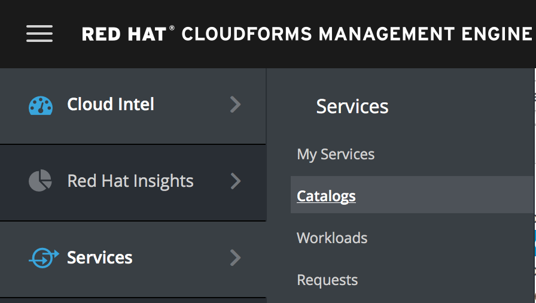

== Lab 1: Provisioning a security compliant RHEL host in Red Hat Virtualization and Red Hat Openstack Platform

=== Goal of Lab 1
The goal of this lab is to show the ability for a user to click an order button in the service catalog of Red Hat CloudForms to execute specific custom defined services.
Specifically, in this lab, you will use the Red Hat CloudForms service catalog to create a security compliant host at provisioning time in both Red Hat Virtualization and Red Hat Openstack Platform.

=== Introduction
Red Hat CloudForms provides users the ability to create self-service catalogs.  Through the use of catalogs, Red Hat CloudForms provides support for executing free form automation as a service and also allow for multi-tiered service provisioning to deploy layered workloads across hybrid environments. You can create customized dialogs that will give consumers of the services the ability to input just a few parameters and provision the entire service. In addition to using the native ruby language, free form automation workflows using the service catalog of Red Hat CloudForms can call Ansible Tower job templates or Ansible playbooks (using the embedded Ansible in Red Hat CloudForms) as part of your automation workflow as well.

=== Provisioning a security compliant host at the push of a button in Red Hat Virtualization
. In your web browser, click on the tab you have opened to your Red Hat CloudForms UI. Log back in with *admin* as the username and *r3dh4t1!* as your password.
. In the Red Hat CloudForms UI, in the left pane, navigate to *Services  → Catalogs*.
+

=== Provisioning a security compliant host at the push of a button in Red Hat Openstack Platform
. Logout and login as a member of a different tenant (or as a different user). Users were pre-created in CloudForms that are more "locked down" via roles, tenancy, etc to limit access to automate custom buttons, etc (using OOTB roles in CloudForms: user, admin, security, etc). Provision the Openstack instance and lock it down with a different security profile <kimchee>.
* Provision a security compliant RHEL 7.5 host as this user with limited privileges.

<<top>>

link:README.adoc#table-of-contents[ Table of Contents ] | link:lab2.adoc[ Lab 2]
