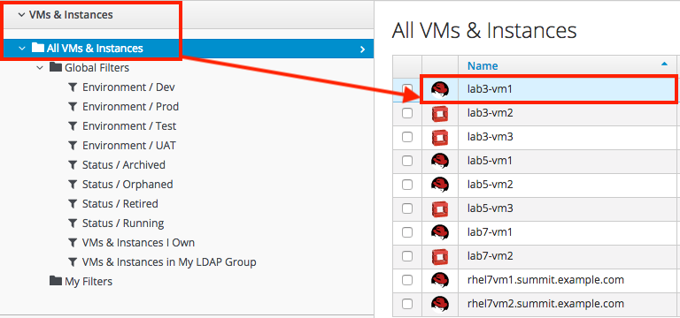
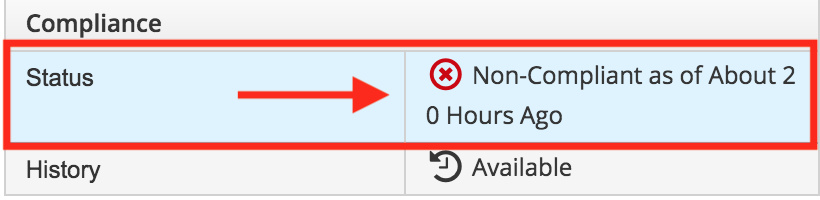
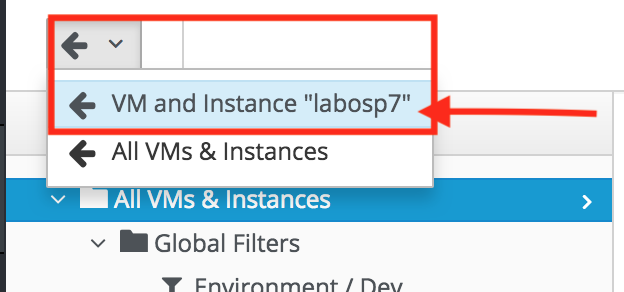
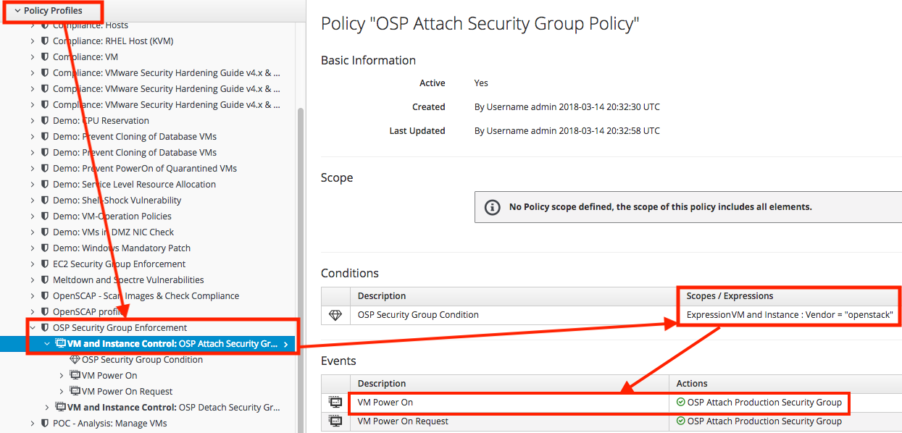
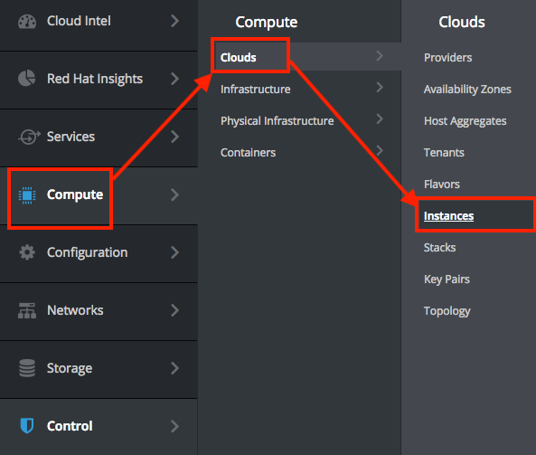

== Lab 3: How to use the control policy engine in Red Hat CloudForms and Ansible Tower to enforce compliance with security policies

== Goal of Lab 3
The goal of this lab is to introduce you to the power and flexibility of Red Hat CloudForms and Ansible Tower by Red Hat to enforce your security policies.

Specifically, using a combination of Red Hat CloudForms and Ansible Tower by Red Hat, you will identify and fix the Shellshock vulnerability in your system in an automated fashion.

The Shellshock vulnerability is the bash remote code execution vulnerability (CVE-2014-6271), which allows an attacker to gain control over a targeted computer if exploited successfully. Specifically, an attacker could use this flaw to override or bypass environment restrictions to execute shell commands. Certain services and applications allow remote unauthenticated attackers to provide environment variables, allowing them to exploit this issue. If your system is vulnerable, you can fix these issues by updating to the most recent version of the Bash package available from Red Hat for Red Hat Enterprise Linux 5, 6, and 7.

== Introduction
Red Hat CloudForms provides unified hybrid cloud management across your entire heterogenous environment, including virtual, private cloud, public cloud, and container environments. Other supported technologies include software defined networking, middleware, and in the future storage management.

Red Hat CloudForms is an agentless solution,delivered as a virtual appliance, that is highly scalable and provides deep continuous visibility and discovery of your entire infrastructure. The Red Hat CloudForms control and policy engine provides compliance and governance capabilities right in the GUI of CloudForms. The Red Hat CloudForms automate engine can be utilized to execute free-form automation using either ruby or Ansible playbooks.  Red Hat CloudForms is able to communicate directly to your Ansible Tower instance to execute your Ansible playbooks.

Ansible is a simple, powerful, and agentless IT automation technology that can help improve your current processes, migrate applications for better optimization, and provide a single language for DevOps practices across your organization including Developers, Operations, and the Security Team.

Ansible Tower by Red Hat provides a graphical user interface for Ansible with a visual dashboard, a centralized API for your Ansible automation, role-based access control for increased security, job scheduling, graphical inventory management, and real-time job status updates thus providing you all the IT automation features you need to support your enterprise.

Ansible is great for security automation because it is agentless, only requires SSH/WinRM, supports desired state, is extensible and modular, has a push-based architecture, and provides easy targeting based on facts.

=== Lab 3.1 Using Red Hat CloudForms compliance policy with Ansible Automation to enforce the AIDE package
. Log into CloudForms as *admin*.
. Navigate to Control -> Explorer.
+
image:images/lab3.1-control-explorer.png[200,200]
+
. Navigate to Policy Profiles -> Lab 3.1 Enforce-AIDE -> Lab 3.1 Enforce AIDE Package.
+
image:images/lab3.1-control-policy.png[600,600]
+
. This control policy dictates that when a VM is powered on, install the AIDE package.
. Navigate to Services -> Workloads
+
image:images/lab3.1-services-workloads.png[400,400]
+
. Click on *lab3-vm1* which will take you to the VM summary page.
+

+
. Click on Policy -> Manage Policies
+
image:images/lab3.1-policy-manage-policies.png[400,400]
+
. Verify that the Lab 3.1 control policy is assigned and click on Cancel to exit.
+
image:images/lab3.1-policy-assignment.png[600,600]
+
. From the VM summary page power on the VM. This will take power on the VM and trigger the control policy to execute an Ansible playbook
to install the AIDE package.
+
image:images/lab3.1-power-on.png[200,200]
+
. Note the IP address for *lab-vm1*.
+
image:images/lab3.1-vm-ipaddress.png[400,400]
+
. Using SSH log into your Lab Workstation using your provided private key and sudo to *root*.

 [lab-user@workstation-repl ~]$ sudo -i

. From there, ssh to the *lab3-vm1* IP address using *r3dh4t1!* as the password.

  [root@workstation-repl ~]# ssh root@*192.168.1.171*

. Once logged in check to see if the *AIDE* package is installed. It may take a minute or so

 [root@lab3-vm1 ~]# rpm -qa --last aide
 aide-0.15.1-13.el7.x86_64  Thu 12 Apr 2018 04:26:59 PM EDT

. End of exercise.

=== Lab 3.2 Using Red Hat CloudForms compliance engine to determine if an OpenStack instance is vulnerable for Meltdown/Spectre

. Log into CloudForms as *labuser*.
. Navigate to Services -> Workloads.
+
image:images/lab3-services-workloads.png[400,400]
+
. You will see that the VM *lab3-vm2* is non-compliant. Click on the VM *lab3-vm2* to go to the summary screen.
+
image:images/lab3-vm-list-view.png[400,400]
+
. In the upper right hand corner click on Compliance Status.
+

+
. You will see that the VM is vulnerable for Meltdown/Spectre.
+
NOTE: For the sake of time the kernel packages have already been patched.
+
. Click on the back arrow to navigate back to the VM summary page.
+

+
. Click on Packages and find the kernel package. Notice the version *693.el7*. As of this document we need to ensure that version *830.el7* is installed to be compliant.
. Click on the back arrow to navigate back to the VM summary page.
+

+
. Click on Configuration -> Perform SmartState Analysis. This will launch a job that will scan the VMs packages and other metadata.
+
image:images/lab3-launch-smart-state.png[400,400]
+
+
. Click on Lab User -> Tasks to monitor the scan jobs status.
+
image:images/lab3-tasks.png[150,150]
+
. Click on the Refresh button periodically until it the scan job has completed (about 3 minutes). Afterwards, click on the job and this will take you back to the VM summary page.
+
image:images/lab3-task-results.png[600,600]
+
. Click on Policy -> Check Compliance of Last Known Configuration
+
image:images/lab3-check-compliance.png[400,400]
+
. Click on the Refresh button until the VM is compliant.
+
image:images/lab3-compliant-success.png[600,600]
+

<<top>>

=== Lab 3.3 Using Red Hat CloudForms control engine to enforce OpenStack Security Group membership
. Log into CloudForms as *admin*.
. Navigate to Control -> Explorer.
+
image:images/lab3-control-explorer.png[200,200]
+
. Navigate to Policy Profiles -> OSP Security Group Enforcement -> OSP Attach Security Group Policy.
+

+
. This policy dictates that when an OpenStack instance is powered on, CloudForms will automatically assign the *Production* security group.
. Navigate
+

+

<<top>>

link:README.adoc#table-of-contents[ Table of Contents ] | link:lab4.adoc[Lab 4:Managing the security of Red Hat Openshift container images from Red Hat CloudForms]
